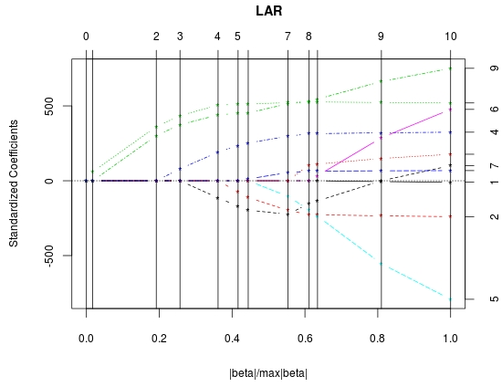
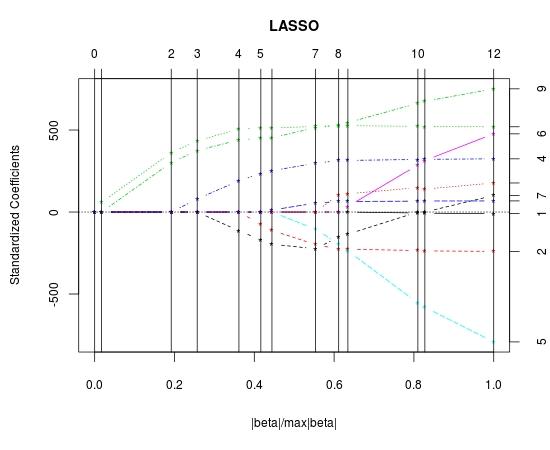

<html><head></head><body>
<h1 class="title topictitle1" id="ariaid-title1">LAR</h1>

The LAR function creates a model that the function <a href="aff1558531224572.md#gly1507907689115">LARPredict</a> uses to make predictions for the response variables.

<h2 class="title topictitle2" id="ariaid-title2">LAR Syntax</h2>

<h3 class="title sectiontitle">Version 1.9</h3><pre class="pre codeblock" xml:space="preserve"><code>SELECT * FROM LAR (
  ON { <var class="keyword varname">table</var> | <var class="keyword varname">view</var> | (<var class="keyword varname">query</var>) } AS InputTable
  OUT TABLE OutputTable (<var class="keyword varname">output_table</var>)
  USING
  TargetColumns ('<var class="keyword varname">response</var>', '<var class="keyword varname">predictor_columns</var>')
  [ FitMethod ({ 'lar' | 'lasso'} ) ]
  [ Intercept (<b>{'true'|'t'|'yes'|'y'|'1'|'false'|'f'|'no'|'n'|'0'}</b>) ]
  [ L2Normalization (<b>{'true'|'t'|'yes'|'y'|'1'|'false'|'f'|'no'|'n'|'0'}</b>) ]
  [ MaxIterNum (<var class="keyword varname">max_iterations</var>) ]
) AS <var class="keyword varname">alias</var>;</code></pre>

<h2 class="title topictitle2" id="ariaid-title3">LAR Syntax Elements</h2>

<dl class="dl parml"><dt class="dt pt dlterm">OutputTable</dt><dd class="dd pd">Specify the name of the output table.</dd><dt class="dt pt dlterm">TargetColumns</dt><dd class="dd pd">Specify the names of the columns of the InputTable that contain the response and predictors.

This is the syntax of <var class="keyword varname">predictor_columns</var>:
<pre class="pre codeblock" xml:space="preserve"><code>{<var class="keyword varname">col</var>[,...] | [<var class="keyword varname">start_column</var><code class="ph codeph">:</code><var class="keyword varname">end_column</var>]}[,...]</code></pre>

where <var class="keyword varname">col</var> is a column name and <var class="keyword varname">start_column</var> and <var class="keyword varname">end_column</var> are the column indexes of the first and last columns in a range of columns. The range includes <var class="keyword varname">start_column</var> and <var class="keyword varname">end_column</var>.

The leftmost column has column index 0, the column to its immediate right has column index 1, and so on.

<b>Note</b>

<ul class="ul" id="dzz1507674420527__ul_fdl_wlb_fy">
<li class="li">In a column range, brackets do not indicate optional elements. You must include the bracket characters (for example, '[2:6]').</li>
<li class="li">This function can take at most 799 response and predictor variables.</li></ul>

</dd><dt class="dt pt dlterm">FitMethod</dt><dd class="dd pd">[Optional] Specify the method to use for linear regression.</dd><dd class="dd pd ddexpand">Default: 'lasso'</dd><dt class="dt pt dlterm">Intercept</dt><dd class="dd pd">[Optional] Specify whether an intercept is included in the model (and not penalized).</dd><dd class="dd pd ddexpand">Default: 'true'</dd><dt class="dt pt dlterm">L2Normalization</dt><dd class="dd pd">[Optional] Specify whether each predictor is standardized to have unit L2 norm.</dd><dd class="dd pd ddexpand">Default: 'true'</dd><dt class="dt pt dlterm">MaxIterNum</dt><dd class="dd pd">[Optional] Specify the maximum number of steps the function runs.</dd><dd class="dd pd ddexpand">Default: 8*min(<var class="keyword varname">number_of_predictors</var>, <var class="keyword varname">sample_size</var> - <var class="keyword varname">intercept</var>). For example, if the number of predictors is 11, the sample size (number of rows in the InputTable) is 1532, and the intercept is 1, then the default value is 8*min(11, 1532 - 1) = 88.</dd></dl>

<h2 class="title topictitle2" id="ariaid-title4">LAR Input</h2>

<h3 class="title sectiontitle">InputTable Schema</h3>
<b>Note</b>
It is important to normalize the input variables before calling this function. For details, see <a href="qnw1570800778984.md">Normalized Input</a>.

The table can have additional columns, but the function ignores them.

<table cellpadding="4" cellspacing="0" summary="" id="ncs1507674708254__table_N10014_N1000E_N1000C_N10001" class="table" frame="border" border="1" rules="all">

<colgroup span="1"><col style="width:25%" span="1"></col><col style="width:25%" span="1"></col><col style="width:50%" span="1"></col></colgroup><thead class="thead" style="text-align:left;"><tr class="row"><th class="entry nocellnorowborder" style="vertical-align:top;" id="d57995e242" rowspan="1" colspan="1">Column</th><th class="entry nocellnorowborder" style="vertical-align:top;" id="d57995e244" rowspan="1" colspan="1">Data Type</th><th class="entry cell-norowborder" style="vertical-align:top;" id="d57995e246" rowspan="1" colspan="1">Description</th></tr></thead><tbody class="tbody"><tr class="row"><td class="entry nocellnorowborder" style="vertical-align:top;" headers="d57995e242" rowspan="1" colspan="1"><var class="keyword varname">response</var></td><td class="entry nocellnorowborder" style="vertical-align:top;" headers="d57995e244" rowspan="1" colspan="1">If both Intercept and Normalize are 'false': BYTEINT

Otherwise: Any numeric SQL data type except BYTEINT
</td><td class="entry cell-norowborder" style="vertical-align:top;" headers="d57995e246" rowspan="1" colspan="1">Response variable.</td></tr><tr class="row"><td class="entry row-nocellborder" style="vertical-align:top;" headers="d57995e242" rowspan="1" colspan="1"><var class="keyword varname">predictor_column</var></td><td class="entry row-nocellborder" style="vertical-align:top;" headers="d57995e244" rowspan="1" colspan="1">If both Intercept and Normalize are 'false': BYTEINT

Otherwise: Any numeric SQL data type except BYTEINT
</td><td class="entry cellrowborder" style="vertical-align:top;" headers="d57995e246" rowspan="1" colspan="1">[Column appears once for each <var class="keyword varname">predictor_column</var>.] Predictor variable.</td></tr></tbody></table>

The function ignores input rows with NULL values.

<h2 class="title topictitle2" id="ariaid-title5">LAR Output</h2>

The function outputs a message and a model table.

<h3 class="title sectiontitle">Output Message Schema</h3>
<table cellpadding="4" cellspacing="0" summary="" id="qfv1507674923366__table_N10014_N1000E_N1000C_N10001" class="table" frame="border" border="1" rules="all">

<colgroup span="1"><col style="width:20%" span="1"></col><col style="width:13.333333333333334%" span="1"></col><col style="width:66.66666666666666%" span="1"></col></colgroup><thead class="thead" style="text-align:left;"><tr class="row"><th class="entry nocellnorowborder" style="vertical-align:top;" id="d57995e303" rowspan="1" colspan="1">Column</th><th class="entry nocellnorowborder" style="vertical-align:top;" id="d57995e305" rowspan="1" colspan="1">Data Type</th><th class="entry cell-norowborder" style="vertical-align:top;" id="d57995e307" rowspan="1" colspan="1">Description</th></tr></thead><tbody class="tbody"><tr class="row"><td class="entry row-nocellborder" style="vertical-align:top;" headers="d57995e303" rowspan="1" colspan="1">message</td><td class="entry row-nocellborder" style="vertical-align:top;" headers="d57995e305" rowspan="1" colspan="1">VARCHAR</td><td class="entry cellrowborder" style="vertical-align:top;" headers="d57995e307" rowspan="1" colspan="1">Reports that the result is stored in the table specified in the OutputTable syntax element.</td></tr></tbody></table>

<h3 class="title sectiontitle">OutputTable Schema</h3>

This is the model table to input to LARPredict.

<table cellpadding="4" cellspacing="0" summary="" id="qfv1507674923366__table_N1000E_N1000C_N10001" class="table" frame="border" border="1" rules="all">

<colgroup span="1"><col style="width:20%" span="1"></col><col style="width:13.333333333333334%" span="1"></col><col style="width:66.66666666666666%" span="1"></col></colgroup><thead class="thead" style="text-align:left;"><tr class="row"><th class="entry nocellnorowborder" style="vertical-align:top;" id="d57995e329" rowspan="1" colspan="1">Column</th><th class="entry nocellnorowborder" style="vertical-align:top;" id="d57995e331" rowspan="1" colspan="1">Data Type</th><th class="entry cell-norowborder" style="vertical-align:top;" id="d57995e333" rowspan="1" colspan="1">Description</th></tr></thead><tbody class="tbody"><tr class="row"><td class="entry nocellnorowborder" style="vertical-align:top;" headers="d57995e329" rowspan="1" colspan="1">steps</td><td class="entry nocellnorowborder" style="vertical-align:top;" headers="d57995e331" rowspan="1" colspan="1">INTEGER</td><td class="entry cell-norowborder" style="vertical-align:top;" headers="d57995e333" rowspan="1" colspan="1">Sequence number of step. One LAR or LASSO move represents one step.</td></tr><tr class="row"><td class="entry nocellnorowborder" style="vertical-align:top;" headers="d57995e329" rowspan="1" colspan="1">var_id</td><td class="entry nocellnorowborder" style="vertical-align:top;" headers="d57995e331" rowspan="1" colspan="1">INTEGER</td><td class="entry cell-norowborder" style="vertical-align:top;" headers="d57995e333" rowspan="1" colspan="1">Sequence number of predictor. Sequence of predictors is specified by TargetColumns syntax element.</td></tr><tr class="row"><td class="entry nocellnorowborder" style="vertical-align:top;" headers="d57995e329" rowspan="1" colspan="1">var_name</td><td class="entry nocellnorowborder" style="vertical-align:top;" headers="d57995e331" rowspan="1" colspan="1">VARCHAR</td><td class="entry cell-norowborder" style="vertical-align:top;" headers="d57995e333" rowspan="1" colspan="1">Column name of predictor.</td></tr><tr class="row"><td class="entry nocellnorowborder" style="vertical-align:top;" headers="d57995e329" rowspan="1" colspan="1">max_abs_corr</td><td class="entry nocellnorowborder" style="vertical-align:top;" headers="d57995e331" rowspan="1" colspan="1">DOUBLE PRECISION</td><td class="entry cell-norowborder" style="vertical-align:top;" headers="d57995e333" rowspan="1" colspan="1">Modified maximum absolute correlation (common for all active variables) between active variables and current residuals. This value is not necessarily in the range [0,1].</td></tr><tr class="row"><td class="entry nocellnorowborder" style="vertical-align:top;" headers="d57995e329" rowspan="1" colspan="1">step_length</td><td class="entry nocellnorowborder" style="vertical-align:top;" headers="d57995e331" rowspan="1" colspan="1">DOUBLE PRECISION</td><td class="entry cell-norowborder" style="vertical-align:top;" headers="d57995e333" rowspan="1" colspan="1">Distance to move along equiangular direction in step.</td></tr><tr class="row"><td class="entry nocellnorowborder" style="vertical-align:top;" headers="d57995e329" rowspan="1" colspan="1">intercept</td><td class="entry nocellnorowborder" style="vertical-align:top;" headers="d57995e331" rowspan="1" colspan="1">DOUBLE PRECISION</td><td class="entry cell-norowborder" style="vertical-align:top;" headers="d57995e333" rowspan="1" colspan="1">Constant item in model. Value evolves along path.</td></tr><tr class="row"><td class="entry row-nocellborder" style="vertical-align:top;" headers="d57995e329" rowspan="1" colspan="1"><var class="keyword varname">predictor_column</var></td><td class="entry row-nocellborder" style="vertical-align:top;" headers="d57995e331" rowspan="1" colspan="1">DOUBLE PRECISION</td><td class="entry cellrowborder" style="vertical-align:top;" headers="d57995e333" rowspan="1" colspan="1">[Column appears once for each <var class="keyword varname">predictor_column</var>.] Coefficient for predictor.</td></tr></tbody></table>

<h3 class="title sectiontitle">Interpreting the Output</h3>

At the beginning of stepi, the variable Xk (identified by the values in columns var_id and var_name) either enters into the regression model (indicated by a positive value in the column var_id) or drops from the regression model (indicated by a negative value in the column var_id), and the current common correlation between active variables and current residuals is the value in the column max_abs_corr.

After moving along the equiangular direction for the distance in the column step_length, either an inactive variable qualifies to enter into the model or a currently active variable is dropped from the model, whereby the process reaches stepi+1. The intercept and coefficients correspond to both the end of stepi and the beginning of stepi+1.

<h2 class="title topictitle2" id="ariaid-title6">LAR Examples</h2>

<h3 class="title topictitle3" id="ariaid-title7">LAR Example: FitMethod ('lar')</h3>

<h4 class="title sectiontitle">Input</h4>

This input is diabetes data from "Least Angle Regression," by Bradley Efron and others.

The InputTable, diabetes, has one response (vector y) and ten baseline predictors measured on 442 diabetes patients. The baseline predictors are age, sex, body mass index (bmi), mean arterial pressure (map) and six blood serum measurements (tc, ldl, hdl, tch, ltg, glu).

The column id is the row identifier, y is the response, and the other columns are predictors.

This data set is atypical in that each predictor has mean 0 and norm 1, which means the following:
<ul class="ul" id="pls1524244665189__ul_y13_knt_r2b">
<li class="li">The value of the Normalize syntax element is irrelevant.</li>
<li class="li">If the value of the Intercept syntax element is 'true', then the intercept is considered to be constant along the entire path (which is typically not true).</li></ul>

<table cellpadding="4" cellspacing="0" summary="" id="pls1524244665189__table_cf5_1nt_r2b" class="table" frame="border" border="1" rules="all">
InputTable: diabetes
<colgroup span="1"><col style="width:8.333333333333332%" span="1"></col><col style="width:8.333333333333332%" span="1"></col><col style="width:8.333333333333332%" span="1"></col><col style="width:8.333333333333332%" span="1"></col><col style="width:8.333333333333332%" span="1"></col><col style="width:8.333333333333332%" span="1"></col><col style="width:8.333333333333332%" span="1"></col><col style="width:8.333333333333332%" span="1"></col><col style="width:8.333333333333332%" span="1"></col><col style="width:8.333333333333332%" span="1"></col><col style="width:8.333333333333332%" span="1"></col><col style="width:8.333333333333332%" span="1"></col></colgroup><thead class="thead" style="text-align:left;"><tr class="row"><th class="entry cellrowborder" style="vertical-align:top;" id="d57995e476" rowspan="1" colspan="1">id</th><th class="entry cellrowborder" style="vertical-align:top;" id="d57995e478" rowspan="1" colspan="1">age</th><th class="entry cellrowborder" style="vertical-align:top;" id="d57995e480" rowspan="1" colspan="1">sex</th><th class="entry cellrowborder" style="vertical-align:top;" id="d57995e482" rowspan="1" colspan="1">bmi</th><th class="entry cellrowborder" style="vertical-align:top;" id="d57995e484" rowspan="1" colspan="1">map</th><th class="entry cellrowborder" style="vertical-align:top;" id="d57995e486" rowspan="1" colspan="1">tc</th><th class="entry cellrowborder" style="vertical-align:top;" id="d57995e488" rowspan="1" colspan="1">ldl</th><th class="entry cellrowborder" style="vertical-align:top;" id="d57995e490" rowspan="1" colspan="1">hdl</th><th class="entry cellrowborder" style="vertical-align:top;" id="d57995e492" rowspan="1" colspan="1">tch</th><th class="entry cellrowborder" style="vertical-align:top;" id="d57995e494" rowspan="1" colspan="1">ltg</th><th class="entry cellrowborder" style="vertical-align:top;" id="d57995e496" rowspan="1" colspan="1">glu</th><th class="entry cellrowborder" style="vertical-align:top;" id="d57995e499" rowspan="1" colspan="1">y</th></tr></thead><tbody class="tbody"><tr class="row"><td class="entry cellrowborder" style="vertical-align:top;" headers="d57995e476" rowspan="1" colspan="1">1</td><td class="entry cellrowborder" style="vertical-align:top;" headers="d57995e478" rowspan="1" colspan="1">0.0380759</td><td class="entry cellrowborder" style="vertical-align:top;" headers="d57995e480" rowspan="1" colspan="1">0.0506801</td><td class="entry cellrowborder" style="vertical-align:top;" headers="d57995e482" rowspan="1" colspan="1">0.0616962</td><td class="entry cellrowborder" style="vertical-align:top;" headers="d57995e484" rowspan="1" colspan="1">0.0218724</td><td class="entry cellrowborder" style="vertical-align:top;" headers="d57995e486" rowspan="1" colspan="1">-0.0442235</td><td class="entry cellrowborder" style="vertical-align:top;" headers="d57995e488" rowspan="1" colspan="1">-0.0348208</td><td class="entry cellrowborder" style="vertical-align:top;" headers="d57995e490" rowspan="1" colspan="1">-0.0434008</td><td class="entry cellrowborder" style="vertical-align:top;" headers="d57995e492" rowspan="1" colspan="1">-0.00259226</td><td class="entry cellrowborder" style="vertical-align:top;" headers="d57995e494" rowspan="1" colspan="1">0.0199084</td><td class="entry cellrowborder" style="vertical-align:top;" headers="d57995e496" rowspan="1" colspan="1">-0.0176461</td><td class="entry cellrowborder" style="vertical-align:top;" headers="d57995e499" rowspan="1" colspan="1">151</td></tr><tr class="row"><td class="entry cellrowborder" style="vertical-align:top;" headers="d57995e476" rowspan="1" colspan="1">2</td><td class="entry cellrowborder" style="vertical-align:top;" headers="d57995e478" rowspan="1" colspan="1">-0.00188202</td><td class="entry cellrowborder" style="vertical-align:top;" headers="d57995e480" rowspan="1" colspan="1">-0.0446416</td><td class="entry cellrowborder" style="vertical-align:top;" headers="d57995e482" rowspan="1" colspan="1">-0.0514741</td><td class="entry cellrowborder" style="vertical-align:top;" headers="d57995e484" rowspan="1" colspan="1">-0.0263278</td><td class="entry cellrowborder" style="vertical-align:top;" headers="d57995e486" rowspan="1" colspan="1">-0.00844872</td><td class="entry cellrowborder" style="vertical-align:top;" headers="d57995e488" rowspan="1" colspan="1">-0.0191633</td><td class="entry cellrowborder" style="vertical-align:top;" headers="d57995e490" rowspan="1" colspan="1">0.0744116</td><td class="entry cellrowborder" style="vertical-align:top;" headers="d57995e492" rowspan="1" colspan="1">-0.0394934</td><td class="entry cellrowborder" style="vertical-align:top;" headers="d57995e494" rowspan="1" colspan="1">-0.0683297</td><td class="entry cellrowborder" style="vertical-align:top;" headers="d57995e496" rowspan="1" colspan="1">-0.092204</td><td class="entry cellrowborder" style="vertical-align:top;" headers="d57995e499" rowspan="1" colspan="1">75</td></tr><tr class="row"><td class="entry cellrowborder" style="vertical-align:top;" headers="d57995e476" rowspan="1" colspan="1">3</td><td class="entry cellrowborder" style="vertical-align:top;" headers="d57995e478" rowspan="1" colspan="1">0.0852989</td><td class="entry cellrowborder" style="vertical-align:top;" headers="d57995e480" rowspan="1" colspan="1">0.0506801</td><td class="entry cellrowborder" style="vertical-align:top;" headers="d57995e482" rowspan="1" colspan="1">0.0444512</td><td class="entry cellrowborder" style="vertical-align:top;" headers="d57995e484" rowspan="1" colspan="1">-0.00567061</td><td class="entry cellrowborder" style="vertical-align:top;" headers="d57995e486" rowspan="1" colspan="1">-0.0455994</td><td class="entry cellrowborder" style="vertical-align:top;" headers="d57995e488" rowspan="1" colspan="1">-0.0341945</td><td class="entry cellrowborder" style="vertical-align:top;" headers="d57995e490" rowspan="1" colspan="1">-0.0323559</td><td class="entry cellrowborder" style="vertical-align:top;" headers="d57995e492" rowspan="1" colspan="1">-0.00259226</td><td class="entry cellrowborder" style="vertical-align:top;" headers="d57995e494" rowspan="1" colspan="1">0.00286377</td><td class="entry cellrowborder" style="vertical-align:top;" headers="d57995e496" rowspan="1" colspan="1">-0.0259303</td><td class="entry cellrowborder" style="vertical-align:top;" headers="d57995e499" rowspan="1" colspan="1">141</td></tr><tr class="row"><td class="entry cellrowborder" style="vertical-align:top;" headers="d57995e476" rowspan="1" colspan="1">4</td><td class="entry cellrowborder" style="vertical-align:top;" headers="d57995e478" rowspan="1" colspan="1">-0.0890629</td><td class="entry cellrowborder" style="vertical-align:top;" headers="d57995e480" rowspan="1" colspan="1">-0.0446416</td><td class="entry cellrowborder" style="vertical-align:top;" headers="d57995e482" rowspan="1" colspan="1">-0.011595</td><td class="entry cellrowborder" style="vertical-align:top;" headers="d57995e484" rowspan="1" colspan="1">-0.0366564</td><td class="entry cellrowborder" style="vertical-align:top;" headers="d57995e486" rowspan="1" colspan="1">0.0121906</td><td class="entry cellrowborder" style="vertical-align:top;" headers="d57995e488" rowspan="1" colspan="1">0.0249906</td><td class="entry cellrowborder" style="vertical-align:top;" headers="d57995e490" rowspan="1" colspan="1">-0.0360376</td><td class="entry cellrowborder" style="vertical-align:top;" headers="d57995e492" rowspan="1" colspan="1">0.0343089</td><td class="entry cellrowborder" style="vertical-align:top;" headers="d57995e494" rowspan="1" colspan="1">0.022692</td><td class="entry cellrowborder" style="vertical-align:top;" headers="d57995e496" rowspan="1" colspan="1">-0.00936191</td><td class="entry cellrowborder" style="vertical-align:top;" headers="d57995e499" rowspan="1" colspan="1">206</td></tr><tr class="row"><td class="entry cellrowborder" style="vertical-align:top;" headers="d57995e476" rowspan="1" colspan="1">5</td><td class="entry cellrowborder" style="vertical-align:top;" headers="d57995e478" rowspan="1" colspan="1">0.00538306</td><td class="entry cellrowborder" style="vertical-align:top;" headers="d57995e480" rowspan="1" colspan="1">-0.0446416</td><td class="entry cellrowborder" style="vertical-align:top;" headers="d57995e482" rowspan="1" colspan="1">-0.0363847</td><td class="entry cellrowborder" style="vertical-align:top;" headers="d57995e484" rowspan="1" colspan="1">0.0218724</td><td class="entry cellrowborder" style="vertical-align:top;" headers="d57995e486" rowspan="1" colspan="1">0.00393485</td><td class="entry cellrowborder" style="vertical-align:top;" headers="d57995e488" rowspan="1" colspan="1">0.0155961</td><td class="entry cellrowborder" style="vertical-align:top;" headers="d57995e490" rowspan="1" colspan="1">0.00814208</td><td class="entry cellrowborder" style="vertical-align:top;" headers="d57995e492" rowspan="1" colspan="1">-0.00259226</td><td class="entry cellrowborder" style="vertical-align:top;" headers="d57995e494" rowspan="1" colspan="1">-0.0319914</td><td class="entry cellrowborder" style="vertical-align:top;" headers="d57995e496" rowspan="1" colspan="1">-0.0466409</td><td class="entry cellrowborder" style="vertical-align:top;" headers="d57995e499" rowspan="1" colspan="1">135</td></tr><tr class="row"><td class="entry cellrowborder" style="vertical-align:top;" headers="d57995e476" rowspan="1" colspan="1">...</td><td class="entry cellrowborder" style="vertical-align:top;" headers="d57995e478" rowspan="1" colspan="1">...</td><td class="entry cellrowborder" style="vertical-align:top;" headers="d57995e480" rowspan="1" colspan="1">...</td><td class="entry cellrowborder" style="vertical-align:top;" headers="d57995e482" rowspan="1" colspan="1">...</td><td class="entry cellrowborder" style="vertical-align:top;" headers="d57995e484" rowspan="1" colspan="1">...</td><td class="entry cellrowborder" style="vertical-align:top;" headers="d57995e486" rowspan="1" colspan="1">...</td><td class="entry cellrowborder" style="vertical-align:top;" headers="d57995e488" rowspan="1" colspan="1">...</td><td class="entry cellrowborder" style="vertical-align:top;" headers="d57995e490" rowspan="1" colspan="1">...</td><td class="entry cellrowborder" style="vertical-align:top;" headers="d57995e492" rowspan="1" colspan="1">...</td><td class="entry cellrowborder" style="vertical-align:top;" headers="d57995e494" rowspan="1" colspan="1">...</td><td class="entry cellrowborder" style="vertical-align:top;" headers="d57995e496" rowspan="1" colspan="1">...</td><td class="entry cellrowborder" style="vertical-align:top;" headers="d57995e499" rowspan="1" colspan="1">...</td></tr></tbody></table>

<h4 class="title sectiontitle">SQL Call</h4><pre class="pre codeblock" xml:space="preserve"><code>SELECT * FROM LAR (
  ON diabetes AS InputTable
  OUT TABLE OutputTable (diabetes_lars)
  USING
  TargetColumns ('y', 'age', 'sex', 'bmi', 'map', 'tc', 'ldl', 'hdl',
                'tch', 'ltg', 'glu')
  FitMethod ('lar')
  Intercept ('true')
  L2Normalization ('true')
  MaxIterNum (20)
) AS dt;</code></pre>

<h4 class="title sectiontitle">Output</h4><pre class="pre screen" xml:space="preserve"> message                                                                    
 -------------------------------------------------------------------------- 
 Successful.                                                               
 Result has been stored in the table specified in the argument OutputTable.</pre><pre class="pre codeblock" xml:space="preserve"><code>SELECT * FROM diabetes_lars WHERE steps <> 0 ORDER BY steps;</code></pre><pre class="pre screen" xml:space="preserve"> steps var_id var_name max_abs_corr       step_length        intercept          age                 sex                 bmi                map1               tc                  ldl                hdl                 tch                ltg                glu                
 ----- ------ -------- ------------------ ------------------ ------------------ ------------------- ------------------- ------------------ ------------------ ------------------- ------------------ ------------------- ------------------ ------------------ ------------------ 
     1      3 bmi       949.4352416992188  60.11927032470703 152.13348388671875                 0.0                 0.0  60.11927032470703                0.0                 0.0                0.0                 0.0                0.0                0.0                0.0
     2      9 ltg       889.3159790039062  513.2236938476562 152.13348388671875                 0.0                 0.0  361.8946228027344                0.0                 0.0                0.0                 0.0                0.0 301.77532958984375                0.0
     3      4 map1      452.9009704589844    175.55322265625 152.13348388671875                 0.0                 0.0  434.7579650878906   79.2364501953125                 0.0                0.0                 0.0                0.0 374.91583251953125                0.0
     4      7 hdl       316.0740661621094  259.3674621582031 152.13348388671875                 0.0                 0.0  505.6595458984375 191.26988220214844                 0.0                0.0 -114.10098266601562                0.0  439.6649475097656                0.0
     5      2 sex      130.13084411621094   88.6591567993164 152.13348388671875                 0.0  -74.91651153564453 511.34808349609375  234.1546173095703                 0.0                0.0 -169.71139526367188                0.0  450.6674499511719                0.0
     6     10 glu       88.78243255615234  43.67793273925781 152.13348388671875                 0.0 -111.97855377197266  512.0440673828125  252.5270233154297                 0.0                0.0 -196.04544067382812                0.0  452.3927307128906 12.078152656555176
     7      5 tc        68.96521759033203  135.9840850830078 152.13348388671875                 0.0 -197.75650024414062  522.2648315429688 297.15972900390625 -103.94625091552734                0.0 -223.92604064941406                0.0  514.7494506835938  54.76768112182617
     8      8 tch       19.98125457763672 54.015602111816406 152.13348388671875                 0.0  -226.1336669921875  526.8854370117188  314.3892822265625  -195.1058349609375                0.0 -152.47726440429688 106.34280395507812      529.916015625  64.48741912841797
     9      6 ldl        5.47747278213501   5.56723165512085 152.13348388671875                 0.0 -227.17579650878906  526.3905639648438  314.9504699707031 -237.34097290039062 33.628273010253906 -134.59934997558594  111.3841323852539  545.4826049804688   64.6066665649414
    10      1 age       5.089179039001465   73.5290756225586 152.13348388671875 -10.012197494506836   -239.819091796875  519.8397827148438 324.39044189453125  -792.1841430664062   476.745849609375  101.04457092285156 177.06417846679688      751.279296875   67.6253890991211</pre>

The following figure represents the results and shows how the standardized coefficients evolved during the model-building process. The x-axis represents the ratio of the norm of the current beta to the full beta. The y-axis represents the standardized coefficients, which are estimated when standardized predictors are used. The numbers on the top of the graph represent the steps of the model-building process. The numbers on the right represent the predictor IDs.

  </img>  

Download a zip file of all examples and a SQL script file that creates their input tables from the attachment in the left sidebar.

<h3 class="title topictitle3" id="ariaid-title8">LAR Example: FitMethod ('lasso')</h3>

<h4 class="title sectiontitle">Input</h4>
<ul class="ul" id="xkm1524244703525__ul_upb_qnt_r2b">
<li class="li">InputTable: diabetes, as in <a href="qge1558473595644.md#pls1524244665189">LAR Example: FitMethod ('lar')</a></li></ul>

<h4 class="title sectiontitle">SQL Call</h4><pre class="pre codeblock" xml:space="preserve"><code>SELECT * FROM LAR (
  ON diabetes AS InputTable
  OUT TABLE OutputTable (diabetes_lasso)
  USING
  TargetColumns ('y', 'age', '[2:5]', 'ldl', 'hdl', '[8:10]')
  FitMethod ('lasso')
  Intercept ('true')
  L2Normalization ('true')
  MaxIterNum (20)
) AS dt;</code></pre>

<h4 class="title sectiontitle">Output</h4><pre class="pre screen" xml:space="preserve"> message                                                                    
 -------------------------------------------------------------------------- 
 Successful.
 message                                                                    
 Result has been stored in the table specified in the argument OutputTable.</pre><pre class="pre codeblock" xml:space="preserve"><code>SELECT * FROM diabetes_lasso WHERE steps <> 0 ORDER BY steps;</code></pre><pre class="pre screen" xml:space="preserve"> steps var_id var_name max_abs_corr       step_length        intercept          age                 sex                 bmi                map1               tc                  ldl                hdl                 tch                ltg                glu                
 ----- ------ -------- ------------------ ------------------ ------------------ ------------------- ------------------- ------------------ ------------------ ------------------- ------------------ ------------------- ------------------ ------------------ ------------------ 
     1      3 bmi       949.4352416992188  60.11927032470703 152.13348388671875                 0.0                 0.0  60.11927032470703                0.0                 0.0                0.0                 0.0                0.0                0.0                0.0
     2      9 ltg       889.3159790039062  513.2236938476562 152.13348388671875                 0.0                 0.0  361.8946228027344                0.0                 0.0                0.0                 0.0                0.0 301.77532958984375                0.0
     3      4 map1      452.9009704589844    175.55322265625 152.13348388671875                 0.0                 0.0  434.7579650878906   79.2364501953125                 0.0                0.0                 0.0                0.0 374.91583251953125                0.0
     4      7 hdl       316.0740661621094  259.3674621582031 152.13348388671875                 0.0                 0.0  505.6595458984375 191.26988220214844                 0.0                0.0 -114.10098266601562                0.0  439.6649475097656                0.0
     5      2 sex      130.13084411621094   88.6591567993164 152.13348388671875                 0.0  -74.91651153564453 511.34808349609375  234.1546173095703                 0.0                0.0 -169.71139526367188                0.0  450.6674499511719                0.0
     6     10 glu       88.78243255615234  43.67793273925781 152.13348388671875                 0.0 -111.97855377197266  512.0440673828125  252.5270233154297                 0.0                0.0 -196.04544067382812                0.0  452.3927307128906 12.078152656555176
     7      5 tc        68.96521759033203  135.9840850830078 152.13348388671875                 0.0 -197.75650024414062  522.2648315429688 297.15972900390625 -103.94625091552734                0.0 -223.92604064941406                0.0  514.7494506835938  54.76768112182617
     8      8 tch       19.98125457763672 54.015602111816406 152.13348388671875                 0.0  -226.1336669921875  526.8854370117188  314.3892822265625  -195.1058349609375                0.0 -152.47726440429688 106.34280395507812      529.916015625  64.48741912841797
     9      6 ldl        5.47747278213501   5.56723165512085 152.13348388671875                 0.0 -227.17579650878906  526.3905639648438  314.9504699707031 -237.34097290039062 33.628273010253906 -134.59934997558594  111.3841323852539  545.4826049804688   64.6066665649414
    10      1 age       5.089179039001465 41.999664306640625 152.13348388671875  -5.718947887420654  -234.3976287841797  522.6488037109375  320.3425598144531   -554.266357421875  286.7361755371094                 0.0 148.90045166015625  663.0332641601562   66.3309555053711
    11     -7 hdl      2.1822497844696045  7.270700931549072 152.13348388671875  -7.011245250701904  -237.1007843017578  521.0751342773438  321.5490417480469  -580.4385986328125 313.86212158203125                 0.0  139.8578643798828  674.9366455078125  67.17939758300781
    12      7 hdl      1.3104352951049805 27.970022201538086 152.13348388671875 -10.012197494506836   -239.819091796875  519.8397827148438 324.39044189453125  -792.1841430664062   476.745849609375  101.04457092285156 177.06417846679688      751.279296875   67.6253890991211</pre>

The following figure represents the results and shows how the standardized coefficients evolved during the model-building process. The x-axis represents the ratio of the norm of the current beta to the full beta. The y-axis represents the standardized coefficients, which are estimated when standardized predictors are used. The numbers on the top of the graph represent the steps of the model-building process. The numbers on the right represent the predictor IDs.

  </img>  

Download a zip file of all examples and a SQL script file that creates their input tables from the attachment in the left sidebar.

</body></html>
