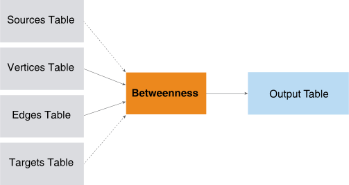
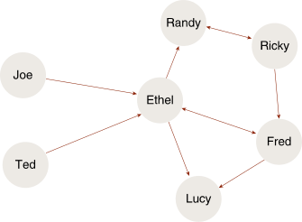

<html><head></head><body>
<h1 class="title topictitle1" id="ariaid-title1">Betweenness (ML Engine)</h1>

The Betweenness function returns the betweenness score, a centrality
			measurement, for every vertex (node) in the input graph.

  </img>  

<h2 class="title topictitle2" id="ariaid-title2">Betweenness Syntax</h2>

<h3 class="title sectiontitle">Version 1.3</h3><pre class="pre codeblock" xml:space="preserve"><code>SELECT * FROM Betweenness (
  ON <var class="keyword varname">vertices_table</var> AS Vertices PARTITION BY <var class="keyword varname">vertex_key_column</var> [,...] 
  ON <var class="keyword varname">edges_table</var> AS Edges PARTITION BY <var class="keyword varname">source_vertex_key_column</var> [,...] 
  [ ON <var class="keyword varname">sources_table</var> AS Sources PARTITION BY <var class="keyword varname">source_vertex_key_column</var> [,...] ]
  [ ON <var class="keyword varname">targets_table</var> AS Targets PARTITION BY <var class="keyword varname">target_vertex_key_column</var> [,...] ]
  USING
  TargetKey ('<var class="keyword varname">target_key_column</var>' [,...])
  [ Directed (<b>{'true'|'t'|'yes'|'y'|'1'|'false'|'f'|'no'|'n'|'0'}</b>) ]
  [ EdgeWeight (<var class="keyword varname">edge_weight_column</var>) ]
  [ MaxDistance (<var class="keyword varname">max_distance</var>) ]
  [ GroupSize (<var class="keyword varname">group_size</var>) ]
  [ SampleRate (<var class="keyword varname">sample_rate</var>) ]
  <code class="ph codeph">[ Accumulate ({ '<var class="keyword varname">accumulate_column</var>' | <var class="keyword varname">accumulate_column_range</var> }[,...]) ]</code>
) AS <var class="keyword varname">alias</var>;</code></pre>

<h2 class="title topictitle2" id="ariaid-title3">Betweenness Syntax Elements</h2>

<dl class="dl parml"><dt class="dt pt dlterm">TargetKey</dt><dd class="dd pd">Specify the target key (the names of the Edges table columns that identify the target vertex). If you specify <var class="keyword varname">targets_table</var>, then the function uses only the vertices in <var class="keyword varname">targets_table</var> as targets (which must be a subset of those that this syntax element specifies).</dd><dt class="dt pt dlterm">Directed</dt><dd class="dd pd">[Optional] Specify whether the graph is directed.</dd><dd class="dd pd ddexpand">Default: 'true'</dd><dt class="dt pt dlterm">EdgeWeight</dt><dd class="dd pd">[Optional] Specify the name of the Edges table column that contains edge weights. The weights are positive values.</dd><dd class="dd pd ddexpand">Default behavior: The weight of each edge is 1 (that is, the graph is unweighted).</dd><dt class="dt pt dlterm">MaxDistance</dt><dd class="dd pd">[Optional] Specify the maximum distance (an integer) between the source and target vertices. A negative <var class="keyword varname">max_distance</var> specifies an infinite distance. If vertices are separated by more than <var class="keyword varname">max_distance</var>, the function does not output them.</dd><dd class="dd pd ddexpand">Default: 10</dd><dt class="dt pt dlterm">GroupSize</dt><dd class="dd pd">[Optional] Specify the number of source vertices that execute a SNSP algorithm in parallel. If <var class="keyword varname">group_size</var> exceeds the number of source vertices in each partition, <var class="keyword varname">s</var>, then <var class="keyword varname">s</var> is the group size.</dd><dd class="dd pd ddexpand">Default behavior: The function calculates the optimal group size based on various cluster and query characteristics.

Running a group of vertices on each vworker, in parallel, uses less memory than running all vertices on each vworker.
</dd><dt class="dt pt dlterm">SampleRate</dt><dd class="dd pd">[Optional] Specify the sample rate (the percentage of source vertices to sample), a DOUBLE PRECISION value in the range (0.0, 1.0]. The number of source vertices that the function uses to create betweenness is approximately <var class="keyword varname">sample_rate</var>*<var class="keyword varname">n</var>, where <var class="keyword varname">n</var> is the number of vertices in the graph.</dd><dt class="dt pt dlterm">Accumulate</dt><dd class="dd pd">[Optional] Specify the names of the Vertices table columns to copy to the output table. These columns enable you to identify the different betweenness scores in the output table.</dd></dl>

<h2 class="title topictitle2" id="ariaid-title4">Betweenness Input</h2>

The input is the same as <a href="ojy1558543631986.md#wii1507906698470">AllPairsShortestPath Input</a>.

For a large graph, specifying the optional sources and targets tables can improve function performance time.

<h2 class="title topictitle2" id="ariaid-title5">Betweenness Output</h2>

<h3 class="title sectiontitle">Output Table Schema</h3>
<table cellpadding="4" cellspacing="0" summary="" id="jgw1507754255988__table_N1000E_N1000C_N10001" class="table" frame="border" border="1" rules="all">

<colgroup span="1"><col style="width:27.27272727272727%" span="1"></col><col style="width:18.181818181818183%" span="1"></col><col style="width:54.54545454545454%" span="1"></col></colgroup><thead class="thead" style="text-align:left;"><tr class="row"><th class="entry nocellnorowborder" style="vertical-align:top;" id="d279893e255" rowspan="1" colspan="1">Column</th><th class="entry nocellnorowborder" style="vertical-align:top;" id="d279893e257" rowspan="1" colspan="1">Data Type</th><th class="entry cell-norowborder" style="vertical-align:top;" id="d279893e259" rowspan="1" colspan="1">Description</th></tr></thead><tbody class="tbody"><tr class="row"><td class="entry nocellnorowborder" style="vertical-align:top;" headers="d279893e255" rowspan="1" colspan="1">betweenness_score</td><td class="entry nocellnorowborder" style="vertical-align:top;" headers="d279893e257" rowspan="1" colspan="1">DOUBLE PRECISION</td><td class="entry cell-norowborder" style="vertical-align:top;" headers="d279893e259" rowspan="1" colspan="1">Betweenness score.</td></tr><tr class="row"><td class="entry row-nocellborder" style="vertical-align:top;" headers="d279893e255" rowspan="1" colspan="1"><var class="keyword varname">accumulate_column</var></td><td class="entry row-nocellborder" style="vertical-align:top;" headers="d279893e257" rowspan="1" colspan="1">Same as in Vertices table</td><td class="entry cellrowborder" style="vertical-align:top;" headers="d279893e259" rowspan="1" colspan="1">[Column appears once for each specified <var class="keyword varname">accumulate_column</var>.] Column copied from Vertices table.

These columns enable you to identify different betweenness scores.
</td></tr></tbody></table>

<h2 class="title topictitle2" id="ariaid-title6">Betweenness Example</h2>

This example computes the betweenness score for each person in the social network shown in the following figure.

Betweenness Example Social Network
  </img>  

<h3 class="title sectiontitle">Input</h3>

The Vertices table has the names of people. The Edges table represents the connections between the people.

<table cellpadding="4" cellspacing="0" summary="" id="jsf1507759014623__table_vp5_bsx_tdb" class="table" frame="border" border="1" rules="all">
Vertices: soc_nw_vertices
<colgroup span="1"><col style="width:100%" span="1"></col></colgroup><thead class="thead" style="text-align:left;"><tr class="row"><th class="entry cellrowborder" style="vertical-align:top;" id="d279893e330" rowspan="1" colspan="1">vertexid</th></tr></thead><tbody class="tbody"><tr class="row"><td class="entry cellrowborder" style="vertical-align:top;" headers="d279893e330" rowspan="1" colspan="1">TED</td></tr><tr class="row"><td class="entry cellrowborder" style="vertical-align:top;" headers="d279893e330" rowspan="1" colspan="1">RICKY</td></tr><tr class="row"><td class="entry cellrowborder" style="vertical-align:top;" headers="d279893e330" rowspan="1" colspan="1">ETHEL</td></tr><tr class="row"><td class="entry cellrowborder" style="vertical-align:top;" headers="d279893e330" rowspan="1" colspan="1">FRED</td></tr><tr class="row"><td class="entry cellrowborder" style="vertical-align:top;" headers="d279893e330" rowspan="1" colspan="1">JOE</td></tr><tr class="row"><td class="entry cellrowborder" style="vertical-align:top;" headers="d279893e330" rowspan="1" colspan="1">RANDY</td></tr><tr class="row"><td class="entry cellrowborder" style="vertical-align:top;" headers="d279893e330" rowspan="1" colspan="1">LUCY</td></tr></tbody></table>

<table cellpadding="4" cellspacing="0" summary="" id="jsf1507759014623__table_szl_3sx_tdb" class="table" frame="border" border="1" rules="all">
Edges: soc_nw_edges
<colgroup span="1"><col style="width:50%" span="1"></col><col style="width:50%" span="1"></col></colgroup><thead class="thead" style="text-align:left;"><tr class="row"><th class="entry cellrowborder" style="vertical-align:top;" id="d279893e362" rowspan="1" colspan="1">source</th><th class="entry cellrowborder" style="vertical-align:top;" id="d279893e364" rowspan="1" colspan="1">target</th></tr></thead><tbody class="tbody"><tr class="row"><td class="entry cellrowborder" style="vertical-align:top;" headers="d279893e362" rowspan="1" colspan="1">TED</td><td class="entry cellrowborder" style="vertical-align:top;" headers="d279893e364" rowspan="1" colspan="1">ETHEL</td></tr><tr class="row"><td class="entry cellrowborder" style="vertical-align:top;" headers="d279893e362" rowspan="1" colspan="1">RICKY</td><td class="entry cellrowborder" style="vertical-align:top;" headers="d279893e364" rowspan="1" colspan="1">FRED</td></tr><tr class="row"><td class="entry cellrowborder" style="vertical-align:top;" headers="d279893e362" rowspan="1" colspan="1">ETHEL</td><td class="entry cellrowborder" style="vertical-align:top;" headers="d279893e364" rowspan="1" colspan="1">LUCY</td></tr><tr class="row"><td class="entry cellrowborder" style="vertical-align:top;" headers="d279893e362" rowspan="1" colspan="1">ETHEL</td><td class="entry cellrowborder" style="vertical-align:top;" headers="d279893e364" rowspan="1" colspan="1">RANDY</td></tr><tr class="row"><td class="entry cellrowborder" style="vertical-align:top;" headers="d279893e362" rowspan="1" colspan="1">FRED</td><td class="entry cellrowborder" style="vertical-align:top;" headers="d279893e364" rowspan="1" colspan="1">ETHEL</td></tr><tr class="row"><td class="entry cellrowborder" style="vertical-align:top;" headers="d279893e362" rowspan="1" colspan="1">ETHEL</td><td class="entry cellrowborder" style="vertical-align:top;" headers="d279893e364" rowspan="1" colspan="1">FRED</td></tr><tr class="row"><td class="entry cellrowborder" style="vertical-align:top;" headers="d279893e362" rowspan="1" colspan="1">JOE</td><td class="entry cellrowborder" style="vertical-align:top;" headers="d279893e364" rowspan="1" colspan="1">ETHEL</td></tr><tr class="row"><td class="entry cellrowborder" style="vertical-align:top;" headers="d279893e362" rowspan="1" colspan="1">RANDY</td><td class="entry cellrowborder" style="vertical-align:top;" headers="d279893e364" rowspan="1" colspan="1">RICKY</td></tr><tr class="row"><td class="entry cellrowborder" style="vertical-align:top;" headers="d279893e362" rowspan="1" colspan="1">RICKY</td><td class="entry cellrowborder" style="vertical-align:top;" headers="d279893e364" rowspan="1" colspan="1">RANDY</td></tr><tr class="row"><td class="entry cellrowborder" style="vertical-align:top;" headers="d279893e362" rowspan="1" colspan="1">FRED</td><td class="entry cellrowborder" style="vertical-align:top;" headers="d279893e364" rowspan="1" colspan="1">LUCY</td></tr></tbody></table>

<h3 class="title sectiontitle">SQL Call</h3><pre class="pre codeblock" xml:space="preserve"><code>SELECT * FROM Betweenness (
  ON soc_nw_vertices AS Vertices PARTITION BY vertexid
  ON soc_nw_edges AS Edges PARTITION BY source
  USING
  TargetKey ('target')
  Accumulate ('vertexid')
) AS dt ORDER BY vertexid;</code></pre>

<h3 class="title sectiontitle">Output</h3>

Ethel has the highest betweenness score.
<pre class="pre screen" xml:space="preserve"> vertexid betweenness 
 -------- ----------- 
 ethel           10.0
 fred             4.0
 joe              0.0
 lucy             0.0
 randy            4.0
 ricky            3.0
 ted              0.0</pre>

Download a zip file of all examples and a SQL script file that creates their input tables from the attachment in the left sidebar.

</body></html>
