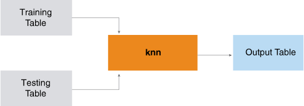

<html><head></head><body>
<h1 class="title topictitle1" id="ariaid-title1">KNN (ML Engine)</h1>

The KNN function uses training data objects to map test data objects to categories. The function is optimized for both small and large training sets. The function supports user-defined distance metrics and distance-weighted voting.

  </img>  

<h2 class="title topictitle2" id="ariaid-title2">KNN Syntax</h2>

<h3 class="title sectiontitle">Version 2.3</h3><pre class="pre codeblock" xml:space="preserve"><code>SELECT * FROM KNN (
  ON <var class="keyword varname">training_table</var> AS TrainingData
  ON <var class="keyword varname">test_table</var> AS TestData
  [ OUT TABLE OutputTable (<var class="keyword varname">output_table</var>) ]
  USING
  K (<var class="keyword varname">k</var>)
  ResponseColumn ('<var class="keyword varname">response_column</var>')
  IDColumn ('<var class="keyword varname">test_id_column</var>')
  DistanceFeatures ({ '<var class="keyword varname">df_column</var>' | <var class="keyword varname">df_column_range</var> }[,... ])
  [ VotingWeight (<var class="keyword varname">voting_weight</var>) ]
  [ CustomizedDistance ('<var class="keyword varname">jar</var>', '<var class="keyword varname">distance_class</var>') ]
  [ ForceMapReduce (<b>{'true'|'t'|'yes'|'y'|'1'|'false'|'f'|'no'|'n'|'0'}</b>) ]
  [ PartitionColumn ('<var class="keyword varname">partition_column</var>') ]
  [ PartitionBlockSize (<var class="keyword varname">partition_block_size</var>) ]
  [ OutputProb (<b>{'true'|'t'|'yes'|'y'|'1'|'false'|'f'|'no'|'n'|'0'}</b>) ]
  <code class="ph codeph">[ Accumulate ({ '<var class="keyword varname">accumulate_column</var>' | <var class="keyword varname">accumulate_column_range</var> }[,...]) ]</code>
) AS <var class="keyword varname">alias</var>;</code></pre>

<b>Related Information</b>

<ul class="linklist linklist relinfo">
<a href="ndv1557782188375.md">Column Specification Syntax Elements</a>
</ul>

<h2 class="title topictitle2" id="ariaid-title3">KNN Syntax Elements</h2>

<dl class="dl parml"><dt class="dt pt dlterm">OutputTable</dt><dd class="dd pd">[Optional] Specify the name of the output table.</dd><dd class="dd pd ddexpand">Default behavior: The function displays the output to the screen.</dd><dt class="dt pt dlterm">K</dt><dd class="dd pd">Specify the number of nearest neighbors to use for classifying the test data. The choice of K presents a bias-variance trade-off. A higher value of K typically results in lower variance and smoother neighboring boundaries but increases bias, and the reverse. If there are more than K neighbors at the same distance, K nearest neighbors are randomly chosen. This adds nondeterminism to the algorithm and may result in variation in classification results. To ensure deterministic behavior, use the <a href="fdw1549987717481.md">UniqueID Syntax Element</a>.</dd><dt class="dt pt dlterm">ResponseColumn</dt><dd class="dd pd">Specify the name of the TrainingData column that contains the class label or classification of the classified data objects.</dd><dt class="dt pt dlterm">IDColumn</dt><dd class="dd pd">Specify the name of the TestData column that uniquely identifies a data object.</dd><dt class="dt pt dlterm">DistanceFeatures</dt><dd class="dd pd">Specify the names of the TrainingData columns that the function uses to compute the distance between a test object and the training objects. The TestData table must also have these columns.</dd><dd class="dd pd ddexpand">A null value in a column is treated as infinite distance.</dd><dd class="dd pd ddexpand">While computing nearest neighbors, the function considers only neighbors from training data, not the already predicted neighbors from testing data.</dd><dd class="dd pd ddexpand">If different features have different units of measurement, Teradata recommends normalizing all data points to be in the range [0,1].</dd><dd class="dd pd ddexpand">As the number of DistanceFeatures increases, the distances between all data points become small and the usefulness of the distance measure decreases. If necessary, reduce the number of features for distance computation by using feature selection or dimensionality reduction methods.</dd><dt class="dt pt dlterm">VotingWeight</dt><dd class="dd pd">[Optional] Specify the voting weight of the distance between a test object and the training objects. The <var class="keyword varname">voting_weight</var> must be a nonnegative integer.</dd><dd class="dd pd ddexpand">The function calculates distance-weighted voting, <var class="keyword varname">w</var>, with this equation:

<code class="ph codeph"><var class="keyword varname">w</var> = 1/POWER(<var class="keyword varname">distance</var>, <var class="keyword varname">voting_weight</var>)</code>
</dd><dd class="dd pd ddexpand">Where <var class="keyword varname">distance</var> is the distance between the test object and the training object.</dd><dd class="dd pd ddexpand">Default: 0</dd><dt class="dt pt dlterm">CustomizedDistance</dt><dd class="dd pd">[Optional] Specify the distance function. The parameter jar is the name of the JAR file that contains the distance metric class. The parameter <var class="keyword varname">distance_class</var> is the distance metric class defined in the jar file. This JAR file must be installed on <b>ML Engine</b>.</dd><dd class="dd pd ddexpand"><b>ML Engine</b> does not support the creation of new customized distance classes. However, it does support existing JAR files—for installation instructions, see <cite class="cite">Teradata Vantage™ User Guide</cite>, B700-4002.</dd><dd class="dd pd ddexpand">Default: Euclidean distance</dd><dt class="dt pt dlterm">ForceMapReduce</dt><dd class="dd pd">[Optional] Specify whether to partition the training data. If you specify 'true', the KNN function partitions the training data and uses the map-and reduce function.</dd><dd class="dd pd ddexpand">If you specify ForceMapReduce, you must also specify PartitionColumn.</dd><dd class="dd pd ddexpand">Default: 'false' (The function loads all training data into memory and uses only the row function.)</dd><dt class="dt pt dlterm">PartitionColumn</dt><dd class="dd pd">[Required if ForceMapReduce is true, ignored otherwise.] Specify name of column by which input table can be uniformly partitioned. The <var class="keyword varname">partition_column</var> must contain INTEGER, BIGINT, or BYTEINT values. A unique identifier for each row results in more uniformed partitioning, for better performance.</dd><dt class="dt pt dlterm">PartitionBlockSize</dt><dd class="dd pd">[Optional] Specify the partition block size to use with ForceMapReduce ('true'). Specifying an optimal value for this syntax element may improve performance. The optimal value depends on the size of the training data and the vworker configuration. Because rows in a partition are processed together, a higher value improves performance, but the maximum value is limited by the memory of the vworker. For example, if the training data set has 1024 rows, specifying PartitionBlockSize('16') partitions the input data into 64 partitions of 16 rows each. Similarly, PartitionBlockSize('128') creates 8 (1024/128) partitions of 128 rows each. The partitions are distributed evenly across the number of vworkers available.</dd><dd class="dd pd ddexpand">If you omit this syntax element, the function calculates the partition block size that best fits available memory. The calculated value is optimal if <var class="keyword varname">partition_column</var> has a unique INTEGER for each row.</dd><dt class="dt pt dlterm">OutputProb</dt><dd class="dd pd">Specify whether to output the calculated probability for each observation.</dd><dd class="dd pd ddexpand">Default: 'false'</dd><dt class="dt pt dlterm">Accumulate</dt><dd class="dd pd">Specify the names of the TrainingTable columns to copy to OutputTable.</dd></dl>

<h2 class="title topictitle2" id="ariaid-title4">KNN Input</h2>

<b>Note</b>
It is important to normalize the input variables before calling this function. For details, see <a href="qnw1570800778984.md">Normalized Input</a>.

<h3 class="title sectiontitle">TrainingData Schema</h3>

The table can have additional columns, but the function ignores them.

<table cellpadding="4" cellspacing="0" summary="" id="kgi1507666508410__table_N10017_N1000E_N1000C_N10001" class="table" frame="border" border="1" rules="all">

<colgroup span="1"><col style="width:23.076923076923077%" span="1"></col><col style="width:15.384615384615385%" span="1"></col><col style="width:61.53846153846154%" span="1"></col></colgroup><thead class="thead" style="text-align:left;"><tr class="row"><th class="entry nocellnorowborder" style="vertical-align:top;" id="d372035e338" rowspan="1" colspan="1">Column</th><th class="entry nocellnorowborder" style="vertical-align:top;" id="d372035e340" rowspan="1" colspan="1">Data Type</th><th class="entry cell-norowborder" style="vertical-align:top;" id="d372035e342" rowspan="1" colspan="1">Description</th></tr></thead><tbody class="tbody"><tr class="row"><td class="entry nocellnorowborder" style="vertical-align:top;" headers="d372035e338" rowspan="1" colspan="1"><var class="keyword varname">id_column</var></td><td class="entry nocellnorowborder" style="vertical-align:top;" headers="d372035e340" rowspan="1" colspan="1">Any</td><td class="entry cell-norowborder" style="vertical-align:top;" headers="d372035e342" rowspan="1" colspan="1">Unique row identifier.</td></tr><tr class="row"><td class="entry nocellnorowborder" style="vertical-align:top;" headers="d372035e338" rowspan="1" colspan="1"><var class="keyword varname">df_column</var></td><td class="entry nocellnorowborder" style="vertical-align:top;" headers="d372035e340" rowspan="1" colspan="1">INTEGER, BIGINT, SMALLINT, or NUMERIC</td><td class="entry cell-norowborder" style="vertical-align:top;" headers="d372035e342" rowspan="1" colspan="1">Column that function uses to compute distance between a test object and the training objects. TestData must have a column with the same name and data type.</td></tr><tr class="row"><td class="entry row-nocellborder" style="vertical-align:top;" headers="d372035e338" rowspan="1" colspan="1"><var class="keyword varname">response_column</var></td><td class="entry row-nocellborder" style="vertical-align:top;" headers="d372035e340" rowspan="1" colspan="1"> </td><td class="entry cellrowborder" style="vertical-align:top;" headers="d372035e342" rowspan="1" colspan="1">Class label or classification of classified data object.</td></tr></tbody></table>

<h3 class="title sectiontitle">TestData Schema</h3>

The table can have additional columns, but the function ignores them.

<table cellpadding="4" cellspacing="0" summary="" id="kgi1507666508410__table_N10071_N1000E_N1000C_N10001" class="table" frame="border" border="1" rules="all">

<colgroup span="1"><col style="width:23.076923076923077%" span="1"></col><col style="width:15.384615384615385%" span="1"></col><col style="width:61.53846153846154%" span="1"></col></colgroup><thead class="thead" style="text-align:left;"><tr class="row"><th class="entry nocellnorowborder" style="vertical-align:top;" id="d372035e381" rowspan="1" colspan="1">Column</th><th class="entry nocellnorowborder" style="vertical-align:top;" id="d372035e383" rowspan="1" colspan="1">Data Type</th><th class="entry cell-norowborder" style="vertical-align:top;" id="d372035e385" rowspan="1" colspan="1">Description</th></tr></thead><tbody class="tbody"><tr class="row"><td class="entry nocellnorowborder" style="vertical-align:top;" headers="d372035e381" rowspan="1" colspan="1"><var class="keyword varname">df_column</var></td><td class="entry nocellnorowborder" style="vertical-align:top;" headers="d372035e383" rowspan="1" colspan="1">INTEGER, BIGINT, SMALLINT, or NUMERIC</td><td class="entry cell-norowborder" style="vertical-align:top;" headers="d372035e385" rowspan="1" colspan="1">Column that function uses to compute distance between a test object and the training objects. TrainingData must have a column with the same name and data type.</td></tr><tr class="row"><td class="entry row-nocellborder" style="vertical-align:top;" headers="d372035e381" rowspan="1" colspan="1"><var class="keyword varname">test_id_column</var></td><td class="entry row-nocellborder" style="vertical-align:top;" headers="d372035e383" rowspan="1" colspan="1">Any</td><td class="entry cellrowborder" style="vertical-align:top;" headers="d372035e385" rowspan="1" colspan="1">Unique test data object identifier.</td></tr></tbody></table>

<h2 class="title topictitle2" id="ariaid-title5">KNN Output</h2>

By default, the KNN function outputs a table to the screen. If you specify an output table name, the function outputs a message to the screen and creates an output table with the specified name.

<h3 class="title sectiontitle">Output Message Schema</h3>
<table cellpadding="4" cellspacing="0" summary="" id="sil1507666521245__table_sfn_3ps_rcb" class="table" frame="border" border="1" rules="all">

<colgroup span="1"><col style="width:33.33333333333333%" span="1"></col><col style="width:33.33333333333333%" span="1"></col><col style="width:33.33333333333333%" span="1"></col></colgroup><thead class="thead" style="text-align:left;"><tr class="row"><th class="entry cellrowborder" style="vertical-align:top;" id="d372035e426" rowspan="1" colspan="1">Column</th><th class="entry cellrowborder" style="vertical-align:top;" id="d372035e428" rowspan="1" colspan="1">Data Type</th><th class="entry cellrowborder" style="vertical-align:top;" id="d372035e430" rowspan="1" colspan="1">Description</th></tr></thead><tbody class="tbody"><tr class="row"><td class="entry cellrowborder" style="vertical-align:top;" headers="d372035e426" rowspan="1" colspan="1">message</td><td class="entry cellrowborder" style="vertical-align:top;" headers="d372035e428" rowspan="1" colspan="1">VARCHAR</td><td class="entry cellrowborder" style="vertical-align:top;" headers="d372035e430" rowspan="1" colspan="1">Reports that final result is stored in table specified in OutputTable syntax element.</td></tr></tbody></table>

<h3 class="title sectiontitle">OutputTable Schema</h3>
<table cellpadding="4" cellspacing="0" summary="" id="sil1507666521245__table_N10014_N1000E_N1000C_N10001" class="table" frame="border" border="1" rules="all">

<colgroup span="1"><col style="width:23.076923076923077%" span="1"></col><col style="width:15.384615384615385%" span="1"></col><col style="width:61.53846153846154%" span="1"></col></colgroup><thead class="thead" style="text-align:left;"><tr class="row"><th class="entry nocellnorowborder" style="vertical-align:top;" id="d372035e450" rowspan="1" colspan="1">Column</th><th class="entry nocellnorowborder" style="vertical-align:top;" id="d372035e452" rowspan="1" colspan="1">Data Type</th><th class="entry cell-norowborder" style="vertical-align:top;" id="d372035e454" rowspan="1" colspan="1">Description</th></tr></thead><tbody class="tbody"><tr class="row"><td class="entry nocellnorowborder" style="vertical-align:top;" headers="d372035e450" rowspan="1" colspan="1"><var class="keyword varname">test_id_column</var></td><td class="entry nocellnorowborder" style="vertical-align:top;" headers="d372035e452" rowspan="1" colspan="1">Same as in test table</td><td class="entry cell-norowborder" style="vertical-align:top;" headers="d372035e454" rowspan="1" colspan="1">Unique test data object identifier.</td></tr><tr class="row"><td class="entry nocellnorowborder" style="vertical-align:top;" headers="d372035e450" rowspan="1" colspan="1">category</td><td class="entry nocellnorowborder" style="vertical-align:top;" headers="d372035e452" rowspan="1" colspan="1">VARCHAR</td><td class="entry cell-norowborder" style="vertical-align:top;" headers="d372035e454" rowspan="1" colspan="1">Category from TrainingData <var class="keyword varname">response_column</var> to which function mapped test data object.</td></tr><tr class="row"><td class="entry nocellnorowborder" style="vertical-align:top;" headers="d372035e450" rowspan="1" colspan="1">prob</td><td class="entry nocellnorowborder" style="vertical-align:top;" headers="d372035e452" rowspan="1" colspan="1">DOUBLE PRECISION</td><td class="entry cell-norowborder" style="vertical-align:top;" headers="d372035e454" rowspan="1" colspan="1">Probability that observation belongs to predicted category.</td></tr><tr class="row"><td class="entry row-nocellborder" style="vertical-align:top;" headers="d372035e450" rowspan="1" colspan="1"><var class="keyword varname">accumulate_column</var></td><td class="entry row-nocellborder" style="vertical-align:top;" headers="d372035e452" rowspan="1" colspan="1">Same as in input table</td><td class="entry cellrowborder" style="vertical-align:top;" headers="d372035e454" rowspan="1" colspan="1">Column copied from TrainingTable.</td></tr></tbody></table>

<h2 class="title topictitle2" id="ariaid-title6">KNN Example</h2>

<h3 class="title sectiontitle">Input</h3>

The TrainingData table has as dimensions five attributes of personal computers—price, speed, hard disk size, RAM, and screen size. The table has 5008 rows, categorized into eight price categories.

<table cellpadding="4" cellspacing="0" summary="" id="kfy1507666550824__table_vz4_xyf_n2b" class="table" frame="border" border="1" rules="all">
TrainingTable: computers_train1_clustered
<colgroup span="1"><col style="width:14.285714285714285%" span="1"></col><col style="width:14.285714285714285%" span="1"></col><col style="width:14.285714285714285%" span="1"></col><col style="width:14.285714285714285%" span="1"></col><col style="width:14.285714285714285%" span="1"></col><col style="width:14.285714285714285%" span="1"></col><col style="width:14.285714285714285%" span="1"></col></colgroup><thead class="thead" style="text-align:left;"><tr class="row"><th class="entry cellrowborder" style="vertical-align:top;" id="d372035e528" rowspan="1" colspan="1">id</th><th class="entry cellrowborder" style="vertical-align:top;" id="d372035e530" rowspan="1" colspan="1">price</th><th class="entry cellrowborder" style="vertical-align:top;" id="d372035e532" rowspan="1" colspan="1">speed</th><th class="entry cellrowborder" style="vertical-align:top;" id="d372035e534" rowspan="1" colspan="1">hd</th><th class="entry cellrowborder" style="vertical-align:top;" id="d372035e536" rowspan="1" colspan="1">ram</th><th class="entry cellrowborder" style="vertical-align:top;" id="d372035e538" rowspan="1" colspan="1">screen</th><th class="entry cellrowborder" style="vertical-align:top;" id="d372035e540" rowspan="1" colspan="1">computer_category</th></tr></thead><tbody class="tbody"><tr class="row"><td class="entry cellrowborder" style="vertical-align:top;" headers="d372035e528" rowspan="1" colspan="1">1</td><td class="entry cellrowborder" style="vertical-align:top;" headers="d372035e530" rowspan="1" colspan="1">1499</td><td class="entry cellrowborder" style="vertical-align:top;" headers="d372035e532" rowspan="1" colspan="1">25</td><td class="entry cellrowborder" style="vertical-align:top;" headers="d372035e534" rowspan="1" colspan="1">80</td><td class="entry cellrowborder" style="vertical-align:top;" headers="d372035e536" rowspan="1" colspan="1">4</td><td class="entry cellrowborder" style="vertical-align:top;" headers="d372035e538" rowspan="1" colspan="1">14</td><td class="entry cellrowborder" style="vertical-align:top;" headers="d372035e540" rowspan="1" colspan="1">SPECIAL</td></tr><tr class="row"><td class="entry cellrowborder" style="vertical-align:top;" headers="d372035e528" rowspan="1" colspan="1">2</td><td class="entry cellrowborder" style="vertical-align:top;" headers="d372035e530" rowspan="1" colspan="1">1795</td><td class="entry cellrowborder" style="vertical-align:top;" headers="d372035e532" rowspan="1" colspan="1">33</td><td class="entry cellrowborder" style="vertical-align:top;" headers="d372035e534" rowspan="1" colspan="1">85</td><td class="entry cellrowborder" style="vertical-align:top;" headers="d372035e536" rowspan="1" colspan="1">2</td><td class="entry cellrowborder" style="vertical-align:top;" headers="d372035e538" rowspan="1" colspan="1">14</td><td class="entry cellrowborder" style="vertical-align:top;" headers="d372035e540" rowspan="1" colspan="1">SUPER</td></tr><tr class="row"><td class="entry cellrowborder" style="vertical-align:top;" headers="d372035e528" rowspan="1" colspan="1">3</td><td class="entry cellrowborder" style="vertical-align:top;" headers="d372035e530" rowspan="1" colspan="1">1595</td><td class="entry cellrowborder" style="vertical-align:top;" headers="d372035e532" rowspan="1" colspan="1">25</td><td class="entry cellrowborder" style="vertical-align:top;" headers="d372035e534" rowspan="1" colspan="1">170</td><td class="entry cellrowborder" style="vertical-align:top;" headers="d372035e536" rowspan="1" colspan="1">4</td><td class="entry cellrowborder" style="vertical-align:top;" headers="d372035e538" rowspan="1" colspan="1">15</td><td class="entry cellrowborder" style="vertical-align:top;" headers="d372035e540" rowspan="1" colspan="1">SPECIAL</td></tr><tr class="row"><td class="entry cellrowborder" style="vertical-align:top;" headers="d372035e528" rowspan="1" colspan="1">4</td><td class="entry cellrowborder" style="vertical-align:top;" headers="d372035e530" rowspan="1" colspan="1">1849</td><td class="entry cellrowborder" style="vertical-align:top;" headers="d372035e532" rowspan="1" colspan="1">25</td><td class="entry cellrowborder" style="vertical-align:top;" headers="d372035e534" rowspan="1" colspan="1">170</td><td class="entry cellrowborder" style="vertical-align:top;" headers="d372035e536" rowspan="1" colspan="1">8</td><td class="entry cellrowborder" style="vertical-align:top;" headers="d372035e538" rowspan="1" colspan="1">14</td><td class="entry cellrowborder" style="vertical-align:top;" headers="d372035e540" rowspan="1" colspan="1">SUPER</td></tr><tr class="row"><td class="entry cellrowborder" style="vertical-align:top;" headers="d372035e528" rowspan="1" colspan="1">5</td><td class="entry cellrowborder" style="vertical-align:top;" headers="d372035e530" rowspan="1" colspan="1">3295</td><td class="entry cellrowborder" style="vertical-align:top;" headers="d372035e532" rowspan="1" colspan="1">33</td><td class="entry cellrowborder" style="vertical-align:top;" headers="d372035e534" rowspan="1" colspan="1">340</td><td class="entry cellrowborder" style="vertical-align:top;" headers="d372035e536" rowspan="1" colspan="1">16</td><td class="entry cellrowborder" style="vertical-align:top;" headers="d372035e538" rowspan="1" colspan="1">14</td><td class="entry cellrowborder" style="vertical-align:top;" headers="d372035e540" rowspan="1" colspan="1">HYPER</td></tr><tr class="row"><td class="entry cellrowborder" style="vertical-align:top;" headers="d372035e528" rowspan="1" colspan="1">6</td><td class="entry cellrowborder" style="vertical-align:top;" headers="d372035e530" rowspan="1" colspan="1">3695</td><td class="entry cellrowborder" style="vertical-align:top;" headers="d372035e532" rowspan="1" colspan="1">66</td><td class="entry cellrowborder" style="vertical-align:top;" headers="d372035e534" rowspan="1" colspan="1">340</td><td class="entry cellrowborder" style="vertical-align:top;" headers="d372035e536" rowspan="1" colspan="1">16</td><td class="entry cellrowborder" style="vertical-align:top;" headers="d372035e538" rowspan="1" colspan="1">14</td><td class="entry cellrowborder" style="vertical-align:top;" headers="d372035e540" rowspan="1" colspan="1">UBER</td></tr><tr class="row"><td class="entry cellrowborder" style="vertical-align:top;" headers="d372035e528" rowspan="1" colspan="1">7</td><td class="entry cellrowborder" style="vertical-align:top;" headers="d372035e530" rowspan="1" colspan="1">1720</td><td class="entry cellrowborder" style="vertical-align:top;" headers="d372035e532" rowspan="1" colspan="1">25</td><td class="entry cellrowborder" style="vertical-align:top;" headers="d372035e534" rowspan="1" colspan="1">170</td><td class="entry cellrowborder" style="vertical-align:top;" headers="d372035e536" rowspan="1" colspan="1">4</td><td class="entry cellrowborder" style="vertical-align:top;" headers="d372035e538" rowspan="1" colspan="1">14</td><td class="entry cellrowborder" style="vertical-align:top;" headers="d372035e540" rowspan="1" colspan="1">SPECIAL</td></tr><tr class="row"><td class="entry cellrowborder" style="vertical-align:top;" headers="d372035e528" rowspan="1" colspan="1">8</td><td class="entry cellrowborder" style="vertical-align:top;" headers="d372035e530" rowspan="1" colspan="1">1995</td><td class="entry cellrowborder" style="vertical-align:top;" headers="d372035e532" rowspan="1" colspan="1">50</td><td class="entry cellrowborder" style="vertical-align:top;" headers="d372035e534" rowspan="1" colspan="1">85</td><td class="entry cellrowborder" style="vertical-align:top;" headers="d372035e536" rowspan="1" colspan="1">2</td><td class="entry cellrowborder" style="vertical-align:top;" headers="d372035e538" rowspan="1" colspan="1">14</td><td class="entry cellrowborder" style="vertical-align:top;" headers="d372035e540" rowspan="1" colspan="1">SUPER</td></tr><tr class="row"><td class="entry cellrowborder" style="vertical-align:top;" headers="d372035e528" rowspan="1" colspan="1">9</td><td class="entry cellrowborder" style="vertical-align:top;" headers="d372035e530" rowspan="1" colspan="1">2225</td><td class="entry cellrowborder" style="vertical-align:top;" headers="d372035e532" rowspan="1" colspan="1">50</td><td class="entry cellrowborder" style="vertical-align:top;" headers="d372035e534" rowspan="1" colspan="1">210</td><td class="entry cellrowborder" style="vertical-align:top;" headers="d372035e536" rowspan="1" colspan="1">8</td><td class="entry cellrowborder" style="vertical-align:top;" headers="d372035e538" rowspan="1" colspan="1">14</td><td class="entry cellrowborder" style="vertical-align:top;" headers="d372035e540" rowspan="1" colspan="1">SUPER</td></tr><tr class="row"><td class="entry cellrowborder" style="vertical-align:top;" headers="d372035e528" rowspan="1" colspan="1">12</td><td class="entry cellrowborder" style="vertical-align:top;" headers="d372035e530" rowspan="1" colspan="1">2605</td><td class="entry cellrowborder" style="vertical-align:top;" headers="d372035e532" rowspan="1" colspan="1">66</td><td class="entry cellrowborder" style="vertical-align:top;" headers="d372035e534" rowspan="1" colspan="1">210</td><td class="entry cellrowborder" style="vertical-align:top;" headers="d372035e536" rowspan="1" colspan="1">8</td><td class="entry cellrowborder" style="vertical-align:top;" headers="d372035e538" rowspan="1" colspan="1">14</td><td class="entry cellrowborder" style="vertical-align:top;" headers="d372035e540" rowspan="1" colspan="1">MEGA</td></tr><tr class="row"><td class="entry cellrowborder" style="vertical-align:top;" headers="d372035e528" rowspan="1" colspan="1">13</td><td class="entry cellrowborder" style="vertical-align:top;" headers="d372035e530" rowspan="1" colspan="1">2045</td><td class="entry cellrowborder" style="vertical-align:top;" headers="d372035e532" rowspan="1" colspan="1">50</td><td class="entry cellrowborder" style="vertical-align:top;" headers="d372035e534" rowspan="1" colspan="1">130</td><td class="entry cellrowborder" style="vertical-align:top;" headers="d372035e536" rowspan="1" colspan="1">4</td><td class="entry cellrowborder" style="vertical-align:top;" headers="d372035e538" rowspan="1" colspan="1">14</td><td class="entry cellrowborder" style="vertical-align:top;" headers="d372035e540" rowspan="1" colspan="1">SUPER</td></tr><tr class="row"><td class="entry cellrowborder" style="vertical-align:top;" headers="d372035e528" rowspan="1" colspan="1">14</td><td class="entry cellrowborder" style="vertical-align:top;" headers="d372035e530" rowspan="1" colspan="1">2295</td><td class="entry cellrowborder" style="vertical-align:top;" headers="d372035e532" rowspan="1" colspan="1">25</td><td class="entry cellrowborder" style="vertical-align:top;" headers="d372035e534" rowspan="1" colspan="1">245</td><td class="entry cellrowborder" style="vertical-align:top;" headers="d372035e536" rowspan="1" colspan="1">8</td><td class="entry cellrowborder" style="vertical-align:top;" headers="d372035e538" rowspan="1" colspan="1">14</td><td class="entry cellrowborder" style="vertical-align:top;" headers="d372035e540" rowspan="1" colspan="1">MEGA</td></tr><tr class="row"><td class="entry cellrowborder" style="vertical-align:top;" headers="d372035e528" rowspan="1" colspan="1">16</td><td class="entry cellrowborder" style="vertical-align:top;" headers="d372035e530" rowspan="1" colspan="1">2225</td><td class="entry cellrowborder" style="vertical-align:top;" headers="d372035e532" rowspan="1" colspan="1">50</td><td class="entry cellrowborder" style="vertical-align:top;" headers="d372035e534" rowspan="1" colspan="1">130</td><td class="entry cellrowborder" style="vertical-align:top;" headers="d372035e536" rowspan="1" colspan="1">4</td><td class="entry cellrowborder" style="vertical-align:top;" headers="d372035e538" rowspan="1" colspan="1">14</td><td class="entry cellrowborder" style="vertical-align:top;" headers="d372035e540" rowspan="1" colspan="1">SUPER</td></tr><tr class="row"><td class="entry cellrowborder" style="vertical-align:top;" headers="d372035e528" rowspan="1" colspan="1">17</td><td class="entry cellrowborder" style="vertical-align:top;" headers="d372035e530" rowspan="1" colspan="1">1595</td><td class="entry cellrowborder" style="vertical-align:top;" headers="d372035e532" rowspan="1" colspan="1">33</td><td class="entry cellrowborder" style="vertical-align:top;" headers="d372035e534" rowspan="1" colspan="1">85</td><td class="entry cellrowborder" style="vertical-align:top;" headers="d372035e536" rowspan="1" colspan="1">2</td><td class="entry cellrowborder" style="vertical-align:top;" headers="d372035e538" rowspan="1" colspan="1">14</td><td class="entry cellrowborder" style="vertical-align:top;" headers="d372035e540" rowspan="1" colspan="1">SPECIAL</td></tr><tr class="row"><td class="entry cellrowborder" style="vertical-align:top;" headers="d372035e528" rowspan="1" colspan="1">18</td><td class="entry cellrowborder" style="vertical-align:top;" headers="d372035e530" rowspan="1" colspan="1">2325</td><td class="entry cellrowborder" style="vertical-align:top;" headers="d372035e532" rowspan="1" colspan="1">33</td><td class="entry cellrowborder" style="vertical-align:top;" headers="d372035e534" rowspan="1" colspan="1">210</td><td class="entry cellrowborder" style="vertical-align:top;" headers="d372035e536" rowspan="1" colspan="1">4</td><td class="entry cellrowborder" style="vertical-align:top;" headers="d372035e538" rowspan="1" colspan="1">15</td><td class="entry cellrowborder" style="vertical-align:top;" headers="d372035e540" rowspan="1" colspan="1">MEGA</td></tr><tr class="row"><td class="entry cellrowborder" style="vertical-align:top;" headers="d372035e528" rowspan="1" colspan="1">19</td><td class="entry cellrowborder" style="vertical-align:top;" headers="d372035e530" rowspan="1" colspan="1">2095</td><td class="entry cellrowborder" style="vertical-align:top;" headers="d372035e532" rowspan="1" colspan="1">33</td><td class="entry cellrowborder" style="vertical-align:top;" headers="d372035e534" rowspan="1" colspan="1">250</td><td class="entry cellrowborder" style="vertical-align:top;" headers="d372035e536" rowspan="1" colspan="1">4</td><td class="entry cellrowborder" style="vertical-align:top;" headers="d372035e538" rowspan="1" colspan="1">15</td><td class="entry cellrowborder" style="vertical-align:top;" headers="d372035e540" rowspan="1" colspan="1">SUPER</td></tr><tr class="row"><td class="entry cellrowborder" style="vertical-align:top;" headers="d372035e528" rowspan="1" colspan="1">20</td><td class="entry cellrowborder" style="vertical-align:top;" headers="d372035e530" rowspan="1" colspan="1">4395</td><td class="entry cellrowborder" style="vertical-align:top;" headers="d372035e532" rowspan="1" colspan="1">66</td><td class="entry cellrowborder" style="vertical-align:top;" headers="d372035e534" rowspan="1" colspan="1">452</td><td class="entry cellrowborder" style="vertical-align:top;" headers="d372035e536" rowspan="1" colspan="1">8</td><td class="entry cellrowborder" style="vertical-align:top;" headers="d372035e538" rowspan="1" colspan="1">14</td><td class="entry cellrowborder" style="vertical-align:top;" headers="d372035e540" rowspan="1" colspan="1">UBER</td></tr><tr class="row"><td class="entry cellrowborder" style="vertical-align:top;" headers="d372035e528" rowspan="1" colspan="1">...</td><td class="entry cellrowborder" style="vertical-align:top;" headers="d372035e530" rowspan="1" colspan="1">...</td><td class="entry cellrowborder" style="vertical-align:top;" headers="d372035e532" rowspan="1" colspan="1">...</td><td class="entry cellrowborder" style="vertical-align:top;" headers="d372035e534" rowspan="1" colspan="1">...</td><td class="entry cellrowborder" style="vertical-align:top;" headers="d372035e536" rowspan="1" colspan="1">...</td><td class="entry cellrowborder" style="vertical-align:top;" headers="d372035e538" rowspan="1" colspan="1">...</td><td class="entry cellrowborder" style="vertical-align:top;" headers="d372035e540" rowspan="1" colspan="1">...</td></tr></tbody></table>

The TestData table has more than 1000 rows.

<table cellpadding="4" cellspacing="0" summary="" id="kfy1507666550824__table_wkw_bzf_n2b" class="table" frame="border" border="1" rules="all">
TestData: computers_test1
<colgroup span="1"><col style="width:16.666666666666664%" span="1"></col><col style="width:16.666666666666664%" span="1"></col><col style="width:16.666666666666664%" span="1"></col><col style="width:16.666666666666664%" span="1"></col><col style="width:16.666666666666664%" span="1"></col><col style="width:16.666666666666664%" span="1"></col></colgroup><thead class="thead" style="text-align:left;"><tr class="row"><th class="entry cellrowborder" style="vertical-align:top;" id="d372035e828" rowspan="1" colspan="1">id</th><th class="entry cellrowborder" style="vertical-align:top;" id="d372035e830" rowspan="1" colspan="1">price</th><th class="entry cellrowborder" style="vertical-align:top;" id="d372035e832" rowspan="1" colspan="1">speed</th><th class="entry cellrowborder" style="vertical-align:top;" id="d372035e834" rowspan="1" colspan="1">hd</th><th class="entry cellrowborder" style="vertical-align:top;" id="d372035e836" rowspan="1" colspan="1">ram</th><th class="entry cellrowborder" style="vertical-align:top;" id="d372035e838" rowspan="1" colspan="1">screen</th></tr></thead><tbody class="tbody"><tr class="row"><td class="entry cellrowborder" style="vertical-align:top;" headers="d372035e828" rowspan="1" colspan="1">10</td><td class="entry cellrowborder" style="vertical-align:top;" headers="d372035e830" rowspan="1" colspan="1">2575</td><td class="entry cellrowborder" style="vertical-align:top;" headers="d372035e832" rowspan="1" colspan="1">50</td><td class="entry cellrowborder" style="vertical-align:top;" headers="d372035e834" rowspan="1" colspan="1">210</td><td class="entry cellrowborder" style="vertical-align:top;" headers="d372035e836" rowspan="1" colspan="1">4</td><td class="entry cellrowborder" style="vertical-align:top;" headers="d372035e838" rowspan="1" colspan="1">15</td></tr><tr class="row"><td class="entry cellrowborder" style="vertical-align:top;" headers="d372035e828" rowspan="1" colspan="1">11</td><td class="entry cellrowborder" style="vertical-align:top;" headers="d372035e830" rowspan="1" colspan="1">2195</td><td class="entry cellrowborder" style="vertical-align:top;" headers="d372035e832" rowspan="1" colspan="1">33</td><td class="entry cellrowborder" style="vertical-align:top;" headers="d372035e834" rowspan="1" colspan="1">170</td><td class="entry cellrowborder" style="vertical-align:top;" headers="d372035e836" rowspan="1" colspan="1">8</td><td class="entry cellrowborder" style="vertical-align:top;" headers="d372035e838" rowspan="1" colspan="1">15</td></tr><tr class="row"><td class="entry cellrowborder" style="vertical-align:top;" headers="d372035e828" rowspan="1" colspan="1">15</td><td class="entry cellrowborder" style="vertical-align:top;" headers="d372035e830" rowspan="1" colspan="1">2699</td><td class="entry cellrowborder" style="vertical-align:top;" headers="d372035e832" rowspan="1" colspan="1">50</td><td class="entry cellrowborder" style="vertical-align:top;" headers="d372035e834" rowspan="1" colspan="1">212</td><td class="entry cellrowborder" style="vertical-align:top;" headers="d372035e836" rowspan="1" colspan="1">8</td><td class="entry cellrowborder" style="vertical-align:top;" headers="d372035e838" rowspan="1" colspan="1">14</td></tr><tr class="row"><td class="entry cellrowborder" style="vertical-align:top;" headers="d372035e828" rowspan="1" colspan="1">29</td><td class="entry cellrowborder" style="vertical-align:top;" headers="d372035e830" rowspan="1" colspan="1">3095</td><td class="entry cellrowborder" style="vertical-align:top;" headers="d372035e832" rowspan="1" colspan="1">33</td><td class="entry cellrowborder" style="vertical-align:top;" headers="d372035e834" rowspan="1" colspan="1">340</td><td class="entry cellrowborder" style="vertical-align:top;" headers="d372035e836" rowspan="1" colspan="1">16</td><td class="entry cellrowborder" style="vertical-align:top;" headers="d372035e838" rowspan="1" colspan="1">14</td></tr><tr class="row"><td class="entry cellrowborder" style="vertical-align:top;" headers="d372035e828" rowspan="1" colspan="1">30</td><td class="entry cellrowborder" style="vertical-align:top;" headers="d372035e830" rowspan="1" colspan="1">3244</td><td class="entry cellrowborder" style="vertical-align:top;" headers="d372035e832" rowspan="1" colspan="1">66</td><td class="entry cellrowborder" style="vertical-align:top;" headers="d372035e834" rowspan="1" colspan="1">245</td><td class="entry cellrowborder" style="vertical-align:top;" headers="d372035e836" rowspan="1" colspan="1">8</td><td class="entry cellrowborder" style="vertical-align:top;" headers="d372035e838" rowspan="1" colspan="1">14</td></tr><tr class="row"><td class="entry cellrowborder" style="vertical-align:top;" headers="d372035e828" rowspan="1" colspan="1">38</td><td class="entry cellrowborder" style="vertical-align:top;" headers="d372035e830" rowspan="1" colspan="1">3795</td><td class="entry cellrowborder" style="vertical-align:top;" headers="d372035e832" rowspan="1" colspan="1">66</td><td class="entry cellrowborder" style="vertical-align:top;" headers="d372035e834" rowspan="1" colspan="1">500</td><td class="entry cellrowborder" style="vertical-align:top;" headers="d372035e836" rowspan="1" colspan="1">8</td><td class="entry cellrowborder" style="vertical-align:top;" headers="d372035e838" rowspan="1" colspan="1">14</td></tr><tr class="row"><td class="entry cellrowborder" style="vertical-align:top;" headers="d372035e828" rowspan="1" colspan="1">45</td><td class="entry cellrowborder" style="vertical-align:top;" headers="d372035e830" rowspan="1" colspan="1">3495</td><td class="entry cellrowborder" style="vertical-align:top;" headers="d372035e832" rowspan="1" colspan="1">50</td><td class="entry cellrowborder" style="vertical-align:top;" headers="d372035e834" rowspan="1" colspan="1">340</td><td class="entry cellrowborder" style="vertical-align:top;" headers="d372035e836" rowspan="1" colspan="1">16</td><td class="entry cellrowborder" style="vertical-align:top;" headers="d372035e838" rowspan="1" colspan="1">14</td></tr><tr class="row"><td class="entry cellrowborder" style="vertical-align:top;" headers="d372035e828" rowspan="1" colspan="1">46</td><td class="entry cellrowborder" style="vertical-align:top;" headers="d372035e830" rowspan="1" colspan="1">2695</td><td class="entry cellrowborder" style="vertical-align:top;" headers="d372035e832" rowspan="1" colspan="1">33</td><td class="entry cellrowborder" style="vertical-align:top;" headers="d372035e834" rowspan="1" colspan="1">245</td><td class="entry cellrowborder" style="vertical-align:top;" headers="d372035e836" rowspan="1" colspan="1">8</td><td class="entry cellrowborder" style="vertical-align:top;" headers="d372035e838" rowspan="1" colspan="1">14</td></tr><tr class="row"><td class="entry cellrowborder" style="vertical-align:top;" headers="d372035e828" rowspan="1" colspan="1">48</td><td class="entry cellrowborder" style="vertical-align:top;" headers="d372035e830" rowspan="1" colspan="1">1749</td><td class="entry cellrowborder" style="vertical-align:top;" headers="d372035e832" rowspan="1" colspan="1">25</td><td class="entry cellrowborder" style="vertical-align:top;" headers="d372035e834" rowspan="1" colspan="1">120</td><td class="entry cellrowborder" style="vertical-align:top;" headers="d372035e836" rowspan="1" colspan="1">4</td><td class="entry cellrowborder" style="vertical-align:top;" headers="d372035e838" rowspan="1" colspan="1">14</td></tr><tr class="row"><td class="entry cellrowborder" style="vertical-align:top;" headers="d372035e828" rowspan="1" colspan="1">51</td><td class="entry cellrowborder" style="vertical-align:top;" headers="d372035e830" rowspan="1" colspan="1">2499</td><td class="entry cellrowborder" style="vertical-align:top;" headers="d372035e832" rowspan="1" colspan="1">33</td><td class="entry cellrowborder" style="vertical-align:top;" headers="d372035e834" rowspan="1" colspan="1">170</td><td class="entry cellrowborder" style="vertical-align:top;" headers="d372035e836" rowspan="1" colspan="1">4</td><td class="entry cellrowborder" style="vertical-align:top;" headers="d372035e838" rowspan="1" colspan="1">14</td></tr><tr class="row"><td class="entry cellrowborder" style="vertical-align:top;" headers="d372035e828" rowspan="1" colspan="1">52</td><td class="entry cellrowborder" style="vertical-align:top;" headers="d372035e830" rowspan="1" colspan="1">2395</td><td class="entry cellrowborder" style="vertical-align:top;" headers="d372035e832" rowspan="1" colspan="1">33</td><td class="entry cellrowborder" style="vertical-align:top;" headers="d372035e834" rowspan="1" colspan="1">130</td><td class="entry cellrowborder" style="vertical-align:top;" headers="d372035e836" rowspan="1" colspan="1">4</td><td class="entry cellrowborder" style="vertical-align:top;" headers="d372035e838" rowspan="1" colspan="1">14</td></tr><tr class="row"><td class="entry cellrowborder" style="vertical-align:top;" headers="d372035e828" rowspan="1" colspan="1">59</td><td class="entry cellrowborder" style="vertical-align:top;" headers="d372035e830" rowspan="1" colspan="1">2945</td><td class="entry cellrowborder" style="vertical-align:top;" headers="d372035e832" rowspan="1" colspan="1">66</td><td class="entry cellrowborder" style="vertical-align:top;" headers="d372035e834" rowspan="1" colspan="1">210</td><td class="entry cellrowborder" style="vertical-align:top;" headers="d372035e836" rowspan="1" colspan="1">8</td><td class="entry cellrowborder" style="vertical-align:top;" headers="d372035e838" rowspan="1" colspan="1">17</td></tr><tr class="row"><td class="entry cellrowborder" style="vertical-align:top;" headers="d372035e828" rowspan="1" colspan="1">65</td><td class="entry cellrowborder" style="vertical-align:top;" headers="d372035e830" rowspan="1" colspan="1">2195</td><td class="entry cellrowborder" style="vertical-align:top;" headers="d372035e832" rowspan="1" colspan="1">66</td><td class="entry cellrowborder" style="vertical-align:top;" headers="d372035e834" rowspan="1" colspan="1">85</td><td class="entry cellrowborder" style="vertical-align:top;" headers="d372035e836" rowspan="1" colspan="1">2</td><td class="entry cellrowborder" style="vertical-align:top;" headers="d372035e838" rowspan="1" colspan="1">14</td></tr><tr class="row"><td class="entry cellrowborder" style="vertical-align:top;" headers="d372035e828" rowspan="1" colspan="1">66</td><td class="entry cellrowborder" style="vertical-align:top;" headers="d372035e830" rowspan="1" colspan="1">1495</td><td class="entry cellrowborder" style="vertical-align:top;" headers="d372035e832" rowspan="1" colspan="1">25</td><td class="entry cellrowborder" style="vertical-align:top;" headers="d372035e834" rowspan="1" colspan="1">170</td><td class="entry cellrowborder" style="vertical-align:top;" headers="d372035e836" rowspan="1" colspan="1">4</td><td class="entry cellrowborder" style="vertical-align:top;" headers="d372035e838" rowspan="1" colspan="1">14</td></tr><tr class="row"><td class="entry cellrowborder" style="vertical-align:top;" headers="d372035e828" rowspan="1" colspan="1">70</td><td class="entry cellrowborder" style="vertical-align:top;" headers="d372035e830" rowspan="1" colspan="1">3095</td><td class="entry cellrowborder" style="vertical-align:top;" headers="d372035e832" rowspan="1" colspan="1">66</td><td class="entry cellrowborder" style="vertical-align:top;" headers="d372035e834" rowspan="1" colspan="1">245</td><td class="entry cellrowborder" style="vertical-align:top;" headers="d372035e836" rowspan="1" colspan="1">8</td><td class="entry cellrowborder" style="vertical-align:top;" headers="d372035e838" rowspan="1" colspan="1">14</td></tr><tr class="row"><td class="entry cellrowborder" style="vertical-align:top;" headers="d372035e828" rowspan="1" colspan="1">86</td><td class="entry cellrowborder" style="vertical-align:top;" headers="d372035e830" rowspan="1" colspan="1">1999</td><td class="entry cellrowborder" style="vertical-align:top;" headers="d372035e832" rowspan="1" colspan="1">33</td><td class="entry cellrowborder" style="vertical-align:top;" headers="d372035e834" rowspan="1" colspan="1">120</td><td class="entry cellrowborder" style="vertical-align:top;" headers="d372035e836" rowspan="1" colspan="1">8</td><td class="entry cellrowborder" style="vertical-align:top;" headers="d372035e838" rowspan="1" colspan="1">14</td></tr><tr class="row"><td class="entry cellrowborder" style="vertical-align:top;" headers="d372035e828" rowspan="1" colspan="1">91</td><td class="entry cellrowborder" style="vertical-align:top;" headers="d372035e830" rowspan="1" colspan="1">2975</td><td class="entry cellrowborder" style="vertical-align:top;" headers="d372035e832" rowspan="1" colspan="1">50</td><td class="entry cellrowborder" style="vertical-align:top;" headers="d372035e834" rowspan="1" colspan="1">210</td><td class="entry cellrowborder" style="vertical-align:top;" headers="d372035e836" rowspan="1" colspan="1">4</td><td class="entry cellrowborder" style="vertical-align:top;" headers="d372035e838" rowspan="1" colspan="1">17</td></tr><tr class="row"><td class="entry cellrowborder" style="vertical-align:top;" headers="d372035e828" rowspan="1" colspan="1">92</td><td class="entry cellrowborder" style="vertical-align:top;" headers="d372035e830" rowspan="1" colspan="1">2145</td><td class="entry cellrowborder" style="vertical-align:top;" headers="d372035e832" rowspan="1" colspan="1">66</td><td class="entry cellrowborder" style="vertical-align:top;" headers="d372035e834" rowspan="1" colspan="1">130</td><td class="entry cellrowborder" style="vertical-align:top;" headers="d372035e836" rowspan="1" colspan="1">4</td><td class="entry cellrowborder" style="vertical-align:top;" headers="d372035e838" rowspan="1" colspan="1">14</td></tr><tr class="row"><td class="entry cellrowborder" style="vertical-align:top;" headers="d372035e828" rowspan="1" colspan="1">93</td><td class="entry cellrowborder" style="vertical-align:top;" headers="d372035e830" rowspan="1" colspan="1">2420</td><td class="entry cellrowborder" style="vertical-align:top;" headers="d372035e832" rowspan="1" colspan="1">33</td><td class="entry cellrowborder" style="vertical-align:top;" headers="d372035e834" rowspan="1" colspan="1">170</td><td class="entry cellrowborder" style="vertical-align:top;" headers="d372035e836" rowspan="1" colspan="1">8</td><td class="entry cellrowborder" style="vertical-align:top;" headers="d372035e838" rowspan="1" colspan="1">15</td></tr><tr class="row"><td class="entry cellrowborder" style="vertical-align:top;" headers="d372035e828" rowspan="1" colspan="1">94</td><td class="entry cellrowborder" style="vertical-align:top;" headers="d372035e830" rowspan="1" colspan="1">2505</td><td class="entry cellrowborder" style="vertical-align:top;" headers="d372035e832" rowspan="1" colspan="1">50</td><td class="entry cellrowborder" style="vertical-align:top;" headers="d372035e834" rowspan="1" colspan="1">210</td><td class="entry cellrowborder" style="vertical-align:top;" headers="d372035e836" rowspan="1" colspan="1">8</td><td class="entry cellrowborder" style="vertical-align:top;" headers="d372035e838" rowspan="1" colspan="1">14</td></tr><tr class="row"><td class="entry cellrowborder" style="vertical-align:top;" headers="d372035e828" rowspan="1" colspan="1">104</td><td class="entry cellrowborder" style="vertical-align:top;" headers="d372035e830" rowspan="1" colspan="1">2999</td><td class="entry cellrowborder" style="vertical-align:top;" headers="d372035e832" rowspan="1" colspan="1">66</td><td class="entry cellrowborder" style="vertical-align:top;" headers="d372035e834" rowspan="1" colspan="1">330</td><td class="entry cellrowborder" style="vertical-align:top;" headers="d372035e836" rowspan="1" colspan="1">4</td><td class="entry cellrowborder" style="vertical-align:top;" headers="d372035e838" rowspan="1" colspan="1">15</td></tr><tr class="row"><td class="entry cellrowborder" style="vertical-align:top;" headers="d372035e828" rowspan="1" colspan="1">...</td><td class="entry cellrowborder" style="vertical-align:top;" headers="d372035e830" rowspan="1" colspan="1">...</td><td class="entry cellrowborder" style="vertical-align:top;" headers="d372035e832" rowspan="1" colspan="1">...</td><td class="entry cellrowborder" style="vertical-align:top;" headers="d372035e834" rowspan="1" colspan="1">...</td><td class="entry cellrowborder" style="vertical-align:top;" headers="d372035e836" rowspan="1" colspan="1">...</td><td class="entry cellrowborder" style="vertical-align:top;" headers="d372035e838" rowspan="1" colspan="1">...</td></tr></tbody></table>

<h3 class="title sectiontitle">SQL Call</h3><pre class="pre codeblock" xml:space="preserve"><code>SELECT * FROM KNN (
  ON computers_train1_clustered AS TrainingData
  ON computers_test1 AS TestData
  OUT TABLE OutputTable (knn_output)
  USING
  K (50)
  ResponseColumn ('computer_category')
  DistanceFeatures ('price', 'speed', 'hd', 'ram', 'screen')
  VotingWeight (1)
  IDColumn ('id')
  OutputProb ('t')
  Accumulate ('price')
) AS dt;</code></pre>

<h3 class="title sectiontitle">Output</h3><pre class="pre screen" xml:space="preserve"> message                                                                                 
 --------------------------------------------------------------------------------------- 
 Successful!                                                                            
 The final result is successfully stored in the table specified in OutputTable argument.</pre><pre class="pre codeblock" xml:space="preserve"><code>SELECT * FROM knn_output;</code></pre><pre class="pre screen" xml:space="preserve"> id   computer_category prob               
 ---- ----------------- ------------------ 
   10 mega                             1.0
   11 super                            1.0
   15 mega              0.7515842570160136
   29 hyper                            1.0
   30 hyper             0.9868332664440534
   38 uber                             1.0
   45 uber              0.8872700371272975
   46 mega              0.8007186591491793
   48 special           0.6572238590173166
   51 mega                             1.0
   52 mega                             1.0
   59 hyper                            1.0
  ...  ...                             ...</pre>

Download a zip file of all examples and a SQL script file that creates their input tables from the attachment in the left sidebar.

</body></html>
