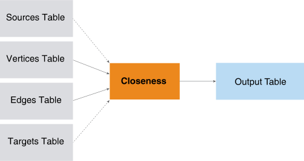

<html><head></head><body>
<h1 class="title topictitle1" id="ariaid-title1">Closeness (ML Engine)</h1>

The Closeness function returns closeness and k-degree scores for each
			specified source vertex in a graph. The closeness scores are the inverse of the sum, the
			inverse of the average, and the sum of inverses for the shortest distances to all
			reachable target vertices (excluding the source vertex itself).The graph can be directed
			or undirected, weighted or unweighted.

For large graph, you can apply the function to a random sample of the
			specified target vertices to get an efficient approximation of the closeness and
			k-degree scores.

  </img>  

<h2 class="title topictitle2" id="ariaid-title2">Closeness Background</h2>

Closeness and k-degree scores are fundamental distance-based centrality metrics used in network structure analysis. Both measure the time needed to spread information from a source vertex to a set of target vertices.

The <dfn class="term">closeness score</dfn> is classically defined for each
                vertex <var class="keyword varname">v</var> as either the inverse sum or the inverse
                average of the shortest distances from <var class="keyword varname">v</var> to all
                other reachable vertices <var class="keyword varname">u</var>. The classical
                definition does not apply to disconnected graphs; alternative definitions of
                closeness have been proposed for them.

The Closeness function applies the classical definition of closeness to connected graphs and an alternative definition to disconnected graphs. The alternative definition that the function uses adds 0 to the sum for each unreachable target vertex, which is consistent with the classic definition, because the inverse distance is effectively 0 for a disconnected graph.

The <dfn class="term">k-degree score</dfn> is defined for vertex <var class="keyword varname">v</var> as the number of vertices whose distance from
                    <var class="keyword varname">v</var> is less than or equal to <var class="keyword varname">k</var>.

The Closeness function uses a hybrid distributed all pairs shortest path (APSP) algorithm to calculate the shortest distances from each specified source vertex to each specified target vertex and then aggregates these shortest distances into closeness and k-degree scores for each source vertex. By restricting the number of parallel single node shortest path (SNSP) executions to groups of <var class="keyword varname">P</var> vertices, the APSP algorithm enables a trade-off between time and memory usage. The APSP algorithm completes when N/P of these groups have completed, where N is the number of vertices in the graph. (For more information, see <a href="ojy1558543631986.md#oxa1507906655319">AllPairsShortestPath (ML Engine)</a>.)

<h2 class="title topictitle2" id="ariaid-title3">Closeness Syntax</h2>

<h3 class="title sectiontitle">Version 1.3</h3><pre class="pre codeblock" xml:space="preserve"><code>SELECT * FROM Closeness (
  ON <var class="keyword varname">vertices_table</var> AS Vertices PARTITION BY <var class="keyword varname">vertex_key_column</var> [,...] 
  ON <var class="keyword varname">edges_table</var> AS Edges PARTITION BY <var class="keyword varname">source_vertex_key_column</var> [,...] 
  [ ON <var class="keyword varname">sources_table</var> AS Sources PARTITION BY <var class="keyword varname">source_vertex_key_column</var> [,...] ]
  [ ON <var class="keyword varname">targets_table</var> AS Targets PARTITION BY <var class="keyword varname">target_vertex_key_column</var> [,...] ]
  USING
  TargetKey ('<var class="keyword varname">target_key_column</var>' [,...])
  [ Directed (<b>{'true'|'t'|'yes'|'y'|'1'|'false'|'f'|'no'|'n'|'0'}</b>) ]
  [ EdgeWeight (<var class="keyword varname">edge_weight</var>) ]
  [ MaxDistance (<var class="keyword varname">max_distance</var>) ]
  [ GroupSize (<var class="keyword varname">group_size</var>) ]
  [ SampleRate (<var class="keyword varname">sample_rate</var>) ]
  <code class="ph codeph">[ Accumulate ({ '<var class="keyword varname">accumulate_column</var>' | <var class="keyword varname">accumulate_column_range</var> }[,...]) ]</code>
) AS <var class="keyword varname">alias</var>;</code></pre>

<h2 class="title topictitle2" id="ariaid-title4">Closeness Syntax Elements</h2>

<dl class="dl parml"><dt class="dt pt dlterm">TargetKey</dt><dd class="dd pd">Specify the target key (the names of the Edges table columns that identify the target vertex). If you specify <var class="keyword varname">targets_table</var>, then the function uses only the Vertices in <var class="keyword varname">targets_table</var> as targets (which must be a subset of those that this syntax element specifies).</dd><dt class="dt pt dlterm">Directed</dt><dd class="dd pd">[Optional] Specify whether the graph is directed.</dd><dd class="dd pd ddexpand">Default: 'true'</dd><dt class="dt pt dlterm">EdgeWeight</dt><dd class="dd pd">[Optional] Specify the name of the Edges table column that contains edge weights. The weights are positive values.</dd><dd class="dd pd ddexpand">Default behavior: The weight of each edge is 1 (that is, the graph is unweighted).</dd><dt class="dt pt dlterm">MaxDistance</dt><dd class="dd pd">[Optional] Specify the maximum distance (an integer) between the source and target Vertices. A negative <var class="keyword varname">max_distance</var> specifies an infinite distance. If Vertices are separated by more than <var class="keyword varname">max_distance</var>, the function does not output them.</dd><dd class="dd pd ddexpand">Default: 10</dd><dt class="dt pt dlterm">GroupSize</dt><dd class="dd pd">[Optional] Specify the number of source Vertices that run a SNSP algorithm in parallel. If <var class="keyword varname">group_size</var> exceeds the number of source Vertices in each partition, <var class="keyword varname">s</var>, then <var class="keyword varname">s</var> is the group size. Running a group of Vertices on each vworker, in parallel, uses less memory than running all Vertices on each vworker.</dd><dd class="dd pd ddexpand">Default behavior: The function calculates the optimal group size based on cluster and query characteristics.</dd><dt class="dt pt dlterm">SampleRate</dt><dd class="dd pd">[Optional] Specify the sample rate (the percentage of source Vertices to sample), a numeric value in the range (0, 1].</dd><dd class="dd pd ddexpand">Default: 1</dd><dt class="dt pt dlterm">Accumulate</dt><dd class="dd pd">[Optional] Specify the names of the Vertices table columns to copy to the output table. These columns enable you to identify the different closeness scores in the output table.</dd></dl>

<h2 class="title topictitle2" id="ariaid-title5">Closeness Input</h2>

The input is the same as <a href="ojy1558543631986.md#wii1507906698470">AllPairsShortestPath Input</a>.

<h2 class="title topictitle2" id="ariaid-title6">Closeness Output</h2>

<h3 class="title sectiontitle">Output Table Schema</h3>

The table has a row for each source vertex. The reachable target vertices exclude the source vertex itself; that is, the function does not calculate the closeness and k-degree scores for loops.

<table cellpadding="4" cellspacing="0" summary="" id="ffh1507837894663__table_N10014_N1000E_N1000C_N10001" class="table" frame="border" border="1" rules="all">

<colgroup span="1"><col style="width:27.27272727272727%" span="1"></col><col style="width:18.181818181818183%" span="1"></col><col style="width:54.54545454545454%" span="1"></col></colgroup><thead class="thead" style="text-align:left;"><tr class="row"><th class="entry nocellnorowborder" style="vertical-align:top;" id="d394720e309" rowspan="1" colspan="1">Column</th><th class="entry nocellnorowborder" style="vertical-align:top;" id="d394720e311" rowspan="1" colspan="1">Data Type</th><th class="entry cell-norowborder" style="vertical-align:top;" id="d394720e313" rowspan="1" colspan="1">Description</th></tr></thead><tbody class="tbody"><tr class="row"><td class="entry nocellnorowborder" style="vertical-align:top;" headers="d394720e309" rowspan="1" colspan="1">inv_sum_dist</td><td class="entry nocellnorowborder" style="vertical-align:top;" headers="d394720e311" rowspan="1" colspan="1">DOUBLE PRECISION</td><td class="entry cell-norowborder" style="vertical-align:top;" headers="d394720e313" rowspan="1" colspan="1">Inverse of sum of shortest distances to all reachable target vertices. NULL if there are no reachable target vertices.</td></tr><tr class="row"><td class="entry nocellnorowborder" style="vertical-align:top;" headers="d394720e309" rowspan="1" colspan="1">inv_avg_dist</td><td class="entry nocellnorowborder" style="vertical-align:top;" headers="d394720e311" rowspan="1" colspan="1">DOUBLE PRECISION</td><td class="entry cell-norowborder" style="vertical-align:top;" headers="d394720e313" rowspan="1" colspan="1">Inverse of average shortest distances to all reachable target vertices. NULL if there are no reachable target vertices.</td></tr><tr class="row"><td class="entry nocellnorowborder" style="vertical-align:top;" headers="d394720e309" rowspan="1" colspan="1">sum_inv_dist</td><td class="entry nocellnorowborder" style="vertical-align:top;" headers="d394720e311" rowspan="1" colspan="1">DOUBLE PRECISION</td><td class="entry cell-norowborder" style="vertical-align:top;" headers="d394720e313" rowspan="1" colspan="1">Sum of inverse distances to all reachable target vertices. NULL if there are no reachable target vertices.</td></tr><tr class="row"><td class="entry nocellnorowborder" style="vertical-align:top;" headers="d394720e309" rowspan="1" colspan="1">kdegree</td><td class="entry nocellnorowborder" style="vertical-align:top;" headers="d394720e311" rowspan="1" colspan="1">DOUBLE PRECISION</td><td class="entry cell-norowborder" style="vertical-align:top;" headers="d394720e313" rowspan="1" colspan="1">Total number of reachable target vertices. 0 if there are no reachable target vertices.</td></tr><tr class="row"><td class="entry row-nocellborder" style="vertical-align:top;" headers="d394720e309" rowspan="1" colspan="1"><var class="keyword varname">accumulate_column</var></td><td class="entry row-nocellborder" style="vertical-align:top;" headers="d394720e311" rowspan="1" colspan="1">Same as in Vertices table</td><td class="entry cellrowborder" style="vertical-align:top;" headers="d394720e313" rowspan="1" colspan="1">[Column appears once for each specified <var class="keyword varname">accumulate_column</var>.] Column copied from Vertices table.

These columns enable you to identify different closeness scores.
</td></tr></tbody></table>

<h2 class="title topictitle2" id="ariaid-title7">Closeness Examples</h2>

<h3 class="title topictitle3" id="ariaid-title8">Closeness Example: Unweighted, Unbounded Graph</h3>

<h4 class="title sectiontitle">Input</h4>

Input tables are from <a href="ojy1558543631986.md#wpd1525894439964">AllPairsShortestPath Example: Unweighted, Unbounded Graph</a>:

<ul class="ul" id="kiw1525966414624__ul_itr_bjr_t2b">
<li class="li">Vertices: callers</li>
<li class="li">Edges: calls</li></ul>

<h4 class="title sectiontitle">SQL Call</h4><pre class="pre codeblock" xml:space="preserve"><code>SELECT * FROM Closeness (
  ON callers as Vertices PARTITION BY callerid
  ON calls as Edges PARTITION BY callerfrom
  USING
  TargetKey ('callerto')
  MaxDistance (-1)
  Accumulate ('callerid', 'callername')
) AS dt ORDER BY callerid;</code></pre>

<h4 class="title sectiontitle">Output</h4>

Because callerid 6 (Diana) has no outbound calls, the k-degree is 0.
<pre class="pre screen" xml:space="preserve"> callerid callername inv_sum_dist inv_avg_dist sum_inv_dist kdegree 
 -------- ---------- ------------ ------------ ------------ ------- 
        1 john               0.25          1.0          4.0     4.0
        2 carla               0.5          1.0          2.0     2.0
        3 simon               1.0          1.0          1.0     1.0
        4 celine              1.0          1.0          1.0     1.0
        5 winston             1.0          1.0          1.0     1.0
        6 diana              NULL         NULL         NULL     0.0</pre>

Download a zip file of all examples and a SQL script file that creates their input tables from the attachment in the left sidebar.

<h3 class="title topictitle3" id="ariaid-title9">Closeness Example: Weighted, Bounded Graph, MaxDistance=12</h3>

<h4 class="title sectiontitle">Input</h4>

Input tables are from <a href="ojy1558543631986.md#wpd1525894439964">AllPairsShortestPath Example: Unweighted, Unbounded Graph</a>:

<ul class="ul" id="wze1525966449775__ul_itr_bjr_t2b">
<li class="li">Vertices: callers</li>
<li class="li">Edges: calls</li></ul>

<h4 class="title sectiontitle">SQL Call</h4><pre class="pre codeblock" xml:space="preserve"><code>SELECT * FROM Closeness (
  ON callers AS Vertices PARTITION BY callerid
  ON calls AS Edges PARTITION BY callerfrom
  USING
  TargetKey ('callerto')
  EdgeWeight ('calls')
  MaxDistance (12)
  Accumulate ('callerid', 'callername')
) AS dt ORDER BY callerid;</code></pre>

<h4 class="title sectiontitle">Output</h4><pre class="pre screen" xml:space="preserve"> callerid callername inv_sum_dist        inv_avg_dist       sum_inv_dist        kdegree 
 -------- ---------- ------------------- ------------------ ------------------- ------- 
        1 john                      0.05                0.2  1.1333333333333333     4.0
        2 carla      0.05555555555555555 0.1111111111111111 0.23376623376623376     2.0
        3 simon                      1.0                1.0                 1.0     1.0
        4 celine                    0.25               0.25                0.25     1.0
        5 winston                    0.1                0.1                 0.1     1.0
        6 diana                     NULL               NULL                NULL     0.0</pre>

Download a zip file of all examples and a SQL script file that creates their input tables from the attachment in the left sidebar.

<h3 class="title topictitle3" id="ariaid-title10">Closeness Example: Weighted, Bounded Graph, MaxDistance=8</h3>

<h4 class="title sectiontitle">Input</h4>

Input tables are from <a href="ojy1558543631986.md#wpd1525894439964">AllPairsShortestPath Example: Unweighted, Unbounded Graph</a>:

<ul class="ul" id="ttt1525966472909__ul_itr_bjr_t2b">
<li class="li">Vertices: callers</li>
<li class="li">Edges: calls</li></ul>

<h4 class="title sectiontitle">SQL Call</h4><pre class="pre codeblock" xml:space="preserve"><code>SELECT * FROM Closeness (
  ON callers AS Vertices PARTITION BY callerid
  ON calls AS Edges PARTITION BY callerfrom
  USING
  TargetKey ('callerto')
  EdgeWeight ('calls')
  MaxDistance (8)
  Accumulate ('callerid', 'callername')
) AS dt ORDER BY callerid;</code></pre>

<h4 class="title sectiontitle">Output</h4><pre class="pre screen" xml:space="preserve"> callerid callername inv_sum_dist        inv_avg_dist        sum_inv_dist        kdegree 
 -------- ---------- ------------------- ------------------- ------------------- ------- 
        1 john                       0.1                 0.3  1.0333333333333332     3.0
        2 carla      0.14285714285714285 0.14285714285714285 0.14285714285714285     1.0
        3 simon                      1.0                 1.0                 1.0     1.0
        4 celine                    0.25                0.25                0.25     1.0
        5 winston                   NULL                NULL                NULL     0.0
        6 diana                     NULL                NULL                NULL     0.0</pre>

Download a zip file of all examples and a SQL script file that creates their input tables from the attachment in the left sidebar.

</body></html>
