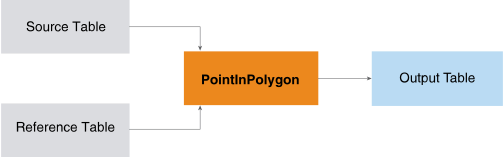
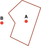

<html><head></head><body>
<h1 class="title topictitle1" id="ariaid-title1">PointInPolygon</h1>

The PointInPolygon function takes a list of location points and a list of
			polygons and returns a list of binary values for every point and polygon combination,
			which indicates whether the point is contained in the polygon.

  </img>  

The PointInPolygon function works only on 2D spatial objects.

The function determines whether a given point in the plane lies inside or outside of a polygon. It has various applications in many fields such as computer graphics, geographical information systems (GIS), and CAD.

In the following example, point A is in the polygon and point B is outside of the polygon.

  </img>  

A use case for this function is to determine in which drive-time polygon surrounding a store a customer resides. This information helps in mailer targeting.

Another use case is to determine which cell phones are frequently within a polygon surrounding an airport. This information helps in identifying frequent fliers.

<h2 class="title topictitle2" id="ariaid-title2">PointInPolygon Syntax</h2>

<h3 class="title topictitle3" id="ariaid-title3">Small Polygon Count and Large Point Count</h3>

<h4 class="title sectiontitle">Version 1.3</h4><pre class="pre codeblock" xml:space="preserve"><code>SELECT * FROM PointInPolygon (
  ON <var class="keyword varname">source_table</var> AS SourceTable PARTITION BY ANY
  ON <var class="keyword varname">reference_table</var> AS ReferenceTable DIMENSION
  USING
  SourceLocationColumn ('<var class="keyword varname">source_location_point_column</var>' [, '<var class="keyword varname">source_location_point_column_2</var>' ])
  ReferenceLocationColumn ('<var class="keyword varname">reference_location_polygon_column</var>')
  ReferenceNameColumns ({ '<var class="keyword varname">reference_name_column</var>' | <var class="keyword varname">reference_name_column_range</var> }[,...])
  [ OutputAll (<b>{'true'|'t'|'yes'|'y'|'1'|'false'|'f'|'no'|'n'|'0'}</b>) ]
  <code class="ph codeph">[ Accumulate ({ '<var class="keyword varname">accumulate_column</var>' | <var class="keyword varname">accumulate_column_range</var> }[,...]) ]</code>
) AS <var class="keyword varname">alias</var>;</code></pre>

<b>Related Information</b>

<ul class="linklist linklist relinfo">
<a href="ndv1557782188375.md">Column Specification Syntax Elements</a>
</ul>

<h3 class="title topictitle3" id="ariaid-title4">Large Polygon Count and Small Point Count</h3>

<h4 class="title sectiontitle">Version 1.3</h4><pre class="pre codeblock" xml:space="preserve"><code>SELECT * FROM PointInPolygon (
  ON <var class="keyword varname">dimension_table</var> AS SourceTable DIMENSION
  ON <var class="keyword varname">reference_table</var> AS ReferenceTable PARTITION BY ANY
  USING
  SourceLocationColumn ('<var class="keyword varname">source_location_point_column</var>' [, '<var class="keyword varname">source_location_point_column_2</var>' ])
  ReferenceLocationColumn ('<var class="keyword varname">reference_location_polygon_column</var>')
  ReferenceNameColumns ({ '<var class="keyword varname">reference_name_column</var>' | <var class="keyword varname">reference_name_column_range</var> }[,...])
  OutputAll (<b>{'true'|'t'|'yes'|'y'|'1'|'false'|'f'|'no'|'n'|'0'}</b>)
  <code class="ph codeph">[ Accumulate ({ '<var class="keyword varname">accumulate_column</var>' | <var class="keyword varname">accumulate_column_range</var> }[,...]) ]</code>
) AS <var class="keyword varname">alias</var>;</code></pre>

<b>Related Information</b>

<ul class="linklist linklist relinfo">
<a href="ndv1557782188375.md">Column Specification Syntax Elements</a>
</ul>

<h3 class="title topictitle3" id="ariaid-title5">Only to Determine Relations of Points and Polygons in Same Group</h3>

<h4 class="title sectiontitle">Version 1.3</h4><pre class="pre codeblock" xml:space="preserve"><code>SELECT * FROM PointInPolygon (
  ON { <var class="keyword varname">table</var> | <var class="keyword varname">view</var> | (<var class="keyword varname">query</var>) } AS SourceTable PARTITION BY <var class="keyword varname">group_key</var> 
  ON { <var class="keyword varname">table</var> | <var class="keyword varname">view</var> | (<var class="keyword varname">query</var>) } AS ReferenceTable PARTITION BY <var class="keyword varname">group_key</var>
  USING
  SourceLocationColumn ('<var class="keyword varname">source_location_point_column</var>' [, '<var class="keyword varname">source_location_point_column_2</var>' ])
  ReferenceLocationColumn ('<var class="keyword varname">reference_location_polygon_column</var>')
  ReferenceNameColumns ({ '<var class="keyword varname">reference_name_column</var>' | <var class="keyword varname">reference_name_column_range</var> }[,...])
  OutputAll (<b>{'true'|'t'|'yes'|'y'|'1'|'false'|'f'|'no'|'n'|'0'}</b>)
  <code class="ph codeph">[ Accumulate ({ '<var class="keyword varname">accumulate_column</var>' | <var class="keyword varname">accumulate_column_range</var> }[,...]) ]</code>
) AS <var class="keyword varname">alias</var>;</code></pre>

<b>Related Information</b>

<ul class="linklist linklist relinfo">
<a href="ndv1557782188375.md">Column Specification Syntax Elements</a>
</ul>

<h2 class="title topictitle2" id="ariaid-title6">PointInPolygon Syntax Elements</h2>

<dl class="dl parml"><dt class="dt pt dlterm">SourceLocationColumn</dt><dd class="dd pd">Specify the names of the SourceTable columns that contain the point coordinate values.

If you specify only one column, specify the point coordinates in well-known text (WKT) syntax. For example, the string 'POINT (30 10)' is the WKT markup syntax that describes a point with x coordinate 30 and y coordinate 10.

If you specify two columns, they represent the two coordinates of the input points (for example, latitude and longitude).

<b>Tip</b>
When you specify two columns, the output of the IPGeo function can be input to this function.

</dd><dt class="dt pt dlterm">ReferenceLocationColumn</dt><dd class="dd pd">Specify the name of the ReferenceTable column that contains the polygon coordinate values. The column content must be of type WKT.</dd><dt class="dt pt dlterm">ReferenceNameColumns</dt><dd class="dd pd">Specify the names of the ReferenceTable columns that contain the polygon names. The function copies these columns to the output table.</dd><dt class="dt pt dlterm">OutputAll</dt><dd class="dd pd">[Optional] Specify whether to indicate in the output table when the point is not in a polygon.</dd><dd class="dd pd ddexpand">Default: 'false'</dd><dt class="dt pt dlterm">Accumulate</dt><dd class="dd pd">[Optional] Specify the SourceTable columns to copy to the output table.</dd></dl>

<h2 class="title topictitle2" id="ariaid-title7">PointInPolygon Input</h2>

SourceTable and ReferenceTable must use the same coordinate reference system.

<h3 class="title sectiontitle">SourceTable Schema</h3>
<table cellpadding="4" cellspacing="0" summary="" id="vfj1507842528236__table_N10014_N1000E_N1000C_N10001" class="table" frame="border" border="1" rules="all">

<colgroup span="1"><col style="width:33.33333333333333%" span="1"></col><col style="width:33.33333333333333%" span="1"></col><col style="width:33.33333333333333%" span="1"></col></colgroup><thead class="thead" style="text-align:left;"><tr class="row"><th class="entry nocellnorowborder" style="vertical-align:top;" id="d197496e426" rowspan="1" colspan="1">Column</th><th class="entry nocellnorowborder" style="vertical-align:top;" id="d197496e428" rowspan="1" colspan="1">Data Type</th><th class="entry cell-norowborder" style="vertical-align:top;" id="d197496e430" rowspan="1" colspan="1">Description</th></tr></thead><tbody class="tbody"><tr class="row"><td class="entry nocellnorowborder" style="vertical-align:top;" headers="d197496e426" rowspan="1" colspan="1"><var class="keyword varname">source_location_point_column</var></td><td class="entry nocellnorowborder" style="vertical-align:top;" headers="d197496e428" rowspan="1" colspan="1">If you specify only this column:

CHARACTER or VARCHAR

If you also specify <var class="keyword varname">source_location_point_column</var>_2:

SMALLINT, INTEGER, BIGINT, DOUBLE PRECISION, or NUMERIC
</td><td class="entry cell-norowborder" style="vertical-align:top;" headers="d197496e430" rowspan="1" colspan="1">If you specify only this column: WKT content.

If you also specify <var class="keyword varname">source_location_point_column</var>_2: x coordinate of point.
</td></tr><tr class="row"><td class="entry nocellnorowborder" style="vertical-align:top;" headers="d197496e426" rowspan="1" colspan="1"><var class="keyword varname">source_location_point_column</var>_2</td><td class="entry nocellnorowborder" style="vertical-align:top;" headers="d197496e428" rowspan="1" colspan="1">SMALLINT, INTEGER, BIGINT, DOUBLE PRECISION, or NUMERIC</td><td class="entry cell-norowborder" style="vertical-align:top;" headers="d197496e430" rowspan="1" colspan="1">y coordinate of point.</td></tr><tr class="row"><td class="entry row-nocellborder" style="vertical-align:top;" headers="d197496e426" rowspan="1" colspan="1"><var class="keyword varname">accumulate_column</var></td><td class="entry row-nocellborder" style="vertical-align:top;" headers="d197496e428" rowspan="1" colspan="1">Any</td><td class="entry cellrowborder" style="vertical-align:top;" headers="d197496e430" rowspan="1" colspan="1">[Column appears once for each specified <var class="keyword varname">accumulate_column</var>.] Column to copy to output table.</td></tr></tbody></table>

<h3 class="title sectiontitle">ReferenceTable Schema</h3>
<table cellpadding="4" cellspacing="0" summary="" id="vfj1507842528236__table_N10078_N1000E_N1000C_N10001" class="table" frame="border" border="1" rules="all">

<colgroup span="1"><col style="width:37.49999999999999%" span="1"></col><col style="width:31.25%" span="1"></col><col style="width:31.25%" span="1"></col></colgroup><thead class="thead" style="text-align:left;"><tr class="row"><th class="entry nocellnorowborder" style="vertical-align:top;" id="d197496e487" rowspan="1" colspan="1">Column</th><th class="entry nocellnorowborder" style="vertical-align:top;" id="d197496e489" rowspan="1" colspan="1">Data Type</th><th class="entry cell-norowborder" style="vertical-align:top;" id="d197496e491" rowspan="1" colspan="1">Description</th></tr></thead><tbody class="tbody"><tr class="row"><td class="entry nocellnorowborder" style="vertical-align:top;" headers="d197496e487" rowspan="1" colspan="1"><var class="keyword varname">reference_location_polygon_column</var></td><td class="entry nocellnorowborder" style="vertical-align:top;" headers="d197496e489" rowspan="1" colspan="1">CHARACTER or VARCHAR</td><td class="entry cell-norowborder" style="vertical-align:top;" headers="d197496e491" rowspan="1" colspan="1">Polygon description.</td></tr><tr class="row"><td class="entry row-nocellborder" style="vertical-align:top;" headers="d197496e487" rowspan="1" colspan="1"><var class="keyword varname">reference_location_column</var></td><td class="entry row-nocellborder" style="vertical-align:top;" headers="d197496e489" rowspan="1" colspan="1">Any</td><td class="entry cellrowborder" style="vertical-align:top;" headers="d197496e491" rowspan="1" colspan="1">Polygon name.</td></tr></tbody></table>

<h2 class="title topictitle2" id="ariaid-title8">PointInPolygon Output</h2>

<h3 class="title sectiontitle">Output Table Schema</h3>
<table cellpadding="4" cellspacing="0" summary="" id="gxc1507842537070__table_N1000E_N1000C_N10001" class="table" frame="border" border="1" rules="all">

<colgroup span="1"><col style="width:44.44444444444444%" span="1"></col><col style="width:11.11111111111111%" span="1"></col><col style="width:44.44444444444444%" span="1"></col></colgroup><thead class="thead" style="text-align:left;"><tr class="row"><th class="entry nocellnorowborder" style="vertical-align:top;" id="d197496e529" rowspan="1" colspan="1">Column</th><th class="entry nocellnorowborder" style="vertical-align:top;" id="d197496e531" rowspan="1" colspan="1">Data Type</th><th class="entry cell-norowborder" style="vertical-align:top;" id="d197496e533" rowspan="1" colspan="1">Description</th></tr></thead><tbody class="tbody"><tr class="row"><td class="entry nocellnorowborder" style="vertical-align:top;" headers="d197496e529" rowspan="1" colspan="1">pip_flag</td><td class="entry nocellnorowborder" style="vertical-align:top;" headers="d197496e531" rowspan="1" colspan="1">INTEGER</td><td class="entry cell-norowborder" style="vertical-align:top;" headers="d197496e533" rowspan="1" colspan="1">1 if point is inside polygon, 0 otherwise.</td></tr><tr class="row"><td class="entry nocellnorowborder" style="vertical-align:top;" headers="d197496e529" rowspan="1" colspan="1"><var class="keyword varname">source_location_point_column</var></td><td class="entry nocellnorowborder" style="vertical-align:top;" headers="d197496e531" rowspan="1" colspan="1">Same as in SourceTable</td><td class="entry cell-norowborder" style="vertical-align:top;" headers="d197496e533" rowspan="1" colspan="1">If source table has only this column: WKT content.

If source table also has <var class="keyword varname">source_location_point_column</var>_2: x coordinate of point.
</td></tr><tr class="row"><td class="entry nocellnorowborder" style="vertical-align:top;" headers="d197496e529" rowspan="1" colspan="1"><var class="keyword varname">source_location_point_column</var>_2</td><td class="entry nocellnorowborder" style="vertical-align:top;" headers="d197496e531" rowspan="1" colspan="1">Same as in SourceTable</td><td class="entry cell-norowborder" style="vertical-align:top;" headers="d197496e533" rowspan="1" colspan="1">[Column appears here only if it appears in source table.] y coordinate of point.</td></tr><tr class="row"><td class="entry nocellnorowborder" style="vertical-align:top;" headers="d197496e529" rowspan="1" colspan="1">ref_<var class="keyword varname">reference_location_polygon_column</var></td><td class="entry nocellnorowborder" style="vertical-align:top;" headers="d197496e531" rowspan="1" colspan="1">Same as in ReferenceTable</td><td class="entry cell-norowborder" style="vertical-align:top;" headers="d197496e533" rowspan="1" colspan="1">Polygon description.</td></tr><tr class="row"><td class="entry nocellnorowborder" style="vertical-align:top;" headers="d197496e529" rowspan="1" colspan="1">ref_<var class="keyword varname">reference_location_column</var></td><td class="entry nocellnorowborder" style="vertical-align:top;" headers="d197496e531" rowspan="1" colspan="1">Same as in ReferenceTable</td><td class="entry cell-norowborder" style="vertical-align:top;" headers="d197496e533" rowspan="1" colspan="1">Polygon name.</td></tr><tr class="row"><td class="entry row-nocellborder" style="vertical-align:top;" headers="d197496e529" rowspan="1" colspan="1"><var class="keyword varname">accumulate_column</var></td><td class="entry row-nocellborder" style="vertical-align:top;" headers="d197496e531" rowspan="1" colspan="1">Same as in SourceTable</td><td class="entry cellrowborder" style="vertical-align:top;" headers="d197496e533" rowspan="1" colspan="1">[Column appears once for each specified <var class="keyword varname">accumulate_column</var>.] Column copied from SourceTable.</td></tr></tbody></table>

<h2 class="title topictitle2" id="ariaid-title9">PointInPolygon Examples</h2>

The goal of each example is to determine the airport terminal where each airline passenger is located.

<h3 class="title topictitle3" id="ariaid-title10">PointInPolygon Example: OutputAll ('true')</h3>

<h4 class="title sectiontitle">Input</h4>
<ul class="ul" id="nhi1527002573251__ul_vrw_zzg_xdb">
<li class="li">SourceTable: source_passenger, which groups parsed location file formats and contains four passengers with known x and y coordinates</li>
<li class="li">ReferenceTable: reference_terminal, which has the geographical locations of two airport terminals, A and B, specified as polygon coordinates, using WKT syntax</li></ul>
<table cellpadding="4" cellspacing="0" summary="" id="nhi1527002573251__table_j5n_l1h_xdb" class="table" frame="border" border="1" rules="all">
SourceTable: source_passenger
<colgroup span="1"><col style="width:33.33333333333333%" span="1"></col><col style="width:33.33333333333333%" span="1"></col><col style="width:33.33333333333333%" span="1"></col></colgroup><thead class="thead" style="text-align:left;"><tr class="row"><th class="entry cellrowborder" style="vertical-align:top;" id="d197496e644" rowspan="1" colspan="1">customer_id</th><th class="entry cellrowborder" style="vertical-align:top;" id="d197496e646" rowspan="1" colspan="1">source_location_point</th><th class="entry cellrowborder" style="vertical-align:top;" id="d197496e648" rowspan="1" colspan="1">customer_name</th></tr></thead><tbody class="tbody"><tr class="row"><td class="entry cellrowborder" style="vertical-align:top;" headers="d197496e644" rowspan="1" colspan="1">3</td><td class="entry cellrowborder" style="vertical-align:top;" headers="d197496e646" rowspan="1" colspan="1">POINT (300 20)</td><td class="entry cellrowborder" style="vertical-align:top;" headers="d197496e648" rowspan="1" colspan="1">Maria</td></tr><tr class="row"><td class="entry cellrowborder" style="vertical-align:top;" headers="d197496e644" rowspan="1" colspan="1">2</td><td class="entry cellrowborder" style="vertical-align:top;" headers="d197496e646" rowspan="1" colspan="1">POINT (300 10)</td><td class="entry cellrowborder" style="vertical-align:top;" headers="d197496e648" rowspan="1" colspan="1">John</td></tr><tr class="row"><td class="entry cellrowborder" style="vertical-align:top;" headers="d197496e644" rowspan="1" colspan="1">1</td><td class="entry cellrowborder" style="vertical-align:top;" headers="d197496e646" rowspan="1" colspan="1">POINT (30 10)</td><td class="entry cellrowborder" style="vertical-align:top;" headers="d197496e648" rowspan="1" colspan="1">Jeff</td></tr><tr class="row"><td class="entry cellrowborder" style="vertical-align:top;" headers="d197496e644" rowspan="1" colspan="1">4</td><td class="entry cellrowborder" style="vertical-align:top;" headers="d197496e646" rowspan="1" colspan="1">POINT (400 20)</td><td class="entry cellrowborder" style="vertical-align:top;" headers="d197496e648" rowspan="1" colspan="1">Macy</td></tr></tbody></table>

<table cellpadding="4" cellspacing="0" summary="" id="nhi1527002573251__table_cmh_p1h_xdb" class="table" frame="border" border="1" rules="all">
ReferenceTable: reference_terminal
<colgroup span="1"><col style="width:33.33333333333333%" span="1"></col><col style="width:33.33333333333333%" span="1"></col><col style="width:33.33333333333333%" span="1"></col></colgroup><thead class="thead" style="text-align:left;"><tr class="row"><th class="entry cellrowborder" style="vertical-align:top;" id="d197496e688" rowspan="1" colspan="1">terminal_id</th><th class="entry cellrowborder" style="vertical-align:top;" id="d197496e690" rowspan="1" colspan="1">reference_location_polygon</th><th class="entry cellrowborder" style="vertical-align:top;" id="d197496e692" rowspan="1" colspan="1">terminal_name</th></tr></thead><tbody class="tbody"><tr class="row"><td class="entry cellrowborder" style="vertical-align:top;" headers="d197496e688" rowspan="1" colspan="1">1</td><td class="entry cellrowborder" style="vertical-align:top;" headers="d197496e690" rowspan="1" colspan="1">POLYGON ((0 0, 100 0, 100 100, 0 100, 0 0))</td><td class="entry cellrowborder" style="vertical-align:top;" headers="d197496e692" rowspan="1" colspan="1">Terminal A</td></tr><tr class="row"><td class="entry cellrowborder" style="vertical-align:top;" headers="d197496e688" rowspan="1" colspan="1">2</td><td class="entry cellrowborder" style="vertical-align:top;" headers="d197496e690" rowspan="1" colspan="1">POLYGON ((200 0, 400 0, 400 200, 200 200, 200 0))</td><td class="entry cellrowborder" style="vertical-align:top;" headers="d197496e692" rowspan="1" colspan="1">Terminal B</td></tr></tbody></table>

<h4 class="title sectiontitle">SQL Call</h4><pre class="pre codeblock" xml:space="preserve"><code>SELECT * FROM PointInPolygon (
  ON source_passenger AS SourceTable PARTITION BY ANY
  ON reference_terminal AS ReferenceTable DIMENSION
  USING
  SourceLocationColumn ('source_location_point')
  ReferenceLocationColumn ('reference_location_polygon')
  ReferenceNameColumns ('terminal_name')
  outputall ('true')
  Accumulate ('customer_id', 'customer_name')
) AS dt ORDER BY source_location_point,customer_id,customer_name;</code></pre>

<h4 class="title sectiontitle">Output</h4>

The output table shows all passengers, whether or not they are in a terminal.
<pre class="pre screen" xml:space="preserve"> source_location_point ref_reference_location_polygon                    ref_terminal_name pip_flag customer_id customer_name 
 --------------------- ------------------------------------------------- ----------------- -------- ----------- ------------- 
 point (30 10)         polygon ((200 0, 400 0, 400 200, 200 200, 200 0)) terminal b               0           1 jeff         
 point (30 10)         polygon ((0 0, 100 0, 100 100, 0 100, 0 0))       terminal a               1           1 jeff         
 point (300 10)        polygon ((0 0, 100 0, 100 100, 0 100, 0 0))       terminal a               0           2 john         
 point (300 10)        polygon ((200 0, 400 0, 400 200, 200 200, 200 0)) terminal b               1           2 john         
 point (300 20)        polygon ((200 0, 400 0, 400 200, 200 200, 200 0)) terminal b               1           3 maria        
 point (300 20)        polygon ((0 0, 100 0, 100 100, 0 100, 0 0))       terminal a               0           3 maria        
 point (400 20)        polygon ((200 0, 400 0, 400 200, 200 200, 200 0)) terminal b               0           4 macy         
 point (400 20)        polygon ((0 0, 100 0, 100 100, 0 100, 0 0))       terminal a               0           4 macy</pre>

Download a zip file of all examples and a SQL script file that creates their input tables from the attachment in the left sidebar.

<h3 class="title topictitle3" id="ariaid-title11">PointInPolygon Example: OutputAll ('false')</h3>

<h4 class="title sectiontitle">Input</h4>
As in <a href="vfd1558453668981.md#nhi1527002573251">PointInPolygon Example: OutputAll ('true')</a>:
<ul class="ul" id="qnx1527002612641__ul_vrw_zzg_xdb">
<li class="li">SourceTable: source_passenger</li>
<li class="li">ReferenceTable: reference_terminal</li></ul>

<h4 class="title sectiontitle">SQL Call</h4><pre class="pre codeblock" xml:space="preserve"><code>SELECT * FROM PointInPolygon(
  ON source_passenger AS SourceTable PARTITION BY ANY
  ON reference_terminal AS ReferenceTable DIMENSION
  USING
  SourceLocationColumn ('source_location_point')
  ReferenceLocationColumn ('reference_location_polygon')
  ReferenceNameColumns ('terminal_name')
  outputall ('false')
  Accumulate ('customer_id', 'customer_name')
) AS dt ORDER BY source_location_point;</code></pre>

<h4 class="title sectiontitle">Output</h4>

The output table includes only passengers inside a terminal. Macy is not in any terminal and does not appear in the output table.
<pre class="pre screen" xml:space="preserve"> source_location_point ref_reference_location_polygon                    ref_terminal_name pip_flag customer_id customer_name 
 --------------------- ------------------------------------------------- ----------------- -------- ----------- ------------- 
 point (30 10)         polygon ((0 0, 100 0, 100 100, 0 100, 0 0))       terminal a               1           1 jeff         
 point (300 10)        polygon ((200 0, 400 0, 400 200, 200 200, 200 0)) terminal b               1           2 john         
 point (300 20)        polygon ((200 0, 400 0, 400 200, 200 200, 200 0)) terminal b               1           3 maria</pre>

Download a zip file of all examples and a SQL script file that creates their input tables from the attachment in the left sidebar.

<h3 class="title topictitle3" id="ariaid-title12">PointInPolygon Example: Passenger Coordinates in Columns</h3>

The x and y coordinates of the passenger locations are in columns x and y, respectively.

<h4 class="title sectiontitle">Input</h4>
<ul class="ul" id="bts1507842584764__ul_vrw_zzg_xdb">
<li class="li">SourceTable: source_passenger1, which groups parsed location file formats and contains four passengers with known x and y coordinates</li>
<li class="li">ReferenceTable: reference_terminal, as in <a href="vfd1558453668981.md#nhi1527002573251">PointInPolygon Example: OutputAll ('true')</a></li></ul>
<table cellpadding="4" cellspacing="0" summary="" id="bts1507842584764__table_sxv_ych_xdb" class="table" frame="border" border="1" rules="all">
source_passenger1
<colgroup span="1"><col style="width:25%" span="1"></col><col style="width:25%" span="1"></col><col style="width:25%" span="1"></col><col style="width:25%" span="1"></col></colgroup><thead class="thead" style="text-align:left;"><tr class="row"><th class="entry cellrowborder" style="vertical-align:top;" id="d197496e833" rowspan="1" colspan="1">customer_id</th><th class="entry cellrowborder" style="vertical-align:top;" id="d197496e835" rowspan="1" colspan="1">x</th><th class="entry cellrowborder" style="vertical-align:top;" id="d197496e837" rowspan="1" colspan="1">y</th><th class="entry cellrowborder" style="vertical-align:top;" id="d197496e839" rowspan="1" colspan="1">customer_name</th></tr></thead><tbody class="tbody"><tr class="row"><td class="entry cellrowborder" style="vertical-align:top;" headers="d197496e833" rowspan="1" colspan="1">1</td><td class="entry cellrowborder" style="vertical-align:top;" headers="d197496e835" rowspan="1" colspan="1">30</td><td class="entry cellrowborder" style="vertical-align:top;" headers="d197496e837" rowspan="1" colspan="1">10</td><td class="entry cellrowborder" style="vertical-align:top;" headers="d197496e839" rowspan="1" colspan="1">Jeff</td></tr><tr class="row"><td class="entry cellrowborder" style="vertical-align:top;" headers="d197496e833" rowspan="1" colspan="1">1</td><td class="entry cellrowborder" style="vertical-align:top;" headers="d197496e835" rowspan="1" colspan="1">300</td><td class="entry cellrowborder" style="vertical-align:top;" headers="d197496e837" rowspan="1" colspan="1">10</td><td class="entry cellrowborder" style="vertical-align:top;" headers="d197496e839" rowspan="1" colspan="1">John</td></tr><tr class="row"><td class="entry cellrowborder" style="vertical-align:top;" headers="d197496e833" rowspan="1" colspan="1">1</td><td class="entry cellrowborder" style="vertical-align:top;" headers="d197496e835" rowspan="1" colspan="1">300</td><td class="entry cellrowborder" style="vertical-align:top;" headers="d197496e837" rowspan="1" colspan="1">20</td><td class="entry cellrowborder" style="vertical-align:top;" headers="d197496e839" rowspan="1" colspan="1">Maria</td></tr><tr class="row"><td class="entry cellrowborder" style="vertical-align:top;" headers="d197496e833" rowspan="1" colspan="1">1</td><td class="entry cellrowborder" style="vertical-align:top;" headers="d197496e835" rowspan="1" colspan="1">400</td><td class="entry cellrowborder" style="vertical-align:top;" headers="d197496e837" rowspan="1" colspan="1">20</td><td class="entry cellrowborder" style="vertical-align:top;" headers="d197496e839" rowspan="1" colspan="1">Macy</td></tr></tbody></table>

<h4 class="title sectiontitle">SQL Call</h4><pre class="pre codeblock" xml:space="preserve"><code>SELECT * FROM PointInPolygon (
  ON source_passenger1 AS SourceTable PARTITION BY ANY
  ON reference_terminal AS ReferenceTable dimension
  USING
  SourceLocationColumn ('x','y')
  ReferenceLocationColumn ('reference_location_polygon')
  ReferenceNameColumns ('terminal_name')
  outputall ('false')
  Accumulate ('customer_id', 'customer_name')
) AS dt ORDER BY x,y ;
</code></pre>

<h4 class="title sectiontitle">Output</h4><pre class="pre screen" xml:space="preserve"> x   y  ref_reference_location_polygon                    ref_terminal_name pip_flag customer_id customer_name 
 --- -- ------------------------------------------------- ----------------- -------- ----------- ------------- 
  30 10 polygon ((0 0, 100 0, 100 100, 0 100, 0 0))       terminal a               1           1 jeff         
 300 10 polygon ((200 0, 400 0, 400 200, 200 200, 200 0)) terminal b               1           2 john         
 300 20 polygon ((200 0, 400 0, 400 200, 200 200, 200 0)) terminal b               1           3 maria</pre>

Download a zip file of all examples and a SQL script file that creates their input tables from the attachment in the left sidebar.

</body></html>
