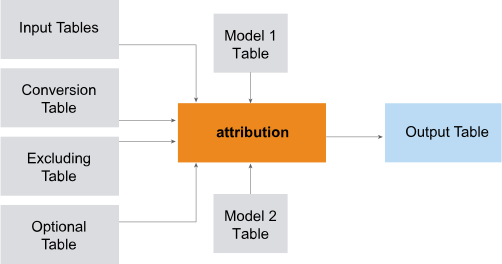

<html><head></head><body>
<h1 class="title topictitle1" id="ariaid-title1">Multiple-Input Attribution_MLE</h1>

The multiple-input version of the Attribution_MLE function accepts one or more input tables and gets many parameters from other dimension tables.

  </img>  

<b>Related Information</b>

<ul class="linklist linklist relinfo">
<a href="ppu1541526284885.md#ifq1507592820945">Single-Input Attribution_MLE</a>
</ul>

<h2 class="title topictitle2" id="ariaid-title2">Attribution_MLE Syntax (Multiple Inputs)</h2>

<h3 class="title sectiontitle">Version 2.9</h3><pre class="pre codeblock" xml:space="preserve"><code>SELECT * FROM Attribution_MLE (
  ON { <var class="keyword varname">table</var> | <var class="keyword varname">view</var> | (<var class="keyword varname">query</var>) } PARTITION BY <var class="keyword varname">user_id</var> ORDER BY <var class="keyword varname">timestamp_column</var> 
  [ ON { <var class="keyword varname">table</var> | <var class="keyword varname">view</var> | (<var class="keyword varname">query</var>) } PARTITION BY <var class="keyword varname">user_id</var> ORDER BY <var class="keyword varname">timestamp_column</var> ][,...]
  ON <var class="keyword varname">conversion_event_table</var> AS ConversionEventTable DIMENSION
  [ ON <var class="keyword varname">excluding_event_table</var> AS ExcludedEventTable DIMENSION ]
  [ ON <var class="keyword varname">optional_event_table</var> AS OptionalEventTable DIMENSION ]
  ON <var class="keyword varname">first_model_table</var> AS FirstModelTable DIMENSION
  [ ON <var class="keyword varname">second_model_table</var> AS SecondModelTable DIMENSION ]
  USING
  EventColumn ('<var class="keyword varname">event_column</var>')
  TimeColumn ('<var class="keyword varname">timestamp_column</var>')
  WindowSize ({ 'rows:<var class="keyword varname">K</var>' | 'seconds:<var class="keyword varname">K</var>' | 'rows:<var class="keyword varname">K</var>&amp;seconds:<var class="keyword varname">K2</var>' })
) AS <var class="keyword varname">alias</var> ORDER BY <var class="keyword varname">user_id</var>,<var class="keyword varname">time_stamp</var>;</code></pre>

<b>Related Information</b>

<ul class="linklist linklist relinfo">
<a href="eta1543514041091.md">Comments in Queries</a>
</ul>

<h2 class="title topictitle2" id="ariaid-title3">Attribution_MLE Syntax Elements (Multiple Inputs)</h2>

<dl class="dl parml"><dt class="dt pt dlterm">EventColumn</dt><dd class="dd pd">Specify the name of the input column that contains the clickstream events.</dd><dt class="dt pt dlterm">TimeColumn</dt><dd class="dd pd">Specify the name of the input column that contains the timestamps of the clickstream events.</dd><dt class="dt pt dlterm">WindowSize</dt><dd class="dd pd">Specify how to determine the maximum window size for the attribution calculation:

<table cellpadding="4" cellspacing="0" summary="" id="nwj1507592418107__table_a4k_nyx_fdb" class="table" frame="border" border="1" rules="all">

<colgroup span="1"><col style="width:50%" span="1"></col><col style="width:50%" span="1"></col></colgroup><thead class="thead" style="text-align:left;"><tr class="row"><th class="entry cellrowborder" style="vertical-align:top;" id="d354639e203" rowspan="1" colspan="1">Option</th><th class="entry cellrowborder" style="vertical-align:top;" id="d354639e205" rowspan="1" colspan="1">Description</th></tr></thead><tbody class="tbody"><tr class="row"><td class="entry cellrowborder" style="vertical-align:top;" headers="d354639e203" rowspan="1" colspan="1"><code class="ph codeph">rows:</code><var class="keyword varname">K</var></td><td class="entry cellrowborder" style="vertical-align:top;" headers="d354639e205" rowspan="1" colspan="1">Assign attributions to at most <var class="keyword varname">K</var> events before conversion event, excluding events of types specified in ExcludedEventTable.</td></tr><tr class="row"><td class="entry cellrowborder" style="vertical-align:top;" headers="d354639e203" rowspan="1" colspan="1"><code class="ph codeph">seconds:</code><var class="keyword varname">K</var></td><td class="entry cellrowborder" style="vertical-align:top;" headers="d354639e205" rowspan="1" colspan="1">Assign attributions only to rows not more than <var class="keyword varname">K</var> seconds before conversion event.</td></tr><tr class="row"><td class="entry cellrowborder" style="vertical-align:top;" headers="d354639e203" rowspan="1" colspan="1"><code class="ph codeph">rows:</code><var class="keyword varname">K</var><code class="ph codeph">&amp;seconds:</code><var class="keyword varname">K2</var></td><td class="entry cellrowborder" style="vertical-align:top;" headers="d354639e205" rowspan="1" colspan="1">Apply both constraints and comply with stricter one.</td></tr></tbody></table>
</dd></dl>

<h2 class="title topictitle2" id="ariaid-title4">Attribution_MLE Input (Multiple Inputs)</h2>

<h3 class="title sectiontitle">Required</h3>
<table cellpadding="4" cellspacing="0" summary="" id="ruu1507592122911__table_sv1_plq_vcb" class="table" frame="border" border="1" rules="all">

<colgroup span="1"><col style="width:33.33333333333333%" span="1"></col><col style="width:66.66666666666666%" span="1"></col></colgroup><thead class="thead" style="text-align:left;"><tr class="row"><th class="entry cellrowborder" style="vertical-align:top;" id="d354639e267" rowspan="1" colspan="1">Table</th><th class="entry cellrowborder" style="vertical-align:top;" id="d354639e269" rowspan="1" colspan="1">Description</th></tr></thead><tbody class="tbody"><tr class="row"><td class="entry cellrowborder" style="vertical-align:top;" headers="d354639e267" rowspan="1" colspan="1">Input table</td><td class="entry cellrowborder" style="vertical-align:top;" headers="d354639e269" rowspan="1" colspan="1">Contains clickstream data for computing attributions.</td></tr><tr class="row"><td class="entry cellrowborder" style="vertical-align:top;" headers="d354639e267" rowspan="1" colspan="1">ConversionEventTable</td><td class="entry cellrowborder" style="vertical-align:top;" headers="d354639e269" rowspan="1" colspan="1">Contains conversion events.</td></tr><tr class="row"><td class="entry cellrowborder" style="vertical-align:top;" headers="d354639e267" rowspan="1" colspan="1">FirstModelTable</td><td class="entry cellrowborder" style="vertical-align:top;" headers="d354639e269" rowspan="1" colspan="1">Defines first model.</td></tr></tbody></table>

<h3 class="title sectiontitle">Optional</h3>
<table cellpadding="4" cellspacing="0" summary="" id="ruu1507592122911__table_rd1_ylq_vcb" class="table" frame="border" border="1" rules="all">

<colgroup span="1"><col style="width:33.33333333333333%" span="1"></col><col style="width:66.66666666666666%" span="1"></col></colgroup><thead class="thead" style="text-align:left;"><tr class="row"><th class="entry cellrowborder" style="vertical-align:top;" id="d354639e299" rowspan="1" colspan="1">Table</th><th class="entry cellrowborder" style="vertical-align:top;" id="d354639e301" rowspan="1" colspan="1">Description</th></tr></thead><tbody class="tbody"><tr class="row"><td class="entry cellrowborder" style="vertical-align:top;" headers="d354639e299" rowspan="1" colspan="1">1-4 additional input tables</td><td class="entry cellrowborder" style="vertical-align:top;" headers="d354639e301" rowspan="1" colspan="1">Contain additional clickstream data. Specifying these tables lets you co-group attributes from all specified input tables (for example, ad_click, impressions, and conversions).</td></tr><tr class="row"><td class="entry cellrowborder" style="vertical-align:top;" headers="d354639e299" rowspan="1" colspan="1">ExcludedEventTable</td><td class="entry cellrowborder" style="vertical-align:top;" headers="d354639e301" rowspan="1" colspan="1">Contains events to exclude from attribution.</td></tr><tr class="row"><td class="entry cellrowborder" style="vertical-align:top;" headers="d354639e299" rowspan="1" colspan="1">OptionalEventTable</td><td class="entry cellrowborder" style="vertical-align:top;" headers="d354639e301" rowspan="1" colspan="1">Contains optional events.</td></tr><tr class="row"><td class="entry cellrowborder" style="vertical-align:top;" headers="d354639e299" rowspan="1" colspan="1">SecondModelTable</td><td class="entry cellrowborder" style="vertical-align:top;" headers="d354639e301" rowspan="1" colspan="1">Defines second model.</td></tr></tbody></table>

<h3 class="title sectiontitle">Input Table Schema</h3>
<table cellpadding="4" cellspacing="0" summary="" id="ruu1507592122911__table_N10050_N1003F_N1002B_N1000E_N1000C_N10001" class="table" frame="border" border="1" rules="all">

<colgroup span="1"><col style="width:23.076923076923077%" span="1"></col><col style="width:15.384615384615385%" span="1"></col><col style="width:61.53846153846154%" span="1"></col></colgroup><thead class="thead" style="text-align:left;"><tr class="row"><th class="entry nocellnorowborder" style="vertical-align:top;" id="d354639e336" rowspan="1" colspan="1">Column</th><th class="entry nocellnorowborder" style="vertical-align:top;" id="d354639e338" rowspan="1" colspan="1">Data Type</th><th class="entry cell-norowborder" style="vertical-align:top;" id="d354639e340" rowspan="1" colspan="1">Description</th></tr></thead><tbody class="tbody"><tr class="row"><td class="entry nocellnorowborder" style="vertical-align:top;" headers="d354639e336" rowspan="1" colspan="1"><var class="keyword varname">userid_column</var></td><td class="entry nocellnorowborder" style="vertical-align:top;" headers="d354639e338" rowspan="1" colspan="1">INTEGER or VARCHAR</td><td class="entry cell-norowborder" style="vertical-align:top;" headers="d354639e340" rowspan="1" colspan="1">User identifier.</td></tr><tr class="row"><td class="entry nocellnorowborder" style="vertical-align:top;" headers="d354639e336" rowspan="1" colspan="1"><var class="keyword varname">event_column</var></td><td class="entry nocellnorowborder" style="vertical-align:top;" headers="d354639e338" rowspan="1" colspan="1">Any</td><td class="entry cell-norowborder" style="vertical-align:top;" headers="d354639e340" rowspan="1" colspan="1">Event from clickstream.</td></tr><tr class="row"><td class="entry row-nocellborder" style="vertical-align:top;" headers="d354639e336" rowspan="1" colspan="1"><var class="keyword varname">time_column</var></td><td class="entry row-nocellborder" style="vertical-align:top;" headers="d354639e338" rowspan="1" colspan="1">INTEGER, SMALLINT, BIGINT, TIMESTAMP, or TIME</td><td class="entry cellrowborder" style="vertical-align:top;" headers="d354639e340" rowspan="1" colspan="1">Event timestamp.</td></tr></tbody></table>

<h3 class="title sectiontitle">ConversionEventTable Schema</h3>
<table cellpadding="4" cellspacing="0" summary="" id="ruu1507592122911__table_N100A7_N1003F_N1002B_N1000E_N1000C_N10001" class="table" frame="border" border="1" rules="all">

<colgroup span="1"><col style="width:28.57142857142857%" span="1"></col><col style="width:14.285714285714285%" span="1"></col><col style="width:57.14285714285714%" span="1"></col></colgroup><thead class="thead" style="text-align:left;"><tr class="row"><th class="entry nocellnorowborder" style="vertical-align:top;" id="d354639e377" rowspan="1" colspan="1">Column</th><th class="entry nocellnorowborder" style="vertical-align:top;" id="d354639e379" rowspan="1" colspan="1">Data Type</th><th class="entry cell-norowborder" style="vertical-align:top;" id="d354639e381" rowspan="1" colspan="1">Description</th></tr></thead><tbody class="tbody"><tr class="row"><td class="entry row-nocellborder" style="vertical-align:top;" headers="d354639e377" rowspan="1" colspan="1"><var class="keyword varname">conversion_events</var></td><td class="entry row-nocellborder" style="vertical-align:top;" headers="d354639e379" rowspan="1" colspan="1">VARCHAR</td><td class="entry cellrowborder" style="vertical-align:top;" headers="d354639e381" rowspan="1" colspan="1">[Column appears once for each conversion event.] Conversion event value (string or integer).</td></tr></tbody></table>

<h3 class="title sectiontitle">FirstModelTable and SecondModelTable Schema</h3>
<table cellpadding="4" cellspacing="0" summary="" id="ruu1507592122911__table_N1014F_N1000E_N1000C_N10001" class="table" frame="border" border="1" rules="all">

<colgroup span="1"><col style="width:28.57142857142857%" span="1"></col><col style="width:14.285714285714285%" span="1"></col><col style="width:57.14285714285714%" span="1"></col></colgroup><thead class="thead" style="text-align:left;"><tr class="row"><th class="entry nocellnorowborder" style="vertical-align:top;" id="d354639e402" rowspan="1" colspan="1">Column</th><th class="entry nocellnorowborder" style="vertical-align:top;" id="d354639e404" rowspan="1" colspan="1">Data Type</th><th class="entry cell-norowborder" style="vertical-align:top;" id="d354639e406" rowspan="1" colspan="1">Description</th></tr></thead><tbody class="tbody"><tr class="row"><td class="entry nocellnorowborder" style="vertical-align:top;" headers="d354639e402" rowspan="1" colspan="1">id</td><td class="entry nocellnorowborder" style="vertical-align:top;" headers="d354639e404" rowspan="1" colspan="1">INTEGER</td><td class="entry cell-norowborder" style="vertical-align:top;" headers="d354639e406" rowspan="1" colspan="1">Row identifier. Rows are numbered 0, 1, 2, and so on.</td></tr><tr class="row"><td class="entry row-nocellborder" style="vertical-align:top;" headers="d354639e402" rowspan="1" colspan="1">model</td><td class="entry row-nocellborder" style="vertical-align:top;" headers="d354639e404" rowspan="1" colspan="1">VARCHAR</td><td class="entry cellrowborder" style="vertical-align:top;" headers="d354639e406" rowspan="1" colspan="1">Row 0: Model type.

Row 1, ..., <var class="keyword varname">n</var>: Distribution model definition.

SIMPLE model: Model table has single row that specifies model type and parameters.

Other model types: <var class="keyword varname">n</var> is number of rows or events included in model.

For model type and specification definitions, see <a href="qzj1542740942273.md">Attribution Model Specification</a>.
</td></tr></tbody></table>

<h3 class="title sectiontitle">ExcludedEventTable Schema</h3>
<table cellpadding="4" cellspacing="0" summary="" id="ruu1507592122911__table_N100DE_N1003F_N1002B_N1000E_N1000C_N10001" class="table" frame="border" border="1" rules="all">

<colgroup span="1"><col style="width:28.57142857142857%" span="1"></col><col style="width:14.285714285714285%" span="1"></col><col style="width:57.14285714285714%" span="1"></col></colgroup><thead class="thead" style="text-align:left;"><tr class="row"><th class="entry nocellnorowborder" style="vertical-align:top;" id="d354639e457" rowspan="1" colspan="1">Column</th><th class="entry nocellnorowborder" style="vertical-align:top;" id="d354639e459" rowspan="1" colspan="1">Data Type</th><th class="entry cell-norowborder" style="vertical-align:top;" id="d354639e461" rowspan="1" colspan="1">Description</th></tr></thead><tbody class="tbody"><tr class="row"><td class="entry row-nocellborder" style="vertical-align:top;" headers="d354639e457" rowspan="1" colspan="1"><var class="keyword varname">excluding_event</var></td><td class="entry row-nocellborder" style="vertical-align:top;" headers="d354639e459" rowspan="1" colspan="1">VARCHAR</td><td class="entry cellrowborder" style="vertical-align:top;" headers="d354639e461" rowspan="1" colspan="1">[Column appears once for each excluded event.] Excluded event (string or integer). Cannot be a conversion event.</td></tr></tbody></table>

<h3 class="title sectiontitle">OptionalEventTable Schema</h3>
<table cellpadding="4" cellspacing="0" summary="" id="ruu1507592122911__table_N10115_N1003F_N1002B_N1000E_N1000C_N10001" class="table" frame="border" border="1" rules="all">

<colgroup span="1"><col style="width:28.57142857142857%" span="1"></col><col style="width:14.285714285714285%" span="1"></col><col style="width:57.14285714285714%" span="1"></col></colgroup><thead class="thead" style="text-align:left;"><tr class="row"><th class="entry nocellnorowborder" style="vertical-align:top;" id="d354639e482" rowspan="1" colspan="1">Column</th><th class="entry nocellnorowborder" style="vertical-align:top;" id="d354639e484" rowspan="1" colspan="1">Data Type</th><th class="entry cell-norowborder" style="vertical-align:top;" id="d354639e486" rowspan="1" colspan="1">Description</th></tr></thead><tbody class="tbody"><tr class="row"><td class="entry row-nocellborder" style="vertical-align:top;" headers="d354639e482" rowspan="1" colspan="1"><var class="keyword varname">optional_event</var></td><td class="entry row-nocellborder" style="vertical-align:top;" headers="d354639e484" rowspan="1" colspan="1">VARCHAR</td><td class="entry cellrowborder" style="vertical-align:top;" headers="d354639e486" rowspan="1" colspan="1">[Column appears once for each optional event.] Optional event (string or integer). Cannot be a conversion or excluded event. Function attributes conversion event to optional event only if it cannot attribute it to regular event.</td></tr></tbody></table>

<h2 class="title topictitle2" id="ariaid-title5">Attribution_MLE Output (Multiple Inputs)</h2>

<h3 class="title sectiontitle">Output Table Schema</h3>
<table cellpadding="4" cellspacing="0" summary="" id="fhs1507592546378__table_N1000E_N1000C_N10001" class="table" frame="border" border="1" rules="all">

<colgroup span="1"><col style="width:28.57142857142857%" span="1"></col><col style="width:14.285714285714285%" span="1"></col><col style="width:57.14285714285714%" span="1"></col></colgroup><thead class="thead" style="text-align:left;"><tr class="row"><th class="entry nocellnorowborder" style="vertical-align:top;" id="d354639e518" rowspan="1" colspan="1">Column</th><th class="entry nocellnorowborder" style="vertical-align:top;" id="d354639e520" rowspan="1" colspan="1">Data Type</th><th class="entry cell-norowborder" style="vertical-align:top;" id="d354639e522" rowspan="1" colspan="1">Description</th></tr></thead><tbody class="tbody"><tr class="row"><td class="entry nocellnorowborder" style="vertical-align:top;" headers="d354639e518" rowspan="1" colspan="1">user_id</td><td class="entry nocellnorowborder" style="vertical-align:top;" headers="d354639e520" rowspan="1" colspan="1">INTEGER or VARCHAR</td><td class="entry cell-norowborder" style="vertical-align:top;" headers="d354639e522" rowspan="1" colspan="1">User identifier from input table.</td></tr><tr class="row"><td class="entry nocellnorowborder" style="vertical-align:top;" headers="d354639e518" rowspan="1" colspan="1">event</td><td class="entry nocellnorowborder" style="vertical-align:top;" headers="d354639e520" rowspan="1" colspan="1">VARCHAR</td><td class="entry cell-norowborder" style="vertical-align:top;" headers="d354639e522" rowspan="1" colspan="1">Clickstream event from input table.</td></tr><tr class="row"><td class="entry nocellnorowborder" style="vertical-align:top;" headers="d354639e518" rowspan="1" colspan="1">time_stamp</td><td class="entry nocellnorowborder" style="vertical-align:top;" headers="d354639e520" rowspan="1" colspan="1">TIMESTAMP</td><td class="entry cell-norowborder" style="vertical-align:top;" headers="d354639e522" rowspan="1" colspan="1">Event timestamp from input table.</td></tr><tr class="row"><td class="entry nocellnorowborder" style="vertical-align:top;" headers="d354639e518" rowspan="1" colspan="1">attribution</td><td class="entry nocellnorowborder" style="vertical-align:top;" headers="d354639e520" rowspan="1" colspan="1">DOUBLE PRECISION</td><td class="entry cell-norowborder" style="vertical-align:top;" headers="d354639e522" rowspan="1" colspan="1">Fraction of attribution for conversion event that is attributed to this event.</td></tr><tr class="row"><td class="entry row-nocellborder" style="vertical-align:top;" headers="d354639e518" rowspan="1" colspan="1">time_to_conversion</td><td class="entry row-nocellborder" style="vertical-align:top;" headers="d354639e520" rowspan="1" colspan="1">INTEGER</td><td class="entry cellrowborder" style="vertical-align:top;" headers="d354639e522" rowspan="1" colspan="1">Elapsed time between attributable event and conversion event.</td></tr></tbody></table>

<h2 class="title topictitle2" id="ariaid-title6">Attribution_MLE Example (Multiple Inputs)</h2>

This example uses models to assign attribution weights to these events and channels:

<table cellpadding="4" cellspacing="0" summary="" id="anw1506030212637__table_N10014_N1000E_N1000C_N10001" class="table" frame="border" border="1" rules="all">

<colgroup span="1"><col style="width:16.666666666666664%" span="1"></col><col style="width:83.33333333333334%" span="1"></col></colgroup><thead class="thead" style="text-align:left;"><tr class="row"><th class="entry nocellnorowborder" style="vertical-align:top;" id="d354639e589" rowspan="1" colspan="1">Event Type</th><th class="entry cell-norowborder" style="vertical-align:top;" id="d354639e591" rowspan="1" colspan="1">Channels</th></tr></thead><tbody class="tbody"><tr class="row"><td class="entry nocellnorowborder" style="vertical-align:top;" headers="d354639e589" rowspan="1" colspan="1">conversion</td><td class="entry cell-norowborder" style="vertical-align:top;" headers="d354639e591" rowspan="1" colspan="1">SocialNetwork, PaidSearch</td></tr><tr class="row"><td class="entry nocellnorowborder" style="vertical-align:top;" headers="d354639e589" rowspan="1" colspan="1">excluding</td><td class="entry cell-norowborder" style="vertical-align:top;" headers="d354639e591" rowspan="1" colspan="1">Email</td></tr><tr class="row"><td class="entry row-nocellborder" style="vertical-align:top;" headers="d354639e589" rowspan="1" colspan="1">optional</td><td class="entry cellrowborder" style="vertical-align:top;" headers="d354639e591" rowspan="1" colspan="1">Direct, Referral, OrganicSearch</td></tr></tbody></table>

<h3 class="title sectiontitle">Input</h3>
<table cellpadding="4" cellspacing="0" summary="" id="anw1506030212637__table_xr1_3kh_zdb" class="table" frame="border" border="1" rules="all">
attribution_sample_table1
<colgroup span="1"><col style="width:33.33333333333333%" span="1"></col><col style="width:33.33333333333333%" span="1"></col><col style="width:33.33333333333333%" span="1"></col></colgroup><thead class="thead" style="text-align:left;"><tr class="row"><th class="entry cellrowborder" style="vertical-align:top;" id="d354639e621" rowspan="1" colspan="1">user_id</th><th class="entry cellrowborder" style="vertical-align:top;" id="d354639e623" rowspan="1" colspan="1">event</th><th class="entry cellrowborder" style="vertical-align:top;" id="d354639e625" rowspan="1" colspan="1">time_stamp</th></tr></thead><tbody class="tbody"><tr class="row"><td class="entry cellrowborder" style="vertical-align:top;" headers="d354639e621" rowspan="1" colspan="1">1</td><td class="entry cellrowborder" style="vertical-align:top;" headers="d354639e623" rowspan="1" colspan="1">impression</td><td class="entry cellrowborder" style="vertical-align:top;" headers="d354639e625" rowspan="1" colspan="1">2001-09-27 23:00:01</td></tr><tr class="row"><td class="entry cellrowborder" style="vertical-align:top;" headers="d354639e621" rowspan="1" colspan="1">1</td><td class="entry cellrowborder" style="vertical-align:top;" headers="d354639e623" rowspan="1" colspan="1">impression</td><td class="entry cellrowborder" style="vertical-align:top;" headers="d354639e625" rowspan="1" colspan="1">2001-09-27 23:00:05</td></tr><tr class="row"><td class="entry cellrowborder" style="vertical-align:top;" headers="d354639e621" rowspan="1" colspan="1">1</td><td class="entry cellrowborder" style="vertical-align:top;" headers="d354639e623" rowspan="1" colspan="1">Email</td><td class="entry cellrowborder" style="vertical-align:top;" headers="d354639e625" rowspan="1" colspan="1">2001-09-27 23:00:15</td></tr><tr class="row"><td class="entry cellrowborder" style="vertical-align:top;" headers="d354639e621" rowspan="1" colspan="1">2</td><td class="entry cellrowborder" style="vertical-align:top;" headers="d354639e623" rowspan="1" colspan="1">impression</td><td class="entry cellrowborder" style="vertical-align:top;" headers="d354639e625" rowspan="1" colspan="1">2001-09-27 23:00:31</td></tr><tr class="row"><td class="entry cellrowborder" style="vertical-align:top;" headers="d354639e621" rowspan="1" colspan="1">2</td><td class="entry cellrowborder" style="vertical-align:top;" headers="d354639e623" rowspan="1" colspan="1">impression</td><td class="entry cellrowborder" style="vertical-align:top;" headers="d354639e625" rowspan="1" colspan="1">2001-09-27 23:00:51</td></tr></tbody></table>

<table cellpadding="4" cellspacing="0" summary="" id="anw1506030212637__table_st2_mkh_zdb" class="table" frame="border" border="1" rules="all">
attribution_sample_table2
<colgroup span="1"><col style="width:33.33333333333333%" span="1"></col><col style="width:33.33333333333333%" span="1"></col><col style="width:33.33333333333333%" span="1"></col></colgroup><thead class="thead" style="text-align:left;"><tr class="row"><th class="entry cellrowborder" style="vertical-align:top;" id="d354639e672" rowspan="1" colspan="1">user_id</th><th class="entry cellrowborder" style="vertical-align:top;" id="d354639e674" rowspan="1" colspan="1">event</th><th class="entry cellrowborder" style="vertical-align:top;" id="d354639e676" rowspan="1" colspan="1">time_stamp</th></tr></thead><tbody class="tbody"><tr class="row"><td class="entry cellrowborder" style="vertical-align:top;" headers="d354639e672" rowspan="1" colspan="1">1</td><td class="entry cellrowborder" style="vertical-align:top;" headers="d354639e674" rowspan="1" colspan="1">impression</td><td class="entry cellrowborder" style="vertical-align:top;" headers="d354639e676" rowspan="1" colspan="1">2001-09-27 23:00:19</td></tr><tr class="row"><td class="entry cellrowborder" style="vertical-align:top;" headers="d354639e672" rowspan="1" colspan="1">1</td><td class="entry cellrowborder" style="vertical-align:top;" headers="d354639e674" rowspan="1" colspan="1">SocialNetwork</td><td class="entry cellrowborder" style="vertical-align:top;" headers="d354639e676" rowspan="1" colspan="1">2001-09-27 23:00:20</td></tr><tr class="row"><td class="entry cellrowborder" style="vertical-align:top;" headers="d354639e672" rowspan="1" colspan="1">1</td><td class="entry cellrowborder" style="vertical-align:top;" headers="d354639e674" rowspan="1" colspan="1">Direct</td><td class="entry cellrowborder" style="vertical-align:top;" headers="d354639e676" rowspan="1" colspan="1">2001-09-27 23:00:21</td></tr><tr class="row"><td class="entry cellrowborder" style="vertical-align:top;" headers="d354639e672" rowspan="1" colspan="1">1</td><td class="entry cellrowborder" style="vertical-align:top;" headers="d354639e674" rowspan="1" colspan="1">Referral</td><td class="entry cellrowborder" style="vertical-align:top;" headers="d354639e676" rowspan="1" colspan="1">2001-09-27 23:00:22</td></tr><tr class="row"><td class="entry cellrowborder" style="vertical-align:top;" headers="d354639e672" rowspan="1" colspan="1">1</td><td class="entry cellrowborder" style="vertical-align:top;" headers="d354639e674" rowspan="1" colspan="1">PaidSearch</td><td class="entry cellrowborder" style="vertical-align:top;" headers="d354639e676" rowspan="1" colspan="1">2001-09-27 23:00:23</td></tr><tr class="row"><td class="entry cellrowborder" style="vertical-align:top;" headers="d354639e672" rowspan="1" colspan="1">2</td><td class="entry cellrowborder" style="vertical-align:top;" headers="d354639e674" rowspan="1" colspan="1">impression</td><td class="entry cellrowborder" style="vertical-align:top;" headers="d354639e676" rowspan="1" colspan="1">2001-09-27 23:00:29</td></tr><tr class="row"><td class="entry cellrowborder" style="vertical-align:top;" headers="d354639e672" rowspan="1" colspan="1">2</td><td class="entry cellrowborder" style="vertical-align:top;" headers="d354639e674" rowspan="1" colspan="1">impression</td><td class="entry cellrowborder" style="vertical-align:top;" headers="d354639e676" rowspan="1" colspan="1">2001-09-27 23:00:31</td></tr><tr class="row"><td class="entry cellrowborder" style="vertical-align:top;" headers="d354639e672" rowspan="1" colspan="1">2</td><td class="entry cellrowborder" style="vertical-align:top;" headers="d354639e674" rowspan="1" colspan="1">impression</td><td class="entry cellrowborder" style="vertical-align:top;" headers="d354639e676" rowspan="1" colspan="1">2001-09-27 23:00:33</td></tr><tr class="row"><td class="entry cellrowborder" style="vertical-align:top;" headers="d354639e672" rowspan="1" colspan="1">2</td><td class="entry cellrowborder" style="vertical-align:top;" headers="d354639e674" rowspan="1" colspan="1">impression</td><td class="entry cellrowborder" style="vertical-align:top;" headers="d354639e676" rowspan="1" colspan="1">2001-09-27 23:00:36</td></tr><tr class="row"><td class="entry cellrowborder" style="vertical-align:top;" headers="d354639e672" rowspan="1" colspan="1">2</td><td class="entry cellrowborder" style="vertical-align:top;" headers="d354639e674" rowspan="1" colspan="1">impression</td><td class="entry cellrowborder" style="vertical-align:top;" headers="d354639e676" rowspan="1" colspan="1">2001-09-27 23:00:38</td></tr></tbody></table>

<table cellpadding="4" cellspacing="0" summary="" id="anw1506030212637__table_zk3_rkh_zdb" class="table" frame="border" border="1" rules="all">
ConversionEventTable
<colgroup span="1"><col style="width:100%" span="1"></col></colgroup><thead class="thead" style="text-align:left;"><tr class="row"><th class="entry cellrowborder" style="vertical-align:top;" id="d354639e756" rowspan="1" colspan="1">conversion_events</th></tr></thead><tbody class="tbody"><tr class="row"><td class="entry cellrowborder" style="vertical-align:top;" headers="d354639e756" rowspan="1" colspan="1">PaidSearch</td></tr><tr class="row"><td class="entry cellrowborder" style="vertical-align:top;" headers="d354639e756" rowspan="1" colspan="1">SocialNetwork</td></tr></tbody></table>

<table cellpadding="4" cellspacing="0" summary="" id="anw1506030212637__table_fjq_tkh_zdb" class="table" frame="border" border="1" rules="all">
ExcludedEventTable
<colgroup span="1"><col style="width:100%" span="1"></col></colgroup><thead class="thead" style="text-align:left;"><tr class="row"><th class="entry cellrowborder" style="vertical-align:top;" id="d354639e772" rowspan="1" colspan="1">excluding_events</th></tr></thead><tbody class="tbody"><tr class="row"><td class="entry cellrowborder" style="vertical-align:top;" headers="d354639e772" rowspan="1" colspan="1">Email</td></tr></tbody></table>

<table cellpadding="4" cellspacing="0" summary="" id="anw1506030212637__table_sjk_vkh_zdb" class="table" frame="border" border="1" rules="all">
OptionalEventTable
<colgroup span="1"><col style="width:100%" span="1"></col></colgroup><thead class="thead" style="text-align:left;"><tr class="row"><th class="entry cellrowborder" style="vertical-align:top;" id="d354639e785" rowspan="1" colspan="1">optional_events</th></tr></thead><tbody class="tbody"><tr class="row"><td class="entry cellrowborder" style="vertical-align:top;" headers="d354639e785" rowspan="1" colspan="1">Direct</td></tr><tr class="row"><td class="entry cellrowborder" style="vertical-align:top;" headers="d354639e785" rowspan="1" colspan="1">OrganicSearch</td></tr><tr class="row"><td class="entry cellrowborder" style="vertical-align:top;" headers="d354639e785" rowspan="1" colspan="1">Referral</td></tr></tbody></table>

The following two model tables apply the distribution models by rows and by seconds, respectively.

<table cellpadding="4" cellspacing="0" summary="" id="anw1506030212637__table_jbq_1lh_zdb" class="table" frame="border" border="1" rules="all">
FirstModelTable
<colgroup span="1"><col style="width:50%" span="1"></col><col style="width:50%" span="1"></col></colgroup><thead class="thead" style="text-align:left;"><tr class="row"><th class="entry cellrowborder" style="vertical-align:top;" id="d354639e807" rowspan="1" colspan="1">id</th><th class="entry cellrowborder" style="vertical-align:top;" id="d354639e809" rowspan="1" colspan="1">model</th></tr></thead><tbody class="tbody"><tr class="row"><td class="entry cellrowborder" style="vertical-align:top;" headers="d354639e807" rowspan="1" colspan="1">0</td><td class="entry cellrowborder" style="vertical-align:top;" headers="d354639e809" rowspan="1" colspan="1">SEGMENT_ROWS</td></tr><tr class="row"><td class="entry cellrowborder" style="vertical-align:top;" headers="d354639e807" rowspan="1" colspan="1">1</td><td class="entry cellrowborder" style="vertical-align:top;" headers="d354639e809" rowspan="1" colspan="1">3:0.5:EXPONENTIAL:0.5,SECOND</td></tr><tr class="row"><td class="entry cellrowborder" style="vertical-align:top;" headers="d354639e807" rowspan="1" colspan="1">2</td><td class="entry cellrowborder" style="vertical-align:top;" headers="d354639e809" rowspan="1" colspan="1">4:0.3:WEIGHTED:0.4,0.3,0.2,0.1</td></tr><tr class="row"><td class="entry cellrowborder" style="vertical-align:top;" headers="d354639e807" rowspan="1" colspan="1">3</td><td class="entry cellrowborder" style="vertical-align:top;" headers="d354639e809" rowspan="1" colspan="1">3:0.2:FIRST_CLICK:NA</td></tr></tbody></table>

<table cellpadding="4" cellspacing="0" summary="" id="anw1506030212637__table_rrq_dlh_zdb" class="table" frame="border" border="1" rules="all">
SecondModelTable
<colgroup span="1"><col style="width:50%" span="1"></col><col style="width:50%" span="1"></col></colgroup><thead class="thead" style="text-align:left;"><tr class="row"><th class="entry cellrowborder" style="vertical-align:top;" id="d354639e840" rowspan="1" colspan="1">id</th><th class="entry cellrowborder" style="vertical-align:top;" id="d354639e842" rowspan="1" colspan="1">model</th></tr></thead><tbody class="tbody"><tr class="row"><td class="entry cellrowborder" style="vertical-align:top;" headers="d354639e840" rowspan="1" colspan="1">0</td><td class="entry cellrowborder" style="vertical-align:top;" headers="d354639e842" rowspan="1" colspan="1">SEGMENT_SECONDS</td></tr><tr class="row"><td class="entry cellrowborder" style="vertical-align:top;" headers="d354639e840" rowspan="1" colspan="1">1</td><td class="entry cellrowborder" style="vertical-align:top;" headers="d354639e842" rowspan="1" colspan="1">6:0.5:UNIFORM:NA</td></tr><tr class="row"><td class="entry cellrowborder" style="vertical-align:top;" headers="d354639e840" rowspan="1" colspan="1">2</td><td class="entry cellrowborder" style="vertical-align:top;" headers="d354639e842" rowspan="1" colspan="1">8:0.3:LAST_CLICK:NA</td></tr><tr class="row"><td class="entry cellrowborder" style="vertical-align:top;" headers="d354639e840" rowspan="1" colspan="1">3</td><td class="entry cellrowborder" style="vertical-align:top;" headers="d354639e842" rowspan="1" colspan="1">6:0.2:FIRST_CLICK:NA</td></tr></tbody></table>

<h3 class="title sectiontitle">SQL Call</h3><pre class="pre codeblock" xml:space="preserve"><code>SELECT * FROM Attribution_MLE (
  ON attribution_sample_table1 AS input1
    PARTITION BY user_id
    ORDER BY time_stamp
  ON attribution_sample_table2 AS input2
    PARTITION BY user_id
    ORDER BY time_stamp
  ON conversion_event_table AS ConversionEventTable DIMENSION
  ON excluding_event_table AS ExcludedEventTable DIMENSION
  ON optional_event_table AS OptionalEventTable DIMENSION
  ON model1_table AS FirstModelTable DIMENSION
  ON model2_table AS SecondModelTable DIMENSION
  USING
  EventColumn ('event')
  TimeColumn ('time_stamp')
  WindowSize ('rows:10&amp;seconds:20')
) AS dt ;</code></pre>

<h3 class="title sectiontitle">Output</h3><pre class="pre screen" xml:space="preserve"> user_id event         time_stamp                 attribution        time_to_conversion 
 ------- ------------- -------------------------- ------------------ ------------------ 
       1 impression    2001-09-27 23:00:19.000000 0.7142857313156128               -1.0
       1 impression    2001-09-27 23:00:01.000000 0.2857142984867096              -19.0
       1 impression    2001-09-27 23:00:05.000000                0.0               NULL
       1 socialnetwork 2001-09-27 23:00:20.000000               NULL               NULL
       1 referral      2001-09-27 23:00:22.000000                0.5               -1.0
       1 direct        2001-09-27 23:00:21.000000                0.5               -2.0
       1 paidsearch    2001-09-27 23:00:23.000000               NULL               NULL
</pre>

Download a zip file of all examples and a SQL script file that creates their input tables from the attachment in the left sidebar.

</body></html>
