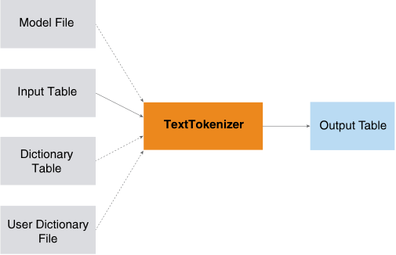

<html><head></head><body>
<h1 class="title topictitle1" id="ariaid-title1">TextTokenizer (ML Engine)</h1>

The TextTokenizer function extracts English, Chinese, or Japanese tokens
			from text. Examples of tokens are words, punctuation marks, and numbers. Tokenization is
			the first step of many types of text analysis.

  </img>  

TextTokenizer uses files that are preinstalled on <b>ML Engine</b>. For details, see <a href="tzu1557778477026.md">Preinstalled Files That Functions Use</a>.

<h2 class="title topictitle2" id="ariaid-title2">TextTokenizer Syntax</h2>

<h3 class="title sectiontitle">Version 3.7</h3><pre class="pre codeblock" xml:space="preserve"><code>SELECT * FROM TextTokenizer (
  ON { <var class="keyword varname">table</var> | <var class="keyword varname">view</var> | (<var class="keyword varname">query</var>) } PARTITION BY ANY
  [ ON <var class="keyword varname">dict_table</var> AS Dict DIMENSION ]
  USING
  TextColumn ('<var class="keyword varname">text_column</var>') ]
  [ InputLanguage ({ 'en' | 'zh_CN' | 'zh_TW' | 'jp' | }) ]
  [ InputModelFile ('<var class="keyword varname">input_model_file</var>') ]
  [ OutputDelimiter ('<var class="keyword varname">delimiter</var>') ]
  [ OutputByWord (<b>{'true'|'t'|'yes'|'y'|'1'|'false'|'f'|'no'|'n'|'0'}</b>) ]
  <code class="ph codeph">[ Accumulate ({ '<var class="keyword varname">accumulate_column</var>' | <var class="keyword varname">accumulate_column_range</var> }[,...]) ]</code>
  [ UserDictionaryFile ('<var class="keyword varname">user_dictionary_file</var>') ]
) AS <var class="keyword varname">alias</var>;</code></pre>

<b>Related Information</b>

<ul class="linklist linklist relinfo">
<a href="ndv1557782188375.md">Column Specification Syntax Elements</a>
</ul>

<h2 class="title topictitle2" id="ariaid-title3">TextTokenizer Syntax Elements</h2>

<dl class="dl parml"><dt class="dt pt dlterm">TextColumn</dt><dd class="dd pd">Specify the name of the InputTable column that contains the text to tokenize.</dd><dt class="dt pt dlterm">InputLanguage</dt><dd class="dd pd">[Optional] Specify the language of the text in <var class="keyword varname">text_column</var>:

<table cellpadding="4" cellspacing="0" summary="" id="wht1507574656875__table_x3n_flz_fdb" class="table" frame="border" border="1" rules="all">

<colgroup span="1"><col style="width:50%" span="1"></col><col style="width:50%" span="1"></col></colgroup><thead class="thead" style="text-align:left;"><tr class="row"><th class="entry cellrowborder" style="vertical-align:top;" id="d343669e179" rowspan="1" colspan="1">Option</th><th class="entry cellrowborder" style="vertical-align:top;" id="d343669e181" rowspan="1" colspan="1">Description</th></tr></thead><tbody class="tbody"><tr class="row"><td class="entry cellrowborder" style="vertical-align:top;" headers="d343669e179" rowspan="1" colspan="1"><code class="ph codeph">'en'</code> (Default)</td><td class="entry cellrowborder" style="vertical-align:top;" headers="d343669e181" rowspan="1" colspan="1">English</td></tr><tr class="row"><td class="entry cellrowborder" style="vertical-align:top;" headers="d343669e179" rowspan="1" colspan="1"><code class="ph codeph">'zh_CN'</code></td><td class="entry cellrowborder" style="vertical-align:top;" headers="d343669e181" rowspan="1" colspan="1">Simplified Chinese</td></tr><tr class="row"><td class="entry cellrowborder" style="vertical-align:top;" headers="d343669e179" rowspan="1" colspan="1"><code class="ph codeph">'zh_TW'</code></td><td class="entry cellrowborder" style="vertical-align:top;" headers="d343669e181" rowspan="1" colspan="1">Traditional Chinese</td></tr><tr class="row"><td class="entry cellrowborder" style="vertical-align:top;" headers="d343669e179" rowspan="1" colspan="1"><code class="ph codeph">'jp'</code></td><td class="entry cellrowborder" style="vertical-align:top;" headers="d343669e181" rowspan="1" colspan="1">Japanese</td></tr></tbody></table>
</dd><dt class="dt pt dlterm">InputModelFile</dt><dd class="dd pd">[Optional] Specify the name of model file that the function uses for tokenizing. The model must be a conditional random-fields model and <var class="keyword varname">input_model_file</var> must already be installed on <b>ML Engine</b>. If you omit this syntax element, or if <var class="keyword varname">input_model_file</var> is not installed, then the function uses white spaces to separate English words and an embedded dictionary to tokenize Chinese text.</dd><dd class="dd pd ddexpand">If you specify <code class="ph codeph">InputLanguage('jp')</code>, the function ignores this syntax element.</dd><dt class="dt pt dlterm">OutputDelimiter</dt><dd class="dd pd">[Optional] Specify the delimiter, a string, for separating tokens in the output.</dd><dd class="dd pd ddexpand">Default: '/' (slash)</dd><dt class="dt pt dlterm">OutputByWord</dt><dd class="dd pd">Specify whether to output one token in each row.</dd><dd class="dd pd ddexpand">Default: 'false' (Output one line of text in each row.)</dd><dt class="dt pt dlterm">Accumulate</dt><dd class="dd pd">[Optional] Specify the names of the InputTable columns to copy to the output table.</dd><dt class="dt pt dlterm">UserDictionaryFile</dt><dd class="dd pd">[Optional] Specify the name of the user dictionary to use to correct results specified by the model. If you specify both this syntax element and a dictionary table (Dict), then the function uses the union of <var class="keyword varname">user_dictionary_file</var> and Dict as its dictionary. <a href="vxn1558537001391.md#egz1507575004073">TextTokenizer Input</a> describes the format of <var class="keyword varname">user_dictionary_file</var> and Dict.</dd><dd class="dd pd ddexpand">If the function finds more than one matched term, it selects the longest term for the first match.</dd></dl>

<h2 class="title topictitle2" id="ariaid-title4">TextTokenizer Input</h2>

<h3 class="title sectiontitle">Input Table Schema</h3>
<table cellpadding="4" cellspacing="0" summary="" id="egz1507575004073__table_N10014_N1000E_N1000C_N10001" class="table" frame="border" border="1" rules="all">

<colgroup span="1"><col style="width:28.57142857142857%" span="1"></col><col style="width:14.285714285714285%" span="1"></col><col style="width:57.14285714285714%" span="1"></col></colgroup><thead class="thead" style="text-align:left;"><tr class="row"><th class="entry nocellnorowborder" style="vertical-align:top;" id="d343669e286" rowspan="1" colspan="1">Column</th><th class="entry nocellnorowborder" style="vertical-align:top;" id="d343669e288" rowspan="1" colspan="1">Data Type</th><th class="entry cell-norowborder" style="vertical-align:top;" id="d343669e290" rowspan="1" colspan="1">Description</th></tr></thead><tbody class="tbody"><tr class="row"><td class="entry nocellnorowborder" style="vertical-align:top;" headers="d343669e286" rowspan="1" colspan="1"><var class="keyword varname">text_column</var></td><td class="entry nocellnorowborder" style="vertical-align:top;" headers="d343669e288" rowspan="1" colspan="1">VARCHAR</td><td class="entry cell-norowborder" style="vertical-align:top;" headers="d343669e290" rowspan="1" colspan="1">Text to tokenize.</td></tr><tr class="row"><td class="entry row-nocellborder" style="vertical-align:top;" headers="d343669e286" rowspan="1" colspan="1"><var class="keyword varname">accumulate_column</var></td><td class="entry row-nocellborder" style="vertical-align:top;" headers="d343669e288" rowspan="1" colspan="1">Any</td><td class="entry cellrowborder" style="vertical-align:top;" headers="d343669e290" rowspan="1" colspan="1">[Column appears once for each specified <var class="keyword varname">accumulate_column</var>.] Column to copy to output table.</td></tr></tbody></table>

<h3 class="title sectiontitle">Dict Schema</h3>

This table is optional.

<table cellpadding="4" cellspacing="0" summary="" id="egz1507575004073__table_N1005B_N1000E_N1000C_N10001" class="table" frame="border" border="1" rules="all">

<colgroup span="1"><col style="width:17.24137931034483%" span="1"></col><col style="width:13.793103448275861%" span="1"></col><col style="width:68.96551724137932%" span="1"></col></colgroup><thead class="thead" style="text-align:left;"><tr class="row"><th class="entry nocellnorowborder" style="vertical-align:top;" id="d343669e326" rowspan="1" colspan="1">Column</th><th class="entry nocellnorowborder" style="vertical-align:top;" id="d343669e328" rowspan="1" colspan="1">Data Type</th><th class="entry cell-norowborder" style="vertical-align:top;" id="d343669e330" rowspan="1" colspan="1">Description</th></tr></thead><tbody class="tbody"><tr class="row"><td class="entry row-nocellborder" style="vertical-align:top;" headers="d343669e326" rowspan="1" colspan="1"><var class="keyword varname">entry</var></td><td class="entry row-nocellborder" style="vertical-align:top;" headers="d343669e328" rowspan="1" colspan="1">VARCHAR</td><td class="entry cellrowborder" style="vertical-align:top;" headers="d343669e330" rowspan="1" colspan="1">Dictionary entry.</td></tr></tbody></table>

<h3 class="title sectiontitle">Dictionary Table and User Dictionary File Format</h3>

This table describes the format of both the dictionary table (Dict) and the user dictionary file (specified by the UserDictionaryFile syntax element).

<table cellpadding="4" cellspacing="0" summary="" id="egz1507575004073__table_N10095_N1000E_N1000C_N10001" class="table" frame="border" border="1" rules="all">

<colgroup span="1"><col style="width:25%" span="1"></col><col style="width:75%" span="1"></col></colgroup><thead class="thead" style="text-align:left;"><tr class="row"><th class="entry nocellnorowborder" style="vertical-align:top;" id="d343669e352" rowspan="1" colspan="1">Language</th><th class="entry cell-norowborder" style="vertical-align:top;" id="d343669e354" rowspan="1" colspan="1">Format</th></tr></thead><tbody class="tbody"><tr class="row"><td class="entry nocellnorowborder" style="vertical-align:top;" headers="d343669e352" rowspan="1" colspan="1">Chinese and English</td><td class="entry cell-norowborder" style="vertical-align:top;" headers="d343669e354" rowspan="1" colspan="1">One dictionary word on each line.</td></tr><tr class="row"><td class="entry row-nocellborder" style="vertical-align:top;" headers="d343669e352" rowspan="1" colspan="1">Japanese</td><td class="entry cellrowborder" style="vertical-align:top;" headers="d343669e354" rowspan="1" colspan="1">A dictionary entry consists of the following comma-separated words:

<var class="keyword varname">word</var>—The original word.

<var class="keyword varname">tokenized_word</var>—The tokenized form of the word.

<var class="keyword varname">reading</var>—The reading of word in Katakana.

<var class="keyword varname">pos</var>—The part-of-speech of the word.

For example:

成田空港,成田空港,ナリタクウコウ,カスタム名詞
</td></tr></tbody></table>

<h2 class="title topictitle2" id="ariaid-title5">TextTokenizer Output</h2>

The output table schema depends on the OutputByWord syntax element.

<h3 class="title sectiontitle">Output Table Schema, OutputByWord ('true')</h3>
<table cellpadding="4" cellspacing="0" summary="" id="tlt1507575082569__table_N10018_N1000E_N1000C_N10001" class="table" frame="border" border="1" rules="all">

<colgroup span="1"><col style="width:28.57142857142857%" span="1"></col><col style="width:14.285714285714285%" span="1"></col><col style="width:57.14285714285714%" span="1"></col></colgroup><thead class="thead" style="text-align:left;"><tr class="row"><th class="entry nocellnorowborder" style="vertical-align:top;" id="d343669e409" rowspan="1" colspan="1">Column</th><th class="entry nocellnorowborder" style="vertical-align:top;" id="d343669e411" rowspan="1" colspan="1">Data Type</th><th class="entry cell-norowborder" style="vertical-align:top;" id="d343669e413" rowspan="1" colspan="1">Description</th></tr></thead><tbody class="tbody"><tr class="row"><td class="entry nocellnorowborder" style="vertical-align:top;" headers="d343669e409" rowspan="1" colspan="1"><var class="keyword varname">accumulate_column</var></td><td class="entry nocellnorowborder" style="vertical-align:top;" headers="d343669e411" rowspan="1" colspan="1">Same as in Input table</td><td class="entry cell-norowborder" style="vertical-align:top;" headers="d343669e413" rowspan="1" colspan="1">[Column appears once for each specified <var class="keyword varname">accumulate_column</var>.] Column copied from InputTable.</td></tr><tr class="row"><td class="entry nocellnorowborder" style="vertical-align:top;" headers="d343669e409" rowspan="1" colspan="1">sn</td><td class="entry nocellnorowborder" style="vertical-align:top;" headers="d343669e411" rowspan="1" colspan="1">VARCHAR</td><td class="entry cell-norowborder" style="vertical-align:top;" headers="d343669e413" rowspan="1" colspan="1">Serial number, in input text, of extracted token.</td></tr><tr class="row"><td class="entry row-nocellborder" style="vertical-align:top;" headers="d343669e409" rowspan="1" colspan="1">token</td><td class="entry row-nocellborder" style="vertical-align:top;" headers="d343669e411" rowspan="1" colspan="1">VARCHAR</td><td class="entry cellrowborder" style="vertical-align:top;" headers="d343669e413" rowspan="1" colspan="1">Extracted token.</td></tr></tbody></table>

<h3 class="title sectiontitle">Output Table Schema, OutputByWord ('false')</h3>
<table cellpadding="4" cellspacing="0" summary="" id="tlt1507575082569__table_N1006B_N1000E_N1000C_N10001" class="table" frame="border" border="1" rules="all">

<colgroup span="1"><col style="width:28.57142857142857%" span="1"></col><col style="width:14.285714285714285%" span="1"></col><col style="width:57.14285714285714%" span="1"></col></colgroup><thead class="thead" style="text-align:left;"><tr class="row"><th class="entry nocellnorowborder" style="vertical-align:top;" id="d343669e452" rowspan="1" colspan="1">Column</th><th class="entry nocellnorowborder" style="vertical-align:top;" id="d343669e454" rowspan="1" colspan="1">Data Type</th><th class="entry cell-norowborder" style="vertical-align:top;" id="d343669e456" rowspan="1" colspan="1">Description</th></tr></thead><tbody class="tbody"><tr class="row"><td class="entry nocellnorowborder" style="vertical-align:top;" headers="d343669e452" rowspan="1" colspan="1"><var class="keyword varname">accumulate_column</var></td><td class="entry nocellnorowborder" style="vertical-align:top;" headers="d343669e454" rowspan="1" colspan="1">Same as in Input table</td><td class="entry cell-norowborder" style="vertical-align:top;" headers="d343669e456" rowspan="1" colspan="1">Column copied from InputTable.</td></tr><tr class="row"><td class="entry row-nocellborder" style="vertical-align:top;" headers="d343669e452" rowspan="1" colspan="1">token</td><td class="entry row-nocellborder" style="vertical-align:top;" headers="d343669e454" rowspan="1" colspan="1">CLOB</td><td class="entry cellrowborder" style="vertical-align:top;" headers="d343669e456" rowspan="1" colspan="1">Tokens in text, separated by specified <var class="keyword varname">delimiter</var>.</td></tr></tbody></table>

<h2 class="title topictitle2" id="ariaid-title6">TextTokenizer Examples</h2>

<h3 class="title topictitle3" id="ariaid-title7">TextTokenizer Example: Chinese Tokenization</h3>

To run queries that include non-Latin characters, you must set SESSION CHARSET to UTF-8. For more information, see <cite class="cite">Basic Teradata® Query Reference</cite>, B035-2414.

<h4 class="title sectiontitle">Input</h4>
<table cellpadding="4" cellspacing="0" summary="" id="nbv1524669863580__table_hhf_bss_pdb" class="table" frame="border" border="1" rules="all">
Input Table: cn_input
<colgroup span="1"><col style="width:50%" span="1"></col><col style="width:50%" span="1"></col></colgroup><thead class="thead" style="text-align:left;"><tr class="row"><th class="entry cellrowborder" style="vertical-align:top;" id="d343669e531" rowspan="1" colspan="1">id</th><th class="entry cellrowborder" style="vertical-align:top;" id="d343669e533" rowspan="1" colspan="1">txt</th></tr></thead><tbody class="tbody"><tr class="row"><td class="entry cellrowborder" style="vertical-align:top;" headers="d343669e531" rowspan="1" colspan="1">t1</td><td class="entry cellrowborder" style="vertical-align:top;" headers="d343669e533" rowspan="1" colspan="1">我从小就不由自主地认为自己长大以后一定得成为一个象我父亲一样的画家, 可能是父母潜移默化的影响。</td></tr><tr class="row"><td class="entry cellrowborder" style="vertical-align:top;" headers="d343669e531" rowspan="1" colspan="1">t2</td><td class="entry cellrowborder" style="vertical-align:top;" headers="d343669e533" rowspan="1" colspan="1">中华人民共和国 辽宁省 铁岭市 靠山屯 村支书 赵本山。</td></tr></tbody></table>

<table cellpadding="4" cellspacing="0" summary="" id="nbv1524669863580__table_mpm_gts_pdb" class="table" frame="border" border="1" rules="all">
Dict: cn_dict
<colgroup span="1"><col style="width:100%" span="1"></col></colgroup><thead class="thead" style="text-align:left;"><tr class="row"><th class="entry cellrowborder" style="vertical-align:top;" id="d343669e553" rowspan="1" colspan="1">txt</th></tr></thead><tbody class="tbody"><tr class="row"><td class="entry cellrowborder" style="vertical-align:top;" headers="d343669e553" rowspan="1" colspan="1">辽宁省铁岭市靠山屯村</td></tr><tr class="row"><td class="entry cellrowborder" style="vertical-align:top;" headers="d343669e553" rowspan="1" colspan="1">赵本山</td></tr></tbody></table>

<h4 class="title sectiontitle">SQL Call 1</h4><pre class="pre codeblock" xml:space="preserve"><code>SELECT * FROM TextTokenizer (
  ON cn_input PARTITION BY ANY
  ON cn_dict AS dict DIMENSION
  USING
  InputLanguage ('zh_CN')
  OutputDelimiter (' ')
  OutputByWord ('false')
  Accumulate ('id')
  TextColumn ('txt')
) AS dt ORDER BY id;</code></pre>

<h4 class="title sectiontitle">Output 1</h4><pre class="pre screen" xml:space="preserve"> id |                                                          token                                                           
----+--------------------------------------------------------------------------------------------------------------------------
 t1 | 我 从小 就 不由自主 地 认为 自己 长大 以后 一定 得 成为 一 个 象 我 父亲 一样 的 画家 , 可能 是 父母 潜移默化 的 影响 。
 t2 | 中华人民共和国 辽宁省 铁岭市 靠山 屯 村 支 书 赵本山 。
(2 rows)</pre>

<h4 class="title sectiontitle">SQL Call 2</h4><pre class="pre codeblock" xml:space="preserve"><code>SELECT * FROM TextTokenizer(
  ON cn_input PARTITION BY ANY
  ON cn_dict AS dict DIMENSION
  USING
  InputLanguage('zh_CN')
  OutputDelimiter(' ')
  OutputByWord('true')
  Accumulate('id')
  TextColumn('txt')
) AS dt ORDER BY id;</code></pre>

<h4 class="title sectiontitle">Output 2</h4><pre class="pre screen" xml:space="preserve"> id sn token   
 -- -- ------- 
 t1  1 我      
 t1  2 从小     
 t1  3 就      
 t1  4 不由自主   
 t1  5 地      
 t1  6 认为     
 t1  7 自己     
 t1  8 长大     
 t1  9 以后     
 t1 10 一定     
 t1 11 得      
 t1 12 成为     
 t1 13 一      
 t1 14 个      
 t1 15 象      
 t1 16 我      
 t1 17 父亲     
 t1 18 一样     
 t1 19 的      
 t1 20 画家     
 t1 21 ,      
 t1 22 可能     
 t1 23 是      
 t1 24 父母     
 t1 25 潜移默化   
 t1 26 的      
 t1 27 影响     
 t1 28 。      
 t2  1 中华人民共和国
 t2  2 辽宁省    
 t2  3 铁岭市    
 t2  4 靠山     
 t2  5 屯      
 t2  6 村      
 t2  7 支      
 t2  8 书      
 t2  9 赵本山    
 t2 10 。</pre>

Download a zip file of all examples and a SQL script file that creates their input tables from the attachment in the left sidebar.

<h3 class="title topictitle3" id="ariaid-title8">TextTokenizer Example: Japanese Tokenization</h3>

To run queries that include non-Latin characters, you must set SESSION CHARSET to UTF-8. For more information, see <cite class="cite">Basic Teradata® Query Reference</cite>, B035-2414.

<h4 class="title sectiontitle">Input</h4>
<table cellpadding="4" cellspacing="0" summary="" id="ivh1524670028532__table_mfq_rts_pdb" class="table" frame="border" border="1" rules="all">
Input Table: jp_input
<colgroup span="1"><col style="width:50%" span="1"></col><col style="width:50%" span="1"></col></colgroup><thead class="thead" style="text-align:left;"><tr class="row"><th class="entry cellrowborder" style="vertical-align:top;" id="d343669e631" rowspan="1" colspan="1">id</th><th class="entry cellrowborder" style="vertical-align:top;" id="d343669e633" rowspan="1" colspan="1">txt</th></tr></thead><tbody class="tbody"><tr class="row"><td class="entry cellrowborder" style="vertical-align:top;" headers="d343669e631" rowspan="1" colspan="1">t1</td><td class="entry cellrowborder" style="vertical-align:top;" headers="d343669e633" rowspan="1" colspan="1">総務省は28日、全国の主要51市を対象に2013年の物価水準を比較した消費者物価地域差指数を発表した。</td></tr><tr class="row"><td class="entry cellrowborder" style="vertical-align:top;" headers="d343669e631" rowspan="1" colspan="1">t2</td><td class="entry cellrowborder" style="vertical-align:top;" headers="d343669e633" rowspan="1" colspan="1">ソチ五輪６位の浅田真央（２３）＝中京大＝はＳＰ女子世界最高の７８・６６点で首位に立った。</td></tr></tbody></table>

<table cellpadding="4" cellspacing="0" summary="" id="ivh1524670028532__table_x5n_5ts_pdb" class="table" frame="border" border="1" rules="all">
Dict: jp_dict
<colgroup span="1"><col style="width:100%" span="1"></col></colgroup><thead class="thead" style="text-align:left;"><tr class="row"><th class="entry cellrowborder" style="vertical-align:top;" id="d343669e653" rowspan="1" colspan="1">word</th></tr></thead><tbody class="tbody"><tr class="row"><td class="entry cellrowborder" style="vertical-align:top;" headers="d343669e653" rowspan="1" colspan="1">地域差指数,地域差指数,チイキサシスウ,カスタム名詞</td></tr></tbody></table>

User dictionary file user_dict_jp.txt:

ＳＰ女子,ＳＰ女子,エスピージョシ,カスタム名詞

<h4 class="title sectiontitle">SQL Call 1</h4><pre class="pre codeblock" xml:space="preserve"><code>SELECT * FROM TextTokenizer (
  ON jp_input PARTITION BY ANY
  ON jp_dict AS dict DIMENSION
  USING
  InputLanguage ('jp')
  OutputByWord ('false')
  Accumulate ('id')
  TextColumn ('txt')
  UserDictionaryFile ('user_dict_jp.txt')
) AS dt ORDER BY id;</code></pre>

<h4 class="title sectiontitle">Output 1</h4><pre class="pre screen" xml:space="preserve"> id |                                                            token                                                            
----+-----------------------------------------------------------------------------------------------------------------------------
 t1 | 総務省/は/28/日/、/全国/の/主要/51/市/を/対象/に/2013/年/の/物価水準/を/比較/し/た/消費者/物/価地域差/指数/を/発表/し/た/。
 t2 | ソチ五輪/６/位/の/浅田真央/（/２/３/）/＝/中京大/＝/は/Ｓ/Ｐ/女子世界最高/の/７/８/・/６/６/点/で/首位/に/立っ/た/。
(2 rows)</pre>

<h4 class="title sectiontitle">SQL Call 2</h4><pre class="pre codeblock" xml:space="preserve"><code>SELECT * FROM TextTokenizer (
  ON jp_input PARTITION BY ANY
  ON jp_dict AS dict DIMENSION
  USING
  InputLanguage ('jp')
  OutputByWord ('true')
  Accumulate ('id')
  TextColumn ('txt')
  UserDictionaryFile ('user_dict_jp.txt')
) AS dt ORDER BY id;</code></pre>

<h4 class="title sectiontitle">Output 2</h4><pre class="pre screen" xml:space="preserve"> id sn token  
 -- -- ------ 
 t1  1 総務省   
 t1  2 は     
 t1  3 28    
 t1  4 日     
 t1  5 、     
 t1  6 全国    
 t1  7 の     
 t1  8 主要    
 t1  9 51    
 t1 10 市     
 t1 11 を     
 t1 12 対象    
 t1 13 に     
 t1 14 2013  
 t1 15 年     
 t1 16 の     
 t1 17 物価水準  
 t1 18 を     
 t1 19 比較    
 t1 20 し     
 t1 21 た     
 t1 22 消費者   
 t1 23 物     
 t1 24 価     
 t1 25 地域差指数 
 t1 26 を     
 t1 27 発表    
 t1 28 し     
 t1 29 た     
 t1 30 。     
 t2  1 ソチ五輪  
 t2  2 ６     
 t2  3 位     
 t2  4 の     
 t2  5 浅田真央  
 t2  6 （     
 t2  7 ２     
 t2  8 ３     
 t2  9 ）     
 t2 10 ＝     
 t2 11 中京大   
 t2 12 ＝     
 t2 13 は     
 t2 14 Ｓ     
 t2 15 Ｐ     
 t2 16 女子世界最高
 t2 17 の     
 t2 18 ７     
 t2 19 ８     
 t2 20 ・     
 t2 21 ６     
 t2 22 ６     
 t2 23 点     
 t2 24 で     
 t2 25 首位    
 t2 26 に     
 t2 27 立っ    
 t2 28 た     
 t2 29 。</pre>

Download a zip file of all examples and a SQL script file that creates their input tables from the attachment in the left sidebar.

<h3 class="title topictitle3" id="ariaid-title9">TextTokenizer Example: English Tokenization</h3>

<h4 class="title sectiontitle">Input</h4>

The InputTable is log of vehicle complaints. The category column indicates whether the car has been in a crash.

<table cellpadding="4" cellspacing="0" summary="" id="ozo1524670140804__table_vfn_x5s_pdb" class="table" frame="border" border="1" rules="all">
complaints
<colgroup span="1"><col style="width:33.33333333333333%" span="1"></col><col style="width:33.33333333333333%" span="1"></col><col style="width:33.33333333333333%" span="1"></col></colgroup><thead class="thead" style="text-align:left;"><tr class="row"><th class="entry cellrowborder" style="vertical-align:top;" id="d343669e721" rowspan="1" colspan="1">doc_id</th><th class="entry cellrowborder" style="vertical-align:top;" id="d343669e723" rowspan="1" colspan="1">text_data</th><th class="entry cellrowborder" style="vertical-align:top;" id="d343669e725" rowspan="1" colspan="1">category</th></tr></thead><tbody class="tbody"><tr class="row"><td class="entry cellrowborder" style="vertical-align:top;" headers="d343669e721" rowspan="1" colspan="1">1</td><td class="entry cellrowborder" style="vertical-align:top;" headers="d343669e723" rowspan="1" colspan="1">consumer was driving approximately 45 mph hit a deer with the front bumper and then ran into an embankment head-on passenger's side air bag did deploy hit windshield and deployed outward. driver's side airbag cover opened but did not inflate it was still folded causing injuries.</td><td class="entry cellrowborder" style="vertical-align:top;" headers="d343669e725" rowspan="1" colspan="1">crash</td></tr><tr class="row"><td class="entry cellrowborder" style="vertical-align:top;" headers="d343669e721" rowspan="1" colspan="1">2</td><td class="entry cellrowborder" style="vertical-align:top;" headers="d343669e723" rowspan="1" colspan="1">when vehicle was involved in a crash totalling vehicle driver's side/ passenger's side air bags did not deploy. vehicle was making a left turn and was hit by a ford f350 traveling about 35 mph on the front passenger's side. driver hit his head-on the steering wheel. hurt his knee and received neck and back injuries.</td><td class="entry cellrowborder" style="vertical-align:top;" headers="d343669e725" rowspan="1" colspan="1">crash</td></tr><tr class="row"><td class="entry cellrowborder" style="vertical-align:top;" headers="d343669e721" rowspan="1" colspan="1">3</td><td class="entry cellrowborder" style="vertical-align:top;" headers="d343669e723" rowspan="1" colspan="1">consumer has experienced following problems; 1.) both lower ball joints wear out excessively; 2.) head gasket leaks; and 3.) cruise control would shut itself off while driving without foot pressing on brake pedal.</td><td class="entry cellrowborder" style="vertical-align:top;" headers="d343669e725" rowspan="1" colspan="1">no_crash</td></tr><tr class="row"><td class="entry cellrowborder" style="vertical-align:top;" headers="d343669e721" rowspan="1" colspan="1">...</td><td class="entry cellrowborder" style="vertical-align:top;" headers="d343669e723" rowspan="1" colspan="1">...</td><td class="entry cellrowborder" style="vertical-align:top;" headers="d343669e725" rowspan="1" colspan="1">...</td></tr></tbody></table>

<h4 class="title sectiontitle">SQL Call</h4><pre class="pre codeblock" xml:space="preserve"><code>SELECT * FROM TextTokenizer (
  ON complaints PARTITION BY ANY
  USING
  InputLanguage ('en')
  OutputDelimiter (' ')
  OutputByWord ('true')
  Accumulate ('doc_id')
  TextColumn ('text_data')
) AS dt ORDER BY doc_id, sn, token;</code></pre>

<h4 class="title sectiontitle">Output</h4><pre class="pre screen" xml:space="preserve"> doc_id sn token           
 ------ -- --------------- 
      1  1 consumer       
      1  2 was            
      1  3 driving        
      1  4 approximately  
      1  5 45             
      1  6 mph            
      1  7 hit            
      1  8 a              
      1  9 deer           
      1 10 with           
      1 11 the            
      1 12 front          
      1 13 bumper         
      1 14 and            
      1 15 then           
      1 16 ran            
      1 17 into           
      1 18 an             
      1 19 embankment     
      1 20 head-on        
      1 21 passenger's    
      1 22 side           
      1 23 air            
      1 24 bag            
      1 25 did            
      1 26 deploy         
      1 27 hit            
      1 28 windshield     
      1 29 and            
      1 30 deployed       
      1 31 outward        
      1 32 .              
      1 33 driver's       
      1 34 side           
      1 35 airbag         
      1 36 cover          
      1 37 opened         
      1 38 but            
      1 39 did            
      1 40 not            
      1 41 inflate        
      1 42 it             
      1 43 was            
      1 44 still          
      1 45 folded         
      1 46 causing        
      1 47 injuries       
      1 48 .              
      2  1 when           
      2  2 vehicle        
      2  3 was            
      2  4 involved       
      2  5 in             
      2  6 a              
      2  7 crash          
      2  8 totalling      
      2  9 vehicle        
      2 10 driver's       
      2 11 side/          
      2 12 passenger's    
      2 13 side           
      2 14 air            
      2 15 bags           
      2 16 did            
      2 17 not            
      2 18 deploy         
      2 19 .              
      2 20 vehicle        
      2 21 was            
      2 22 making         
      2 23 a              
      2 24 left           
      2 25 turn           
      2 26 and            
      2 27 was            
      2 28 hit            
      2 29 by             
      2 30 a              
      2 31 ford           
      2 32 f350           
      2 33 traveling      
      2 34 about          
      2 35 35             
      2 36 mph            
      2 37 on             
      2 38 the            
      2 39 front          
      2 40 passenger's    
      2 41 side           
      2 42 .              
      2 43 driver         
      2 44 hit            
      2 45 his            
      2 46 head-on        
      2 47 the            
      2 48 steering       
      2 49 wheel          
      2 50 .              
      2 51 hurt           
      2 52 his            
      2 53 knee           
      2 54 and            
      2 55 received       
      2 56 neck           
      2 57 and            
      2 58 back           
      2 59 injuries       
      2 60 .              
      3  1 consumer       
      3  2 has            
      3  3 experienced    
      3  4 following      
      3  5 problems       
      3  6 ;              
      3  7 1              
      3  8 .              
      3  9 )              
      3 10 both           
      3 11 lower          
      3 12 ball           
      3 13 joints         
      3 14 wear           
      3 15 out            
      3 16 excessively    
      3 17 ;              
      3 18 2              
      3 19 .              
      3 20 )              
      3 21 head           
      3 22 gasket         
      3 23 leaks          
      3 24 ;              
      3 25 and            
      3 26 3              
      3 27 .              
      3 28 )              
      3 29 cruise         
      3 30 control        
      3 31 would          
      3 32 shut           
      3 33 itself         
      3 34 off            
      3 35 while          
      3 36 driving        
      3 37 without        
      3 38 foot           
      3 39 pressing       
      3 40 on             
      3 41 brake          
      3 42 pedal          
      3 43 .              
      4  1 transfer       
      4  2 case           
      4  3 was            
      4  4 repaired       
      4  5 under          
      4  6 recall         
      4  7 .              
      4  8 after          
      4  9 the            
      4 10 work           
      4 11 was            
      4 12 completed      
      4 13 noise          
      4 14 was            
      4 15 heard          
      4 16 intermittently 
      4 17 .              
      4 18 consumer       
      4 19 took           
      4 20 vehicle        
      4 21 back           
      4 22 to             
      4 23 dealer         
      4 24 .              
      4 25 the            
      4 26 dealer         
      4 27 reinspected    
      4 28 vehicle        
      4 29 and            
      4 30 informed       
      4 31 the            
      4 32 owner          
      4 33 that           
      4 34 the            
      4 35 driveshaft     
      4 36 was            
      4 37 hitting        
      4 38 the            
      4 39 transfer       
      4 40 case           
      4 41 .              
      4 42 the            
      4 43 manufacturer   
      4 44 has            
      4 45 been           
      4 46 notfied        
      4 47 .              
      5  1 transmission   
      5  2 would          
      5  3 start          
      5  4 to             
      5  5 slip           
      5  6 when           
      5  7 traveling      
      5  8 just           
      5  9 10mph          
      5 10 .              
      5 11 the            
      5 12 rpms           
      5 13 would          
      5 14 be             
      5 15 over           
      5 16 3              
      5 17 thousand       
      5 18 .              
      5 19 had            
      5 20 vehicle        
      5 21 checked        
      5 22 at             
      5 23 dealership     
      5 24 &amp;              
      5 25 was            
      5 26 informed       
      5 27 transmission   
      5 28 was            
      5 29 stuck          
      5 30 &amp;              
      5 31 that           
      5 32 it's           
      5 33 a              
      5 34 factory        
      5 35 defect         
      5 36 almost         
      5 37 blew           
      5 38 up             
      5 39 .              
      5 40 also           
      5 41 speedometer    
      5 42 does           
      5 43 not            
      5 44 keep           
      5 45 accurate       
      5 46 speeds         
      5 47 .              
      5 48 if             
      5 49 speed          
      5 50 is             
      5 51 increasedit    
      5 52 would          
      5 53 fail           
      5 54 to             
      5 55 work           
      5 56 .              
      5 57 this           
      5 58 was            
      5 59 referred       
      5 60 to             
      5 61 mechanic       
      5 62 by             
      5 63 manufacturer   
      5 64 .              
      6  1 due            
      6  2 to             
      6  3 the            
      6  4 defective      
      6  5 ignition       
      6  6 cable          
      6  7 which          
      6  8 burned         
      6  9 the            
      6 10 coil           
      6 11 the            
      6 12 vehicle        
      6 13 stalled        
      6 14 unexpectedly   
      6 15 which          
      6 16 could          
      6 17 have           
      6 18 resulted       
      6 19 in             
      6 20 a              
      6 21 crash          
      6 22 .              
      6 23 also           
      6 24 dealer         
      6 25 replaced       
      6 26 the            
      6 27 r&amp;r            
      6 28 drive          
      6 29 belts/speed    
      6 30 controlcable   
      6 31 and            
      6 32 performed      
      6 33 vehicle        
      6 34 tune           
      6 35 up             
      6 36 .              
      6 37 please         
      6 38 provide        
      6 39 further        
      6 40 information    
      6 41 .              
      7  1 when           
      7  2 switch         
      7  3 is             
      7  4 turned         
      7  5 on             
      7  6 windshield     
      7  7 wipers         
      7  8 would          
      7  9 not            
      7 10 work           
      7 11 properly       
      7 12 .              
      7 13 would          
      7 14 have           
      7 15 to             
      7 16 jiggle         
      7 17 switch         
      7 18 &amp;              
      7 19 then           
      7 20 wipers         
      7 21 would          
      7 22 move           
      7 23 .              
      7 24 wipers         
      7 25 do             
      7 26 turn           
      7 27 off/on         
      7 28 by             
      7 29 themselves     
      7 30 .              
      7 31 recall         
      7 32 97v017000      
      7 33 .              
      8  1 consumer       
      8  2 was            
      8  3 driving        
      8  4 in             
      8  5 a              
      8  6 rain           
      8  7 storm          
      8  8 when           
      8  9 the            
      8 10 windshield     
      8 11 wipers         
      8 12 stopped        
      8 13 this           
      8 14 happened       
      8 15 periodcally    
      8 16 .              
      9  1 at             
      9  2 66900          
      9  3 miles          
      9  4 transmission   
      9  5 has            
      9  6 malfunctioned  
      9  7 and            
      9  8 will           
      9  9 not            
      9 10 shift          
      9 11 into           
      9 12 first          
      9 13 gear           
      9 14 .              
      9 15 repairs        
      9 16 were           
      9 17 made           
      9 18 at             
      9 19 owner's        
      9 20 expense        
      9 21 wants          
      9 22 reimbursement  
      9 23 .              
      9 24 *ml            
     10  1 when           
     10  2 truck          
     10  3 was            
     10  4 sitting        
     10  5 on             
     10  6 an             
     10  7 incline        
     10  8 it             
     10  9 rolled         
     10 10 on             
     10 11 its            
     10 12 own            
     10 13 .              
     10 14 manufacturer   
     10 15 was            
     10 16 aware          
     10 17 of             
     10 18 the            
     10 19 problem        
     10 20 .              
     10 21 problem        
     10 22 has            
     10 23 not            
     10 24 been           
     10 25 corrected      
     10 26 .              
     10 27 the            
     10 28 truck          
     10 29 is             
     10 30 owned          
     10 31 by             
     10 32 walnut         
     10 33 hill           
     10 34 recker         
     10 35 manufactured   
     10 36 in             
     10 37 1998           
     10 38 .              
     11  1 car            
     11  2 engine         
     11  3 raced          
     11  4 while          
     11  5 slowing        
     11  6 to             
     11  7 park           
     11  8 .              
     11  9 car            
     11 10 lurched        
     11 11 forward        
     11 12 and            
     11 13 crashed        
     11 14 into           
     11 15 a              
     11 16 fence          
     11 17 and            
     11 18 a              
     11 19 building       
     11 20 .              
     11 21 car            
     11 22 had            
     11 23 been           
     11 24 in             
     11 25 shop           
     11 26 approximately  
     11 27 one            
     11 28 week           
     11 29 prior          
     11 30 to             
     11 31 incident       
     11 32 for            
     11 33 high           
     11 34 idle           
     11 35 condition      
     11 36 .              
     12  1 rear           
     12  2 ended          
     12  3 another        
     12  4 vehicle        
     12  5 at             
     12  6 65             
     12  7 to             
     12  8 70mph          
     12  9 and            
     12 10 neither        
     12 11 driver's       
     12 12 side           
     12 13 or             
     12 14 passenger's    
     12 15 side           
     12 16 airbags        
     12 17 deployed       
     12 18 .              
     12 19 dealer         
     12 20 has            
     12 21 vehicle        
     12 22 .              
     13  1 while          
     13  2 vehicle        
     13  3 was            
     13  4 parked         
     13  5 for            
     13  6 an             
     13  7 hour           
     13  8 a              
     13  9 fire           
     13 10 started        
     13 11 on             
     13 12 the            
     13 13 left           
     13 14 side           
     13 15 of             
     13 16 the            
     13 17 engine         
     13 18 compartment    
     13 19 .              
     13 20 owners         
     13 21 son            
     13 22 smelled        
     13 23 smoke          
     13 24 owner          
     13 25 saw            
     13 26 fire           
     13 27 coming         
     13 28 from           
     13 29 around         
     13 30 drivers        
     13 31 side           
     13 32 front          
     13 33 wheel          
     13 34 .              
     13 35 referenced     
     13 36 in             
     13 37 ea02-025       
     14  1 after          
     14  2 vehicle        
     14  3 was            
     14  4 repaired       
     14  5 under          
     14  6 recall         
     14  7 99v029000      
     14  8 ignition       
     14  9 switch         
     14 10 the            
     14 11 airbag         
     14 12 light          
     14 13 stayed         
     14 14 on             
     14 15 .              
     14 16 the            
     14 17 dealer         
     14 18 and            
     14 19 the            
     14 20 manufacturer   
     14 21 has            
     14 22 been           
     14 23 notified       
     14 24 .              
     15  1 electrical     
     15  2 control        
     15  3 module         
     15  4 is             
     15  5 shortening     
     15  6 out            
     15  7 causing        
     15  8 the            
     15  9 vehicle        
     15 10 to             
     15 11 stall          
     15 12 .              
     15 13 engine         
     15 14 will           
     15 15 become         
     15 16 totally        
     15 17 inoperative    
     15 18 .              
     15 19 consumer       
     15 20 had            
     15 21 to             
     15 22 change         
     15 23 alternator/    
     15 24 battery        
     15 25 and            
     15 26 starter        
     15 27 and            
     15 28 module         
     15 29 replaced       
     15 30 4              
     15 31 times          
     15 32 but            
     15 33 defect         
     15 34 still          
     15 35 occurring      
     15 36 cannot         
     15 37 determine      
     15 38 what           
     15 39 is             
     15 40 causing        
     15 41 the            
     15 42 problem        
     15 43 .              
     16  1 at             
     16  2 68000          
     16  3 miles          
     16  4 power          
     16  5 steering       
     16  6 broke          
     16  7 off            
     16  8 the            
     16  9 housing        
     16 10 pump           
     16 11 causing        
     16 12 total          
     16 13 loss           
     16 14 of             
     16 15 power          
     16 16 steering       
     16 17 which          
     16 18 also           
     16 19 caused         
     16 20 the            
     16 21 vehicle        
     16 22 to             
     16 23 shut           
     16 24 down           
     16 25 .              
     17  1 on             
     17  2 two            
     17  3 occasions      
     17  4 dual           
     17  5 airbags        
     17  6 did            
     17  7 not            
     17  8 deploy         
     17  9 .              
     17 10 consumer       
     17 11 rearended      
     17 12 another        
     17 13 vehicle        
     17 14 at             
     17 15 approximately  
     17 16 50             
     17 17 mphand         
     17 18 at             
     17 19 80             
     17 20 mph            
     17 21 hit            
     17 22 a              
     17 23 truck          
     17 24 head-on        
     17 25 upon           
     17 26 impact         
     17 27 air            
     17 28 bags           
     17 29 did            
     17 30 not            
     17 31 deploy         
     17 32 .              
     17 33 driver         
     17 34 sustained      
     17 35 injuries.dealer
     17 36 did            
     17 37 not            
     17 38 determine      
     17 39 why            
     17 40 air            
     17 41 bags           
     17 42 did            
     17 43 not            
     17 44 deploy         
     17 45 .              
     18  1 sunroof        
     18  2 is             
     18  3 leaking        
     18  4 .              
     18  5 yh             
     19  1 motor          
     19  2 and            
     19  3 the            
     19  4 frame          
     19  5 separated      
     19  6 from           
     19  7 vehicle        
     19  8 .              
     19  9 manufacturer   
     19 10 will           
     19 11 be             
     19 12 notified       
     19 13 .              
     20  1 rear           
     20  2 front          
     20  3 wheel          
     20  4 bearing        
     20  5 broke          
     20  6 causing        
     20  7 vehicle        
     20  8 to             
     20  9 pull           
     20 10 to             
     20 11 the            
     20 12 left           
     20 13 when           
     20 14 slowing        
     20 15 down           
     20 16 .              
     20 17 consumer       
     20 18 had            
     20 19 brake's        
     20 20 replaced       
     20 21 about          
     20 22 four           
     20 23 times          
     20 24 and            
     20 25 still          
     20 26 dealer         
     20 27 can't          
     20 28 determine      
     20 29 the            
     20 30 problem        
     20 31 .</pre>

Download a zip file of all examples and a SQL script file that creates their input tables from the attachment in the left sidebar.

</body></html>
