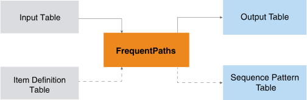

<html><head></head><body>
<h1 class="title topictitle1" id="ariaid-title1">FrequentPaths (ML Engine)</h1>

The FrequentPaths takes a table of sequences and outputs a table of subsequences (patterns) that frequently appear in the input table and, optionally, a table of sequence-pattern pairs.

  </img>  

The function is useful for analyzing customer purchase behavior, web access patterns, disease treatments, and DNA sequences.

<h2 class="title topictitle2" id="ariaid-title2">FrequentPaths Syntax</h2>

<h3 class="title sectiontitle">Version 2.5</h3><pre class="pre codeblock" xml:space="preserve"><code>SELECT * FROM FrequentPaths (
  ON { <var class="keyword varname">table</var> | <var class="keyword varname">view</var> | (<var class="keyword varname">query</var>) } AS InputTable
  ON { <var class="keyword varname">table</var> | <var class="keyword varname">view</var> | (<var class="keyword varname">query</var>) } AS ItemDefinitionTable
  OUT TABLE OutputTable (<var class="keyword varname">output_table</var>)
  [ OUT TABLE SeqPatternTable (<var class="keyword varname">sequence_pattern_table</var>) ]
  USING
  PartitionColumns ( { '<var class="keyword varname">partition_column</var>' | <var class="keyword varname">partition_column_range</var> }[,...])
  [ TimeColumn ('<var class="keyword varname">time_column</var>') ]
  [ PathFilters ([Separator (<var class="keyword varname">symbol</var>),] '<var class="keyword varname">filter</var>' [,...]) ]
  [ GroupByColumns ({ '<var class="keyword varname">group_column'</var> | <var class="keyword varname">group_column_range</var>}[,...]) ]
  { ItemColumn ('<var class="keyword varname">sequence_column</var>') |
    PathColumn ('<var class="keyword varname">path_column</var>') |
    ItemDefinitionColumns ('[<var class="keyword varname">index_column</var>:<var class="keyword varname">definition_column</var>:<var class="keyword varname">item_column</var>]')
  }
  MinSupport (<var class="keyword varname">minimum</var>)
  [ MaxLength (<var class="keyword varname">maximum_length</var>) ]
  [ MinLength (<var class="keyword varname">minimum_length</var>) ]
  [ ClosedPattern (<b>{'true'|'t'|'yes'|'y'|'1'|'false'|'f'|'no'|'n'|'0'}</b>)]
) AS <var class="keyword varname">alias</var>;</code></pre>

For the ItemDefinitionColumns syntax element, the brackets inside the parentheses are required. For example: 
<pre class="pre codeblock" xml:space="preserve"><code>ItemDefinitionColumns ([id:def:item])</code></pre>

<b>Related Information</b>

<ul class="linklist linklist relinfo">
<a href="ndv1557782188375.md">Column Specification Syntax Elements</a>
</ul>

<h2 class="title topictitle2" id="ariaid-title3">FrequentPaths Syntax Elements</h2>

<dl class="dl parml"><dt class="dt pt dlterm">OutputTable</dt><dd class="dd pd">Specify the name of the table where the function outputs the subsequences.</dd><dt class="dt pt dlterm">SeqPatternTable</dt><dd class="dd pd">[Optional] Specify the name of the table where the function outputs sequence-pattern pairs. For example, if a sequence has a partition value of "1" and contains 3 patterns with IDs 2, 9, and 10, for that sequence the function outputs the sequence-pattern pairs ("1", 2), ("1", 9), and ("1", 10).</dd><dt class="dt pt dlterm">PartitionColumns</dt><dd class="dd pd">Specify the names of the columns that comprise the partition key of the InputTable sequences.</dd><dt class="dt pt dlterm">TimeColumn</dt><dd class="dd pd">[Required when ItemColumn or ItemDefinition is specified.] Specify the name of the InputTable column that determines the order of items in a sequence. Items in the same sequence that have the same time stamp belong to the same set.</dd><dt class="dt pt dlterm">PathFilters</dt><dd class="dd pd">[Optional] Specify the filters to use on the InputTable sequences. Only InputTable sequences that satisfy all constraints of at least one filter are input to the function.</dd><dd class="dd pd ddexpand">Each <var class="keyword varname">filter</var> has one or more constraints, which are separated by spaces. Each constraint has this syntax:<pre class="pre codeblock" xml:space="preserve"><code><var class="keyword varname">constraint</var> (<var class="keyword varname">item</var> [<var class="keyword varname">symbol</var> ...])</code></pre></dd><dd class="dd pd ddexpand">
<table cellpadding="4" cellspacing="0" summary="" id="mnl1507643365154__table_xjw_3fy_fdb" class="table" frame="border" border="1" rules="all">

<colgroup span="1"><col style="width:50%" span="1"></col><col style="width:50%" span="1"></col></colgroup><thead class="thead" style="text-align:left;"><tr class="row"><th class="entry cellrowborder" style="vertical-align:top;" id="d268560e236" rowspan="1" colspan="1"><var class="keyword varname">constraint</var></th><th class="entry cellrowborder" style="vertical-align:top;" id="d268560e239" rowspan="1" colspan="1">Description</th></tr></thead><tbody class="tbody"><tr class="row"><td class="entry cellrowborder" style="vertical-align:top;" headers="d268560e236" rowspan="1" colspan="1"><code class="ph codeph">STW (<var class="keyword varname">start-with_constraint</var>)</code></td><td class="entry cellrowborder" style="vertical-align:top;" headers="d268560e239" rowspan="1" colspan="1">First item set of sequence must contain at least one <var class="keyword varname">item</var>.

For example, STW(c,d) requires first item set of sequence to contain c or d. Sequence "(a, c), e, (f, d)" meets this constraint because first item set, (a,c), contains c.
</td></tr><tr class="row"><td class="entry cellrowborder" style="vertical-align:top;" headers="d268560e236" rowspan="1" colspan="1"><code class="ph codeph">EDW (<var class="keyword varname">end-with_constraint</var>)</code></td><td class="entry cellrowborder" style="vertical-align:top;" headers="d268560e239" rowspan="1" colspan="1">Last item set of sequence must contain at least one <var class="keyword varname">item</var>.

For example, EDW(f,g) requires the last item set of the sequence to contain f or g. Sequence "(a, b), e, (f, d)" meets this constraint because last item set, (f,d), contains f.
</td></tr><tr class="row"><td class="entry cellrowborder" style="vertical-align:top;" headers="d268560e236" rowspan="1" colspan="1"><code class="ph codeph">CTN (<var class="keyword varname">containing_constraint</var>)</code></td><td class="entry cellrowborder" style="vertical-align:top;" headers="d268560e239" rowspan="1" colspan="1">Sequence must contain at least one <var class="keyword varname">item</var>.

For example, CTN(a,b) requires sequence to contain a or b. Sequence "(a,c), d, (e,f)" meets this constraint but sequence "d, (e,f)" does not.
</td></tr></tbody></table>
</dd><dd class="dd pd ddexpand">Constraints in the same <var class="keyword varname">filter</var> must differ. For example:
<ul class="ul" id="mnl1507643365154__ul_x3k_t2x_kx">
<li class="li">Valid: <code class="ph codeph">'STW(c,d) EDW(g,k) CTN(e)'</code></li>
<li class="li">Invalid: <code class="ph codeph">'STW(c,d) STW(e,h)'</code></li></ul></dd><dd class="dd pd ddexpand">This syntax element specifies a separator and uses it in two filters:</dd><dd class="dd pd ddexpand"><code class="ph codeph">PathFilters('Separator(#)', 'STW(c#d) EDW(g#k) CTN(e)', 'CTN(h#k)')</code></dd><dd class="dd pd ddexpand">If you specify <var class="keyword varname">symbol</var>, it applies to all filters. Default <var class="keyword varname">symbol</var>:  comma (,)</dd><dt class="dt pt dlterm">GroupByColumns</dt><dd class="dd pd">[Optional] Specify the names of the InputTable columns by which to group the InputTable sequences. If you specify this syntax element, the function operates on each group separately and copies each <var class="keyword varname">group_column</var> to the output table.</dd><dt class="dt pt dlterm">ItemColumn</dt><dd class="dd pd">[Required if you specify neither ItemDefinitionColumns nor PathColumn.] Specify the names of the InputTable columns that contain the items.</dd><dt class="dt pt dlterm">PathColumn</dt><dd class="dd pd">[Required if you specify neither ItemDefinitionColumns nor ItemColumn.] Specify the name of the InputTable column that contains paths in the form of sequence strings. A sequence string has this syntax:<pre class="pre codeblock" xml:space="preserve"><code>'[<var class="keyword varname">item</var> [, ...]]'</code></pre>

In the sequence string syntax, you must type the outer brackets (bold). The sequence strings in this column can be created by the nPath function.

If you specify this syntax element, each item set can have only one item.
</dd><dt class="dt pt dlterm">ItemDefinitionColumns</dt><dd class="dd pd">[Required if you specify neither ItemColumn nor PathColumn.] Specify the names of the index, definition, and item columns of the ItemDefinitionTable.</dd><dt class="dt pt dlterm">MinSupport</dt><dd class="dd pd">Determines the threshold for whether a sequential pattern is frequent. The <var class="keyword varname">minimum</var> must be a positive real number.

If <var class="keyword varname">minimum</var> is in the range (0,1], it is a relative threshold: If <var class="keyword varname">N</var> is the total number of input sequences, the threshold is <var class="keyword varname">T</var>=<var class="keyword varname">N</var>*<var class="keyword varname">minimum</var>. For example, if there are 1000 sequences in the InputTable and <var class="keyword varname">minimum</var> is 0.05, the threshold is 50.

If <var class="keyword varname">minimum</var> is in the range (1,+), it is an absolute threshold: Regardless of <var class="keyword varname">N</var>, <var class="keyword varname">T</var>=<var class="keyword varname">minimum</var>. For example, if <var class="keyword varname">minimum</var> is 50, the threshold is 50, regardless of <var class="keyword varname">N</var>.

A pattern is frequent if its support value is at least <var class="keyword varname">T</var>.

Because the function outputs only frequent patterns, <var class="keyword varname">minimum</var> controls the number of output patterns. If <var class="keyword varname">minimum</var> is small, processing time increases exponentially; therefore, Teradata recommends starting the trial with a larger value.—for example, 5% of the total sequence number if you know N and 0.05 otherwise.

If you specify a relative <var class="keyword varname">minimum</var> and GroupByColumns, the function calculates <var class="keyword varname">N</var> and <var class="keyword varname">T</var> for each group.

If you specify a relative <var class="keyword varname">minimum</var> and PathFilters, <var class="keyword varname">N</var> is the number of sequences that meet the constraints of the filters.
</dd><dt class="dt pt dlterm">MaxLength</dt><dd class="dd pd">[Optional] Specify the maximum length of the output sequential patterns. The length of a pattern is its number of sets.</dd><dd class="dd pd ddexpand">Default: No maximum length</dd><dt class="dt pt dlterm">MinLength</dt><dd class="dd pd">[Optional] Specify the minimum length of the output sequential patterns.</dd><dd class="dd pd ddexpand">Default: 1</dd><dt class="dt pt dlterm">ClosedPattern</dt><dd class="dd pd">[Optional] Specify whether to output only closed patterns.</dd><dd class="dd pd ddexpand">Default: 'false'</dd></dl>

<h2 class="title topictitle2" id="ariaid-title4">FrequentPaths Input</h2>

<table cellpadding="4" cellspacing="0" summary="" id="abh1507643436312__table_hlt_h5m_wcb" class="table" frame="border" border="1" rules="all">

<colgroup span="1"><col style="width:33.33333333333333%" span="1"></col><col style="width:66.66666666666666%" span="1"></col></colgroup><thead class="thead" style="text-align:left;"><tr class="row"><th class="entry cellrowborder" style="vertical-align:top;" id="d268560e472" rowspan="1" colspan="1">Table</th><th class="entry cellrowborder" style="vertical-align:top;" id="d268560e474" rowspan="1" colspan="1">Description</th></tr></thead><tbody class="tbody"><tr class="row"><td class="entry cellrowborder" style="vertical-align:top;" headers="d268560e472" rowspan="1" colspan="1">InputTable</td><td class="entry cellrowborder" style="vertical-align:top;" headers="d268560e474" rowspan="1" colspan="1">Contains sequence data to process, in either of these formats:

<table cellpadding="4" cellspacing="0" summary="" id="abh1507643436312__table_nnq_vhd_1db" class="table" frame="border" border="1" rules="all">

<colgroup span="1"><col style="width:50%" span="1"></col><col style="width:50%" span="1"></col></colgroup><thead class="thead" style="text-align:left;"><tr class="row"><th class="entry cellrowborder" style="vertical-align:top;" id="d268560e489" rowspan="1" colspan="1">Format</th><th class="entry cellrowborder" style="vertical-align:top;" id="d268560e491" rowspan="1" colspan="1">Description</th></tr></thead><tbody class="tbody"><tr class="row"><td class="entry cellrowborder" style="vertical-align:top;" headers="d268560e489" rowspan="1" colspan="1">Sequence/path</td><td class="entry cellrowborder" style="vertical-align:top;" headers="d268560e491" rowspan="1" colspan="1">Each row contains a string of format <code class="ph codeph">'[<var class="keyword varname">item</var>[,...]]'</code>. Outer brackets belong to string (for example, '[A, B, C, D]').

To output strings in this format, use <a href="anj1558127449015.md#nnz1507231322706">Introduction to nPath</a> function with its Accumulate syntax element.
</td></tr><tr class="row"><td class="entry cellrowborder" style="vertical-align:top;" headers="d268560e489" rowspan="1" colspan="1">Item</td><td class="entry cellrowborder" style="vertical-align:top;" headers="d268560e491" rowspan="1" colspan="1">Each row represents one item in a sequence. 

With this format, specify either ItemDefinitionTable or ItemColumn syntax element.
</td></tr></tbody></table>

</td></tr><tr class="row"><td class="entry cellrowborder" style="vertical-align:top;" headers="d268560e472" rowspan="1" colspan="1"> ItemDefinitionTable</td><td class="entry cellrowborder" style="vertical-align:top;" headers="d268560e474" rowspan="1" colspan="1">[Optional] Required if you omit both ItemColumn and PathColumn syntax elements.</td></tr></tbody></table>

The function ignores input rows with NULL values.

<h3 class="title sectiontitle">InputTable Schema</h3>
<table cellpadding="4" cellspacing="0" summary="" id="abh1507643436312__table_N1002F_N1000E_N1000C_N10001" class="table" frame="border" border="1" rules="all">

<colgroup span="1"><col style="width:21.052631578947366%" span="1"></col><col style="width:17.543859649122805%" span="1"></col><col style="width:61.40350877192983%" span="1"></col></colgroup><thead class="thead" style="text-align:left;"><tr class="row"><th class="entry nocellnorowborder" style="vertical-align:top;" id="d268560e542" rowspan="1" colspan="1">Column</th><th class="entry nocellnorowborder" style="vertical-align:top;" id="d268560e544" rowspan="1" colspan="1">Data Type</th><th class="entry cell-norowborder" style="vertical-align:top;" id="d268560e546" rowspan="1" colspan="1">Description</th></tr></thead><tbody class="tbody"><tr class="row"><td class="entry nocellnorowborder" style="vertical-align:top;" headers="d268560e542" rowspan="1" colspan="1"><var class="keyword varname">partition_column</var></td><td class="entry nocellnorowborder" style="vertical-align:top;" headers="d268560e544" rowspan="1" colspan="1">INTEGER, SHORT, or LONG</td><td class="entry cell-norowborder" style="vertical-align:top;" headers="d268560e546" rowspan="1" colspan="1">Sequence index. Rows with same index belong to same sequence.</td></tr><tr class="row"><td class="entry nocellnorowborder" style="vertical-align:top;" headers="d268560e542" rowspan="1" colspan="1"><var class="keyword varname">item_column</var></td><td class="entry nocellnorowborder" style="vertical-align:top;" headers="d268560e544" rowspan="1" colspan="1">CHARACTER or VARCHAR</td><td class="entry cell-norowborder" style="vertical-align:top;" headers="d268560e546" rowspan="1" colspan="1">[Appears only if you omit ItemDefinitionTable.] Sequence item.</td></tr><tr class="row"><td class="entry nocellnorowborder" style="vertical-align:top;" headers="d268560e542" rowspan="1" colspan="1"><var class="keyword varname">time_column</var></td><td class="entry nocellnorowborder" style="vertical-align:top;" headers="d268560e544" rowspan="1" colspan="1">Any except DOUBLE PRECISION</td><td class="entry cell-norowborder" style="vertical-align:top;" headers="d268560e546" rowspan="1" colspan="1">[Optional] Sequence item timestamp. Items in same sequence with same time stamp belong to same item set.</td></tr><tr class="row"><td class="entry row-nocellborder" style="vertical-align:top;" headers="d268560e542" rowspan="1" colspan="1"><var class="keyword varname">path_column</var></td><td class="entry row-nocellborder" style="vertical-align:top;" headers="d268560e544" rowspan="1" colspan="1">CHARACTER or VARCHAR</td><td class="entry cellrowborder" style="vertical-align:top;" headers="d268560e546" rowspan="1" colspan="1">[Optional] Paths (as sequence strings).</td></tr></tbody></table>

<h3 class="title sectiontitle">ItemDefinitionTable Schema</h3>
<table cellpadding="4" cellspacing="0" summary="" id="abh1507643436312__table_N10096_N1000E_N1000C_N10001" class="table" frame="border" border="1" rules="all">

<colgroup span="1"><col style="width:20.833333333333336%" span="1"></col><col style="width:16.666666666666664%" span="1"></col><col style="width:62.5%" span="1"></col></colgroup><thead class="thead" style="text-align:left;"><tr class="row"><th class="entry nocellnorowborder" style="vertical-align:top;" id="d268560e591" rowspan="1" colspan="1">Column</th><th class="entry nocellnorowborder" style="vertical-align:top;" id="d268560e593" rowspan="1" colspan="1">Data Type</th><th class="entry cell-norowborder" style="vertical-align:top;" id="d268560e595" rowspan="1" colspan="1">Description</th></tr></thead><tbody class="tbody"><tr class="row"><td class="entry nocellnorowborder" style="vertical-align:top;" headers="d268560e591" rowspan="1" colspan="1"><var class="keyword varname">index_column</var></td><td class="entry nocellnorowborder" style="vertical-align:top;" headers="d268560e593" rowspan="1" colspan="1">INTEGER, SHORT, or LONG</td><td class="entry cell-norowborder" style="vertical-align:top;" headers="d268560e595" rowspan="1" colspan="1">Used to determine when more than one predicate in <var class="keyword varname">definition_column</var> is satisfied, in which case <var class="keyword varname">item_column</var> applies.</td></tr><tr class="row"><td class="entry nocellnorowborder" style="vertical-align:top;" headers="d268560e591" rowspan="1" colspan="1"><var class="keyword varname">definition_column</var></td><td class="entry nocellnorowborder" style="vertical-align:top;" headers="d268560e593" rowspan="1" colspan="1">CHARACTER or VARCHAR</td><td class="entry cell-norowborder" style="vertical-align:top;" headers="d268560e595" rowspan="1" colspan="1">Predicate definition.</td></tr><tr class="row"><td class="entry row-nocellborder" style="vertical-align:top;" headers="d268560e591" rowspan="1" colspan="1"><var class="keyword varname">item_column</var></td><td class="entry row-nocellborder" style="vertical-align:top;" headers="d268560e593" rowspan="1" colspan="1">CHARACTER or VARCHAR</td><td class="entry cellrowborder" style="vertical-align:top;" headers="d268560e595" rowspan="1" colspan="1">Sequence item for which predicate is true.

Function applies predicates to InputTable in index order. If more than one predicate is true for a row, function assigns row the value that corresponds to predicate with smallest index.

If InputTable row has no corresponding definition in item definition table, function skips that row.
</td></tr></tbody></table>

<h2 class="title topictitle2" id="ariaid-title5">FrequentPaths Output</h2>

<h3 class="title sectiontitle">Output Message Schema</h3>
<table cellpadding="4" cellspacing="0" summary="" id="aki1507643470516__table_N10014_N1000E_N1000C_N10001" class="table" frame="border" border="1" rules="all">

<colgroup span="1"><col style="width:20%" span="1"></col><col style="width:13.333333333333334%" span="1"></col><col style="width:66.66666666666666%" span="1"></col></colgroup><thead class="thead" style="text-align:left;"><tr class="row"><th class="entry nocellnorowborder" style="vertical-align:top;" id="d268560e651" rowspan="1" colspan="1">Column</th><th class="entry nocellnorowborder" style="vertical-align:top;" id="d268560e653" rowspan="1" colspan="1">Data Type</th><th class="entry cell-norowborder" style="vertical-align:top;" id="d268560e655" rowspan="1" colspan="1">Description</th></tr></thead><tbody class="tbody"><tr class="row"><td class="entry row-nocellborder" style="vertical-align:top;" headers="d268560e651" rowspan="1" colspan="1">message</td><td class="entry row-nocellborder" style="vertical-align:top;" headers="d268560e653" rowspan="1" colspan="1">VARCHAR</td><td class="entry cellrowborder" style="vertical-align:top;" headers="d268560e655" rowspan="1" colspan="1">Reports number of patterns found.</td></tr></tbody></table>

<h3 class="title sectiontitle">Output Table Schema</h3>
<table cellpadding="4" cellspacing="0" summary="" id="aki1507643470516__table_N10049_N1000E_N1000C_N10001" class="table" frame="border" border="1" rules="all">

<colgroup span="1"><col style="width:23.076923076923077%" span="1"></col><col style="width:15.384615384615385%" span="1"></col><col style="width:61.53846153846154%" span="1"></col></colgroup><thead class="thead" style="text-align:left;"><tr class="row"><th class="entry nocellnorowborder" style="vertical-align:top;" id="d268560e675" rowspan="1" colspan="1">Column</th><th class="entry nocellnorowborder" style="vertical-align:top;" id="d268560e677" rowspan="1" colspan="1">Data Type</th><th class="entry cell-norowborder" style="vertical-align:top;" id="d268560e679" rowspan="1" colspan="1">Description</th></tr></thead><tbody class="tbody"><tr class="row"><td class="entry nocellnorowborder" style="vertical-align:top;" headers="d268560e675" rowspan="1" colspan="1">pattern</td><td class="entry nocellnorowborder" style="vertical-align:top;" headers="d268560e677" rowspan="1" colspan="1">CLOB</td><td class="entry cell-norowborder" style="vertical-align:top;" headers="d268560e679" rowspan="1" colspan="1">Pattern (subsequence) in string format (<code class="ph codeph">'<var class="keyword varname">item</var> [,...]'</code>).</td></tr><tr class="row"><td class="entry nocellnorowborder" style="vertical-align:top;" headers="d268560e675" rowspan="1" colspan="1">support</td><td class="entry nocellnorowborder" style="vertical-align:top;" headers="d268560e677" rowspan="1" colspan="1">INTEGER</td><td class="entry cell-norowborder" style="vertical-align:top;" headers="d268560e679" rowspan="1" colspan="1">Pattern support value (number of InputTable sequences that contain the pattern).</td></tr><tr class="row"><td class="entry nocellnorowborder" style="vertical-align:top;" headers="d268560e675" rowspan="1" colspan="1">length</td><td class="entry nocellnorowborder" style="vertical-align:top;" headers="d268560e677" rowspan="1" colspan="1">INTEGER</td><td class="entry cell-norowborder" style="vertical-align:top;" headers="d268560e679" rowspan="1" colspan="1">Pattern length.</td></tr><tr class="row"><td class="entry row-nocellborder" style="vertical-align:top;" headers="d268560e675" rowspan="1" colspan="1"><var class="keyword varname">group_column</var></td><td class="entry row-nocellborder" style="vertical-align:top;" headers="d268560e677" rowspan="1" colspan="1">VARCHAR</td><td class="entry cellrowborder" style="vertical-align:top;" headers="d268560e679" rowspan="1" colspan="1">[Appears only with GroupByColumns syntax element.] Copied from InputTable.</td></tr></tbody></table>

<h3 class="title sectiontitle">Sequence Pattern Table Schema</h3>

The table appears only with the SeqPatternTable syntax element.

<table cellpadding="4" cellspacing="0" summary="" id="aki1507643470516__table_N100AE_N1000E_N1000C_N10001" class="table" frame="border" border="1" rules="all">

<colgroup span="1"><col style="width:23.076923076923077%" span="1"></col><col style="width:15.384615384615385%" span="1"></col><col style="width:61.53846153846154%" span="1"></col></colgroup><thead class="thead" style="text-align:left;"><tr class="row"><th class="entry nocellnorowborder" style="vertical-align:top;" id="d268560e729" rowspan="1" colspan="1">Column</th><th class="entry nocellnorowborder" style="vertical-align:top;" id="d268560e731" rowspan="1" colspan="1">Data Type</th><th class="entry cell-norowborder" style="vertical-align:top;" id="d268560e733" rowspan="1" colspan="1">Description</th></tr></thead><tbody class="tbody"><tr class="row"><td class="entry nocellnorowborder" style="vertical-align:top;" headers="d268560e729" rowspan="1" colspan="1"><var class="keyword varname">partition_column</var></td><td class="entry nocellnorowborder" style="vertical-align:top;" headers="d268560e731" rowspan="1" colspan="1">Same as in Input table</td><td class="entry cell-norowborder" style="vertical-align:top;" headers="d268560e733" rowspan="1" colspan="1">[Column appears once for each specified <var class="keyword varname">partition_column</var>.] Column that is, or is part of, the partition key of the input table sequences.</td></tr><tr class="row"><td class="entry row-nocellborder" style="vertical-align:top;" headers="d268560e729" rowspan="1" colspan="1">pattern</td><td class="entry row-nocellborder" style="vertical-align:top;" headers="d268560e731" rowspan="1" colspan="1">VARCHAR</td><td class="entry cellrowborder" style="vertical-align:top;" headers="d268560e733" rowspan="1" colspan="1">Pattern found in sequence specified by <var class="keyword varname">partition_column</var>.</td></tr></tbody></table>

<h2 class="title topictitle2" id="ariaid-title6">FrequentPaths Examples</h2>

These examples apply the FrequentPaths function to browsing sequences of different users on a banking website.

<h3 class="title topictitle3" id="ariaid-title7">FrequentPaths Example: ItemColumn</h3>

<h4 class="title sectiontitle">Input</h4>

The input table has web clickstream data from a set of users with multiple sessions or sequences.

<table cellpadding="4" cellspacing="0" summary="" id="rrp1523479136479__table_uwn_vlw_ldb" class="table" frame="border" border="1" rules="all">
InputTable: bank_web_clicks1
<colgroup span="1"><col style="width:33.33333333333333%" span="1"></col><col style="width:33.33333333333333%" span="1"></col><col style="width:33.33333333333333%" span="1"></col></colgroup><thead class="thead" style="text-align:left;"><tr class="row"><th class="entry cellrowborder" style="vertical-align:top;" id="d268560e807" rowspan="1" colspan="1">session_id</th><th class="entry cellrowborder" style="vertical-align:top;" id="d268560e809" rowspan="1" colspan="1">page</th><th class="entry cellrowborder" style="vertical-align:top;" id="d268560e811" rowspan="1" colspan="1">datestamp</th></tr></thead><tbody class="tbody"><tr class="row"><td class="entry cellrowborder" style="vertical-align:top;" headers="d268560e807" rowspan="1" colspan="1">0</td><td class="entry cellrowborder" style="vertical-align:top;" headers="d268560e809" rowspan="1" colspan="1">ACCOUNT SUMMARY</td><td class="entry cellrowborder" style="vertical-align:top;" headers="d268560e811" rowspan="1" colspan="1">2004-03-17 16:35:00</td></tr><tr class="row"><td class="entry cellrowborder" style="vertical-align:top;" headers="d268560e807" rowspan="1" colspan="1">0</td><td class="entry cellrowborder" style="vertical-align:top;" headers="d268560e809" rowspan="1" colspan="1">FAQ</td><td class="entry cellrowborder" style="vertical-align:top;" headers="d268560e811" rowspan="1" colspan="1">2004-03-17 16:38:00</td></tr><tr class="row"><td class="entry cellrowborder" style="vertical-align:top;" headers="d268560e807" rowspan="1" colspan="1">0</td><td class="entry cellrowborder" style="vertical-align:top;" headers="d268560e809" rowspan="1" colspan="1">ACCOUNT HISTORY</td><td class="entry cellrowborder" style="vertical-align:top;" headers="d268560e811" rowspan="1" colspan="1">2004-03-17 16:42:00</td></tr><tr class="row"><td class="entry cellrowborder" style="vertical-align:top;" headers="d268560e807" rowspan="1" colspan="1">0</td><td class="entry cellrowborder" style="vertical-align:top;" headers="d268560e809" rowspan="1" colspan="1">FUNDS TRANSFER</td><td class="entry cellrowborder" style="vertical-align:top;" headers="d268560e811" rowspan="1" colspan="1">2004-03-17 16:45:00</td></tr><tr class="row"><td class="entry cellrowborder" style="vertical-align:top;" headers="d268560e807" rowspan="1" colspan="1">0</td><td class="entry cellrowborder" style="vertical-align:top;" headers="d268560e809" rowspan="1" colspan="1">ONLINE STATEMENT ENROLLMENT</td><td class="entry cellrowborder" style="vertical-align:top;" headers="d268560e811" rowspan="1" colspan="1">2004-03-17 16:49:00</td></tr><tr class="row"><td class="entry cellrowborder" style="vertical-align:top;" headers="d268560e807" rowspan="1" colspan="1">0</td><td class="entry cellrowborder" style="vertical-align:top;" headers="d268560e809" rowspan="1" colspan="1">PROFILE UPDATE</td><td class="entry cellrowborder" style="vertical-align:top;" headers="d268560e811" rowspan="1" colspan="1">2004-03-17 16:50:00</td></tr><tr class="row"><td class="entry cellrowborder" style="vertical-align:top;" headers="d268560e807" rowspan="1" colspan="1">0</td><td class="entry cellrowborder" style="vertical-align:top;" headers="d268560e809" rowspan="1" colspan="1">ACCOUNT SUMMARY</td><td class="entry cellrowborder" style="vertical-align:top;" headers="d268560e811" rowspan="1" colspan="1">2004-03-17 16:51:00</td></tr><tr class="row"><td class="entry cellrowborder" style="vertical-align:top;" headers="d268560e807" rowspan="1" colspan="1">0</td><td class="entry cellrowborder" style="vertical-align:top;" headers="d268560e809" rowspan="1" colspan="1">CUSTOMER SUPPORT</td><td class="entry cellrowborder" style="vertical-align:top;" headers="d268560e811" rowspan="1" colspan="1">2004-03-17 16:53:00</td></tr><tr class="row"><td class="entry cellrowborder" style="vertical-align:top;" headers="d268560e807" rowspan="1" colspan="1">0</td><td class="entry cellrowborder" style="vertical-align:top;" headers="d268560e809" rowspan="1" colspan="1">VIEW DEPOSIT DETAILS</td><td class="entry cellrowborder" style="vertical-align:top;" headers="d268560e811" rowspan="1" colspan="1">2004-03-17 16:57:00</td></tr><tr class="row"><td class="entry cellrowborder" style="vertical-align:top;" headers="d268560e807" rowspan="1" colspan="1">1</td><td class="entry cellrowborder" style="vertical-align:top;" headers="d268560e809" rowspan="1" colspan="1">ACCOUNT SUMMARY</td><td class="entry cellrowborder" style="vertical-align:top;" headers="d268560e811" rowspan="1" colspan="1">2004-03-18 01:16:00</td></tr><tr class="row"><td class="entry cellrowborder" style="vertical-align:top;" headers="d268560e807" rowspan="1" colspan="1">1</td><td class="entry cellrowborder" style="vertical-align:top;" headers="d268560e809" rowspan="1" colspan="1">ACCOUNT SUMMARY</td><td class="entry cellrowborder" style="vertical-align:top;" headers="d268560e811" rowspan="1" colspan="1">2004-03-18 01:18:00</td></tr><tr class="row"><td class="entry cellrowborder" style="vertical-align:top;" headers="d268560e807" rowspan="1" colspan="1">1</td><td class="entry cellrowborder" style="vertical-align:top;" headers="d268560e809" rowspan="1" colspan="1">FAQ</td><td class="entry cellrowborder" style="vertical-align:top;" headers="d268560e811" rowspan="1" colspan="1">2004-03-18 01:20:00</td></tr><tr class="row"><td class="entry cellrowborder" style="vertical-align:top;" headers="d268560e807" rowspan="1" colspan="1">1</td><td class="entry cellrowborder" style="vertical-align:top;" headers="d268560e809" rowspan="1" colspan="1">ACCOUNT SUMMARY</td><td class="entry cellrowborder" style="vertical-align:top;" headers="d268560e811" rowspan="1" colspan="1">2004-03-18 01:21:00</td></tr><tr class="row"><td class="entry cellrowborder" style="vertical-align:top;" headers="d268560e807" rowspan="1" colspan="1">1</td><td class="entry cellrowborder" style="vertical-align:top;" headers="d268560e809" rowspan="1" colspan="1">FUNDS TRANSFER</td><td class="entry cellrowborder" style="vertical-align:top;" headers="d268560e811" rowspan="1" colspan="1">2004-03-18 01:24:00</td></tr><tr class="row"><td class="entry cellrowborder" style="vertical-align:top;" headers="d268560e807" rowspan="1" colspan="1">1</td><td class="entry cellrowborder" style="vertical-align:top;" headers="d268560e809" rowspan="1" colspan="1">ACCOUNT HISTORY</td><td class="entry cellrowborder" style="vertical-align:top;" headers="d268560e811" rowspan="1" colspan="1">2004-03-18 01:25:00</td></tr><tr class="row"><td class="entry cellrowborder" style="vertical-align:top;" headers="d268560e807" rowspan="1" colspan="1">1</td><td class="entry cellrowborder" style="vertical-align:top;" headers="d268560e809" rowspan="1" colspan="1">VIEW DEPOSIT DETAILS</td><td class="entry cellrowborder" style="vertical-align:top;" headers="d268560e811" rowspan="1" colspan="1">2004-03-18 01:27:00</td></tr><tr class="row"><td class="entry cellrowborder" style="vertical-align:top;" headers="d268560e807" rowspan="1" colspan="1">1</td><td class="entry cellrowborder" style="vertical-align:top;" headers="d268560e809" rowspan="1" colspan="1">ACCOUNT SUMMARY</td><td class="entry cellrowborder" style="vertical-align:top;" headers="d268560e811" rowspan="1" colspan="1">2004-03-18 01:27:00</td></tr><tr class="row"><td class="entry cellrowborder" style="vertical-align:top;" headers="d268560e807" rowspan="1" colspan="1">1</td><td class="entry cellrowborder" style="vertical-align:top;" headers="d268560e809" rowspan="1" colspan="1">ACCOUNT HISTORY</td><td class="entry cellrowborder" style="vertical-align:top;" headers="d268560e811" rowspan="1" colspan="1">2004-03-18 01:28:00</td></tr><tr class="row"><td class="entry cellrowborder" style="vertical-align:top;" headers="d268560e807" rowspan="1" colspan="1">2</td><td class="entry cellrowborder" style="vertical-align:top;" headers="d268560e809" rowspan="1" colspan="1">ACCOUNT SUMMARY</td><td class="entry cellrowborder" style="vertical-align:top;" headers="d268560e811" rowspan="1" colspan="1">2004-03-18 09:22:00</td></tr><tr class="row"><td class="entry cellrowborder" style="vertical-align:top;" headers="d268560e807" rowspan="1" colspan="1">2</td><td class="entry cellrowborder" style="vertical-align:top;" headers="d268560e809" rowspan="1" colspan="1">ACCOUNT SUMMARY</td><td class="entry cellrowborder" style="vertical-align:top;" headers="d268560e811" rowspan="1" colspan="1">2004-03-18 09:23:00</td></tr><tr class="row"><td class="entry cellrowborder" style="vertical-align:top;" headers="d268560e807" rowspan="1" colspan="1">2</td><td class="entry cellrowborder" style="vertical-align:top;" headers="d268560e809" rowspan="1" colspan="1">ACCOUNT SUMMARY</td><td class="entry cellrowborder" style="vertical-align:top;" headers="d268560e811" rowspan="1" colspan="1">2004-03-18 09:25:00</td></tr><tr class="row"><td class="entry cellrowborder" style="vertical-align:top;" headers="d268560e807" rowspan="1" colspan="1">2</td><td class="entry cellrowborder" style="vertical-align:top;" headers="d268560e809" rowspan="1" colspan="1">ACCOUNT HISTORY</td><td class="entry cellrowborder" style="vertical-align:top;" headers="d268560e811" rowspan="1" colspan="1">2004-03-18 09:27:00</td></tr><tr class="row"><td class="entry cellrowborder" style="vertical-align:top;" headers="d268560e807" rowspan="1" colspan="1">2</td><td class="entry cellrowborder" style="vertical-align:top;" headers="d268560e809" rowspan="1" colspan="1">FUNDS TRANSFER</td><td class="entry cellrowborder" style="vertical-align:top;" headers="d268560e811" rowspan="1" colspan="1">2004-03-18 09:31:00</td></tr><tr class="row"><td class="entry cellrowborder" style="vertical-align:top;" headers="d268560e807" rowspan="1" colspan="1">2</td><td class="entry cellrowborder" style="vertical-align:top;" headers="d268560e809" rowspan="1" colspan="1">ACCOUNT SUMMARY</td><td class="entry cellrowborder" style="vertical-align:top;" headers="d268560e811" rowspan="1" colspan="1">2004-03-18 09:31:00</td></tr><tr class="row"><td class="entry cellrowborder" style="vertical-align:top;" headers="d268560e807" rowspan="1" colspan="1">2</td><td class="entry cellrowborder" style="vertical-align:top;" headers="d268560e809" rowspan="1" colspan="1">FAQ</td><td class="entry cellrowborder" style="vertical-align:top;" headers="d268560e811" rowspan="1" colspan="1">2004-03-18 09:33:00</td></tr><tr class="row"><td class="entry cellrowborder" style="vertical-align:top;" headers="d268560e807" rowspan="1" colspan="1">2</td><td class="entry cellrowborder" style="vertical-align:top;" headers="d268560e809" rowspan="1" colspan="1">FAQ</td><td class="entry cellrowborder" style="vertical-align:top;" headers="d268560e811" rowspan="1" colspan="1">2004-03-18 09:36:00</td></tr><tr class="row"><td class="entry cellrowborder" style="vertical-align:top;" headers="d268560e807" rowspan="1" colspan="1">3</td><td class="entry cellrowborder" style="vertical-align:top;" headers="d268560e809" rowspan="1" colspan="1">ACCOUNT SUMMARY</td><td class="entry cellrowborder" style="vertical-align:top;" headers="d268560e811" rowspan="1" colspan="1">2004-03-18 22:41:00</td></tr><tr class="row"><td class="entry cellrowborder" style="vertical-align:top;" headers="d268560e807" rowspan="1" colspan="1">3</td><td class="entry cellrowborder" style="vertical-align:top;" headers="d268560e809" rowspan="1" colspan="1">ACCOUNT HISTORY</td><td class="entry cellrowborder" style="vertical-align:top;" headers="d268560e811" rowspan="1" colspan="1">2004-03-18 22:45:00</td></tr><tr class="row"><td class="entry cellrowborder" style="vertical-align:top;" headers="d268560e807" rowspan="1" colspan="1">3</td><td class="entry cellrowborder" style="vertical-align:top;" headers="d268560e809" rowspan="1" colspan="1">ACCOUNT SUMMARY</td><td class="entry cellrowborder" style="vertical-align:top;" headers="d268560e811" rowspan="1" colspan="1">2004-03-18 22:47:00</td></tr><tr class="row"><td class="entry cellrowborder" style="vertical-align:top;" headers="d268560e807" rowspan="1" colspan="1">3</td><td class="entry cellrowborder" style="vertical-align:top;" headers="d268560e809" rowspan="1" colspan="1">ACCOUNT HISTORY</td><td class="entry cellrowborder" style="vertical-align:top;" headers="d268560e811" rowspan="1" colspan="1">2004-03-18 22:49:00</td></tr><tr class="row"><td class="entry cellrowborder" style="vertical-align:top;" headers="d268560e807" rowspan="1" colspan="1">3</td><td class="entry cellrowborder" style="vertical-align:top;" headers="d268560e809" rowspan="1" colspan="1">FAQ</td><td class="entry cellrowborder" style="vertical-align:top;" headers="d268560e811" rowspan="1" colspan="1">2004-03-18 22:50:00</td></tr><tr class="row"><td class="entry cellrowborder" style="vertical-align:top;" headers="d268560e807" rowspan="1" colspan="1">3</td><td class="entry cellrowborder" style="vertical-align:top;" headers="d268560e809" rowspan="1" colspan="1">ACCOUNT SUMMARY</td><td class="entry cellrowborder" style="vertical-align:top;" headers="d268560e811" rowspan="1" colspan="1">2004-03-18 22:53:00</td></tr><tr class="row"><td class="entry cellrowborder" style="vertical-align:top;" headers="d268560e807" rowspan="1" colspan="1">3</td><td class="entry cellrowborder" style="vertical-align:top;" headers="d268560e809" rowspan="1" colspan="1">ACCOUNT SUMMARY</td><td class="entry cellrowborder" style="vertical-align:top;" headers="d268560e811" rowspan="1" colspan="1">2004-03-18 22:55:00</td></tr><tr class="row"><td class="entry cellrowborder" style="vertical-align:top;" headers="d268560e807" rowspan="1" colspan="1">4</td><td class="entry cellrowborder" style="vertical-align:top;" headers="d268560e809" rowspan="1" colspan="1">ACCOUNT SUMMARY</td><td class="entry cellrowborder" style="vertical-align:top;" headers="d268560e811" rowspan="1" colspan="1">2004-03-19 08:33:00</td></tr><tr class="row"><td class="entry cellrowborder" style="vertical-align:top;" headers="d268560e807" rowspan="1" colspan="1">4</td><td class="entry cellrowborder" style="vertical-align:top;" headers="d268560e809" rowspan="1" colspan="1">FAQ</td><td class="entry cellrowborder" style="vertical-align:top;" headers="d268560e811" rowspan="1" colspan="1">2004-03-19 08:36:00</td></tr><tr class="row"><td class="entry cellrowborder" style="vertical-align:top;" headers="d268560e807" rowspan="1" colspan="1">4</td><td class="entry cellrowborder" style="vertical-align:top;" headers="d268560e809" rowspan="1" colspan="1">VIEW DEPOSIT DETAILS</td><td class="entry cellrowborder" style="vertical-align:top;" headers="d268560e811" rowspan="1" colspan="1">2004-03-19 08:38:00</td></tr><tr class="row"><td class="entry cellrowborder" style="vertical-align:top;" headers="d268560e807" rowspan="1" colspan="1">4</td><td class="entry cellrowborder" style="vertical-align:top;" headers="d268560e809" rowspan="1" colspan="1">FAQ</td><td class="entry cellrowborder" style="vertical-align:top;" headers="d268560e811" rowspan="1" colspan="1">2004-03-19 08:41:00</td></tr><tr class="row"><td class="entry cellrowborder" style="vertical-align:top;" headers="d268560e807" rowspan="1" colspan="1">5</td><td class="entry cellrowborder" style="vertical-align:top;" headers="d268560e809" rowspan="1" colspan="1">ACCOUNT SUMMARY</td><td class="entry cellrowborder" style="vertical-align:top;" headers="d268560e811" rowspan="1" colspan="1">2004-03-19 10:06:00</td></tr><tr class="row"><td class="entry cellrowborder" style="vertical-align:top;" headers="d268560e807" rowspan="1" colspan="1">5</td><td class="entry cellrowborder" style="vertical-align:top;" headers="d268560e809" rowspan="1" colspan="1">FUNDS TRANSFER</td><td class="entry cellrowborder" style="vertical-align:top;" headers="d268560e811" rowspan="1" colspan="1">2004-03-19 10:09:00</td></tr><tr class="row"><td class="entry cellrowborder" style="vertical-align:top;" headers="d268560e807" rowspan="1" colspan="1">5</td><td class="entry cellrowborder" style="vertical-align:top;" headers="d268560e809" rowspan="1" colspan="1">VIEW DEPOSIT DETAILS</td><td class="entry cellrowborder" style="vertical-align:top;" headers="d268560e811" rowspan="1" colspan="1">2004-03-19 10:11:00</td></tr><tr class="row"><td class="entry cellrowborder" style="vertical-align:top;" headers="d268560e807" rowspan="1" colspan="1">5</td><td class="entry cellrowborder" style="vertical-align:top;" headers="d268560e809" rowspan="1" colspan="1">VIEW DEPOSIT DETAILS</td><td class="entry cellrowborder" style="vertical-align:top;" headers="d268560e811" rowspan="1" colspan="1">2004-03-19 10:13:00</td></tr><tr class="row"><td class="entry cellrowborder" style="vertical-align:top;" headers="d268560e807" rowspan="1" colspan="1">5</td><td class="entry cellrowborder" style="vertical-align:top;" headers="d268560e809" rowspan="1" colspan="1">ACCOUNT HISTORY</td><td class="entry cellrowborder" style="vertical-align:top;" headers="d268560e811" rowspan="1" colspan="1">2004-03-19 10:14:00</td></tr></tbody></table>

<h4 class="title sectiontitle">SQL Call</h4><pre class="pre codeblock" xml:space="preserve"><code>SELECT * FROM FrequentPaths(
  ON bank_web_clicks1 AS InputTable
  OUT TABLE OutputTable(output1)
  USING
  PartitionColumns('session_id')
  TimeColumn('datestamp')
  ItemColumn('page')
  MinSupport(2)
) AS dt ;
</code></pre>

<h4 class="title sectiontitle">Output</h4><pre class="pre screen" xml:space="preserve"> message                           
 --------------------------------- 
 Finished. 69 patterns were found.

SELECT CAST(pattern AS varchar(500)), support, length FROM output1 ORDER BY 3 DESC, 2 DESC;

 pattern                                                                         support length 
 ------------------------------------------------------------------------------- ------- ------ 
 account summary;account summary;faq;account summary;account summary                   2      5
 account summary;account summary;account summary;account history;account summary       2      5
 account summary;account summary;account history;account summary                       3      4
 account summary;account summary;account summary;account summary                       3      4
 account summary;funds transfer;view deposit details;account history                   2      4
 account summary;faq;account summary;account summary                                   2      4
 account summary;account history;account summary;faq                                   2      4
 account summary;account history;account summary;account history                       2      4
 account summary;account summary;account summary;account history                       2      4
 account summary;faq;funds transfer;view deposit details                               2      4
 account summary;faq;account history;account summary                                   2      4
 account summary;account summary;account history;faq                                   2      4
 account summary;account summary;faq;account summary                                   2      4
 account summary;faq;account summary;view deposit details                              2      4
 account summary;account summary;account summary;funds transfer                        2      4
 account summary;faq;account history;view deposit details                              2      4
 account summary;faq;funds transfer;account summary                                    2      4
 account summary;account history;account summary                                       4      3
 account summary;faq;view deposit details                                              3      3
 account summary;account summary;account history                                       3      3
 account summary;account summary;account summary                                       3      3
 account summary;funds transfer;view deposit details                                   3      3
 account summary;faq;account summary                                                   3      3
 account summary;account summary;faq                                                   3      3
 account summary;account history;view deposit details                                  2      3
 account summary;account summary;view deposit details                                  2      3
 faq;account history;view deposit details                                              2      3
 account summary;funds transfer;account history                                        2      3
 account summary;faq;funds transfer                                                    2      3
 faq;funds transfer;account summary                                                    2      3
 account summary;faq;faq                                                               2      3
 account summary;account history;funds transfer                                        2      3
 account summary;view deposit details;account history                                  2      3
 account summary;funds transfer;account summary                                        2      3
 faq;account summary;view deposit details                                              2      3
 account summary;account summary;funds transfer                                        2      3
 faq;funds transfer;view deposit details                                               2      3
 account summary;account history;faq                                                   2      3
 faq;account summary;account summary                                                   2      3
 account history;account summary;faq                                                   2      3
 account history;account summary;account history                                       2      3
 account summary;account history;account history                                       2      3
 funds transfer;view deposit details;account history                                   2      3
 account summary;faq;account history                                                   2      3
 faq;account history;account summary                                                   2      3
 account summary;faq                                                                   5      2
 account summary;account history                                                       5      2
 account summary;account summary                                                       4      2
 account history;account summary                                                       4      2
 account summary;funds transfer                                                        4      2
 account summary;view deposit details                                                  4      2
 faq;account summary                                                                   3      2
 funds transfer;view deposit details                                                   3      2
 faq;view deposit details                                                              3      2
 account history;faq                                                                   2      2
 faq;account history                                                                   2      2
 account history;account history                                                       2      2
 funds transfer;account history                                                        2      2
 account history;funds transfer                                                        2      2
 faq;funds transfer                                                                    2      2
 account history;view deposit details                                                  2      2
 view deposit details;account history                                                  2      2
 faq;faq                                                                               2      2
 funds transfer;account summary                                                        2      2
 account summary                                                                       6      1
 account history                                                                       5      1
 faq                                                                                   5      1
 funds transfer                                                                        4      1
 view deposit details                                                                  4      1</pre>

Download a zip file of all examples and a SQL script file that creates their input tables from the attachment in the left sidebar.

<h3 class="title topictitle3" id="ariaid-title8">FrequentPaths Example: ItemDefinitionTable</h3>

<h4 class="title sectiontitle">Input</h4>
<ul class="ul" id="yeo1523480104075__ul_aqn_gwt_32b">
<li class="li">InputTable:  bank_web_url, which has the URL of each page browsed by the customer</li>
<li class="li">ItemDefinitionTable: ref_url, which has the definitions of the browser pages</li></ul>
<table cellpadding="4" cellspacing="0" summary="" id="yeo1523480104075__table_ov3_tnw_ldb" class="table" frame="border" border="1" rules="all">
InputTable: bank_web_url
<colgroup span="1"><col style="width:33.33333333333333%" span="1"></col><col style="width:33.33333333333333%" span="1"></col><col style="width:33.33333333333333%" span="1"></col></colgroup><thead class="thead" style="text-align:left;"><tr class="row"><th class="entry cellrowborder" style="vertical-align:top;" id="d268560e1166" rowspan="1" colspan="1">session_id</th><th class="entry cellrowborder" style="vertical-align:top;" id="d268560e1168" rowspan="1" colspan="1">page_url</th><th class="entry cellrowborder" style="vertical-align:top;" id="d268560e1170" rowspan="1" colspan="1">datestamp</th></tr></thead><tbody class="tbody"><tr class="row"><td class="entry cellrowborder" style="vertical-align:top;" headers="d268560e1166" rowspan="1" colspan="1">0</td><td class="entry cellrowborder" style="vertical-align:top;" headers="d268560e1168" rowspan="1" colspan="1">www.bank.com/acsum</td><td class="entry cellrowborder" style="vertical-align:top;" headers="d268560e1170" rowspan="1" colspan="1">2004-03-17 16:35:00</td></tr><tr class="row"><td class="entry cellrowborder" style="vertical-align:top;" headers="d268560e1166" rowspan="1" colspan="1">0</td><td class="entry cellrowborder" style="vertical-align:top;" headers="d268560e1168" rowspan="1" colspan="1">www.bank.com/faq</td><td class="entry cellrowborder" style="vertical-align:top;" headers="d268560e1170" rowspan="1" colspan="1">2004-03-17 16:38:00</td></tr><tr class="row"><td class="entry cellrowborder" style="vertical-align:top;" headers="d268560e1166" rowspan="1" colspan="1">0</td><td class="entry cellrowborder" style="vertical-align:top;" headers="d268560e1168" rowspan="1" colspan="1">www.bank.com/achist</td><td class="entry cellrowborder" style="vertical-align:top;" headers="d268560e1170" rowspan="1" colspan="1">2004-03-17 16:42:00</td></tr><tr class="row"><td class="entry cellrowborder" style="vertical-align:top;" headers="d268560e1166" rowspan="1" colspan="1">0</td><td class="entry cellrowborder" style="vertical-align:top;" headers="d268560e1168" rowspan="1" colspan="1">www.bank.com/fundsxfer</td><td class="entry cellrowborder" style="vertical-align:top;" headers="d268560e1170" rowspan="1" colspan="1">2004-03-17 16:45:00</td></tr><tr class="row"><td class="entry cellrowborder" style="vertical-align:top;" headers="d268560e1166" rowspan="1" colspan="1">0</td><td class="entry cellrowborder" style="vertical-align:top;" headers="d268560e1168" rowspan="1" colspan="1">www.bank.com/onlinestat</td><td class="entry cellrowborder" style="vertical-align:top;" headers="d268560e1170" rowspan="1" colspan="1">2004-03-17 16:49:00</td></tr><tr class="row"><td class="entry cellrowborder" style="vertical-align:top;" headers="d268560e1166" rowspan="1" colspan="1">0</td><td class="entry cellrowborder" style="vertical-align:top;" headers="d268560e1168" rowspan="1" colspan="1">www.bank.com/profile</td><td class="entry cellrowborder" style="vertical-align:top;" headers="d268560e1170" rowspan="1" colspan="1">2004-03-17 16:50:00</td></tr><tr class="row"><td class="entry cellrowborder" style="vertical-align:top;" headers="d268560e1166" rowspan="1" colspan="1">0</td><td class="entry cellrowborder" style="vertical-align:top;" headers="d268560e1168" rowspan="1" colspan="1">www.bank.com/acsum</td><td class="entry cellrowborder" style="vertical-align:top;" headers="d268560e1170" rowspan="1" colspan="1">2004-03-17 16:51:00</td></tr><tr class="row"><td class="entry cellrowborder" style="vertical-align:top;" headers="d268560e1166" rowspan="1" colspan="1">0</td><td class="entry cellrowborder" style="vertical-align:top;" headers="d268560e1168" rowspan="1" colspan="1">www.bank.com/customer</td><td class="entry cellrowborder" style="vertical-align:top;" headers="d268560e1170" rowspan="1" colspan="1">2004-03-17 16:53:00</td></tr><tr class="row"><td class="entry cellrowborder" style="vertical-align:top;" headers="d268560e1166" rowspan="1" colspan="1">0</td><td class="entry cellrowborder" style="vertical-align:top;" headers="d268560e1168" rowspan="1" colspan="1">www.bank.com/deposit</td><td class="entry cellrowborder" style="vertical-align:top;" headers="d268560e1170" rowspan="1" colspan="1">2004-03-17 16:57:00</td></tr><tr class="row"><td class="entry cellrowborder" style="vertical-align:top;" headers="d268560e1166" rowspan="1" colspan="1">1</td><td class="entry cellrowborder" style="vertical-align:top;" headers="d268560e1168" rowspan="1" colspan="1">www.bank.com/acsum</td><td class="entry cellrowborder" style="vertical-align:top;" headers="d268560e1170" rowspan="1" colspan="1">2004-03-18 01:16:00</td></tr><tr class="row"><td class="entry cellrowborder" style="vertical-align:top;" headers="d268560e1166" rowspan="1" colspan="1">1</td><td class="entry cellrowborder" style="vertical-align:top;" headers="d268560e1168" rowspan="1" colspan="1">www.bank.com/acsum</td><td class="entry cellrowborder" style="vertical-align:top;" headers="d268560e1170" rowspan="1" colspan="1">2004-03-18 01:18:00</td></tr><tr class="row"><td class="entry cellrowborder" style="vertical-align:top;" headers="d268560e1166" rowspan="1" colspan="1">1</td><td class="entry cellrowborder" style="vertical-align:top;" headers="d268560e1168" rowspan="1" colspan="1">www.bank.com/faq</td><td class="entry cellrowborder" style="vertical-align:top;" headers="d268560e1170" rowspan="1" colspan="1">2004-03-18 01:20:00</td></tr><tr class="row"><td class="entry cellrowborder" style="vertical-align:top;" headers="d268560e1166" rowspan="1" colspan="1">1</td><td class="entry cellrowborder" style="vertical-align:top;" headers="d268560e1168" rowspan="1" colspan="1">www.bank.com/acsum</td><td class="entry cellrowborder" style="vertical-align:top;" headers="d268560e1170" rowspan="1" colspan="1">2004-03-18 01:21:00</td></tr><tr class="row"><td class="entry cellrowborder" style="vertical-align:top;" headers="d268560e1166" rowspan="1" colspan="1">1</td><td class="entry cellrowborder" style="vertical-align:top;" headers="d268560e1168" rowspan="1" colspan="1">www.bank.com/fundsxfer</td><td class="entry cellrowborder" style="vertical-align:top;" headers="d268560e1170" rowspan="1" colspan="1">2004-03-18 01:24:00</td></tr><tr class="row"><td class="entry cellrowborder" style="vertical-align:top;" headers="d268560e1166" rowspan="1" colspan="1">1</td><td class="entry cellrowborder" style="vertical-align:top;" headers="d268560e1168" rowspan="1" colspan="1">www.bank.com/achist</td><td class="entry cellrowborder" style="vertical-align:top;" headers="d268560e1170" rowspan="1" colspan="1">2004-03-18 01:25:00</td></tr><tr class="row"><td class="entry cellrowborder" style="vertical-align:top;" headers="d268560e1166" rowspan="1" colspan="1">1</td><td class="entry cellrowborder" style="vertical-align:top;" headers="d268560e1168" rowspan="1" colspan="1">www.bank.com/deposit</td><td class="entry cellrowborder" style="vertical-align:top;" headers="d268560e1170" rowspan="1" colspan="1">2004-03-18 01:27:00</td></tr><tr class="row"><td class="entry cellrowborder" style="vertical-align:top;" headers="d268560e1166" rowspan="1" colspan="1">1</td><td class="entry cellrowborder" style="vertical-align:top;" headers="d268560e1168" rowspan="1" colspan="1">www.bank.com/acsum</td><td class="entry cellrowborder" style="vertical-align:top;" headers="d268560e1170" rowspan="1" colspan="1">2004-03-18 01:27:00</td></tr><tr class="row"><td class="entry cellrowborder" style="vertical-align:top;" headers="d268560e1166" rowspan="1" colspan="1">1</td><td class="entry cellrowborder" style="vertical-align:top;" headers="d268560e1168" rowspan="1" colspan="1">www.bank.com/achist</td><td class="entry cellrowborder" style="vertical-align:top;" headers="d268560e1170" rowspan="1" colspan="1">2004-03-18 01:28:00</td></tr><tr class="row"><td class="entry cellrowborder" style="vertical-align:top;" headers="d268560e1166" rowspan="1" colspan="1">2</td><td class="entry cellrowborder" style="vertical-align:top;" headers="d268560e1168" rowspan="1" colspan="1">www.bank.com/acsum</td><td class="entry cellrowborder" style="vertical-align:top;" headers="d268560e1170" rowspan="1" colspan="1">2004-03-18 09:22:00</td></tr><tr class="row"><td class="entry cellrowborder" style="vertical-align:top;" headers="d268560e1166" rowspan="1" colspan="1">2</td><td class="entry cellrowborder" style="vertical-align:top;" headers="d268560e1168" rowspan="1" colspan="1">www.bank.com/acsum</td><td class="entry cellrowborder" style="vertical-align:top;" headers="d268560e1170" rowspan="1" colspan="1">2004-03-18 09:23:00</td></tr><tr class="row"><td class="entry cellrowborder" style="vertical-align:top;" headers="d268560e1166" rowspan="1" colspan="1">2</td><td class="entry cellrowborder" style="vertical-align:top;" headers="d268560e1168" rowspan="1" colspan="1">www.bank.com/acsum</td><td class="entry cellrowborder" style="vertical-align:top;" headers="d268560e1170" rowspan="1" colspan="1">2004-03-18 09:25:00</td></tr><tr class="row"><td class="entry cellrowborder" style="vertical-align:top;" headers="d268560e1166" rowspan="1" colspan="1">2</td><td class="entry cellrowborder" style="vertical-align:top;" headers="d268560e1168" rowspan="1" colspan="1">www.bank.com/achist</td><td class="entry cellrowborder" style="vertical-align:top;" headers="d268560e1170" rowspan="1" colspan="1">2004-03-18 09:27:00</td></tr><tr class="row"><td class="entry cellrowborder" style="vertical-align:top;" headers="d268560e1166" rowspan="1" colspan="1">2</td><td class="entry cellrowborder" style="vertical-align:top;" headers="d268560e1168" rowspan="1" colspan="1">www.bank.com/fundsxfer</td><td class="entry cellrowborder" style="vertical-align:top;" headers="d268560e1170" rowspan="1" colspan="1">2004-03-18 09:31:00</td></tr><tr class="row"><td class="entry cellrowborder" style="vertical-align:top;" headers="d268560e1166" rowspan="1" colspan="1">2</td><td class="entry cellrowborder" style="vertical-align:top;" headers="d268560e1168" rowspan="1" colspan="1">www.bank.com/acsum</td><td class="entry cellrowborder" style="vertical-align:top;" headers="d268560e1170" rowspan="1" colspan="1">2004-03-18 09:31:00</td></tr><tr class="row"><td class="entry cellrowborder" style="vertical-align:top;" headers="d268560e1166" rowspan="1" colspan="1">2</td><td class="entry cellrowborder" style="vertical-align:top;" headers="d268560e1168" rowspan="1" colspan="1">www.bank.com/faq</td><td class="entry cellrowborder" style="vertical-align:top;" headers="d268560e1170" rowspan="1" colspan="1">2004-03-18 09:33:00</td></tr><tr class="row"><td class="entry cellrowborder" style="vertical-align:top;" headers="d268560e1166" rowspan="1" colspan="1">2</td><td class="entry cellrowborder" style="vertical-align:top;" headers="d268560e1168" rowspan="1" colspan="1">www.bank.com/faq</td><td class="entry cellrowborder" style="vertical-align:top;" headers="d268560e1170" rowspan="1" colspan="1">2004-03-18 09:36:00</td></tr><tr class="row"><td class="entry cellrowborder" style="vertical-align:top;" headers="d268560e1166" rowspan="1" colspan="1">3</td><td class="entry cellrowborder" style="vertical-align:top;" headers="d268560e1168" rowspan="1" colspan="1">www.bank.com/acsum</td><td class="entry cellrowborder" style="vertical-align:top;" headers="d268560e1170" rowspan="1" colspan="1">2004-03-18 22:41:00</td></tr><tr class="row"><td class="entry cellrowborder" style="vertical-align:top;" headers="d268560e1166" rowspan="1" colspan="1">3</td><td class="entry cellrowborder" style="vertical-align:top;" headers="d268560e1168" rowspan="1" colspan="1">www.bank.com/achist</td><td class="entry cellrowborder" style="vertical-align:top;" headers="d268560e1170" rowspan="1" colspan="1">2004-03-18 22:45:00</td></tr><tr class="row"><td class="entry cellrowborder" style="vertical-align:top;" headers="d268560e1166" rowspan="1" colspan="1">3</td><td class="entry cellrowborder" style="vertical-align:top;" headers="d268560e1168" rowspan="1" colspan="1">www.bank.com/acsum</td><td class="entry cellrowborder" style="vertical-align:top;" headers="d268560e1170" rowspan="1" colspan="1">2004-03-18 22:47:00</td></tr><tr class="row"><td class="entry cellrowborder" style="vertical-align:top;" headers="d268560e1166" rowspan="1" colspan="1">3</td><td class="entry cellrowborder" style="vertical-align:top;" headers="d268560e1168" rowspan="1" colspan="1">www.bank.com/achist</td><td class="entry cellrowborder" style="vertical-align:top;" headers="d268560e1170" rowspan="1" colspan="1">2004-03-18 22:49:00</td></tr><tr class="row"><td class="entry cellrowborder" style="vertical-align:top;" headers="d268560e1166" rowspan="1" colspan="1">3</td><td class="entry cellrowborder" style="vertical-align:top;" headers="d268560e1168" rowspan="1" colspan="1">www.bank.com/faq</td><td class="entry cellrowborder" style="vertical-align:top;" headers="d268560e1170" rowspan="1" colspan="1">2004-03-18 22:50:00</td></tr><tr class="row"><td class="entry cellrowborder" style="vertical-align:top;" headers="d268560e1166" rowspan="1" colspan="1">3</td><td class="entry cellrowborder" style="vertical-align:top;" headers="d268560e1168" rowspan="1" colspan="1">www.bank.com/acsum</td><td class="entry cellrowborder" style="vertical-align:top;" headers="d268560e1170" rowspan="1" colspan="1">2004-03-18 22:53:00</td></tr><tr class="row"><td class="entry cellrowborder" style="vertical-align:top;" headers="d268560e1166" rowspan="1" colspan="1">3</td><td class="entry cellrowborder" style="vertical-align:top;" headers="d268560e1168" rowspan="1" colspan="1">www.bank.com/acsum</td><td class="entry cellrowborder" style="vertical-align:top;" headers="d268560e1170" rowspan="1" colspan="1">2004-03-18 22:55:00</td></tr><tr class="row"><td class="entry cellrowborder" style="vertical-align:top;" headers="d268560e1166" rowspan="1" colspan="1">4</td><td class="entry cellrowborder" style="vertical-align:top;" headers="d268560e1168" rowspan="1" colspan="1">www.bank.com/acsum</td><td class="entry cellrowborder" style="vertical-align:top;" headers="d268560e1170" rowspan="1" colspan="1">2004-03-19 08:33:00</td></tr><tr class="row"><td class="entry cellrowborder" style="vertical-align:top;" headers="d268560e1166" rowspan="1" colspan="1">4</td><td class="entry cellrowborder" style="vertical-align:top;" headers="d268560e1168" rowspan="1" colspan="1">www.bank.com/faq</td><td class="entry cellrowborder" style="vertical-align:top;" headers="d268560e1170" rowspan="1" colspan="1">2004-03-19 08:36:00</td></tr><tr class="row"><td class="entry cellrowborder" style="vertical-align:top;" headers="d268560e1166" rowspan="1" colspan="1">4</td><td class="entry cellrowborder" style="vertical-align:top;" headers="d268560e1168" rowspan="1" colspan="1">www.bank.com/deposit</td><td class="entry cellrowborder" style="vertical-align:top;" headers="d268560e1170" rowspan="1" colspan="1">2004-03-19 08:38:00</td></tr><tr class="row"><td class="entry cellrowborder" style="vertical-align:top;" headers="d268560e1166" rowspan="1" colspan="1">4</td><td class="entry cellrowborder" style="vertical-align:top;" headers="d268560e1168" rowspan="1" colspan="1">www.bank.com/faq</td><td class="entry cellrowborder" style="vertical-align:top;" headers="d268560e1170" rowspan="1" colspan="1">2004-03-19 08:41:00</td></tr><tr class="row"><td class="entry cellrowborder" style="vertical-align:top;" headers="d268560e1166" rowspan="1" colspan="1">5</td><td class="entry cellrowborder" style="vertical-align:top;" headers="d268560e1168" rowspan="1" colspan="1">www.bank.com/acsum</td><td class="entry cellrowborder" style="vertical-align:top;" headers="d268560e1170" rowspan="1" colspan="1">2004-03-19 10:06:00</td></tr><tr class="row"><td class="entry cellrowborder" style="vertical-align:top;" headers="d268560e1166" rowspan="1" colspan="1">5</td><td class="entry cellrowborder" style="vertical-align:top;" headers="d268560e1168" rowspan="1" colspan="1">www.bank.com/fundsxfer</td><td class="entry cellrowborder" style="vertical-align:top;" headers="d268560e1170" rowspan="1" colspan="1">2004-03-19 10:09:00</td></tr><tr class="row"><td class="entry cellrowborder" style="vertical-align:top;" headers="d268560e1166" rowspan="1" colspan="1">5</td><td class="entry cellrowborder" style="vertical-align:top;" headers="d268560e1168" rowspan="1" colspan="1">www.bank.com/deposit</td><td class="entry cellrowborder" style="vertical-align:top;" headers="d268560e1170" rowspan="1" colspan="1">2004-03-19 10:11:00</td></tr><tr class="row"><td class="entry cellrowborder" style="vertical-align:top;" headers="d268560e1166" rowspan="1" colspan="1">5</td><td class="entry cellrowborder" style="vertical-align:top;" headers="d268560e1168" rowspan="1" colspan="1">www.bank.com/deposit</td><td class="entry cellrowborder" style="vertical-align:top;" headers="d268560e1170" rowspan="1" colspan="1">2004-03-19 10:13:00</td></tr><tr class="row"><td class="entry cellrowborder" style="vertical-align:top;" headers="d268560e1166" rowspan="1" colspan="1">5</td><td class="entry cellrowborder" style="vertical-align:top;" headers="d268560e1168" rowspan="1" colspan="1">www.bank.com/achist</td><td class="entry cellrowborder" style="vertical-align:top;" headers="d268560e1170" rowspan="1" colspan="1">2004-03-19 10:14:00</td></tr></tbody></table>

<table cellpadding="4" cellspacing="0" summary="" id="yeo1523480104075__table_f4s_q4w_ldb" class="table" frame="border" border="1" rules="all">
ItemDefinitionTable: ref_url
<colgroup span="1"><col style="width:33.33333333333333%" span="1"></col><col style="width:33.33333333333333%" span="1"></col><col style="width:33.33333333333333%" span="1"></col></colgroup><thead class="thead" style="text-align:left;"><tr class="row"><th class="entry cellrowborder" style="vertical-align:top;" id="d268560e1479" rowspan="1" colspan="1">page_id</th><th class="entry cellrowborder" style="vertical-align:top;" id="d268560e1481" rowspan="1" colspan="1">pagedef</th><th class="entry cellrowborder" style="vertical-align:top;" id="d268560e1483" rowspan="1" colspan="1">page</th></tr></thead><tbody class="tbody"><tr class="row"><td class="entry cellrowborder" style="vertical-align:top;" headers="d268560e1479" rowspan="1" colspan="1">1</td><td class="entry cellrowborder" style="vertical-align:top;" headers="d268560e1481" rowspan="1" colspan="1">page_url like '%acsum%'</td><td class="entry cellrowborder" style="vertical-align:top;" headers="d268560e1483" rowspan="1" colspan="1">ACCOUNT SUMMARY</td></tr><tr class="row"><td class="entry cellrowborder" style="vertical-align:top;" headers="d268560e1479" rowspan="1" colspan="1">2</td><td class="entry cellrowborder" style="vertical-align:top;" headers="d268560e1481" rowspan="1" colspan="1">page_url like '%faq%'</td><td class="entry cellrowborder" style="vertical-align:top;" headers="d268560e1483" rowspan="1" colspan="1">FAQ</td></tr><tr class="row"><td class="entry cellrowborder" style="vertical-align:top;" headers="d268560e1479" rowspan="1" colspan="1">3</td><td class="entry cellrowborder" style="vertical-align:top;" headers="d268560e1481" rowspan="1" colspan="1">page_url like '%achist%'</td><td class="entry cellrowborder" style="vertical-align:top;" headers="d268560e1483" rowspan="1" colspan="1">ACCOUNT HISTORY</td></tr><tr class="row"><td class="entry cellrowborder" style="vertical-align:top;" headers="d268560e1479" rowspan="1" colspan="1">4</td><td class="entry cellrowborder" style="vertical-align:top;" headers="d268560e1481" rowspan="1" colspan="1">page_url like '%fundsxfer%'</td><td class="entry cellrowborder" style="vertical-align:top;" headers="d268560e1483" rowspan="1" colspan="1">FUNDS TRANSFER</td></tr><tr class="row"><td class="entry cellrowborder" style="vertical-align:top;" headers="d268560e1479" rowspan="1" colspan="1">5</td><td class="entry cellrowborder" style="vertical-align:top;" headers="d268560e1481" rowspan="1" colspan="1">page_url like '%onlinestat%'</td><td class="entry cellrowborder" style="vertical-align:top;" headers="d268560e1483" rowspan="1" colspan="1">ONLINE STATEMENT ENROLLMENT</td></tr><tr class="row"><td class="entry cellrowborder" style="vertical-align:top;" headers="d268560e1479" rowspan="1" colspan="1">6</td><td class="entry cellrowborder" style="vertical-align:top;" headers="d268560e1481" rowspan="1" colspan="1">page_url like '%profile%'</td><td class="entry cellrowborder" style="vertical-align:top;" headers="d268560e1483" rowspan="1" colspan="1">PROFILE UPDATE</td></tr><tr class="row"><td class="entry cellrowborder" style="vertical-align:top;" headers="d268560e1479" rowspan="1" colspan="1">8</td><td class="entry cellrowborder" style="vertical-align:top;" headers="d268560e1481" rowspan="1" colspan="1">page_url like '%customer%'</td><td class="entry cellrowborder" style="vertical-align:top;" headers="d268560e1483" rowspan="1" colspan="1">CUSTOMER SUPPORT</td></tr><tr class="row"><td class="entry cellrowborder" style="vertical-align:top;" headers="d268560e1479" rowspan="1" colspan="1">9</td><td class="entry cellrowborder" style="vertical-align:top;" headers="d268560e1481" rowspan="1" colspan="1">page_url like '%deposit%'</td><td class="entry cellrowborder" style="vertical-align:top;" headers="d268560e1483" rowspan="1" colspan="1">VIEW DEPOSIT DETAILS</td></tr></tbody></table>

<h4 class="title sectiontitle">SQL Call</h4><pre class="pre codeblock" xml:space="preserve"><code>SELECT * FROM FrequentPaths(
  ON bank_web_url AS InputTable
  ON ref_url AS ItemDefinitionTable
  OUT TABLE OutputTable(output2)
  USING
  PartitionColumns('session_id')
  TimeColumn('datestamp')
  ItemDefinitionColumns('[page_id:pagedef:page]')
  MinSupport(2)
) AS dt ;</code></pre>

<h4 class="title sectiontitle">Output</h4><pre class="pre screen" xml:space="preserve">message                           
 --------------------------------- 
 Finished. 69 patterns were found.

SELECT CAST(pattern AS varchar(500)), support, length FROM output2 ORDER BY 3 DESC, 2 DESC;

 pattern                                                                         support length 
 ------------------------------------------------------------------------------- ------- ------ 
 account summary;account summary;account summary;account history;account summary       2      5
 account summary;account summary;faq;account summary;account summary                   2      5
 account summary;account summary;account history;account summary                       3      4
 account summary;account summary;account summary;account summary                       3      4
 account summary;account summary;account summary;funds transfer                        2      4
 account summary;account summary;account summary;account history                       2      4
 account summary;account history;account summary;account history                       2      4
 account summary;funds transfer;view deposit details;account history                   2      4
 account summary;account history;account summary;faq                                   2      4
 account summary;faq;account history;view deposit details                              2      4
 account summary;account summary;account history;faq                                   2      4
 account summary;faq;account history;account summary                                   2      4
 account summary;faq;account summary;view deposit details                              2      4
 account summary;faq;funds transfer;view deposit details                               2      4
 account summary;faq;funds transfer;account summary                                    2      4
 account summary;account summary;faq;account summary                                   2      4
 account summary;faq;account summary;account summary                                   2      4
 account summary;account history;account summary                                       4      3
 account summary;account summary;account summary                                       3      3
 account summary;account summary;account history                                       3      3
 account summary;funds transfer;view deposit details                                   3      3
 account summary;faq;account summary                                                   3      3
 account summary;faq;view deposit details                                              3      3
 account summary;account summary;faq                                                   3      3
 funds transfer;view deposit details;account history                                   2      3
 account summary;account summary;funds transfer                                        2      3
 account summary;account summary;view deposit details                                  2      3
 account summary;funds transfer;account summary                                        2      3
 account history;account summary;account history                                       2      3
 account summary;account history;funds transfer                                        2      3
 account summary;funds transfer;account history                                        2      3
 account summary;account history;account history                                       2      3
 account summary;account history;view deposit details                                  2      3
 account summary;view deposit details;account history                                  2      3
 account summary;faq;faq                                                               2      3
 account summary;account history;faq                                                   2      3
 faq;account summary;account summary                                                   2      3
 account history;account summary;faq                                                   2      3
 account summary;faq;account history                                                   2      3
 faq;account summary;view deposit details                                              2      3
 faq;account history;account summary                                                   2      3
 faq;account history;view deposit details                                              2      3
 account summary;faq;funds transfer                                                    2      3
 faq;funds transfer;account summary                                                    2      3
 faq;funds transfer;view deposit details                                               2      3
 account summary;account history                                                       5      2
 account summary;faq                                                                   5      2
 account history;account summary                                                       4      2
 account summary;view deposit details                                                  4      2
 account summary;account summary                                                       4      2
 account summary;funds transfer                                                        4      2
 funds transfer;view deposit details                                                   3      2
 faq;view deposit details                                                              3      2
 faq;account summary                                                                   3      2
 view deposit details;account history                                                  2      2
 funds transfer;account history                                                        2      2
 account history;view deposit details                                                  2      2
 account history;funds transfer                                                        2      2
 funds transfer;account summary                                                        2      2
 faq;faq                                                                               2      2
 account history;account history                                                       2      2
 faq;account history                                                                   2      2
 account history;faq                                                                   2      2
 faq;funds transfer                                                                    2      2
 account summary                                                                       6      1
 account history                                                                       5      1
 faq                                                                                   5      1
 view deposit details                                                                  4      1
 funds transfer                                                                        4      1</pre>

Download a zip file of all examples and a SQL script file that creates their input tables from the attachment in the left sidebar.

<h3 class="title topictitle3" id="ariaid-title9">FrequentPaths Example: GroupByColumns</h3>

<h4 class="title sectiontitle">Input</h4>
<table cellpadding="4" cellspacing="0" summary="" id="bwp1523481146668__table_jt3_dqw_ldb" class="table" frame="border" border="1" rules="all">
InputTable: bank_web_clicks2
<colgroup span="1"><col style="width:25%" span="1"></col><col style="width:25%" span="1"></col><col style="width:25%" span="1"></col><col style="width:25%" span="1"></col></colgroup><thead class="thead" style="text-align:left;"><tr class="row"><th class="entry cellrowborder" style="vertical-align:top;" id="d268560e1592" rowspan="1" colspan="1">customer_id</th><th class="entry cellrowborder" style="vertical-align:top;" id="d268560e1594" rowspan="1" colspan="1">session_id</th><th class="entry cellrowborder" style="vertical-align:top;" id="d268560e1596" rowspan="1" colspan="1">page</th><th class="entry cellrowborder" style="vertical-align:top;" id="d268560e1598" rowspan="1" colspan="1">datestamp</th></tr></thead><tbody class="tbody"><tr class="row"><td class="entry cellrowborder" style="vertical-align:top;" headers="d268560e1592" rowspan="1" colspan="1">529</td><td class="entry cellrowborder" style="vertical-align:top;" headers="d268560e1594" rowspan="1" colspan="1">0</td><td class="entry cellrowborder" style="vertical-align:top;" headers="d268560e1596" rowspan="1" colspan="1">ACCOUNT SUMMARY</td><td class="entry cellrowborder" style="vertical-align:top;" headers="d268560e1598" rowspan="1" colspan="1">2004-03-17 16:35:00</td></tr><tr class="row"><td class="entry cellrowborder" style="vertical-align:top;" headers="d268560e1592" rowspan="1" colspan="1">529</td><td class="entry cellrowborder" style="vertical-align:top;" headers="d268560e1594" rowspan="1" colspan="1">0</td><td class="entry cellrowborder" style="vertical-align:top;" headers="d268560e1596" rowspan="1" colspan="1">FAQ</td><td class="entry cellrowborder" style="vertical-align:top;" headers="d268560e1598" rowspan="1" colspan="1">2004-03-17 16:38:00</td></tr><tr class="row"><td class="entry cellrowborder" style="vertical-align:top;" headers="d268560e1592" rowspan="1" colspan="1">529</td><td class="entry cellrowborder" style="vertical-align:top;" headers="d268560e1594" rowspan="1" colspan="1">0</td><td class="entry cellrowborder" style="vertical-align:top;" headers="d268560e1596" rowspan="1" colspan="1">ACCOUNT HISTORY</td><td class="entry cellrowborder" style="vertical-align:top;" headers="d268560e1598" rowspan="1" colspan="1">2004-03-17 16:42:00</td></tr><tr class="row"><td class="entry cellrowborder" style="vertical-align:top;" headers="d268560e1592" rowspan="1" colspan="1">529</td><td class="entry cellrowborder" style="vertical-align:top;" headers="d268560e1594" rowspan="1" colspan="1">0</td><td class="entry cellrowborder" style="vertical-align:top;" headers="d268560e1596" rowspan="1" colspan="1">FUNDS TRANSFER</td><td class="entry cellrowborder" style="vertical-align:top;" headers="d268560e1598" rowspan="1" colspan="1">2004-03-17 16:45:00</td></tr><tr class="row"><td class="entry cellrowborder" style="vertical-align:top;" headers="d268560e1592" rowspan="1" colspan="1">529</td><td class="entry cellrowborder" style="vertical-align:top;" headers="d268560e1594" rowspan="1" colspan="1">0</td><td class="entry cellrowborder" style="vertical-align:top;" headers="d268560e1596" rowspan="1" colspan="1">ONLINE STATEMENT ENROLLMENT</td><td class="entry cellrowborder" style="vertical-align:top;" headers="d268560e1598" rowspan="1" colspan="1">2004-03-17 16:49:00</td></tr><tr class="row"><td class="entry cellrowborder" style="vertical-align:top;" headers="d268560e1592" rowspan="1" colspan="1">529</td><td class="entry cellrowborder" style="vertical-align:top;" headers="d268560e1594" rowspan="1" colspan="1">0</td><td class="entry cellrowborder" style="vertical-align:top;" headers="d268560e1596" rowspan="1" colspan="1">PROFILE UPDATE</td><td class="entry cellrowborder" style="vertical-align:top;" headers="d268560e1598" rowspan="1" colspan="1">2004-03-17 16:50:00</td></tr><tr class="row"><td class="entry cellrowborder" style="vertical-align:top;" headers="d268560e1592" rowspan="1" colspan="1">529</td><td class="entry cellrowborder" style="vertical-align:top;" headers="d268560e1594" rowspan="1" colspan="1">0</td><td class="entry cellrowborder" style="vertical-align:top;" headers="d268560e1596" rowspan="1" colspan="1">ACCOUNT SUMMARY</td><td class="entry cellrowborder" style="vertical-align:top;" headers="d268560e1598" rowspan="1" colspan="1">2004-03-17 16:51:00</td></tr><tr class="row"><td class="entry cellrowborder" style="vertical-align:top;" headers="d268560e1592" rowspan="1" colspan="1">529</td><td class="entry cellrowborder" style="vertical-align:top;" headers="d268560e1594" rowspan="1" colspan="1">0</td><td class="entry cellrowborder" style="vertical-align:top;" headers="d268560e1596" rowspan="1" colspan="1">CUSTOMER SUPPORT</td><td class="entry cellrowborder" style="vertical-align:top;" headers="d268560e1598" rowspan="1" colspan="1">2004-03-17 16:53:00</td></tr><tr class="row"><td class="entry cellrowborder" style="vertical-align:top;" headers="d268560e1592" rowspan="1" colspan="1">529</td><td class="entry cellrowborder" style="vertical-align:top;" headers="d268560e1594" rowspan="1" colspan="1">0</td><td class="entry cellrowborder" style="vertical-align:top;" headers="d268560e1596" rowspan="1" colspan="1">VIEW DEPOSIT DETAILS</td><td class="entry cellrowborder" style="vertical-align:top;" headers="d268560e1598" rowspan="1" colspan="1">2004-03-17 16:57:00</td></tr><tr class="row"><td class="entry cellrowborder" style="vertical-align:top;" headers="d268560e1592" rowspan="1" colspan="1">529</td><td class="entry cellrowborder" style="vertical-align:top;" headers="d268560e1594" rowspan="1" colspan="1">1</td><td class="entry cellrowborder" style="vertical-align:top;" headers="d268560e1596" rowspan="1" colspan="1">ACCOUNT SUMMARY</td><td class="entry cellrowborder" style="vertical-align:top;" headers="d268560e1598" rowspan="1" colspan="1">2004-03-18 01:16:00</td></tr><tr class="row"><td class="entry cellrowborder" style="vertical-align:top;" headers="d268560e1592" rowspan="1" colspan="1">529</td><td class="entry cellrowborder" style="vertical-align:top;" headers="d268560e1594" rowspan="1" colspan="1">1</td><td class="entry cellrowborder" style="vertical-align:top;" headers="d268560e1596" rowspan="1" colspan="1">ACCOUNT SUMMARY</td><td class="entry cellrowborder" style="vertical-align:top;" headers="d268560e1598" rowspan="1" colspan="1">2004-03-18 01:18:00</td></tr><tr class="row"><td class="entry cellrowborder" style="vertical-align:top;" headers="d268560e1592" rowspan="1" colspan="1">529</td><td class="entry cellrowborder" style="vertical-align:top;" headers="d268560e1594" rowspan="1" colspan="1">1</td><td class="entry cellrowborder" style="vertical-align:top;" headers="d268560e1596" rowspan="1" colspan="1">FAQ</td><td class="entry cellrowborder" style="vertical-align:top;" headers="d268560e1598" rowspan="1" colspan="1">2004-03-18 01:20:00</td></tr><tr class="row"><td class="entry cellrowborder" style="vertical-align:top;" headers="d268560e1592" rowspan="1" colspan="1">529</td><td class="entry cellrowborder" style="vertical-align:top;" headers="d268560e1594" rowspan="1" colspan="1">1</td><td class="entry cellrowborder" style="vertical-align:top;" headers="d268560e1596" rowspan="1" colspan="1">ACCOUNT SUMMARY</td><td class="entry cellrowborder" style="vertical-align:top;" headers="d268560e1598" rowspan="1" colspan="1">2004-03-18 01:21:00</td></tr><tr class="row"><td class="entry cellrowborder" style="vertical-align:top;" headers="d268560e1592" rowspan="1" colspan="1">529</td><td class="entry cellrowborder" style="vertical-align:top;" headers="d268560e1594" rowspan="1" colspan="1">1</td><td class="entry cellrowborder" style="vertical-align:top;" headers="d268560e1596" rowspan="1" colspan="1">FUNDS TRANSFER</td><td class="entry cellrowborder" style="vertical-align:top;" headers="d268560e1598" rowspan="1" colspan="1">2004-03-18 01:24:00</td></tr><tr class="row"><td class="entry cellrowborder" style="vertical-align:top;" headers="d268560e1592" rowspan="1" colspan="1">529</td><td class="entry cellrowborder" style="vertical-align:top;" headers="d268560e1594" rowspan="1" colspan="1">1</td><td class="entry cellrowborder" style="vertical-align:top;" headers="d268560e1596" rowspan="1" colspan="1">ACCOUNT HISTORY</td><td class="entry cellrowborder" style="vertical-align:top;" headers="d268560e1598" rowspan="1" colspan="1">2004-03-18 01:25:00</td></tr><tr class="row"><td class="entry cellrowborder" style="vertical-align:top;" headers="d268560e1592" rowspan="1" colspan="1">529</td><td class="entry cellrowborder" style="vertical-align:top;" headers="d268560e1594" rowspan="1" colspan="1">1</td><td class="entry cellrowborder" style="vertical-align:top;" headers="d268560e1596" rowspan="1" colspan="1">VIEW DEPOSIT DETAILS</td><td class="entry cellrowborder" style="vertical-align:top;" headers="d268560e1598" rowspan="1" colspan="1">2004-03-18 01:27:00</td></tr><tr class="row"><td class="entry cellrowborder" style="vertical-align:top;" headers="d268560e1592" rowspan="1" colspan="1">529</td><td class="entry cellrowborder" style="vertical-align:top;" headers="d268560e1594" rowspan="1" colspan="1">1</td><td class="entry cellrowborder" style="vertical-align:top;" headers="d268560e1596" rowspan="1" colspan="1">ACCOUNT SUMMARY</td><td class="entry cellrowborder" style="vertical-align:top;" headers="d268560e1598" rowspan="1" colspan="1">2004-03-18 01:27:00</td></tr><tr class="row"><td class="entry cellrowborder" style="vertical-align:top;" headers="d268560e1592" rowspan="1" colspan="1">529</td><td class="entry cellrowborder" style="vertical-align:top;" headers="d268560e1594" rowspan="1" colspan="1">1</td><td class="entry cellrowborder" style="vertical-align:top;" headers="d268560e1596" rowspan="1" colspan="1">ACCOUNT HISTORY</td><td class="entry cellrowborder" style="vertical-align:top;" headers="d268560e1598" rowspan="1" colspan="1">2004-03-18 01:28:00</td></tr><tr class="row"><td class="entry cellrowborder" style="vertical-align:top;" headers="d268560e1592" rowspan="1" colspan="1">...</td><td class="entry cellrowborder" style="vertical-align:top;" headers="d268560e1594" rowspan="1" colspan="1">...</td><td class="entry cellrowborder" style="vertical-align:top;" headers="d268560e1596" rowspan="1" colspan="1">...</td><td class="entry cellrowborder" style="vertical-align:top;" headers="d268560e1598" rowspan="1" colspan="1">...</td></tr></tbody></table>

<h4 class="title sectiontitle">SQL Call</h4><pre class="pre codeblock" xml:space="preserve"><code>SELECT * FROM FrequentPaths(
  ON bank_web_clicks2 AS InputTable
  OUT TABLE OutputTable(output3)
  USING
  PartitionColumns('session_id')
  GroupByColumns('customer_id')
  TimeColumn('datestamp')
  ItemColumn('page')
  MinSupport(2)
) AS dt;</code></pre>

<h4 class="title sectiontitle">Output</h4><pre class="pre screen" xml:space="preserve"> message                            
 ---------------------------------- 
 Finished. 213 patterns were found.

SELECT CAST(pattern AS varchar(500)), support, length FROM output3 ORDER BY 3 DESC, 2 DESC;

 pattern                                                                                           support length 
 ------------------------------------------------------------------------------------------------- ------- ------ 
 account summary;account summary;funds transfer;account history;faq;account summary;funds transfer       2      7
 account summary;account summary;funds transfer;account history;faq;account summary                      2      6
 account summary;account summary;account history;faq;account summary;funds transfer                      2      6
 account summary;funds transfer;account history;faq;account summary;funds transfer                       2      6
 account summary;account summary;funds transfer;faq;account summary;funds transfer                       2      6
 account summary;account summary;funds transfer;account history;faq;funds transfer                       2      6
 account summary;account summary;funds transfer;account history;account summary;funds transfer           2      6
 account summary;funds transfer;faq;account summary;funds transfer                                       2      5
 account summary;funds transfer;account history;faq;funds transfer                                       2      5
 account summary;account summary;account summary;account history;account summary                         2      5
 account summary;funds transfer;account summary;faq;funds transfer                                       2      5
 funds transfer;account history;faq;account summary;funds transfer                                       2      5
 account summary;account summary;faq;account summary;account summary                                     2      5
 account summary;faq;faq;account summary;view deposit details                                            2      5
 account summary;account summary;funds transfer;account summary;funds transfer                           2      5
 account summary;account summary;funds transfer;faq;funds transfer                                       2      5
 account summary;account summary;account history;faq;account summary                                     2      5
 account summary;funds transfer;account history;account summary;funds transfer                           2      5
 account summary;funds transfer;account history;account summary;view deposit details                     2      5
 account summary;account summary;funds transfer;account history;funds transfer                           2      5
 account summary;account summary;faq;account summary;funds transfer                                      2      5
 account summary;faq;faq;funds transfer;view deposit details                                             2      5
 account summary;account summary;account history;account summary;funds transfer                          2      5
 account summary;account summary;account history;faq;funds transfer                                      2      5
 account summary;account summary;funds transfer;account history;faq                                      2      5
 account summary;account history;account summary;faq;funds transfer                                      2      5
 account summary;funds transfer;account history;faq;account summary                                      2      5
 account summary;account summary;funds transfer;faq;account summary                                      2      5
 account summary;account history;faq;account summary;funds transfer                                      2      5
 account summary;account summary;funds transfer;account history;account summary                          2      5
 account summary;funds transfer;faq;account summary                                                      3      4
 account summary;funds transfer;account history;account summary                                          3      4
 account summary;account summary;account summary;account summary                                         3      4
 account summary;account summary;account history;account summary                                         3      4
 account summary;account history;account summary;funds transfer                                          2      4
 account summary;faq;account history;view deposit details                                                2      4
 account summary;faq;faq;account summary                                                                 2      4
 account summary;funds transfer;account summary;account history                                          2      4
 account summary;faq;account summary;funds transfer                                                      2      4
 account summary;account summary;funds transfer;account summary                                          2      4
 account summary;account summary;account history;funds transfer                                          2      4
 faq;faq;funds transfer;view deposit details                                                             2      4
 account summary;account summary;funds transfer;account history                                          2      4
 account summary;account history;faq;funds transfer                                                      2      4
 account summary;account summary;faq;funds transfer                                                      2      4
 account summary;funds transfer;account history;faq                                                      2      4
 account summary;funds transfer;account summary;faq                                                      2      4
 account summary;faq;account summary;view deposit details                                                2      4
 account summary;view deposit details;account summary;account history                                    2      4
 funds transfer;account history;faq;account summary                                                      2      4
 account summary;account summary;view deposit details;account history                                    2      4
 account summary;account history;account summary;view deposit details                                    2      4
 account history;account summary;faq;funds transfer                                                      2      4
 account history;faq;account summary;funds transfer                                                      2      4
 account summary;faq;account summary;view deposit details                                                2      4
 account summary;faq;funds transfer;account summary                                                      2      4
 account summary;account summary;account summary;funds transfer                                          2      4
 account summary;view deposit details;account history;account history                                    2      4
 account summary;account summary;funds transfer;faq                                                      2      4
 account summary;account summary;account summary;funds transfer                                          2      4
 account summary;account history;account summary;account history                                         2      4
 funds transfer;account history;account summary;view deposit details                                     2      4
 account summary;funds transfer;account history;view deposit details                                     2      4
 funds transfer;account summary;faq;funds transfer                                                       2      4
 account summary;funds transfer;account summary;view deposit details                                     2      4
 account summary;account summary;faq;account summary                                                     2      4
 account summary;faq;funds transfer;view deposit details                                                 2      4
 account summary;account summary;account history;account summary                                         2      4
 funds transfer;account history;account summary;funds transfer                                           2      4
 account summary;funds transfer;view deposit details;account history                                     2      4
 funds transfer;faq;account summary;funds transfer                                                       2      4
 account summary;account summary;faq;account summary                                                     2      4
 account summary;faq;faq;funds transfer                                                                  2      4
 account summary;funds transfer;faq;funds transfer                                                       2      4
 account summary;faq;funds transfer;view deposit details                                                 2      4
 account summary;account summary;account summary;account history                                         2      4
 account summary;account summary;account history;faq                                                     2      4
 account summary;account history;account summary;faq                                                     2      4
 account summary;funds transfer;account summary;funds transfer                                           2      4
 account summary;account summary;funds transfer;funds transfer                                           2      4
 account summary;account history;faq;account summary                                                     2      4
 account summary;account history;account summary;account history                                         2      4
 account summary;faq;account summary;account summary                                                     2      4
 faq;faq;account summary;view deposit details                                                            2      4
 account summary;faq;faq;view deposit details                                                            2      4
 account summary;faq;account history;account summary                                                     2      4
 account summary;funds transfer;account history;funds transfer                                           2      4
 account summary;account summary;account history;faq                                                     2      4
 funds transfer;account history;faq;funds transfer                                                       2      4
 account summary;account history;account summary;faq                                                     2      4
 account summary;faq;account summary                                                                     4      3
 account summary;account history;account summary                                                         4      3
 account summary;account summary;account history                                                         4      3
 account summary;funds transfer;account summary                                                          4      3
 account summary;faq;account summary                                                                     3      3
 account summary;account summary;account summary                                                         3      3
 account summary;account summary;faq                                                                     3      3
 account summary;account history;account history                                                         3      3
 account summary;account summary;account summary                                                         3      3
 account summary;account summary;account history                                                         3      3
 account summary;account history;account summary                                                         3      3
 account summary;funds transfer;view deposit details                                                     3      3
 funds transfer;account history;account summary                                                          3      3
 account summary;account summary;view deposit details                                                    3      3
 account summary;funds transfer;account history                                                          3      3
 account summary;faq;funds transfer                                                                      3      3
 account summary;funds transfer;faq                                                                      3      3
 account summary;view deposit details;account history                                                    3      3
 funds transfer;faq;account summary                                                                      3      3
 account summary;faq;view deposit details                                                                3      3
 account history;account summary;faq                                                                     2      3
 account summary;account history;account history                                                         2      3
 account history;account summary;account history                                                         2      3
 funds transfer;account history;funds transfer                                                           2      3
 funds transfer;view deposit details;account history                                                     2      3
 faq;account history;account summary                                                                     2      3
 funds transfer;faq;funds transfer                                                                       2      3
 account summary;faq;account history                                                                     2      3
 funds transfer;account summary;funds transfer                                                           2      3
 account summary;funds transfer;funds transfer                                                           2      3
 account history;account summary;account history                                                         2      3
 account summary;account history;faq                                                                     2      3
 funds transfer;account summary;view deposit details                                                     2      3
 account history;account summary;faq                                                                     2      3
 account summary;funds transfer;view deposit details                                                     2      3
 funds transfer;account history;view deposit details                                                     2      3
 account summary;account summary;faq                                                                     2      3
 faq;funds transfer;view deposit details                                                                 2      3
 faq;faq;funds transfer                                                                                  2      3
 faq;account summary;account summary                                                                     2      3
 faq;funds transfer;view deposit details                                                                 2      3
 account history;faq;account summary                                                                     2      3
 faq;faq;view deposit details                                                                            2      3
 account summary;account history;faq                                                                     2      3
 faq;account history;view deposit details                                                                2      3
 account summary;faq;faq                                                                                 2      3
 account summary;view deposit details;account summary                                                    2      3
 funds transfer;account summary;account history                                                          2      3
 account summary;account history;funds transfer                                                          2      3
 account history;account summary;funds transfer                                                          2      3
 account summary;account summary;view deposit details                                                    2      3
 account summary;account summary;funds transfer                                                          2      3
 account summary;faq;faq                                                                                 2      3
 account summary;funds transfer;account summary                                                          2      3
 faq;account summary;funds transfer                                                                      2      3
 funds transfer;account summary;faq                                                                      2      3
 view deposit details;account summary;account history                                                    2      3
 account summary;funds transfer;account history                                                          2      3
 account summary;account history;view deposit details                                                    2      3
 account summary;account history;funds transfer                                                          2      3
 faq;account summary;view deposit details                                                                2      3
 account summary;faq;view deposit details                                                                2      3
 account history;account summary;view deposit details                                                    2      3
 faq;funds transfer;account summary                                                                      2      3
 account summary;faq;funds transfer                                                                      2      3
 account summary;view deposit details;account history                                                    2      3
 funds transfer;account history;faq                                                                      2      3
 account history;faq;funds transfer                                                                      2      3
 faq;account summary;view deposit details                                                                2      3
 account summary;account history;view deposit details                                                    2      3
 account summary;account summary;funds transfer                                                          2      3
 faq;faq;account summary                                                                                 2      3
 view deposit details;account history;account history                                                    2      3
 account summary;funds transfer                                                                          5      2
 account summary;account history                                                                         5      2
 account summary;account summary                                                                         5      2
 account summary;account history                                                                         5      2
 account summary;faq                                                                                     5      2
 account summary;funds transfer                                                                          4      2
 account summary;view deposit details                                                                    4      2
 funds transfer;account summary                                                                          4      2
 account summary;view deposit details                                                                    4      2
 faq;account summary                                                                                     4      2
 account summary;faq                                                                                     4      2
 account summary;account summary                                                                         4      2
 account history;account summary                                                                         4      2
 faq;view deposit details                                                                                3      2
 funds transfer;account history                                                                          3      2
 faq;funds transfer                                                                                      3      2
 view deposit details;account history                                                                    3      2
 funds transfer;faq                                                                                      3      2
 account history;account history                                                                         3      2
 account history;account summary                                                                         3      2
 funds transfer;view deposit details                                                                     3      2
 faq;account summary                                                                                     3      2
 funds transfer;account summary                                                                          2      2
 faq;faq                                                                                                 2      2
 funds transfer;account history                                                                          2      2
 account history;funds transfer                                                                          2      2
 faq;faq                                                                                                 2      2
 view deposit details;account history                                                                    2      2
 account history;view deposit details                                                                    2      2
 view deposit details;account summary                                                                    2      2
 account history;funds transfer                                                                          2      2
 faq;view deposit details                                                                                2      2
 account history;view deposit details                                                                    2      2
 faq;funds transfer                                                                                      2      2
 faq;account history                                                                                     2      2
 account history;faq                                                                                     2      2
 funds transfer;funds transfer                                                                           2      2
 funds transfer;view deposit details                                                                     2      2
 account history;account history                                                                         2      2
 account history;faq                                                                                     2      2
 account summary                                                                                         7      1
 account summary                                                                                         6      1
 account history                                                                                         5      1
 account history                                                                                         5      1
 faq                                                                                                     5      1
 funds transfer                                                                                          5      1
 faq                                                                                                     4      1
 view deposit details                                                                                    4      1
 view deposit details                                                                                    4      1
 funds transfer                                                                                          4      1</pre>

(Row order can vary.)

Download a zip file of all examples and a SQL script file that creates their input tables from the attachment in the left sidebar.

<h3 class="title topictitle3" id="ariaid-title10">FrequentPaths Example: SeqPatternTable</h3>

<h4 class="title sectiontitle">Input</h4>
<ul class="ul" id="znt1523552258270__ul_izr_325_32b">
<li class="li">InputTable: bank_web_clicks1, as in <a href="wft1558127231941.md#rrp1523479136479">FrequentPaths Example: ItemColumn</a></li></ul>

<h4 class="title sectiontitle">SQL Call</h4><pre class="pre codeblock" xml:space="preserve"><code>SELECT * FROM FrequentPaths(
  ON bank_web_clicks1 AS InputTable
  OUT TABLE OutputTable(output4)
  OUT TABLE SeqPatternTable(sp_table)
  USING
  PartitionColumns('session_id')
  TimeColumn('datestamp')
  ItemColumn('page')
  MinSupport(2)
) AS dt;</code></pre>

<h4 class="title sectiontitle">Output</h4><pre class="pre screen" xml:space="preserve">The output table "output4" is identical to the output table shown in <a href="wft1558127231941.md#rrp1523479136479">FrequentPaths Example: ItemColumn</a>, "output1".

The SequencePatternTable can be shown with the following query:

SELECT session_id, CAST(pattern AS varchar(500)) FROM sp_table ORDER BY 1;

 session_id pattern                                                                         
 ---------- ------------------------------------------------------------------------------- 
          0 account summary;account summary;view deposit details                           
          0 funds transfer;account summary                                                 
          0 account summary;account history;funds transfer                                 
          0 account history;funds transfer                                                 
          0 account summary;account history;view deposit details                           
          0 account summary;funds transfer;view deposit details                            
          0 funds transfer;view deposit details                                            
          0 account history;view deposit details                                           
          0 account summary;funds transfer;account summary                                 
          0 account history;account summary                                                
          0 account summary;funds transfer                                                 
          0 account history                                                                
          0 account summary;view deposit details                                           
          0 account summary;account history;account summary                                
          0 funds transfer                                                                 
          0 account summary                                                                
          0 account summary;account summary                                                
          0 account summary;account history                                                
          0 view deposit details                                                           
          0 account summary;faq;view deposit details                                       
          0 faq;account summary;view deposit details                                       
          0 faq;funds transfer;account summary                                             
          0 faq;account history                                                            
          0 faq;account summary                                                            
          0 account summary;faq;account summary                                            
          0 account summary;faq                                                            
          0 faq                                                                            
          0 account summary;faq;funds transfer                                             
          0 faq;account history;account summary                                            
          0 faq;account history;view deposit details                                       
          0 faq;funds transfer                                                             
          0 account summary;faq;account history                                            
          0 account summary;faq;funds transfer;account summary                             
          0 faq;view deposit details                                                       
          0 account summary;faq;account history;view deposit details                       
          0 account summary;faq;funds transfer;view deposit details                        
          0 account summary;faq;account summary;view deposit details                       
          0 faq;funds transfer;view deposit details                                        
          0 account summary;faq;account history;account summary                            
          1 account summary                                                                
          1 funds transfer;account summary                                                 
          1 account history;account summary                                                
          1 account history;account history                                                
          1 view deposit details                                                           
          1 account summary;view deposit details                                           
          1 account summary;account summary;account summary                                
          1 account summary;view deposit details;account history                           
          1 funds transfer;view deposit details                                            
          1 account summary;funds transfer;account history                                 
          1 account summary;account history;view deposit details                           
          1 view deposit details;account history                                           
          1 account summary;account summary;account history;account summary                
          1 account history;account summary;account history                                
          1 funds transfer;view deposit details;account history                            
          1 account summary;funds transfer;account summary                                 
          1 account summary;account summary;account summary;account summary                
          1 funds transfer;account history                                                 
          1 account history                                                                
          1 account summary;funds transfer;view deposit details;account history            
          1 account history;view deposit details                                           
          1 account summary;account history;account summary;account history                
          1 account summary;account history;account summary                                
          1 account summary;account history                                                
          1 account summary;account summary                                                
          1 account summary;funds transfer;view deposit details                            
          1 account summary;account history;account history                                
          1 funds transfer                                                                 
          1 account summary;funds transfer                                                 
          1 account summary;account summary;view deposit details                           
          1 account summary;account summary;account history                                
          1 account summary;account summary;funds transfer                                 
          1 account summary;account summary;account summary;account history                
          1 account summary;account summary;account summary;account history;account summary
          1 account summary;account summary;account summary;funds transfer                 
          1 account summary;faq;view deposit details                                       
          1 account summary;faq;funds transfer;view deposit details                        
          1 account summary;faq;funds transfer                                             
          1 account summary;faq;account summary                                            
          1 account summary;faq;account summary;account summary                            
          1 faq;account summary                                                            
          1 account summary;faq                                                            
          1 account summary;account summary;faq;account summary;account summary            
          1 account summary;faq;funds transfer;account summary                             
          1 account summary;account summary;faq;account summary                            
          1 account summary;faq;account summary;view deposit details                       
          1 account summary;account summary;faq                                            
          1 account summary;faq;account history;account summary                            
          1 faq                                                                            
          1 faq;view deposit details                                                       
          1 faq;account summary;account summary                                            
          1 faq;account history;view deposit details                                       
          1 faq;funds transfer                                                             
          1 faq;account history                                                            
          1 faq;funds transfer;account summary                                             
          1 faq;funds transfer;view deposit details                                        
          1 faq;account history;account summary                                            
          1 account summary;faq;account history;view deposit details                       
          1 account summary;faq;account history                                            
          1 faq;account summary;view deposit details                                       
          2 faq;faq                                                                        
          2 account history;funds transfer                                                 
          2 account history                                                                
          2 account summary;account history;account summary                                
          2 account summary;funds transfer                                                 
          2 account summary;account summary;account history                                
          2 account summary;account summary;account summary;funds transfer                 
          2 account summary;account summary;account summary;account history;account summary
          2 account summary;account summary;account summary                                
          2 account history;account summary                                                
          2 account summary;faq;faq                                                        
          2 account summary;account history;funds transfer                                 
          2 account summary                                                                
          2 account summary;account summary;funds transfer                                 
          2 account summary;account summary;account history;account summary                
          2 account summary;account summary;account summary;account summary                
          2 account summary;account history                                                
          2 funds transfer                                                                 
          2 account summary;account summary;account summary;account history                
          2 account summary;account summary                                                
          2 faq                                                                            
          2 account history;account summary;faq                                            
          2 account summary;account history;faq                                            
          2 account summary;account summary;faq                                            
          2 account history;faq                                                            
          2 account summary;faq                                                            
          2 account summary;account history;account summary;faq                            
          2 account summary;account summary;account history;faq                            
          3 account summary;account history;account history                                
          3 account summary;account history;account summary                                
          3 account summary                                                                
          3 account history;account summary;account history                                
          3 account history;account history                                                
          3 account history;account summary                                                
          3 account history                                                                
          3 account summary;account summary;account summary;account summary                
          3 account summary;account summary;account history;account summary                
          3 account summary;account summary                                                
          3 account summary;account history;account summary;account history                
          3 account summary;account summary;account summary                                
          3 account summary;account history                                                
          3 account summary;account summary;account history                                
          3 account summary;account summary;faq;account summary                            
          3 account summary;account summary;account history;faq                            
          3 faq;account summary;account summary                                            
          3 faq                                                                            
          3 account history;account summary;faq                                            
          3 account summary;account history;account summary;faq                            
          3 account summary;faq;account summary                                            
          3 account summary;account summary;faq;account summary;account summary            
          3 account summary;account summary;faq                                            
          3 account summary;account history;faq                                            
          3 faq;account summary                                                            
          3 account history;faq                                                            
          3 account summary;faq;account summary;account summary                            
          3 account summary;faq                                                            
          4 faq;faq                                                                        
          4 account summary;view deposit details                                           
          4 account summary                                                                
          4 view deposit details                                                           
          4 account summary;faq;faq                                                        
          4 account summary;faq;view deposit details                                       
          4 faq;view deposit details                                                       
          4 faq                                                                            
          4 account summary;faq                                                            
          5 view deposit details                                                           
          5 account history                                                                
          5 view deposit details;account history                                           
          5 account summary;account history                                                
          5 account summary;view deposit details;account history                           
          5 funds transfer;account history                                                 
          5 funds transfer                                                                 
          5 funds transfer;view deposit details                                            
          5 account summary;funds transfer;account history                                 
          5 account summary;funds transfer;view deposit details;account history            
          5 funds transfer;view deposit details;account history                            
          5 account summary;view deposit details                                           
          5 account summary;funds transfer;view deposit details                            
          5 account summary;funds transfer                                                 
          5 account summary</pre>

(Row order can vary.)

Download a zip file of all examples and a SQL script file that creates their input tables from the attachment in the left sidebar.

<h3 class="title topictitle3" id="ariaid-title11">FrequentPaths Example: PathFilters</h3>

<h4 class="title sectiontitle">Input</h4>
<ul class="ul" id="mvm1523552301955__ul_izr_325_32b">
<li class="li">InputTable: bank_web_clicks1, as in <a href="wft1558127231941.md#rrp1523479136479">FrequentPaths Example: ItemColumn</a></li></ul>

<h4 class="title sectiontitle">SQL Call</h4><pre class="pre codeblock" xml:space="preserve"><code>SELECT * FROM FrequentPaths(
  ON bank_web_clicks1 AS InputTable
  OUT TABLE OutputTable(output5)
  USING
  PartitionColumns('session_id')
  TimeColumn('datestamp')
  ItemColumn('page')
  PathFilters('STW(account summary) EDW(account history)')
  MinSupport(2)
) AS dt ;</code></pre>

<h4 class="title sectiontitle">Output</h4><pre class="pre screen" xml:space="preserve"> message                           
 --------------------------------- 
 Finished. 15 patterns were found.

SELECT CAST(pattern AS varchar(500)), support, length FROM output5 ORDER BY 3 DESC, 2 DESC;

 pattern                                                             support length 
 ------------------------------------------------------------------- ------- ------ 
 account summary;funds transfer;view deposit details;account history       2      4
 funds transfer;view deposit details;account history                       2      3
 account summary;funds transfer;view deposit details                       2      3
 account summary;funds transfer;account history                            2      3
 account summary;view deposit details;account history                      2      3
 account summary;funds transfer                                            2      2
 funds transfer;account history                                            2      2
 account summary;view deposit details                                      2      2
 view deposit details;account history                                      2      2
 account summary;account history                                           2      2
 funds transfer;view deposit details                                       2      2
 account summary                                                           2      1
 account history                                                           2      1
 view deposit details                                                      2      1
 funds transfer                                                            2      1</pre>

Download a zip file of all examples and a SQL script file that creates their input tables from the attachment in the left sidebar.

<h3 class="title topictitle3" id="ariaid-title12">FrequentPaths Example: ClosedPattern ('true')</h3>

<h4 class="title sectiontitle">Input</h4>
<ul class="ul" id="bnn1523552331946__ul_izr_325_32b">
<li class="li">InputTable: bank_web_clicks1, as in <a href="wft1558127231941.md#rrp1523479136479">FrequentPaths Example: ItemColumn</a></li></ul>

<h4 class="title sectiontitle">SQL Call</h4><pre class="pre codeblock" xml:space="preserve"><code>SELECT * FROM FrequentPaths(
  ON bank_web_clicks1 AS InputTable
  OUT TABLE OutputTable(output6)
  USING
  PartitionColumns('session_id')
  TimeColumn('datestamp')
  ItemColumn('page')
  MinSupport(2)
  ClosedPattern('true')
) AS dt ;</code></pre>

<h4 class="title sectiontitle">Output</h4><pre class="pre screen" xml:space="preserve"> message                           
 --------------------------------- 
 Finished. 26 patterns were found.

SELECT CAST(pattern AS varchar(500)), support, length FROM output6 ORDER BY 3 DESC, 2 DESC;

 pattern                                                                         support length 
 ------------------------------------------------------------------------------- ------- ------ 
 account summary;account summary;account summary;account history;account summary       2      5
 account summary;account summary;faq;account summary;account summary                   2      5
 account summary;account summary;account summary;account summary                       3      4
 account summary;account summary;account history;account summary                       3      4
 account summary;account summary;account summary;funds transfer                        2      4
 account summary;faq;funds transfer;account summary                                    2      4
 account summary;account history;account summary;account history                       2      4
 account summary;funds transfer;view deposit details;account history                   2      4
 account summary;faq;account summary;view deposit details                              2      4
 account summary;faq;account history;view deposit details                              2      4
 account summary;account summary;account history;faq                                   2      4
 account summary;account history;account summary;faq                                   2      4
 account summary;faq;account history;account summary                                   2      4
 account summary;faq;funds transfer;view deposit details                               2      4
 account summary;account history;account summary                                       4      3
 account summary;funds transfer;view deposit details                                   3      3
 account summary;faq;account summary                                                   3      3
 account summary;account summary;faq                                                   3      3
 account summary;faq;view deposit details                                              3      3
 account summary;faq;faq                                                               2      3
 account summary;account history;funds transfer                                        2      3
 account summary;account history                                                       5      2
 account summary;faq                                                                   5      2
 account summary;view deposit details                                                  4      2
 account summary;funds transfer                                                        4      2
 account summary                                                                       6      1</pre>

Download a zip file of all examples and a SQL script file that creates their input tables from the attachment in the left sidebar.

<h3 class="title topictitle3" id="ariaid-title13">FrequentPaths Example: Use with nPath to Select Sequences</h3>

This example uses nPath and FrequentPaths to select sequences.

<h4 class="title sectiontitle">Input</h4>
<ul class="ul" id="sib1523552363751__ul_acd_x25_32b">
<li class="li">InputTable: nPath_output, which the example creates by inputting the following table, sequence_table, to the nPath function</li></ul>
<table cellpadding="4" cellspacing="0" summary="" id="sib1523552363751__table_a4v_zsc_mdb" class="table" frame="border" border="1" rules="all">
sequence_table
<colgroup span="1"><col style="width:33.33333333333333%" span="1"></col><col style="width:33.33333333333333%" span="1"></col><col style="width:33.33333333333333%" span="1"></col></colgroup><thead class="thead" style="text-align:left;"><tr class="row"><th class="entry cellrowborder" style="vertical-align:top;" id="d268560e1991" rowspan="1" colspan="1">id</th><th class="entry cellrowborder" style="vertical-align:top;" id="d268560e1993" rowspan="1" colspan="1">datestamp</th><th class="entry cellrowborder" style="vertical-align:top;" id="d268560e1995" rowspan="1" colspan="1">item</th></tr></thead><tbody class="tbody"><tr class="row"><td class="entry cellrowborder" style="vertical-align:top;" headers="d268560e1991" rowspan="1" colspan="1">1</td><td class="entry cellrowborder" style="vertical-align:top;" headers="d268560e1993" rowspan="1" colspan="1">2004-03-17 16:35:00</td><td class="entry cellrowborder" style="vertical-align:top;" headers="d268560e1995" rowspan="1" colspan="1">A</td></tr><tr class="row"><td class="entry cellrowborder" style="vertical-align:top;" headers="d268560e1991" rowspan="1" colspan="1">1</td><td class="entry cellrowborder" style="vertical-align:top;" headers="d268560e1993" rowspan="1" colspan="1">2004-03-17 16:38:00</td><td class="entry cellrowborder" style="vertical-align:top;" headers="d268560e1995" rowspan="1" colspan="1">B</td></tr><tr class="row"><td class="entry cellrowborder" style="vertical-align:top;" headers="d268560e1991" rowspan="1" colspan="1">1</td><td class="entry cellrowborder" style="vertical-align:top;" headers="d268560e1993" rowspan="1" colspan="1">2004-03-17 16:42:00</td><td class="entry cellrowborder" style="vertical-align:top;" headers="d268560e1995" rowspan="1" colspan="1">C</td></tr><tr class="row"><td class="entry cellrowborder" style="vertical-align:top;" headers="d268560e1991" rowspan="1" colspan="1">2</td><td class="entry cellrowborder" style="vertical-align:top;" headers="d268560e1993" rowspan="1" colspan="1">2004-03-18 01:16:00</td><td class="entry cellrowborder" style="vertical-align:top;" headers="d268560e1995" rowspan="1" colspan="1">B</td></tr><tr class="row"><td class="entry cellrowborder" style="vertical-align:top;" headers="d268560e1991" rowspan="1" colspan="1">2</td><td class="entry cellrowborder" style="vertical-align:top;" headers="d268560e1993" rowspan="1" colspan="1">2004-03-18 01:18:00</td><td class="entry cellrowborder" style="vertical-align:top;" headers="d268560e1995" rowspan="1" colspan="1">C</td></tr><tr class="row"><td class="entry cellrowborder" style="vertical-align:top;" headers="d268560e1991" rowspan="1" colspan="1">2</td><td class="entry cellrowborder" style="vertical-align:top;" headers="d268560e1993" rowspan="1" colspan="1">2004-03-18 01:20:00</td><td class="entry cellrowborder" style="vertical-align:top;" headers="d268560e1995" rowspan="1" colspan="1">D</td></tr><tr class="row"><td class="entry cellrowborder" style="vertical-align:top;" headers="d268560e1991" rowspan="1" colspan="1">3</td><td class="entry cellrowborder" style="vertical-align:top;" headers="d268560e1993" rowspan="1" colspan="1">2004-03-19 08:33:00</td><td class="entry cellrowborder" style="vertical-align:top;" headers="d268560e1995" rowspan="1" colspan="1">A</td></tr><tr class="row"><td class="entry cellrowborder" style="vertical-align:top;" headers="d268560e1991" rowspan="1" colspan="1">3</td><td class="entry cellrowborder" style="vertical-align:top;" headers="d268560e1993" rowspan="1" colspan="1">2004-03-19 08:36:00</td><td class="entry cellrowborder" style="vertical-align:top;" headers="d268560e1995" rowspan="1" colspan="1">D</td></tr><tr class="row"><td class="entry cellrowborder" style="vertical-align:top;" headers="d268560e1991" rowspan="1" colspan="1">3</td><td class="entry cellrowborder" style="vertical-align:top;" headers="d268560e1993" rowspan="1" colspan="1">2004-03-19 08:38:00</td><td class="entry cellrowborder" style="vertical-align:top;" headers="d268560e1995" rowspan="1" colspan="1">C</td></tr></tbody></table>

The following statement creates nPath_output, populating it with sequences that start with "A" and end with "C", and using the Accumulate syntax element to output the full sequence.
<pre class="pre codeblock" xml:space="preserve"><code>CREATE MULTISET TABLE nPath_output AS (
  SELECT * FROM nPath@coprocessor (
    ON sequence_table PARTITION BY id ORDER BY datestamp
    USING
    Pattern ('itemA.itemAny*.itemC')
    Symbols (item='a' as itemA, item='c' as itemC, true as itemAny)
    Result (FIRST(id OF itemA) AS id, 
    ACCUMULATE(item OF ANY (itemA, itemAny, itemC)) AS path1)
    Mode (NONOVERLAPPING)
) AS dt
) WITH DATA;</code></pre><pre class="pre codeblock" xml:space="preserve"><code>SELECT * FROM nPath_output ORDER BY id;</code></pre><pre class="pre screen" xml:space="preserve"> id path1     
 -- --------- 
  1 [a, b, c]
  3 [a, d, c]</pre>

<h4 class="title sectiontitle">SQL Call</h4>

The FrequentPaths function outputs the sequences that start start with 'A' and end with 'C'.
<pre class="pre codeblock" xml:space="preserve"><code>SELECT * FROM FrequentPaths (
  ON nPath_output AS InputTable
  OUT TABLE OutputTable (output7)
  USING
  PartitionColumns ('id')
  PathColumn ('path1')
  MinSupport (2)
) AS dt;</code></pre>

<h4 class="title sectiontitle">Output</h4><pre class="pre screen" xml:space="preserve"> message                          
 -------------------------------- 
 Finished. 3 patterns were found.

SELECT CAST(pattern AS varchar(10)), support, length FROM output7 ORDER BY 3 DESC, 2 DESC;

 pattern support length 
 ------- ------- ------ 
 a;c           2      2
 a             2      1
 c             2      1</pre>

Download a zip file of all examples and a SQL script file that creates their input tables from the attachment in the left sidebar.

</body></html>
