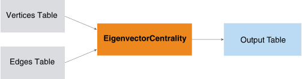
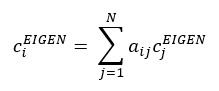
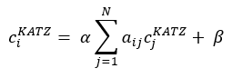
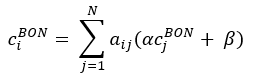
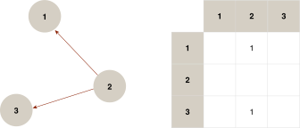
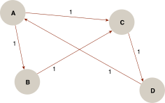

<html><head></head><body>
<h1 class="title topictitle1" id="ariaid-title1">EigenvectorCentrality (ML Engine)</h1>

The EigenvectorCentrality function calculates the <dfn class="term">centrality</dfn> (relative importance) of each node in a graph.

  </img>  

<h2 class="title topictitle2" id="ariaid-title2">Centrality Formulas</h2>

<h3 class="title sectiontitle">Symbols Used in Centrality Formulas</h3>
<table cellpadding="4" cellspacing="0" summary="" id="cee1507756034183__table_v4m_zx5_zdb" class="table" frame="border" border="1" rules="all">

<colgroup span="1"><col style="width:50%" span="1"></col><col style="width:50%" span="1"></col></colgroup><thead class="thead" style="text-align:left;"><tr class="row"><th class="entry cellrowborder" style="vertical-align:top;" id="d383451e70" rowspan="1" colspan="1">Symbol</th><th class="entry cellrowborder" style="vertical-align:top;" id="d383451e72" rowspan="1" colspan="1">Represents</th></tr></thead><tbody class="tbody"><tr class="row"><td class="entry cellrowborder" style="vertical-align:top;" headers="d383451e70" rowspan="1" colspan="1">G</td><td class="entry cellrowborder" style="vertical-align:top;" headers="d383451e72" rowspan="1" colspan="1">Graph</td></tr><tr class="row"><td class="entry cellrowborder" style="vertical-align:top;" headers="d383451e70" rowspan="1" colspan="1">V</td><td class="entry cellrowborder" style="vertical-align:top;" headers="d383451e72" rowspan="1" colspan="1">Vertex</td></tr><tr class="row"><td class="entry cellrowborder" style="vertical-align:top;" headers="d383451e70" rowspan="1" colspan="1">N</td><td class="entry cellrowborder" style="vertical-align:top;" headers="d383451e72" rowspan="1" colspan="1">Number of vertices</td></tr><tr class="row"><td class="entry cellrowborder" style="vertical-align:top;" headers="d383451e70" rowspan="1" colspan="1">A</td><td class="entry cellrowborder" style="vertical-align:top;" headers="d383451e72" rowspan="1" colspan="1">Adjacency matrix of vertices</td></tr><tr class="row"><td class="entry cellrowborder" style="vertical-align:top;" headers="d383451e70" rowspan="1" colspan="1"><var class="keyword varname">a</var><var class="keyword varname">ij</var></td><td class="entry cellrowborder" style="vertical-align:top;" headers="d383451e72" rowspan="1" colspan="1">Element in matrix that represents relationship between vertex <var class="keyword varname">i</var> and vertex <var class="keyword varname">j</var></td></tr><tr class="row"><td class="entry cellrowborder" style="vertical-align:top;" headers="d383451e70" rowspan="1" colspan="1"><var class="keyword varname">c</var><var class="keyword varname">i</var></td><td class="entry cellrowborder" style="vertical-align:top;" headers="d383451e72" rowspan="1" colspan="1">Centrality value of vertex <var class="keyword varname">i</var></td></tr></tbody></table>

<h3 class="title sectiontitle">Eigenvector Centrality</h3>

Bonacich (1972) suggests that the eigenvector of the largest eigenvalue of an adjacency matrix could make a good network centrality measure. He defines Eigenvector Centrality as:

  </img>  

For more information about this formula, see:

<cite class="cite">Bonacich, P. Factoring and Weighting Approaches to Status Scores and Clique Identification. Journal of Mathematical Sociology 2 (1972), 113-120.</cite>

<h3 class="title sectiontitle">Katz Centrality</h3>

Katz (1953) gives a measure of centrality as:

  </img>  

For more information about this formula, see:

<cite class="cite">Katz, L. A New Status Index Derived from Sociometric Analysis. Psychometrika 18 (1953), 39-43.</cite>

<h3 class="title sectiontitle">Bonacich Centrality</h3>

Bonacich (1987) writes a more generic centrality measure as:

  </img>  

a and b are exchanged in the above formula (compared to the original one) to be consistent with Katz centrality.

For more information about this formula, see:

<cite class="cite">Bonacich, P. Power and Centrality: A Family of Measures. American Journal of Sociology 92 (1987), 1170-1182.</cite>

<h2 class="title topictitle2" id="ariaid-title3">Eigenvector and Eigenvalue</h2>

An eigenvector of a square matrix <var class="keyword varname">Α</var> is a nonzero vector <var class="keyword varname">υ</var> such that <var class="keyword varname">Αυ</var>=<var class="keyword varname">λυ</var>. The number <var class="keyword varname">λ</var> is called the eigenvalue of <var class="keyword varname">Α</var> corresponding to <var class="keyword varname">υ</var>.

The eigenvalues of a matrix <var class="keyword varname">Α</var> can be determined by finding the roots of the characteristic polynomial of equation det(<var class="keyword varname">Α</var>−<var class="keyword varname">λI</var>) = 0.

<h2 class="title topictitle2" id="ariaid-title4">Power Iteration</h2>

<dfn class="term">Power iteration</dfn> is an eigenvalue algorithm to find the largest eigenvalue and corresponding eigenvector. This algorithm does not compute a matrix decomposition; therefore, you can use it when <var class="keyword varname">Α</var> is a very large sparse matrix.

The power iteration algorithm starts with a vector <var class="keyword varname">b</var>0, which can be an approximation to the dominant eigenvector or a random vector. This iteration describes the method:

<var class="keyword varname">b</var><var class="keyword varname">k</var>+1 = <var class="keyword varname">A</var><var class="keyword varname">b</var><var class="keyword varname">k</var> / || <var class="keyword varname">A</var><var class="keyword varname">b</var><var class="keyword varname">k</var> ||

At every iteration, the vector <var class="keyword varname">b</var><var class="keyword varname">k</var> is multiplied by matrix <var class="keyword varname">Α</var> and normalized.

The sequence (<var class="keyword varname">b</var><var class="keyword varname">k</var>) does not necessarily converge. A subsequence of (<var class="keyword varname">b</var><var class="keyword varname">k</var>) converges to an eigenvector associated with the dominant eigenvalue under these conditions:

<ul class="ul">
<li class="li"><var class="keyword varname">A</var> has an eigenvalue that is strictly greater in magnitude than its other eigenvalues.</li>
<li class="li">Starting vector <var class="keyword varname">b</var>0 has a nonzero component in the direction of an eigenvector associated with the dominant eigenvalue.</li></ul>

<h2 class="title topictitle2" id="ariaid-title5">Centrality Calculation</h2>

To calculate centrality using the formulas described in <a href="wja1549572584167.md#cee1507756034183">Centrality Formulas</a>, the EigenvectorCentrality function uses an in-neighbors relation matrix of the input source key and target key. In this matrix, aij has the value 1 if there is an edge from j to i.

In-Neighbors Relation Matrix
  </img>  

If you need an out-neighbors adjacent matrix—for example, to calculate the
                contribution of a vertex to other vertices—exchange the source key and target key
                columns and then invoke this function.

<h2 class="title topictitle2" id="ariaid-title6">EigenvectorCentrality Syntax</h2>

<h3 class="title sectiontitle">Version 1.4</h3><pre class="pre codeblock" xml:space="preserve"><code>SELECT * FROM EigenvectorCentrality (
  ON <var class="keyword varname">vertices_table</var> AS Vertices PARTITION BY <var class="keyword varname">vertex_key_column</var> [,...] 
  ON <var class="keyword varname">edges_table</var> AS Edges PARTITION BY <var class="keyword varname">source_vertex_key_column</var> [,...]
  USING
  TargetKey ({ '<var class="keyword varname">edge_attribute</var>' | <var class="keyword varname">edge_attribute_range</var> }[,...])
  [ EdgeWeight (<var class="keyword varname">edge_weight</var>) ]
  [ Family ({ 'eigenvector' | 'katz' | 'bonacich' }) ]
  [ Alpha (<var class="keyword varname">alpha_value</var>) ]
  [ Beta (<var class="keyword varname">beta_value</var>) ]
  [ Directed (<b>{'true'|'t'|'yes'|'y'|'1'|'false'|'f'|'no'|'n'|'0'}</b>) ]
  [ MaxIterNum (<var class="keyword varname">max_iteration_number</var>) ]
  [ StopThreshold (<var class="keyword varname">threshold</var>) ]
  <code class="ph codeph">[ Accumulate ({ '<var class="keyword varname">accumulate_column</var>' | <var class="keyword varname">accumulate_column_range</var> }[,...]) ]</code>
) AS <var class="keyword varname">alias</var>;</code></pre>

<b>Related Information</b>

<ul class="linklist linklist relinfo">
<a href="ndv1557782188375.md">Column Specification Syntax Elements</a>
</ul>

<h2 class="title topictitle2" id="ariaid-title7">EigenvectorCentrality Syntax Elements</h2>

<dl class="dl parml"><dt class="dt pt dlterm">TargetKey</dt><dd class="dd pd">Specify the names of the target key columns in the Edges table. The number and data types of columns must correspond to those of <var class="keyword varname">vertex_key</var>.</dd><dt class="dt pt dlterm">EdgeWeight</dt><dd class="dd pd">[Optional] Specify the name of the Edges table column that contains the edge weights. The edge weights must be positive values.</dd><dd class="dd pd ddexpand">Default behavior: The graph is unweighted.</dd><dt class="dt pt dlterm">Family</dt><dd class="dd pd">[Optional] Specify the centrality formula:
<ul class="ul" id="uzl1507757786903__ul_wsp_pd1_2z">
<li class="li"><code class="ph codeph">'eigenvector'</code> (Default)</li>
<li class="li"><code class="ph codeph">'katz'</code></li>
<li class="li"><code class="ph codeph">'bonacich'</code></li></ul>

For descriptions of the centrality formulas, see <a href="wja1549572584167.md#cee1507756034183">Centrality Formulas</a>.
</dd><dt class="dt pt dlterm">Alpha</dt><dd class="dd pd">[Optional] Specify the alpha value for the Katz or Bonacich centrality formula.</dd><dd class="dd pd ddexpand">Default: 0.85</dd><dt class="dt pt dlterm">Beta</dt><dd class="dd pd">[Optional] Specify the beta value for the Katz or Bonacich centrality formula.</dd><dd class="dd pd ddexpand">Default: 1 for Katz and 0 for Bonacich</dd><dt class="dt pt dlterm">Directed</dt><dd class="dd pd">[Optional] Specify whether the graph is directed.</dd><dd class="dd pd ddexpand">Default: 'true'</dd><dt class="dt pt dlterm">MaxIterNum</dt><dd class="dd pd">[Optional] Specify the maximum number of iterations for the function.</dd><dd class="dd pd ddexpand">Default: 20</dd><dt class="dt pt dlterm">StopThreshold</dt><dd class="dd pd">[Optional] Specify the threshold for convergence (the difference of between <var class="keyword varname">b</var>k+1 and <var class="keyword varname">b</var>k).</dd><dd class="dd pd ddexpand">Default: 0.001</dd><dt class="dt pt dlterm">Accumulate</dt><dd class="dd pd">[Optional] Specify the names of the Vertices columns to copy to the output table.</dd></dl>

<h2 class="title topictitle2" id="ariaid-title8">EigenvectorCentrality Input</h2>

<h3 class="title sectiontitle">Vertices Schema</h3>

Each row represents a vertex of the graph. The table can have additional columns, but the function ignores them.

<table cellpadding="4" cellspacing="0" summary="" id="tsk1507758437102__table_N10017_N1000E_N1000C_N10001" class="table" frame="border" border="1" rules="all">

<colgroup span="1"><col style="width:23.076923076923077%" span="1"></col><col style="width:15.384615384615385%" span="1"></col><col style="width:61.53846153846154%" span="1"></col></colgroup><thead class="thead" style="text-align:left;"><tr class="row"><th class="entry nocellnorowborder" style="vertical-align:top;" id="d383451e591" rowspan="1" colspan="1">Column</th><th class="entry nocellnorowborder" style="vertical-align:top;" id="d383451e593" rowspan="1" colspan="1">Data Type</th><th class="entry cell-norowborder" style="vertical-align:top;" id="d383451e595" rowspan="1" colspan="1">Description</th></tr></thead><tbody class="tbody"><tr class="row"><td class="entry nocellnorowborder" style="vertical-align:top;" headers="d383451e591" rowspan="1" colspan="1"><var class="keyword varname">vertex_key_column</var></td><td class="entry nocellnorowborder" style="vertical-align:top;" headers="d383451e593" rowspan="1" colspan="1">Any allowed in PARTITION BY clause</td><td class="entry cell-norowborder" style="vertical-align:top;" headers="d383451e595" rowspan="1" colspan="1">[Column appears once for each specified <var class="keyword varname">vertex_key_column</var>.] All or part of unique vertex key. Cannot be NULL.</td></tr><tr class="row"><td class="entry row-nocellborder" style="vertical-align:top;" headers="d383451e591" rowspan="1" colspan="1"><var class="keyword varname">accumulate_column</var></td><td class="entry row-nocellborder" style="vertical-align:top;" headers="d383451e593" rowspan="1" colspan="1">Any</td><td class="entry cellrowborder" style="vertical-align:top;" headers="d383451e595" rowspan="1" colspan="1">[Column appears once for each specified <var class="keyword varname">accumulate_column</var>.] Column to copy to output table.</td></tr></tbody></table>

<h3 class="title sectiontitle">Edges Schema</h3>

Each row represents an edge of the graph. The table can have additional columns, but the function ignores them.

<table cellpadding="4" cellspacing="0" summary="" id="tsk1507758437102__table_N1005D_N1000E_N1000C_N10001" class="table" frame="border" border="1" rules="all">

<colgroup span="1"><col style="width:33.33333333333333%" span="1"></col><col style="width:33.33333333333333%" span="1"></col><col style="width:33.33333333333333%" span="1"></col></colgroup><thead class="thead" style="text-align:left;"><tr class="row"><th class="entry nocellnorowborder" style="vertical-align:top;" id="d383451e636" rowspan="1" colspan="1">Column</th><th class="entry nocellnorowborder" style="vertical-align:top;" id="d383451e638" rowspan="1" colspan="1">Data Type</th><th class="entry cell-norowborder" style="vertical-align:top;" id="d383451e640" rowspan="1" colspan="1">Description</th></tr></thead><tbody class="tbody"><tr class="row"><td class="entry nocellnorowborder" style="vertical-align:top;" headers="d383451e636" rowspan="1" colspan="1"><var class="keyword varname">source_vertex_key_column</var></td><td class="entry nocellnorowborder" style="vertical-align:top;" headers="d383451e638" rowspan="1" colspan="1">Any allowed in PARTITION BY clause</td><td class="entry cell-norowborder" style="vertical-align:top;" headers="d383451e640" rowspan="1" colspan="1">Column appears once for each specified <var class="keyword varname">source_vertex_key_column</var>.] All or part of key that identifies source vertex of edge. Must be a <var class="keyword varname">vertex_key_column</var> in Vertices table. Cannot be NULL.</td></tr><tr class="row"><td class="entry nocellnorowborder" style="vertical-align:top;" headers="d383451e636" rowspan="1" colspan="1"><var class="keyword varname">target_vertex_key_column</var></td><td class="entry nocellnorowborder" style="vertical-align:top;" headers="d383451e638" rowspan="1" colspan="1">Same as <var class="keyword varname">source_vertex_key_column</var></td><td class="entry cell-norowborder" style="vertical-align:top;" headers="d383451e640" rowspan="1" colspan="1">Column appears once for each specified <var class="keyword varname">target_vertex_key_column</var>.] All or part of key that identifies target vertex of edge. Must be a <var class="keyword varname">vertex_key_column</var> in Vertices table. Cannot be NULL.</td></tr><tr class="row"><td class="entry nocellnorowborder" style="vertical-align:top;" headers="d383451e636" rowspan="1" colspan="1"><var class="keyword varname">edge_weight</var></td><td class="entry nocellnorowborder" style="vertical-align:top;" headers="d383451e638" rowspan="1" colspan="1">SMALLINT, INTEGER, or NUMERIC</td><td class="entry cell-norowborder" style="vertical-align:top;" headers="d383451e640" rowspan="1" colspan="1">[Required only for weighted graph.] Edge weight, a positive value. Can be NULL.</td></tr><tr class="row"><td class="entry row-nocellborder" style="vertical-align:top;" headers="d383451e636" rowspan="1" colspan="1"><var class="keyword varname">accumulate_column</var></td><td class="entry row-nocellborder" style="vertical-align:top;" headers="d383451e638" rowspan="1" colspan="1">Any</td><td class="entry cellrowborder" style="vertical-align:top;" headers="d383451e640" rowspan="1" colspan="1">[Column appears once for each specified <var class="keyword varname">accumulate_column</var>.] Column to copy to output table.</td></tr></tbody></table>

<h2 class="title topictitle2" id="ariaid-title9">EigenvectorCentrality Output</h2>

<h3 class="title sectiontitle">Output Table Schema</h3>
<table cellpadding="4" cellspacing="0" summary="" id="ubz1507758574933__table_N1000E_N1000C_N10001" class="table" frame="border" border="1" rules="all">

<colgroup span="1"><col style="width:25%" span="1"></col><col style="width:25%" span="1"></col><col style="width:50%" span="1"></col></colgroup><thead class="thead" style="text-align:left;"><tr class="row"><th class="entry nocellnorowborder" style="vertical-align:top;" id="d383451e713" rowspan="1" colspan="1">Column</th><th class="entry nocellnorowborder" style="vertical-align:top;" id="d383451e715" rowspan="1" colspan="1">Data Type</th><th class="entry cell-norowborder" style="vertical-align:top;" id="d383451e717" rowspan="1" colspan="1">Description</th></tr></thead><tbody class="tbody"><tr class="row"><td class="entry nocellnorowborder" style="vertical-align:top;" headers="d383451e713" rowspan="1" colspan="1"><var class="keyword varname">accumulate_column</var></td><td class="entry nocellnorowborder" style="vertical-align:top;" headers="d383451e715" rowspan="1" colspan="1">Same as in Input table</td><td class="entry cell-norowborder" style="vertical-align:top;" headers="d383451e717" rowspan="1" colspan="1">[Column appears once for each specified <var class="keyword varname">accumulate_column</var>.] Column copied from input table.</td></tr><tr class="row"><td class="entry row-nocellborder" style="vertical-align:top;" headers="d383451e713" rowspan="1" colspan="1">centrality value</td><td class="entry row-nocellborder" style="vertical-align:top;" headers="d383451e715" rowspan="1" colspan="1">DOUBLE PRECISION</td><td class="entry cellrowborder" style="vertical-align:top;" headers="d383451e717" rowspan="1" colspan="1">Centrality value (relative importance) of node.</td></tr></tbody></table>

<h2 class="title topictitle2" id="ariaid-title10">EigenvectorCentrality Examples</h2>

<h3 class="title topictitle3" id="ariaid-title11">EigenvectorCentrality Example: Eigenvector Centrality</h3>

<h4 class="title sectiontitle">Input</h4>

In the following figure, nodes represent college sophomores and edges represent the number of elective subjects that both sophomores have taken.

EigenvectorCentrality Examples Input Graph
  </img>  

The graph in the figure is represented by the Vertices and Edges tables sophomores and common_classes, respectively.

<table cellpadding="4" cellspacing="0" summary="" id="pzb1526061780466__table_r3x_sjr_t2b" class="table" frame="border" border="1" rules="all">
Vertices: sophomores
<colgroup span="1"><col style="width:50%" span="1"></col><col style="width:50%" span="1"></col></colgroup><thead class="thead" style="text-align:left;"><tr class="row"><th class="entry cellrowborder" style="vertical-align:top;" id="d383451e795" rowspan="1" colspan="1">id</th><th class="entry cellrowborder" style="vertical-align:top;" id="d383451e797" rowspan="1" colspan="1">name</th></tr></thead><tbody class="tbody"><tr class="row"><td class="entry cellrowborder" style="vertical-align:top;" headers="d383451e795" rowspan="1" colspan="1">A</td><td class="entry cellrowborder" style="vertical-align:top;" headers="d383451e797" rowspan="1" colspan="1">Allen</td></tr><tr class="row"><td class="entry cellrowborder" style="vertical-align:top;" headers="d383451e795" rowspan="1" colspan="1">B</td><td class="entry cellrowborder" style="vertical-align:top;" headers="d383451e797" rowspan="1" colspan="1">Becky</td></tr><tr class="row"><td class="entry cellrowborder" style="vertical-align:top;" headers="d383451e795" rowspan="1" colspan="1">C</td><td class="entry cellrowborder" style="vertical-align:top;" headers="d383451e797" rowspan="1" colspan="1">Cathy</td></tr><tr class="row"><td class="entry cellrowborder" style="vertical-align:top;" headers="d383451e795" rowspan="1" colspan="1">D</td><td class="entry cellrowborder" style="vertical-align:top;" headers="d383451e797" rowspan="1" colspan="1">Darren</td></tr></tbody></table>

<table cellpadding="4" cellspacing="0" summary="" id="pzb1526061780466__table_qd5_vjr_t2b" class="table" frame="border" border="1" rules="all">
Edges: common_classes
<colgroup span="1"><col style="width:33.33333333333333%" span="1"></col><col style="width:33.33333333333333%" span="1"></col><col style="width:33.33333333333333%" span="1"></col></colgroup><thead class="thead" style="text-align:left;"><tr class="row"><th class="entry cellrowborder" style="vertical-align:top;" id="d383451e829" rowspan="1" colspan="1">startid</th><th class="entry cellrowborder" style="vertical-align:top;" id="d383451e831" rowspan="1" colspan="1">endid</th><th class="entry cellrowborder" style="vertical-align:top;" id="d383451e833" rowspan="1" colspan="1">electives</th></tr></thead><tbody class="tbody"><tr class="row"><td class="entry cellrowborder" style="vertical-align:top;" headers="d383451e829" rowspan="1" colspan="1">A</td><td class="entry cellrowborder" style="vertical-align:top;" headers="d383451e831" rowspan="1" colspan="1">B</td><td class="entry cellrowborder" style="vertical-align:top;" headers="d383451e833" rowspan="1" colspan="1">1</td></tr><tr class="row"><td class="entry cellrowborder" style="vertical-align:top;" headers="d383451e829" rowspan="1" colspan="1">A</td><td class="entry cellrowborder" style="vertical-align:top;" headers="d383451e831" rowspan="1" colspan="1">C</td><td class="entry cellrowborder" style="vertical-align:top;" headers="d383451e833" rowspan="1" colspan="1">1</td></tr><tr class="row"><td class="entry cellrowborder" style="vertical-align:top;" headers="d383451e829" rowspan="1" colspan="1">B</td><td class="entry cellrowborder" style="vertical-align:top;" headers="d383451e831" rowspan="1" colspan="1">C</td><td class="entry cellrowborder" style="vertical-align:top;" headers="d383451e833" rowspan="1" colspan="1">1</td></tr><tr class="row"><td class="entry cellrowborder" style="vertical-align:top;" headers="d383451e829" rowspan="1" colspan="1">C</td><td class="entry cellrowborder" style="vertical-align:top;" headers="d383451e831" rowspan="1" colspan="1">D</td><td class="entry cellrowborder" style="vertical-align:top;" headers="d383451e833" rowspan="1" colspan="1">1</td></tr><tr class="row"><td class="entry cellrowborder" style="vertical-align:top;" headers="d383451e829" rowspan="1" colspan="1">D</td><td class="entry cellrowborder" style="vertical-align:top;" headers="d383451e831" rowspan="1" colspan="1">A</td><td class="entry cellrowborder" style="vertical-align:top;" headers="d383451e833" rowspan="1" colspan="1">1</td></tr></tbody></table>

<h4 class="title sectiontitle">SQL Call</h4>

Family is 'eigenVector' by default.
<pre class="pre codeblock" xml:space="preserve"><code>SELECT * FROM EigenvectorCentrality (
  ON sophomores AS Vertices PARTITION BY id
  ON common_classes AS Edges PARTITION BY startid
  USING
  TargetKey ('endid')
  Accumulate ('id')
  EdgeWeight ('electives')
) AS dt ORDER BY centrality DESC;</code></pre>

<h4 class="title sectiontitle">Output</h4><pre class="pre screen" xml:space="preserve"> id centrality          
 -- ------------------- 
 c   0.6494505502390958
 b  0.35224436623137406
 d   0.5283665493470611
 a  0.41829018489975667</pre>

Download a zip file of all examples and a SQL script file that creates their input tables from the attachment in the left sidebar.

<h3 class="title topictitle3" id="ariaid-title12">EigenvectorCentrality Example: Katz Centrality</h3>

<h4 class="title sectiontitle">Input</h4>

Both input tables are from <a href="wja1549572584167.md#pzb1526061780466">EigenvectorCentrality Example: Eigenvector Centrality</a>:

<ul class="ul" id="meo1526061820644__ul_gdb_dkr_t2b">
<li class="li">Vertices: sophomores</li>
<li class="li">Edges: common_classes</li></ul>

<h4 class="title sectiontitle">SQL Call</h4><pre class="pre codeblock" xml:space="preserve"><code>SELECT * FROM EigenvectorCentrality (
  ON sophomores AS Vertices PARTITION BY id
  ON common_classes AS Edges PARTITION BY startid
  USING
  TargetKey ('endid')
  Accumulate ('id','name')
  Family ('katz')
  EdgeWeight ('electives')
) AS dt;</code></pre>

<h4 class="title sectiontitle">Output</h4><pre class="pre screen" xml:space="preserve"> id name   centrality          
 -- ------ ------------------- 
 d  darren  0.5071260939364596
 a  allen   0.4413130299990051
 b  becky  0.38537192565216905
 c  cathy   0.6321031666753343</pre>

Download a zip file of all examples and a SQL script file that creates their input tables from the attachment in the left sidebar.

<h3 class="title topictitle3" id="ariaid-title13">EigenvectorCentrality Example: Bonacich Centrality</h3>

<h4 class="title sectiontitle">Input</h4>

Input tables are from <a href="wja1549572584167.md#pzb1526061780466">EigenvectorCentrality Example: Eigenvector Centrality</a>:

<ul class="ul" id="mxz1526061852037__ul_gdb_dkr_t2b">
<li class="li">Vertices: sophomores</li>
<li class="li">Edges: common_classes</li></ul>

<h4 class="title sectiontitle">SQL Call</h4><pre class="pre codeblock" xml:space="preserve"><code>SELECT * FROM EigenvectorCentrality (
  ON sophomores AS Vertices PARTITION BY id
  ON common_classes AS Edges PARTITION BY startid
  USING
  TargetKey ('endid')
  Accumulate ('id')
  Family ('bonacich')
  Beta (0.01)
  EdgeWeight ('electives')
) AS dt ORDER BY centrality DESC;</code></pre>

<h4 class="title sectiontitle">Output</h4><pre class="pre screen" xml:space="preserve"> id centrality          
 -- ------------------- 
 b  0.34869952073313154
 a   0.4451290264684832
 c   0.6321231958668254
 d    0.529800961949689</pre>

Download a zip file of all examples and a SQL script file that creates their input tables from the attachment in the left sidebar.

</body></html>
