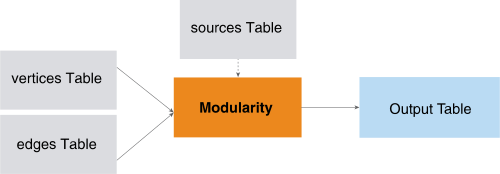
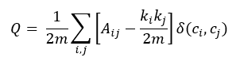
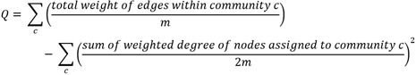
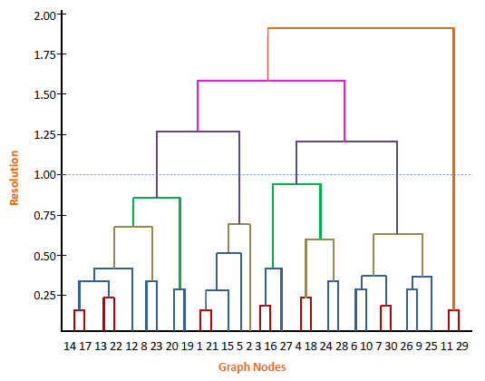

<html><head></head><body>
<h1 class="title topictitle1" id="ariaid-title1">Modularity (ML Engine)</h1>

The Modularity function uses a clustering algorithm to detect communities
			in networks (graphs).The function needs no prior knowledge or estimation of starting
			cluster centers and assumes no particular data distribution of the input data set.

  </img>  

<h2 class="title topictitle2" id="ariaid-title2">Modularity Background</h2>

Community detection and identification is important for understanding network dynamics. In this context, a <dfn class="term">community</dfn> (also called a <dfn class="term">module</dfn>, <dfn class="term">group</dfn>, or <dfn class="term">cluster</dfn>) refers to a subset of a network consisting of nodes that are more highly interconnected with each other than they are with nodes that are not part of the community. Identifying these communities can be valuable in many different network analysis problems. For example, diffusion of information or disease is faster within a densely connected social community than within a more loosely connected group.

<dfn class="term">Modularity</dfn> is a measure of the quality of a division of a network into communities, or modules. It is defined by the following equation, which compares the density of links within communities to the density of links between communities. Modularity is a numeric value between 1 and -1, with values closer to 1 indicating better community formation (that is, a division of the network with dense within-community connections and sparse between-community connections).

<b>ML Engine</b> Modularity function is based on the algorithm described in the paper <cite class="cite">Fast unfolding of communities in large networks; VD Blondel, JL Guillaume, R Lambiotte, E Lefebvre; Journal of Statistical Mechanics: Theory and Experiment, Volume 2008, October 2008</cite>.

<h3 class="title sectiontitle">Modularity Equation</h3>

</img>

In the modularity equation:
<ul class="ul" id="sdb1507756361002__ul_zn3_gtd_gz">
<li class="li"><var class="keyword varname">A</var><var class="keyword varname">ij</var> is the weight of the edge between nodes <var class="keyword varname">i</var> and <var class="keyword varname">j</var>.</li>
<li class="li"><var class="keyword varname">k</var><var class="keyword varname">i</var> is the sum of the weights of the edges of node <var class="keyword varname">i</var>.</li>
<li class="li"><var class="keyword varname">m</var> is the total weight of all edges in the network. For an unweighted network, the weight of each edge is 1.</li>
<li class="li"><var class="keyword varname">δ</var>(<var class="keyword varname">c</var><var class="keyword varname">i</var>,<var class="keyword varname">c</var><var class="keyword varname">j</var>) is 1 when nodes <var class="keyword varname">i</var> and <var class="keyword varname">j</var> are in the same community, and 0 otherwise.</li></ul>

This modularity equation is equivalent to the preceding one:

</img>

<h3 class="title sectiontitle">Use Cases</h3>
<table cellpadding="4" cellspacing="0" summary="" id="sdb1507756361002__table_g4t_r22_gz" class="table" frame="border" border="1" rules="all">

<colgroup span="1"><col style="width:40%" span="1"></col><col style="width:60%" span="1"></col></colgroup><thead class="thead" style="text-align:left;"><tr class="row"><th class="entry cellrowborder" style="vertical-align:top;" id="d93182e159" rowspan="1" colspan="1">Field</th><th class="entry cellrowborder" style="vertical-align:top;" id="d93182e161" rowspan="1" colspan="1">What Modularity Analysis Identifies</th></tr></thead><tbody class="tbody"><tr class="row"><td class="entry cellrowborder" style="vertical-align:top;" headers="d93182e159" rowspan="1" colspan="1">Social network analysis</td><td class="entry cellrowborder" style="vertical-align:top;" headers="d93182e161" rowspan="1" colspan="1">
<ul class="ul" id="sdb1507756361002__ul_wvv_3g2_gz">
<li class="li">Communities of acquaintances</li>
<li class="li">Circles of influence</li></ul></td></tr><tr class="row"><td class="entry cellrowborder" style="vertical-align:top;" headers="d93182e159" rowspan="1" colspan="1">Telecom</td><td class="entry cellrowborder" style="vertical-align:top;" headers="d93182e161" rowspan="1" colspan="1">
<ul class="ul" id="sdb1507756361002__ul_d2z_5g2_gz">
<li class="li">Groups of customers where most communications happen within the group</li></ul></td></tr><tr class="row"><td class="entry cellrowborder" style="vertical-align:top;" headers="d93182e159" rowspan="1" colspan="1">Banking and finance</td><td class="entry cellrowborder" style="vertical-align:top;" headers="d93182e161" rowspan="1" colspan="1">
<ul class="ul" id="sdb1507756361002__ul_jrp_nf2_gz">
<li class="li">Business relationships, such as supply chains or capital chains</li>
<li class="li">Potentially fraudulent transactions or communications</li></ul></td></tr><tr class="row"><td class="entry cellrowborder" style="vertical-align:top;" headers="d93182e159" rowspan="1" colspan="1">Web site optimization</td><td class="entry cellrowborder" style="vertical-align:top;" headers="d93182e161" rowspan="1" colspan="1">
<ul class="ul" id="sdb1507756361002__ul_gph_rf2_gz">
<li class="li">Pages with similar subjects</li>
<li class="li">Pages likely to be accessed in the same session</li></ul></td></tr><tr class="row"><td class="entry cellrowborder" style="vertical-align:top;" headers="d93182e159" rowspan="1" colspan="1">Retail</td><td class="entry cellrowborder" style="vertical-align:top;" headers="d93182e161" rowspan="1" colspan="1">
<ul class="ul" id="sdb1507756361002__ul_qrl_vg2_gz">
<li class="li">Target customers for specific products</li>
<li class="li">Product recommendations for specific customers</li>
<li class="li">Products that are becoming more or less popular (forecasting)</li></ul></td></tr><tr class="row"><td class="entry cellrowborder" style="vertical-align:top;" headers="d93182e159" rowspan="1" colspan="1">Public health</td><td class="entry cellrowborder" style="vertical-align:top;" headers="d93182e161" rowspan="1" colspan="1">
<ul class="ul" id="sdb1507756361002__ul_fs4_vg2_gz">
<li class="li">People who may be at risk for a disease or condition</li></ul></td></tr><tr class="row"><td class="entry cellrowborder" style="vertical-align:top;" headers="d93182e159" rowspan="1" colspan="1">Computer network security</td><td class="entry cellrowborder" style="vertical-align:top;" headers="d93182e161" rowspan="1" colspan="1">
<ul class="ul" id="sdb1507756361002__ul_vcw_vg2_gz">
<li class="li">Systems at risk for a virus or malware attack</li></ul></td></tr></tbody></table>

<h2 class="title topictitle2" id="ariaid-title3">Resolution</h2>

Resolution controls the hierarchical-level information about community formation. It represents the level in a dendrogram at which to converge for the number of communities to detect. Think of different resolution points as different hierarchical levels in a tree of nodes interconnected through an edge table.

Here are two ways to think of resolution:

<table cellpadding="4" cellspacing="0" summary="" id="pwb1507756421710__table_gvk_nl2_3y" class="table" frame="border" border="1" rules="all">

<colgroup span="1"><col style="width:50%" span="1"></col><col style="width:50%" span="1"></col></colgroup><thead class="thead" style="text-align:left;"><tr class="row"><th class="entry cellrowborder" style="vertical-align:top;" id="d93182e243" rowspan="1" colspan="1">Higher Resolution (> 1.0)</th><th class="entry cellrowborder" style="vertical-align:top;" id="d93182e245" rowspan="1" colspan="1">Lower Resolution</th></tr></thead><tbody class="tbody"><tr class="row"><td class="entry cellrowborder" style="vertical-align:top;" headers="d93182e243" rowspan="1" colspan="1">Provides a visualization of the graph nearer the root of the tree.</td><td class="entry cellrowborder" style="vertical-align:top;" headers="d93182e245" rowspan="1" colspan="1">Provides a visualization of the graph nearer the leaves of the tree.</td></tr><tr class="row"><td class="entry cellrowborder" style="vertical-align:top;" headers="d93182e243" rowspan="1" colspan="1">Zooms out , providing fewer, larger communities.</td><td class="entry cellrowborder" style="vertical-align:top;" headers="d93182e245" rowspan="1" colspan="1">Zooms in , providing more, smaller communities.</td></tr></tbody></table>

In the following figure, the x-axis represents the nodes in a sample graph and y-axis represents the community resolution level of the hierarchical tree structure of the graph. For example, at resolution level 0.75, the graph has 7 communities, and at resolution level 1.0, the graph has 5 communities.

Resolution Levels
  </img>  

Resolution is useful for:

<ul class="ul">
<li class="li">Visualizing hierarchical graph structure</li>
<li class="li">Finding the expected number of communities in a graph</li>
<li class="li">Finding the community structure in a graph when some nodes are expected to
                        belong to the same community</li></ul>

For visualizing hierarchical graph structure, the default resolution (1.0) maximizes modularity and is therefore expected to provide the best community structure. Possible exceptions are the second and third preceding use cases, or a graph that includes estimation errors (for example, when edge weights are statistically computed based on behavior similarity among nodes).

For the third use case, an alternative to changing the resolution is to put the nodes that are expected to belong to the same community in one group in the vertices table and specify that group in the CommunityAssociation syntax element.

<h2 class="title topictitle2" id="ariaid-title4">Modularity Syntax</h2>

<h3 class="title sectiontitle">Version 1.6</h3><pre class="pre codeblock" xml:space="preserve"><code>SELECT * FROM Modularity (
  ON { <var class="keyword varname">table</var> | <var class="keyword varname">view</var> | (<var class="keyword varname">query</var>) } AS Vertices PARTITION BY <var class="keyword varname">vertex_key_column</var> [,...] 
  ON { <var class="keyword varname">table</var> | <var class="keyword varname">view</var> | (<var class="keyword varname">query</var>) } AS Edges PARTITION BY <var class="keyword varname">source_vertex_key_column</var> [,...] 
  [ ON { <var class="keyword varname">table</var> | <var class="keyword varname">view</var> | (<var class="keyword varname">query</var>) } AS Sources PARTITION BY <var class="keyword varname">vertex_key_column</var> [,...] ]
  [ OUT TABLE CommunityEdgeTable (<var class="keyword varname">community_edge_table</var>) ]
  USING
  TargetKey ({ '<var class="keyword varname">target_key_column</var>' | <var class="keyword varname">target_key_column_range</var> }[,...])
  [ EdgeWeight (<var class="keyword varname">edge_weight</var>) ]
  [ CommunityAssociation ('<var class="keyword varname">community_id</var>') ]
  [ Resolution (<var class="keyword varname">resolution</var> [,...]) ]
  [ Seed (<var class="keyword varname">seed</var>) ]
  <code class="ph codeph">[ Accumulate ({ '<var class="keyword varname">accumulate_column</var>' | <var class="keyword varname">accumulate_column_range</var> }[,...]) ]</code>
) AS <var class="keyword varname">alias</var>;</code></pre>

<b>Related Information</b>

<ul class="linklist linklist relinfo">
<a href="ndv1557782188375.md">Column Specification Syntax Elements</a>
</ul>

<h2 class="title topictitle2" id="ariaid-title5">Modularity Syntax Elements</h2>

<dl class="dl parml"><dt class="dt pt dlterm">CommunityEdgeTable</dt><dd class="dd pd">[Optional] Specify the name of the table that the function creates to output the weights of the edges between the communities at different resolution levels. If you omit this syntax element, the function does not create this table.</dd><dt class="dt pt dlterm">TargetKey</dt><dd class="dd pd">Specify the key of the target vertex of an edge. The key consists of the names of one or more Edges table columns.</dd><dt class="dt pt dlterm">EdgeWeight</dt><dd class="dd pd">[Optional] Specify the name of the Edges table column that contains edge weights. Each <var class="keyword varname">edge_weight</var> is a positive value.</dd><dd class="dd pd ddexpand">Default behavior: The weight of each edge is 1 (that is, the graph is unweighted).

This syntax element determines how the function treats duplicate edges (that is, edges with the same source and destination, which might have different weights). For a weighted graph, the function treats duplicate edges as a single edge whose weight is the sum of the weights of the duplicate edges. For an unweighted graph, the function uses only one of the duplicate edges.
</dd><dt class="dt pt dlterm">CommunityAssociation</dt><dd class="dd pd">[Optional] Specify the name of the column that represents the community association of the vertices. Use this syntax element if you know some vertex communities.</dd><dt class="dt pt dlterm">Resolution</dt><dd class="dd pd">[Optional] Specify hierarchical-level information for the communities. For details, see <a href="wni1558459753903.md#pwb1507756421710">Resolution</a>. If you specify a list of <var class="keyword varname">resolution</var> values, the function incrementally finds the communities for each value and for the default value.</dd><dd class="dd pd ddexpand">Each <var class="keyword varname">resolution</var> must be a distinct DOUBLE PRECISION value in the range [0.0, 1000000.0]. The value 0.0 puts each node in its own community of size 1. You can specify a maximum of 500 <var class="keyword varname">resolution</var> values.</dd><dd class="dd pd ddexpand">Default: 1.0</dd><dt class="dt pt dlterm">Seed</dt><dd class="dd pd">[Optional] Specify the random seed the algorithm uses for repeatable results. The <var class="keyword varname">seed</var> must be a LONG value greater than or equal to 1. The algorithm multiplies <var class="keyword varname">seed</var> by the hash code of <var class="keyword varname">vertex_key</var> to create a unique seed for each vertex.
<b>Note</b>
 For repeatable results, use both the Seed and UniqueID syntax elements. For more information, see <a href="qym1549987102806.md">Nondeterministic Results and UniqueID Syntax Element</a>.

</dd><dd class="dd pd ddexpand">The function also uses <var class="keyword varname">seed</var> for these purposes:
<ul class="ul" id="cud1507756639473__ul_xmg_dyt_gy">
<li class="li">To break ties between different vertices during community formation</li>
<li class="li">To determine when to stop community formation

If <var class="keyword varname">seed</var> is 1 (default value), community formation continues until the change in modularity score drops below a threshold value. The threshold value is set in the function code; you cannot change it.

If <var class="keyword varname">seed</var> is set to any other value, community formation continues until the change in modularity score between iterations is 0. This deeper analysis of the graph can improve community formation, but can also increase execution time.
</li></ul></dd><dd class="dd pd ddexpand">Default: 1</dd><dt class="dt pt dlterm">Accumulate</dt><dd class="dd pd">[Optional] Specify the names of the Vertices columns to copy to the community Vertices table.</dd><dd class="dd pd ddexpand">Default behavior: The function copies the <var class="keyword varname">vertex_key</var> columns to the output Vertices table for each vertex, changing the column names to <var class="keyword varname">id</var>, <var class="keyword varname">id</var>_1, <var class="keyword varname">id</var>_2, and so on.</dd></dl>

<h2 class="title topictitle2" id="ariaid-title6">Modularity Input</h2>

<table cellpadding="4" cellspacing="0" summary="" id="ztq1507756971124__table_yjx_22r_ycb" class="table" frame="border" border="1" rules="all">

<colgroup span="1"><col style="width:50%" span="1"></col><col style="width:50%" span="1"></col></colgroup><thead class="thead" style="text-align:left;"><tr class="row"><th class="entry cellrowborder" style="vertical-align:top;" id="d93182e570" rowspan="1" colspan="1">Table</th><th class="entry cellrowborder" style="vertical-align:top;" id="d93182e572" rowspan="1" colspan="1">Description</th></tr></thead><tbody class="tbody"><tr class="row"><td class="entry cellrowborder" style="vertical-align:top;" headers="d93182e570" rowspan="1" colspan="1">Vertices</td><td class="entry cellrowborder" style="vertical-align:top;" headers="d93182e572" rowspan="1" colspan="1">Each row represents a vertex of the graph.</td></tr><tr class="row"><td class="entry cellrowborder" style="vertical-align:top;" headers="d93182e570" rowspan="1" colspan="1">Edges</td><td class="entry cellrowborder" style="vertical-align:top;" headers="d93182e572" rowspan="1" colspan="1">Each row represents an edge of the graph.</td></tr><tr class="row"><td class="entry cellrowborder" style="vertical-align:top;" headers="d93182e570" rowspan="1" colspan="1">Sources</td><td class="entry cellrowborder" style="vertical-align:top;" headers="d93182e572" rowspan="1" colspan="1">[Optional] Specifies vertices to use as sources. This table is a subset of the Vertices table. If you specify this table, the function uses only the nodes in this table as sources.</td></tr></tbody></table>

<h3 class="title sectiontitle">Vertices Schema</h3>
<table cellpadding="4" cellspacing="0" summary="" id="ztq1507756971124__table_N10017_N1000E_N1000C_N10001" class="table" frame="border" border="1" rules="all">

<colgroup span="1"><col style="width:33.33333333333333%" span="1"></col><col style="width:33.33333333333333%" span="1"></col><col style="width:33.33333333333333%" span="1"></col></colgroup><thead class="thead" style="text-align:left;"><tr class="row"><th class="entry nocellnorowborder" style="vertical-align:top;" id="d93182e600" rowspan="1" colspan="1">Column</th><th class="entry nocellnorowborder" style="vertical-align:top;" id="d93182e602" rowspan="1" colspan="1">Data Type</th><th class="entry cell-norowborder" style="vertical-align:top;" id="d93182e604" rowspan="1" colspan="1">Description</th></tr></thead><tbody class="tbody"><tr class="row"><td class="entry nocellnorowborder" style="vertical-align:top;" headers="d93182e600" rowspan="1" colspan="1"><var class="keyword varname">vertex_key_column</var></td><td class="entry nocellnorowborder" style="vertical-align:top;" headers="d93182e602" rowspan="1" colspan="1">Any allowed in PARTITION BY clause</td><td class="entry cell-norowborder" style="vertical-align:top;" headers="d93182e604" rowspan="1" colspan="1">[Column appears once for each specified <var class="keyword varname">vertex_key_column</var>.] All or part of unique vertex key. Cannot be NULL.</td></tr><tr class="row"><td class="entry row-nocellborder" style="vertical-align:top;" headers="d93182e600" rowspan="1" colspan="1"><var class="keyword varname">accumulate_column</var></td><td class="entry row-nocellborder" style="vertical-align:top;" headers="d93182e602" rowspan="1" colspan="1">Any</td><td class="entry cellrowborder" style="vertical-align:top;" headers="d93182e604" rowspan="1" colspan="1">[Column appears once for each specified <var class="keyword varname">accumulate_column</var>.] Column to copy to community Vertices table.</td></tr></tbody></table>

<h3 class="title sectiontitle">Edges Schema</h3>
<table cellpadding="4" cellspacing="0" summary="" id="ztq1507756971124__table_N1005A_N1000E_N1000C_N10001" class="table" frame="border" border="1" rules="all">

<colgroup span="1"><col style="width:33.33333333333333%" span="1"></col><col style="width:33.33333333333333%" span="1"></col><col style="width:33.33333333333333%" span="1"></col></colgroup><thead class="thead" style="text-align:left;"><tr class="row"><th class="entry nocellnorowborder" style="vertical-align:top;" id="d93182e639" rowspan="1" colspan="1">Column</th><th class="entry nocellnorowborder" style="vertical-align:top;" id="d93182e641" rowspan="1" colspan="1">Data Type</th><th class="entry cell-norowborder" style="vertical-align:top;" id="d93182e643" rowspan="1" colspan="1">Description</th></tr></thead><tbody class="tbody"><tr class="row"><td class="entry nocellnorowborder" style="vertical-align:top;" headers="d93182e639" rowspan="1" colspan="1"><var class="keyword varname">source_vertex_key_column</var></td><td class="entry nocellnorowborder" style="vertical-align:top;" headers="d93182e641" rowspan="1" colspan="1">Any allowed in PARTITION BY clause</td><td class="entry cell-norowborder" style="vertical-align:top;" headers="d93182e643" rowspan="1" colspan="1">Column appears once for each specified <var class="keyword varname">source_vertex_key_column</var>.] All or part of key that identifies source vertex of edge. Must be a <var class="keyword varname">vertex_key_column</var> in Vertices table. Cannot be NULL.</td></tr><tr class="row"><td class="entry nocellnorowborder" style="vertical-align:top;" headers="d93182e639" rowspan="1" colspan="1"><var class="keyword varname">target_key_column</var></td><td class="entry nocellnorowborder" style="vertical-align:top;" headers="d93182e641" rowspan="1" colspan="1">Same as <var class="keyword varname">source_vertex_key_column</var></td><td class="entry cell-norowborder" style="vertical-align:top;" headers="d93182e643" rowspan="1" colspan="1">Column appears once for each specified <var class="keyword varname">target_key_column</var>.] All or part of key that identifies target vertex of edge. Must be a <var class="keyword varname">vertex_key_column</var> in Vertices table. Can be NULL.</td></tr><tr class="row"><td class="entry row-nocellborder" style="vertical-align:top;" headers="d93182e639" rowspan="1" colspan="1"><var class="keyword varname">edge_weight</var></td><td class="entry row-nocellborder" style="vertical-align:top;" headers="d93182e641" rowspan="1" colspan="1">SMALLINT, INTEGER, or NUMERIC</td><td class="entry cellrowborder" style="vertical-align:top;" headers="d93182e643" rowspan="1" colspan="1">[Required only for weighted graph.] Edge weight, a positive value. Can be NULL.</td></tr></tbody></table>

<h3 class="title sectiontitle">Sources Schema</h3>
<table cellpadding="4" cellspacing="0" summary="" id="ztq1507756971124__table_N100AB_N1000E_N1000C_N10001" class="table" frame="border" border="1" rules="all">

<colgroup span="1"><col style="width:33.33333333333333%" span="1"></col><col style="width:33.33333333333333%" span="1"></col><col style="width:33.33333333333333%" span="1"></col></colgroup><thead class="thead" style="text-align:left;"><tr class="row"><th class="entry nocellnorowborder" style="vertical-align:top;" id="d93182e694" rowspan="1" colspan="1">Column</th><th class="entry nocellnorowborder" style="vertical-align:top;" id="d93182e696" rowspan="1" colspan="1">Data Type</th><th class="entry cell-norowborder" style="vertical-align:top;" id="d93182e698" rowspan="1" colspan="1">Description</th></tr></thead><tbody class="tbody"><tr class="row"><td class="entry row-nocellborder" style="vertical-align:top;" headers="d93182e694" rowspan="1" colspan="1"><var class="keyword varname">source_vertex_key_column</var></td><td class="entry row-nocellborder" style="vertical-align:top;" headers="d93182e696" rowspan="1" colspan="1">Same as corresponding <var class="keyword varname">vertex_key_column</var> in Vertices table</td><td class="entry cellrowborder" style="vertical-align:top;" headers="d93182e698" rowspan="1" colspan="1">Column appears once for each specified <var class="keyword varname">source_vertex_key_column</var>.] All or part of key that identifies source vertex of edge. Must be a <var class="keyword varname">vertex_key_column</var> in Vertices table. Cannot be NULL.</td></tr></tbody></table>

<h2 class="title topictitle2" id="ariaid-title7">Modularity Output</h2>

<table cellpadding="4" cellspacing="0" summary="" id="gbx1507756906685__table_wz3_cdr_ycb" class="table" frame="border" border="1" rules="all">

<colgroup span="1"><col style="width:50%" span="1"></col><col style="width:50%" span="1"></col></colgroup><thead class="thead" style="text-align:left;"><tr class="row"><th class="entry cellrowborder" style="vertical-align:top;" id="d93182e734" rowspan="1" colspan="1">Table</th><th class="entry cellrowborder" style="vertical-align:top;" id="d93182e736" rowspan="1" colspan="1">Description</th></tr></thead><tbody class="tbody"><tr class="row"><td class="entry cellrowborder" style="vertical-align:top;" headers="d93182e734" rowspan="1" colspan="1">Community vertex table</td><td class="entry cellrowborder" style="vertical-align:top;" headers="d93182e736" rowspan="1" colspan="1">Has a row of modularity results for each specified resolution level.</td></tr><tr class="row"><td class="entry cellrowborder" style="vertical-align:top;" headers="d93182e734" rowspan="1" colspan="1">CommunityEdgeTable</td><td class="entry cellrowborder" style="vertical-align:top;" headers="d93182e736" rowspan="1" colspan="1">[Optional] Contains edge weights (strengths) between different communities at specified resolutions. 

Function creates this table on database but does not display it as output. To display this table, use command <code class="ph codeph">SELECT * FROM <var class="keyword varname">community_edge_table</var></code>.
</td></tr></tbody></table>

<h3 class="title sectiontitle">Community Vertex Table Schema (Default Resolution)</h3>
<table cellpadding="4" cellspacing="0" summary="" id="gbx1507756906685__table_N10017_N1000E_N1000C_N10001" class="table" frame="border" border="1" rules="all">

<colgroup span="1"><col style="width:23.076923076923077%" span="1"></col><col style="width:15.384615384615385%" span="1"></col><col style="width:61.53846153846154%" span="1"></col></colgroup><thead class="thead" style="text-align:left;"><tr class="row"><th class="entry nocellnorowborder" style="vertical-align:top;" id="d93182e766" rowspan="1" colspan="1">Column</th><th class="entry nocellnorowborder" style="vertical-align:top;" id="d93182e768" rowspan="1" colspan="1">Data Type</th><th class="entry cell-norowborder" style="vertical-align:top;" id="d93182e770" rowspan="1" colspan="1">Description</th></tr></thead><tbody class="tbody"><tr class="row"><td class="entry nocellnorowborder" style="vertical-align:top;" headers="d93182e766" rowspan="1" colspan="1"><var class="keyword varname">accumulate_column</var></td><td class="entry nocellnorowborder" style="vertical-align:top;" headers="d93182e768" rowspan="1" colspan="1">Same as in Vertices table</td><td class="entry cell-norowborder" style="vertical-align:top;" headers="d93182e770" rowspan="1" colspan="1">Column appears once for each specified <var class="keyword varname">accumulate_column</var>.] Column copied from Vertices table.</td></tr><tr class="row"><td class="entry nocellnorowborder" style="vertical-align:top;" headers="d93182e766" rowspan="1" colspan="1">resolution</td><td class="entry nocellnorowborder" style="vertical-align:top;" headers="d93182e768" rowspan="1" colspan="1">DOUBLE PRECISION</td><td class="entry cell-norowborder" style="vertical-align:top;" headers="d93182e770" rowspan="1" colspan="1">Resolution at which modularity score is computed.</td></tr><tr class="row"><td class="entry nocellnorowborder" style="vertical-align:top;" headers="d93182e766" rowspan="1" colspan="1">community_id</td><td class="entry nocellnorowborder" style="vertical-align:top;" headers="d93182e768" rowspan="1" colspan="1">VARCHAR or Same as in Vertices table</td><td class="entry cell-norowborder" style="vertical-align:top;" headers="d93182e770" rowspan="1" colspan="1">Identifier of community to which vertex belongs.</td></tr><tr class="row"><td class="entry nocellnorowborder" style="vertical-align:top;" headers="d93182e766" rowspan="1" colspan="1">num_communities</td><td class="entry nocellnorowborder" style="vertical-align:top;" headers="d93182e768" rowspan="1" colspan="1">INTEGER</td><td class="entry cell-norowborder" style="vertical-align:top;" headers="d93182e770" rowspan="1" colspan="1">Number of communities at this resolution. (Same for each resolution level.)</td></tr><tr class="row"><td class="entry row-nocellborder" style="vertical-align:top;" headers="d93182e766" rowspan="1" colspan="1">modularity_score</td><td class="entry row-nocellborder" style="vertical-align:top;" headers="d93182e768" rowspan="1" colspan="1">DOUBLE PRECISION</td><td class="entry cellrowborder" style="vertical-align:top;" headers="d93182e770" rowspan="1" colspan="1">Modularity score at this resolution. (Same for each resolution level.)</td></tr></tbody></table>

<h3 class="title sectiontitle">CommunityEdgeTable Schema</h3>
<table cellpadding="4" cellspacing="0" summary="" id="gbx1507756906685__table_N10094_N1000E_N1000C_N10001" class="table" frame="border" border="1" rules="all">

<colgroup span="1"><col style="width:28.57142857142857%" span="1"></col><col style="width:14.285714285714285%" span="1"></col><col style="width:57.14285714285714%" span="1"></col></colgroup><thead class="thead" style="text-align:left;"><tr class="row"><th class="entry nocellnorowborder" style="vertical-align:top;" id="d93182e825" rowspan="1" colspan="1">Column</th><th class="entry nocellnorowborder" style="vertical-align:top;" id="d93182e827" rowspan="1" colspan="1">Data Type</th><th class="entry cell-norowborder" style="vertical-align:top;" id="d93182e829" rowspan="1" colspan="1">Description</th></tr></thead><tbody class="tbody"><tr class="row"><td class="entry nocellnorowborder" style="vertical-align:top;" headers="d93182e825" rowspan="1" colspan="1">src_community_id</td><td class="entry nocellnorowborder" style="vertical-align:top;" headers="d93182e827" rowspan="1" colspan="1">Same as in Vertices table or VARCHAR</td><td class="entry cell-norowborder" style="vertical-align:top;" headers="d93182e829" rowspan="1" colspan="1">Identifier of first community of edge.</td></tr><tr class="row"><td class="entry nocellnorowborder" style="vertical-align:top;" headers="d93182e825" rowspan="1" colspan="1">target_community_id</td><td class="entry nocellnorowborder" style="vertical-align:top;" headers="d93182e827" rowspan="1" colspan="1">Same as in Vertices table or VARCHAR</td><td class="entry cell-norowborder" style="vertical-align:top;" headers="d93182e829" rowspan="1" colspan="1">Identifier of second community of edge.</td></tr><tr class="row"><td class="entry nocellnorowborder" style="vertical-align:top;" headers="d93182e825" rowspan="1" colspan="1">resolution</td><td class="entry nocellnorowborder" style="vertical-align:top;" headers="d93182e827" rowspan="1" colspan="1">DOUBLE PRECISION</td><td class="entry cell-norowborder" style="vertical-align:top;" headers="d93182e829" rowspan="1" colspan="1">Resolution at which modularity score is computed.</td></tr><tr class="row"><td class="entry row-nocellborder" style="vertical-align:top;" headers="d93182e825" rowspan="1" colspan="1">weight</td><td class="entry row-nocellborder" style="vertical-align:top;" headers="d93182e827" rowspan="1" colspan="1">DOUBLE PRECISION</td><td class="entry cellrowborder" style="vertical-align:top;" headers="d93182e829" rowspan="1" colspan="1">Strength of link from first community to second community.</td></tr></tbody></table>

<h2 class="title topictitle2" id="ariaid-title8">Modularity Examples</h2>

<h3 class="title topictitle3" id="ariaid-title9">Modularity Examples Input</h3>

The examples use a graph in which nodes represent persons who are geographically distributed across the United States and are connected on an online social network, where they follow each other. The directed edges start at the follower and end at the leader. For example, Alex follows Bob and Casey.

Graph of Social Network
  </img>  

The graph in the figure is represented by the Vertices and Edges tables friends and followers_leaders, respectively. The Edges table column intensity represents the fervor with which the follower follows the leader, on a scale from 1 (lowest) to 10 (highest).

<table cellpadding="4" cellspacing="0" summary="" id="kvu1507757175603__table_N10026_N1000E_N1000C_N10001" class="table" frame="border" border="1" rules="all">
Vertices: friends
<colgroup span="1"><col style="width:33.33333333333333%" span="1"></col><col style="width:33.33333333333333%" span="1"></col><col style="width:33.33333333333333%" span="1"></col></colgroup><thead class="thead" style="text-align:left;"><tr class="row"><th class="entry nocellnorowborder" style="vertical-align:top;" id="d93182e909" rowspan="1" colspan="1">friends_name</th><th class="entry nocellnorowborder" style="vertical-align:top;" id="d93182e911" rowspan="1" colspan="1">location</th><th class="entry cell-norowborder" style="vertical-align:top;" id="d93182e913" rowspan="1" colspan="1">group_id</th></tr></thead><tbody class="tbody"><tr class="row"><td class="entry nocellnorowborder" style="vertical-align:top;" headers="d93182e909" rowspan="1" colspan="1">Alex</td><td class="entry nocellnorowborder" style="vertical-align:top;" headers="d93182e911" rowspan="1" colspan="1">SanFrancisco</td><td class="entry cell-norowborder" style="vertical-align:top;" headers="d93182e913" rowspan="1" colspan="1">SanFrancisco</td></tr><tr class="row"><td class="entry nocellnorowborder" style="vertical-align:top;" headers="d93182e909" rowspan="1" colspan="1">Bob</td><td class="entry nocellnorowborder" style="vertical-align:top;" headers="d93182e911" rowspan="1" colspan="1">LosAngeles</td><td class="entry cell-norowborder" style="vertical-align:top;" headers="d93182e913" rowspan="1" colspan="1">LosAngeles</td></tr><tr class="row"><td class="entry nocellnorowborder" style="vertical-align:top;" headers="d93182e909" rowspan="1" colspan="1">Casey</td><td class="entry nocellnorowborder" style="vertical-align:top;" headers="d93182e911" rowspan="1" colspan="1">LosAngeles</td><td class="entry cell-norowborder" style="vertical-align:top;" headers="d93182e913" rowspan="1" colspan="1">LosAngeles</td></tr><tr class="row"><td class="entry nocellnorowborder" style="vertical-align:top;" headers="d93182e909" rowspan="1" colspan="1">Danny</td><td class="entry nocellnorowborder" style="vertical-align:top;" headers="d93182e911" rowspan="1" colspan="1">NewYorkCity</td><td class="entry cell-norowborder" style="vertical-align:top;" headers="d93182e913" rowspan="1" colspan="1">NewYorkCity</td></tr><tr class="row"><td class="entry nocellnorowborder" style="vertical-align:top;" headers="d93182e909" rowspan="1" colspan="1">Eve</td><td class="entry nocellnorowborder" style="vertical-align:top;" headers="d93182e911" rowspan="1" colspan="1">Birmingham</td><td class="entry cell-norowborder" style="vertical-align:top;" headers="d93182e913" rowspan="1" colspan="1">Birmingham</td></tr><tr class="row"><td class="entry nocellnorowborder" style="vertical-align:top;" headers="d93182e909" rowspan="1" colspan="1">Fox</td><td class="entry nocellnorowborder" style="vertical-align:top;" headers="d93182e911" rowspan="1" colspan="1">Austin</td><td class="entry cell-norowborder" style="vertical-align:top;" headers="d93182e913" rowspan="1" colspan="1">Austin</td></tr><tr class="row"><td class="entry nocellnorowborder" style="vertical-align:top;" headers="d93182e909" rowspan="1" colspan="1">Gohar</td><td class="entry nocellnorowborder" style="vertical-align:top;" headers="d93182e911" rowspan="1" colspan="1">Miami</td><td class="entry cell-norowborder" style="vertical-align:top;" headers="d93182e913" rowspan="1" colspan="1">Miami</td></tr><tr class="row"><td class="entry row-nocellborder" style="vertical-align:top;" headers="d93182e909" rowspan="1" colspan="1">Harry</td><td class="entry row-nocellborder" style="vertical-align:top;" headers="d93182e911" rowspan="1" colspan="1">Chicago</td><td class="entry cellrowborder" style="vertical-align:top;" headers="d93182e913" rowspan="1" colspan="1">Chicago</td></tr></tbody></table>

<table cellpadding="4" cellspacing="0" summary="" id="kvu1507757175603__table_N100BD_N1000E_N1000C_N10001" class="table" frame="border" border="1" rules="all">
Edges: followers_leaders
<colgroup span="1"><col style="width:33.33333333333333%" span="1"></col><col style="width:33.33333333333333%" span="1"></col><col style="width:33.33333333333333%" span="1"></col></colgroup><thead class="thead" style="text-align:left;"><tr class="row"><th class="entry nocellnorowborder" style="vertical-align:top;" id="d93182e981" rowspan="1" colspan="1">follower</th><th class="entry nocellnorowborder" style="vertical-align:top;" id="d93182e983" rowspan="1" colspan="1">leader</th><th class="entry cell-norowborder" style="vertical-align:top;" id="d93182e985" rowspan="1" colspan="1">intensity</th></tr></thead><tbody class="tbody"><tr class="row"><td class="entry nocellnorowborder" style="vertical-align:top;" headers="d93182e981" rowspan="1" colspan="1">Alex</td><td class="entry nocellnorowborder" style="vertical-align:top;" headers="d93182e983" rowspan="1" colspan="1">Bob</td><td class="entry cell-norowborder" style="vertical-align:top;" headers="d93182e985" rowspan="1" colspan="1">5</td></tr><tr class="row"><td class="entry nocellnorowborder" style="vertical-align:top;" headers="d93182e981" rowspan="1" colspan="1">Alex</td><td class="entry nocellnorowborder" style="vertical-align:top;" headers="d93182e983" rowspan="1" colspan="1">Casey</td><td class="entry cell-norowborder" style="vertical-align:top;" headers="d93182e985" rowspan="1" colspan="1">6</td></tr><tr class="row"><td class="entry nocellnorowborder" style="vertical-align:top;" headers="d93182e981" rowspan="1" colspan="1">Casey</td><td class="entry nocellnorowborder" style="vertical-align:top;" headers="d93182e983" rowspan="1" colspan="1">Bob</td><td class="entry cell-norowborder" style="vertical-align:top;" headers="d93182e985" rowspan="1" colspan="1">1</td></tr><tr class="row"><td class="entry nocellnorowborder" style="vertical-align:top;" headers="d93182e981" rowspan="1" colspan="1">Eve</td><td class="entry nocellnorowborder" style="vertical-align:top;" headers="d93182e983" rowspan="1" colspan="1">Danny</td><td class="entry cell-norowborder" style="vertical-align:top;" headers="d93182e985" rowspan="1" colspan="1">9</td></tr><tr class="row"><td class="entry nocellnorowborder" style="vertical-align:top;" headers="d93182e981" rowspan="1" colspan="1">Fox</td><td class="entry nocellnorowborder" style="vertical-align:top;" headers="d93182e983" rowspan="1" colspan="1">Danny</td><td class="entry cell-norowborder" style="vertical-align:top;" headers="d93182e985" rowspan="1" colspan="1">7</td></tr><tr class="row"><td class="entry nocellnorowborder" style="vertical-align:top;" headers="d93182e981" rowspan="1" colspan="1">Fox</td><td class="entry nocellnorowborder" style="vertical-align:top;" headers="d93182e983" rowspan="1" colspan="1">Eve</td><td class="entry cell-norowborder" style="vertical-align:top;" headers="d93182e985" rowspan="1" colspan="1">8</td></tr><tr class="row"><td class="entry nocellnorowborder" style="vertical-align:top;" headers="d93182e981" rowspan="1" colspan="1">Gohar</td><td class="entry nocellnorowborder" style="vertical-align:top;" headers="d93182e983" rowspan="1" colspan="1">Casey</td><td class="entry cell-norowborder" style="vertical-align:top;" headers="d93182e985" rowspan="1" colspan="1">10</td></tr><tr class="row"><td class="entry nocellnorowborder" style="vertical-align:top;" headers="d93182e981" rowspan="1" colspan="1">Harry</td><td class="entry nocellnorowborder" style="vertical-align:top;" headers="d93182e983" rowspan="1" colspan="1">Gohar</td><td class="entry cell-norowborder" style="vertical-align:top;" headers="d93182e985" rowspan="1" colspan="1">4</td></tr><tr class="row"><td class="entry row-nocellborder" style="vertical-align:top;" headers="d93182e981" rowspan="1" colspan="1">Harry</td><td class="entry row-nocellborder" style="vertical-align:top;" headers="d93182e983" rowspan="1" colspan="1">Danny</td><td class="entry cellrowborder" style="vertical-align:top;" headers="d93182e985" rowspan="1" colspan="1">3</td></tr></tbody></table>

<h3 class="title topictitle3" id="ariaid-title10">Modularity Example: Unweighted Edges</h3>

<h4 class="title sectiontitle">Input</h4>

See <a href="wni1558459753903.md#kvu1507757175603">Modularity Examples Input</a>.

Followers follow leaders with equal intensity (all edges have default weight 1).

<h4 class="title sectiontitle">SQL Call</h4><pre class="pre codeblock" xml:space="preserve"><code>SELECT * FROM Modularity (
  ON friends AS Vertices PARTITION BY friends_name
  ON followers_leaders AS Edges PARTITION BY follower
  OUT TABLE CommunityEdgeTable (community_edges)
  USING
  TargetKey ('leader')
  CommunityAssociation ('group_id')
  Accumulate ('friends_name','location')
) AS dt ORDER BY friends_name;</code></pre>

<h4 class="title sectiontitle">Output</h4><pre class="pre screen" xml:space="preserve"> friends_name location      resolution community_id num_communities modularity_score    
 ------------ ------------- ---------- ------------ --------------- ------------------- 
 alex         san francisco        1.0 los angeles                3 0.42592594027519226
 bob          los angeles          1.0 los angeles                3 0.42592594027519226
 casey        los angeles          1.0 los angeles                3 0.42592594027519226
 danny        new york city        1.0 austin                     3 0.42592594027519226
 eve          birmingham           1.0 austin                     3 0.42592594027519226
 fox          austin               1.0 austin                     3 0.42592594027519226
 gohar        miami                1.0 chicago                    3 0.42592594027519226
 harry        chicago              1.0 chicago                    3 0.42592594027519226</pre><pre class="pre codeblock" xml:space="preserve"><code>SELECT * FROM community_edges ORDER BY src_community_id, target_community_id;</code></pre><pre class="pre screen" xml:space="preserve"> src_community_id target_community_id resolution weight 
 ---------------- ------------------- ---------- ------ 
 austin           austin                     1.0    6.0
 austin           chicago                    1.0    1.0
 chicago          austin                     1.0    1.0
 chicago          chicago                    1.0    2.0
 chicago          los angeles                1.0    1.0
 los angeles      chicago                    1.0    1.0
 los angeles      los angeles                1.0    6.0</pre>

Download a zip file of all examples and a SQL script file that creates their input tables from the attachment in the left sidebar.

<h3 class="title topictitle3" id="ariaid-title11">Modularity Example: Weighted Edges, Community Edge Table</h3>

<h4 class="title sectiontitle">Input</h4>

See <a href="wni1558459753903.md#kvu1507757175603">Modularity Examples Input</a>.

Followers follow leaders with different intensity.

<h4 class="title sectiontitle">SQL Call</h4><pre class="pre codeblock" xml:space="preserve"><code>SELECT * FROM Modularity (
  ON friends AS Vertices PARTITION BY friends_name
  ON followers_leaders AS Edges PARTITION BY follower
  OUT TABLE CommunityEdgeTable (community_edges)
  USING
  TargetKey ('leader')
  CommunityAssociation ('group_id')
  EdgeWeight ('intensity')
  Accumulate ('friends_name','location')
) AS dt ORDER BY friends_name;</code></pre>

<h4 class="title sectiontitle">Output</h4><pre class="pre screen" xml:space="preserve"> friends_name location      resolution community_id num_communities modularity_score    
 ------------ ------------- ---------- ------------ --------------- ------------------- 
 alex         san francisco        1.0 los angeles                2 0.44268423318862915
 bob          los angeles          1.0 los angeles                2 0.44268423318862915
 casey        los angeles          1.0 los angeles                2 0.44268423318862915
 danny        new york city        1.0 birmingham                 2 0.44268423318862915
 eve          birmingham           1.0 birmingham                 2 0.44268423318862915
 fox          austin               1.0 birmingham                 2 0.44268423318862915
 gohar        miami                1.0 los angeles                2 0.44268423318862915
 harry        chicago              1.0 los angeles                2 0.44268423318862915</pre><pre class="pre codeblock" xml:space="preserve"><code>SELECT * FROM community_edges ORDER BY src_community_id, target_community_id;</code></pre><pre class="pre screen" xml:space="preserve"> src_community_id target_community_id resolution weight 
 ---------------- ------------------- ---------- ------ 
 birmingham       birmingham                 1.0   48.0
 birmingham       los angeles                1.0    3.0
 los angeles      birmingham                 1.0    3.0
 los angeles      los angeles                1.0   52.0</pre>

Download a zip file of all examples and a SQL script file that creates their input tables from the attachment in the left sidebar.

<h2 class="title topictitle2" id="ariaid-title12">Modularity Tips</h2>

<ul class="ul">
<li class="li">If the modularity when you specify multiple resolution points in the Resolution syntax element differs from the modularity for the same resolution points when you specify them individually, Teradata recommends specifying the resolution points individually.</li>
<li class="li">The function runs faster on graphs with vertices of data type INTEGER or BIGINT, because they use less memory than graphs with vertices of other data types.

Suppose that you have Vertices table string_nodes with column id of data type VARCHAR and Edges table string_edges with columns src_id, dest_id, and weight of data types VARCHAR, VARCHAR, and INTEGER, respectively. You can create equivalent INTEGER-based vertex and Edges tables statements such as these:
<pre class="pre codeblock" xml:space="preserve"><code>CREATE MULTISET TABLE int_nodes (id_string VARCHAR, id_int INTEGER);

INSERT INTO int_nodes SELECT id, row_number()
  OVER (ORDER BY id) FROM string_nodes;

CREATE MULTISET TABLE int_edges (src INTEGER, dest INTEGER, weight INTEGER) AS (
  SELECT m1.id_int, m2.id_int, weight
  FROM string_edges E, int_nodes m1, int_nodes m2
  WHERE E.src_id = m1.id_string AND E.dest_id = m2.id_string
) WITH DATA;</code></pre></li>
<li class="li">If the column community_id that the function creates has data type VARCHAR, and you want community_id to have the data type INTEGER, use either of the these statements (where the table modularity_output is output by the function):<pre class="pre codeblock" xml:space="preserve"><code>SELECT id, rank() OVER (ORDER BY community_id) AS comm_int_id
  FROM <var class="keyword varname">modularity_output</var>;

SELECT id, dense_rank() OVER (ORDER BY community_id) AS comm_int_id
  FROM <var class="keyword varname">modularity_output</var>;</code></pre></li></ul>

<h2 class="title topictitle2" id="ariaid-title13">Modularity Troubleshooting</h2>

<h3 class="title sectiontitle">Problem: Function runs slowly for large graphs or terminates unsuccessfully.</h3>

If the function terminates unsuccessfully, it displays a failure message.

<h3 class="title sectiontitle">Workarounds:</h3>
<ul class="ul" id="pgt1518210660607__ul_pct_2vz_51b">
<li class="li">Consult the logs for error message details and troubleshooting.</li>
<li class="li">The logs can help determine the time taken for each iteration. If you know the number of iterations that the function takes (usually 25-50), you can estimate the total execution time.</li>
<li class="li">All graph functions operate much faster on INTEGER and BIGINT single-column vertex ids. To create an INTEGER vertex based graph, see <a href="wni1558459753903.md#znm1507758586853">Modularity Tips</a>.</li>
<li class="li">Compute the modularity in incremental steps by choosing a subset of nodes using the Sources syntax element.</li>
<li class="li">If you know some groupings in the graph, specify them with the CommunityAssociation syntax element.</li>
<li class="li">If you specified the CommunityEdgeTable syntax element, the reason for slowness might be that the function is writing the community table to the database through JDBC. Run the function without the CommunityEdgeTable syntax element first, to obtain the modularity of the resultant graph.</li></ul>

<h3 class="title sectiontitle">Problem: Function terminates with errors on Vertices table or Edges table.</h3>

<h3 class="title sectiontitle">Workarounds:</h3>
<ul class="ul" id="pgt1518210660607__ul_jxg_svz_51b">
<li class="li">Consult the logs for error message details and troubleshooting.</li>
<li class="li">Verify that all source and target Vertices in the Edges table are listed in the Vertices table.</li>
<li class="li">Verify that the columns representing source and target vertices are not NULL.</li></ul>

<h3 class="title sectiontitle">Problem: Function completes successfully but results are poor.</h3>

Results do not show good modularity or community detection.

<h3 class="title sectiontitle">Workarounds:</h3>
<ul class="ul" id="pgt1518210660607__ul_ah4_2wz_51b">
<li class="li">Change the value of seed.</li>
<li class="li">Multiply the edge weights by a constant.</li>
<li class="li">Change the values in the Resolution syntax element.</li>
<li class="li">If you know some groupings in the graph, specify them with the CommunityAssociation syntax element.</li></ul>

A poor modularity score can indicate that the graph has no inherent community structure.

</body></html>
