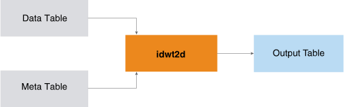

<html><head></head><body>
<h1 class="title topictitle1" id="ariaid-title1">IDWT2D</h1>

The IDWT2D function is the inverse of <a href="noj1558468237458.md#mld1506629675211">DWT2D</a>; that is, IDWT2D applies inverse wavelet transforms on multiple sequences simultaneously. IDWT2D takes as input the output table and meta table output by DWT2D and outputs the sequences as 2-dimensional matrixes. (Because the IDWT2D output is comparable to the DWT2D input, the inverse transformation is also called the reconstruction.)

  </img>  

This is a typical IDWT2D use case:

<ol class="ol" id="zsa1506633647588__ol_pzp_s1f_p1b">
<li class="li">Apply DWT2D to 2-dimensional sequences to create the coefficients of the matrixes and corresponding metadata.</li>
<li class="li">Filter the coefficients by methods appropriate for the objects (for example, minimum threshold or top <var class="keyword varname">n</var> coefficients), compressing the original matrixes.</li>
<li class="li">Apply IDWT to the filtered coefficients to reconstruct the sequences.</li>
<li class="li">Compare the reconstructed matrixes to their original counterparts.</li></ol>

<h2 class="title topictitle2" id="ariaid-title2">IDWT2D Syntax</h2>

<h2 class="title topictitle2" id="ariaid-title3">IDWT2D Syntax Elements</h2>

<dl class="dl parml"><dt class="dt pt dlterm">OutputTable</dt><dd class="dd pd">Specify the name for the table that the function creates to store the reconstructed result. This table must not exist.</dd><dt class="dt pt dlterm">TargetColumns</dt><dd class="dd pd">Specify the names of the InputTable columns that contain the data to transform. These columns must contain numeric values between -1e308 and 1e308. The function treats NULL as 0.</dd><dt class="dt pt dlterm">SortColumn</dt><dd class="dd pd">Specify the name of the InputTable column that represents the order of coefficients in each sequence (the waveletid column in the DWT2D output table). The column must contain a sequence of integer values that start from 1 for each sequence. If a value is missing from the sequence, the function treats the corresponding data column as 0.</dd><dt class="dt pt dlterm">PartitionColumns</dt><dd class="dd pd">[Optional] Specify the names of the InputTable partition columns, which identify the sequences. Rows with the same partition column values belong to the same sequence. If you specify multiple partition columns, the function treats the first one as the distribute key of the OutputTable and MetaTable.
<b>Note</b>
The IDWT2D input tables are the DWT2D output tables. If you specify this syntax element for DWT2D, you must also specify it for IDWT2D; otherwise, the results might not make sense.

</dd><dd class="dd pd ddexpand">Default behavior: All rows belong to one sequence, and the function creates a distribute key column named dwt_id_<var class="keyword varname">random_name</var> in both the OutputTable and MetaTable. In both tables, every cell of dwt_id_<var class="keyword varname">random_name</var> has the value 1.</dd><dt class="dt pt dlterm">VerboseFlag</dt><dd class="dd pd">[Optional] Specify whether to ignore (not output) rows in which all coefficient values have an absolute value less than 1e-12). For a sparse input matrix, ignoring such rows reduces the output table size.</dd><dd class="dd pd ddexpand">Default: 'true'</dd></dl>

<h2 class="title topictitle2" id="ariaid-title4">IDWT2D Input</h2>

<table cellpadding="4" cellspacing="0" summary="" id="aro1507667813019__table_gn5_dht_wcb" class="table" frame="border" border="1" rules="all">

<colgroup span="1"><col style="width:50%" span="1"></col><col style="width:50%" span="1"></col></colgroup><thead class="thead" style="text-align:left;"><tr class="row"><th class="entry cellrowborder" style="vertical-align:top;" id="d165473e153" rowspan="1" colspan="1">Table</th><th class="entry cellrowborder" style="vertical-align:top;" id="d165473e155" rowspan="1" colspan="1">Description</th></tr></thead><tbody class="tbody"><tr class="row"><td class="entry cellrowborder" style="vertical-align:top;" headers="d165473e153" rowspan="1" colspan="1">InputTable</td><td class="entry cellrowborder" style="vertical-align:top;" headers="d165473e155" rowspan="1" colspan="1">Has same schema as <a href="asx1558468105037.md#sns1506629090993">DWT Output</a> OutputTable.</td></tr><tr class="row"><td class="entry cellrowborder" style="vertical-align:top;" headers="d165473e153" rowspan="1" colspan="1">MetaTable</td><td class="entry cellrowborder" style="vertical-align:top;" headers="d165473e155" rowspan="1" colspan="1">Has same schema as DWT Output MetaInformationTable.</td></tr></tbody></table>

<h2 class="title topictitle2" id="ariaid-title5">IDWT2D Output</h2>

<h3 class="title sectiontitle">Output Message Schema</h3>
<table cellpadding="4" cellspacing="0" summary="" id="wfd1506634189357__table_N10014_N1000E_N1000C_N10001" class="table" frame="border" border="1" rules="all">

<colgroup span="1"><col style="width:20%" span="1"></col><col style="width:13.333333333333334%" span="1"></col><col style="width:66.66666666666666%" span="1"></col></colgroup><thead class="thead" style="text-align:left;"><tr class="row"><th class="entry nocellnorowborder" style="vertical-align:top;" id="d165473e191" rowspan="1" colspan="1">Column</th><th class="entry nocellnorowborder" style="vertical-align:top;" id="d165473e193" rowspan="1" colspan="1">Data Type</th><th class="entry cell-norowborder" style="vertical-align:top;" id="d165473e195" rowspan="1" colspan="1">Description</th></tr></thead><tbody class="tbody"><tr class="row"><td class="entry row-nocellborder" style="vertical-align:top;" headers="d165473e191" rowspan="1" colspan="1">messages</td><td class="entry row-nocellborder" style="vertical-align:top;" headers="d165473e193" rowspan="1" colspan="1">VARCHAR</td><td class="entry cellrowborder" style="vertical-align:top;" headers="d165473e195" rowspan="1" colspan="1">Reports whether function succeeded.</td></tr></tbody></table>

<h3 class="title sectiontitle">IDWT2D Output Table Schema</h3>

The table has reconstructed sequences.

<table cellpadding="4" cellspacing="0" summary="" id="wfd1506634189357__table_N10049_N1000E_N1000C_N10001" class="table" frame="border" border="1" rules="all">

<colgroup span="1"><col style="width:18.181818181818183%" span="1"></col><col style="width:27.27272727272727%" span="1"></col><col style="width:54.54545454545454%" span="1"></col></colgroup><thead class="thead" style="text-align:left;"><tr class="row"><th class="entry nocellnorowborder" style="vertical-align:top;" id="d165473e217" rowspan="1" colspan="1">Column</th><th class="entry nocellnorowborder" style="vertical-align:top;" id="d165473e219" rowspan="1" colspan="1">Data Type</th><th class="entry cell-norowborder" style="vertical-align:top;" id="d165473e221" rowspan="1" colspan="1">Description</th></tr></thead><tbody class="tbody"><tr class="row"><td class="entry nocellnorowborder" style="vertical-align:top;" headers="d165473e217" rowspan="1" colspan="1"><var class="keyword varname">partition_column</var></td><td class="entry nocellnorowborder" style="vertical-align:top;" headers="d165473e219" rowspan="1" colspan="1">Same as in Input table</td><td class="entry cell-norowborder" style="vertical-align:top;" headers="d165473e221" rowspan="1" colspan="1">[Column appears once for each specified <var class="keyword varname">partition_column</var>.] Identifier of sequence to which data belongs. Rows with same partition column values belong to same sequence.

If InputTable has multiple partition columns, first one is distribution key in both InputTable and OutputTable.

If InputTable has only one partition column, OutputTable has as its distribution key a function-created column named dwt_id_<var class="keyword varname">random_name</var>. Every cell of dwt_id_<var class="keyword varname">random_name</var> has the value 1.
</td></tr><tr class="row"><td class="entry nocellnorowborder" style="vertical-align:top;" headers="d165473e217" rowspan="1" colspan="1">indexy</td><td class="entry nocellnorowborder" style="vertical-align:top;" headers="d165473e219" rowspan="1" colspan="1">INTEGER</td><td class="entry cell-norowborder" style="vertical-align:top;" headers="d165473e221" rowspan="1" colspan="1">Y index of reconstructed matrix.</td></tr><tr class="row"><td class="entry nocellnorowborder" style="vertical-align:top;" headers="d165473e217" rowspan="1" colspan="1">indexx</td><td class="entry nocellnorowborder" style="vertical-align:top;" headers="d165473e219" rowspan="1" colspan="1">INTEGER</td><td class="entry cell-norowborder" style="vertical-align:top;" headers="d165473e221" rowspan="1" colspan="1">X index of reconstructed matrix.</td></tr><tr class="row"><td class="entry row-nocellborder" style="vertical-align:top;" headers="d165473e217" rowspan="1" colspan="1"><var class="keyword varname">target_column</var></td><td class="entry row-nocellborder" style="vertical-align:top;" headers="d165473e219" rowspan="1" colspan="1">INTEGER, SMALLINT, BIGINT, DOUBLE PRECISION, or NUMERIC</td><td class="entry cellrowborder" style="vertical-align:top;" headers="d165473e221" rowspan="1" colspan="1">[Column appears once for each <var class="keyword varname">target_column</var>.] Reconstructed matrix.</td></tr></tbody></table>

<h2 class="title topictitle2" id="ariaid-title6">IDWT2D Example</h2>

This example reconstructs the <a href="noj1558468237458.md#vme1506631169343">DWT2D Example</a> input table.

<h3 class="title sectiontitle">Input</h3>

Input tables are <a href="noj1558468237458.md#vme1506631169343">DWT2D Example</a> output:

<ul class="ul" id="wpa1506634318009__ul_o1l_4fq_ccb">
<li class="li">InputTable: dwt_coef_table</li>
<li class="li">MetaTable: dwt_meta_table</li></ul>

<h3 class="title sectiontitle">SQL Call</h3><pre class="pre codeblock" xml:space="preserve"><code>SELECT * FROM IDWT2D (
  ON dwt2d_coeftable AS InputTable
  ON dwt2d_metatable AS MetaTable
  OUT TABLE OutputTable (climate2d_reconstruct)
  USING
  TargetColumns ('temp_f', 'pressure_mbar', 'dewpoint_f')
  SortColumn ('waveletid')
  PartitionColumns ('state')
) AS dt;</code></pre>

<h3 class="title sectiontitle">Output</h3><pre class="pre screen" xml:space="preserve"> messages                      
 ----------------------------- 
 IDwt2D finished successfully!</pre><pre class="pre codeblock" xml:space="preserve"><code>SELECT * FROM climate2d_reconstruct order by state, indexy, indexx;</code></pre><pre class="pre screen" xml:space="preserve"> state indexy indexx temp_f             pressure_mbar      dewpoint_f         
 ----- ------ ------ ------------------ ------------------ ------------------ 
 ca        32   -117  34.90000000000003 1020.5000000000011  28.90000000000002
 ca        32   -116 34.400000000000034 1020.2000000000014 28.700000000000024
 ca        33   -118  33.90000000000003 1020.0000000000014 28.400000000000023
 ca        33   -117  33.40000000000002 1020.2000000000011  28.30000000000002
 ca        34   -121  33.10000000000004  1020.200000000001  28.00000000000002
 ca        34   -120  32.70000000000005 1020.0000000000016  27.90000000000002
 ca        34   -119 32.500000000000036 1020.3000000000013  27.70000000000003
 ca        34   -118  32.30000000000003 1020.8000000000013 27.600000000000037
 ca        35   -120  32.10000000000005 1021.3000000000012 27.400000000000034
 ca        35   -119  33.80000000000004 1021.7000000000013  28.20000000000003
 ca        35   -118 36.400000000000034 1022.1000000000015  28.90000000000005
 ca        35   -117 39.400000000000034 1022.0000000000009 29.300000000000026
 ca        36   -122 34.900000000000034 1020.5000000000009  28.90000000000002
 ca        36   -121 34.400000000000034 1020.2000000000012  28.70000000000002
 ca        36   -120 33.900000000000034  1020.000000000001 28.400000000000013
 ca        36   -119 33.400000000000034  1020.200000000001 28.300000000000033
 ca        36   -118  33.10000000000003 1020.2000000000012 28.000000000000032
 ca        37   -123  32.70000000000004 1020.0000000000013 27.900000000000023
 ca        37   -122  32.50000000000006 1020.3000000000013  27.70000000000003
 ca        37   -121 32.300000000000026  1020.800000000001 27.600000000000026
 ca        38   -124  32.10000000000003 1021.3000000000009 27.400000000000023
 ca        38   -123  33.80000000000004  1021.700000000001 28.200000000000024
 ca        38   -122  34.90000000000004 1020.6000000000013  28.80000000000004
 ca        38   -121 34.400000000000034 1020.2000000000012  28.70000000000002
 ca        38   -120  33.90000000000003 1020.1000000000009 28.400000000000013
 ca        39   -124  33.50000000000004 1020.2000000000008 28.300000000000026
 ca        39   -122  33.10000000000004 1020.2000000000014  28.00000000000003
 ca        39   -121  32.70000000000004  1020.000000000001 27.900000000000016
 ca        40   -125 32.500000000000036 1020.4000000000008  27.70000000000003
 ca        40   -122  32.30000000000004 1020.8000000000013 27.600000000000033
 ca        41   -125 32.100000000000044 1021.3000000000011 27.500000000000032
 ca        41   -124  33.80000000000005 1021.7000000000012 28.300000000000033
 ca        41   -123  34.60000000000005 1020.2000000000012 28.800000000000033
 ca        41   -122  33.80000000000004 1021.7000000000015  28.30000000000004
 ca        41   -121  36.60000000000004 1022.0000000000009 29.100000000000033
 tx        26    -99 39.600000000000044  1021.900000000001  29.50000000000003
 tx        26    -98 42.400000000000055 1021.1000000000013  29.50000000000002
 tx        27    -99  44.50000000000005 1020.0000000000009  29.40000000000002
 tx        27    -98 46.000000000000064 1019.3000000000011  29.10000000000003
 tx        28   -100  46.50000000000005 1019.0000000000009  28.80000000000003
 tx        28    -99  46.10000000000005 1019.2000000000014 28.800000000000033
 tx        28    -98  44.40000000000005 1019.6000000000015  28.70000000000004
 tx        29   -105  41.50000000000005  1020.100000000001  28.70000000000003
 tx        29   -104  39.80000000000005  1020.600000000001  29.10000000000003
 tx        29   -102 38.500000000000036 1020.9000000000012  29.20000000000002
 tx        29   -101 37.400000000000034  1021.000000000001  29.20000000000003
 tx        29    -99  36.50000000000005 1020.9000000000011  29.20000000000004
 tx        29    -98 35.800000000000054 1020.9000000000011  29.10000000000005
 tx        29    -97 35.100000000000044 1020.5000000000011 28.900000000000034
 tx        29    -96  34.60000000000004 1020.2000000000013 28.800000000000026
 tx        29    -95 34.100000000000044 1020.0000000000011  28.50000000000003
 tx        30   -105  33.70000000000003 1020.1000000000008 28.400000000000027
 tx        30   -104 33.300000000000026  1020.200000000001 28.200000000000024
 tx        30   -103  32.90000000000004  1020.000000000001 28.100000000000037
 tx        30   -102 32.700000000000045 1020.3000000000012 27.900000000000034
 tx        30   -101 32.500000000000036 1020.8000000000012 27.800000000000033
 tx        30   -100 32.300000000000026 1021.2000000000014 27.700000000000035
 tx        30    -99 34.000000000000036 1021.6000000000013 28.500000000000043
 tx        30    -98 36.700000000000045 1022.0000000000014 29.200000000000042
 tx        30    -97 39.700000000000045 1021.9000000000015 29.600000000000033
 tx        30    -96  42.50000000000004 1021.0000000000016 29.700000000000024
 tx        31   -103  44.50000000000005 1019.9000000000011 29.500000000000032
 tx        31   -102  45.90000000000007 1019.2000000000018 29.200000000000042
 tx        31   -100 46.500000000000036 1019.0000000000016 28.900000000000034
 tx        31    -99  46.00000000000005 1019.2000000000016 28.900000000000038
 tx        31    -98  44.30000000000005 1019.6000000000015 28.900000000000038
 tx        31    -97  41.50000000000004  1020.000000000002 28.800000000000036
 tx        31    -96  39.80000000000004 1020.5000000000023 29.200000000000035
 tx        31    -95  38.50000000000004 1020.8000000000013 29.300000000000033
 tx        32   -103 37.400000000000034 1020.9000000000012 29.300000000000033
 tx        32   -102  36.50000000000005 1020.9000000000017 29.300000000000047
 tx        32   -101  35.70000000000005 1020.8000000000014 29.200000000000035
 tx        32   -100  35.00000000000005 1020.4000000000015  29.00000000000003
 tx        32    -99  34.50000000000004 1020.1000000000015  28.70000000000003
 tx        32    -98  34.00000000000004 1019.9000000000011 28.500000000000036
 tx        32    -97 33.600000000000044 1020.0000000000015 28.300000000000033
 tx        32    -96 33.100000000000044 1020.1000000000017 28.100000000000033
 tx        32    -95  32.80000000000004 1019.9000000000012 28.000000000000036
 tx        33   -103 32.500000000000036 1020.2000000000012  27.80000000000003
 tx        33   -102 32.400000000000034 1020.6000000000015 27.700000000000042
 tx        33   -101 32.200000000000045 1021.1000000000013 27.600000000000037
 tx        33   -100 33.800000000000054 1021.5000000000013 28.400000000000038
 tx        33    -99  36.60000000000005 1021.9000000000012 29.000000000000032
 tx        33    -98  39.60000000000005 1021.8000000000012 29.400000000000027
 tx        33    -97  42.30000000000004 1021.0000000000011 29.400000000000027
 tx        33    -95  44.30000000000005 1019.8000000000012 29.200000000000035
 tx        34   -103 45.600000000000044 1019.2000000000012 28.900000000000027
 tx        34   -102  46.20000000000006 1018.9000000000011 28.700000000000028
 tx        34   -101  45.70000000000006  1019.100000000001  28.60000000000003
 tx        34   -100  44.10000000000005 1019.5000000000009 28.700000000000024
 tx        35   -104 41.300000000000026 1019.9000000000008  28.60000000000003
 tx        35   -102  39.50000000000004  1020.400000000001  28.90000000000003
 tx        35   -101  38.30000000000003 1020.7000000000007 29.000000000000025
 tx        36   -102 37.200000000000045 1020.9000000000012  29.00000000000003
 tx        36   -101  36.40000000000003 1020.8000000000009  29.00000000000003
 wa        45   -122 29.900000000000038 1020.2000000000012 24.800000000000026
 wa        45   -121  29.70000000000003 1020.7000000000013 24.700000000000024
 wa        46   -125 29.700000000000045  1020.200000000001 24.600000000000026
 wa        46   -124 29.500000000000046 1020.7000000000008 24.500000000000032
 wa        46   -123 29.800000000000036 1020.0000000000011 24.600000000000026
 wa        46   -122  29.60000000000003  1020.500000000001 24.600000000000023
 wa        46   -121 29.700000000000035 1019.9000000000012 24.400000000000023
 wa        46   -120 29.500000000000036 1020.4000000000012  24.40000000000002
 wa        46   -118 29.900000000000027 1019.5000000000007  24.30000000000001
 wa        47   -125 29.600000000000037 1019.9000000000008  24.20000000000002
 wa        47   -124 29.400000000000027 1020.4000000000009 24.200000000000028
 wa        47   -123 29.700000000000035  1019.500000000001  24.20000000000002
 wa        47   -122 29.400000000000038 1020.0000000000011  24.10000000000003
 wa        47   -121 29.300000000000033 1020.5000000000011 24.000000000000018
 wa        47   -120 29.700000000000024 1019.3000000000011 24.100000000000016
 wa        47   -118 29.400000000000027  1019.600000000001  23.90000000000002
 wa        48   -123  29.20000000000004  1020.100000000001 23.700000000000017
 wa        48   -122 29.000000000000053 1020.6000000000012 23.700000000000024
 wa        48   -121 29.800000000000033 1019.4000000000009  24.10000000000002
 wa        48   -119 29.500000000000036 1019.7000000000014 23.900000000000016
 wa        48   -118 29.200000000000035 1020.2000000000016 23.800000000000026</pre>

VerboseFlag is 'true' by default; therefore, rows in which all coefficient values have an absolute value less than 1e-12 do not appear in climate2d_reconstruct.

Download a zip file of all examples and a SQL script file that creates their input tables from the attachment in the left sidebar.

</body></html>
