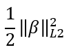
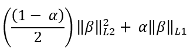
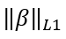

<html><head></head><body>
<h1 class="title topictitle1" id="ariaid-title1">GLM2</h1>

The GLM2 function differs from the <a href="eej1558472403086.md#hrv1507149150084">GLM</a> function in these ways:
<ul class="ul" id="ynr1507159835395__ul_fpz_5f3_mz">
<li class="li">GLM2 supports the regularization models ridge, LASSO, and elastic net.</li>
<li class="li">GLM2 uses the coordinate descent method to minimize the loss function (GLM uses the Fisher scoring method).</li>
<li class="li">GLM2 outputs a model table and, optionally, a regularization table (GLM outputs only a model table).</li></ul>

You can input the model table and regularization table to the <a href="xju1507161026486.md#xju1507161026486">GLM2Predict</a> function.

<h2 class="title topictitle2" id="ariaid-title2">GLM2 Syntax</h2>

<h3 class="title sectiontitle">Version 1.8</h3><pre class="pre codeblock" xml:space="preserve"><code>SELECT * FROM GLM2 (
  ON { <var class="keyword varname">table</var> | <var class="keyword varname">view</var> | (<var class="keyword varname">query</var>) } AS InputTable
  OUT TABLE ModelTable (<var class="keyword varname">model_table</var>)
  [ OUT TABLE RegularizationTable (<var class="keyword varname">regularization_table</var>) ]
  USING
  InputColumns ({ '<var class="keyword varname">predictor_var_column</var>' | <var class="keyword varname">predictor_var_column_range</var> }[,...])
  [ CategoricalColumns (({ '<var class="keyword varname">categorical_column_and_categories</var>' [,...])]
  [ WeightColumn ('<var class="keyword varname">weight_column</var>') ]
  ResponseColumn ('<var class="keyword varname">response_column</var>')
  [ Family ({ 'BINOMIAL' | 'GAUSSIAN' | 'POISSON' }) ]
  { Lambda (<var class="keyword varname">lambda</var> [,...]) |
    NumLambdas (<var class="keyword varname">num_lambdas</var>) ]
    MinLambdaRatio (<var class="keyword varname">min_lambda_ratio</var>) ]
  }
  [ StopThreshold (<var class="keyword varname">threshold</var>) ]
  [ Alpha (<var class="keyword varname">alpha</var>)]
  [ MaxIterNum (<var class="keyword varname">max_iterations</var>) ]
  [ Intercept (<b>{'true'|'t'|'yes'|'y'|'1'|'false'|'f'|'no'|'n'|'0'}</b>) ]
) AS <var class="keyword varname">alias</var>;</code></pre>

<b>Related Information</b>

<ul class="linklist linklist relinfo">
<a href="ndv1557782188375.md">Column Specification Syntax Elements</a>
</ul>

<h2 class="title topictitle2" id="ariaid-title3">GLM2 Arguments</h2>

<dl class="dl parml"><dt class="dt pt dlterm">ModelTable</dt><dd class="dd pd">Specify the name for the output table that contains the trained model. The trained model contains parameters, statistics, and the coefficients of the predictors for <var class="keyword varname">lambda</var>. This table must not exist.</dd><dt class="dt pt dlterm">RegularizationTable</dt><dd class="dd pd">[Optional] Specify the name for the output table that contains the statistics and coefficients of each <var class="keyword varname">lambda</var>. Recommended if you want predicted results for each <var class="keyword varname">lambda</var> from GLM2Predict.</dd><dt class="dt pt dlterm">InputColumns</dt><dd class="dd pd">Specify the names of the <var class="keyword varname">input_table</var> columns that contain the variables to use as predictors (independent variables).</dd><dt class="dt pt dlterm">CategoricalColumns</dt><dd class="dd pd">[Optional] Specify the names of the <var class="keyword varname">input_table</var> columns that contain categorical variables, and which of their categories to use in the model.</dd><dd class="dd pd ddexpand">
<table cellpadding="4" cellspacing="0" summary="" id="mic1507159982725__table_sxq_xqy_fdb" class="table" frame="border" border="1" rules="all">

<colgroup span="1"><col style="width:50%" span="1"></col><col style="width:50%" span="1"></col></colgroup><thead class="thead" style="text-align:left;"><tr class="row"><th class="entry cellrowborder" style="vertical-align:top;" id="d306649e200" rowspan="1" colspan="1"><var class="keyword varname">categorical_column_and_categories</var></th><th class="entry cellrowborder" style="vertical-align:top;" id="d306649e203" rowspan="1" colspan="1">Description</th></tr></thead><tbody class="tbody"><tr class="row"><td class="entry cellrowborder" style="vertical-align:top;" headers="d306649e200" rowspan="1" colspan="1"><code class="ph codeph">'<var class="keyword varname">categorical_column</var>:<var class="keyword varname">max_cardinality</var>'</code></td><td class="entry cellrowborder" style="vertical-align:top;" headers="d306649e203" rowspan="1" colspan="1">Uses most common categories in <var class="keyword varname">categorical_column</var> and groups other categories into category 'others'. 

For example, 'column_a:3' specifies that for column_a, function uses 3 most common categories and sets category of rows that do not belong to those 3 categories to 'others'.
</td></tr><tr class="row"><td class="entry cellrowborder" style="vertical-align:top;" headers="d306649e200" rowspan="1" colspan="1"><code class="ph codeph">'<var class="keyword varname">categorical_column</var>:(<var class="keyword varname">category</var> [,...])'</code></td><td class="entry cellrowborder" style="vertical-align:top;" headers="d306649e203" rowspan="1" colspan="1">Uses specified categories of <var class="keyword varname">categorical_column</var> and groups other categories into category 'others'. 

For example, 'column_a : (red, yellow, blue)' specifies that for column_a, function uses categories red, yellow, and blue, and sets category of rows that do not belong to those categories to 'others'.
</td></tr><tr class="row"><td class="entry cellrowborder" style="vertical-align:top;" headers="d306649e200" rowspan="1" colspan="1"><code class="ph codeph">'<var class="keyword varname">categorical_column</var>'</code></td><td class="entry cellrowborder" style="vertical-align:top;" headers="d306649e203" rowspan="1" colspan="1">Uses all categories in <var class="keyword varname">categorical_column</var>.</td></tr></tbody></table>
</dd><dd class="dd pd ddexpand">If you use this argument, you must also specify each <var class="keyword varname">categorical_column</var> in the InputColumns argument.</dd><dd class="dd pd ddexpand">Default behavior: The function treats all variables as numerical.
<b>Note</b>
For information about columns that you must identify as categorical, see <a href="uxa1540574678350.md">Identification of Numeric and Categorical Columns</a>.

</dd><dt class="dt pt dlterm">WeightColumn</dt><dd class="dd pd">[Optional] Specify the name of the <var class="keyword varname">input_table</var> column that contains the weights to assign to responses.</dd><dd class="dd pd ddexpand">You can use non-NULL weights to indicate that different observations have different dispersions (with the weights being inversely proportional to the dispersions). Equivalently, when the weights are positive integers wi, each response yi is the mean of wi unit-weight observations. A binomial GLM uses prior weights to give the number of trials when the response is the proportion of successes. A Poisson GLM rarely uses weights.</dd><dd class="dd pd ddexpand">If the weight is less than the response value, the function throws an exception. Therefore, if the response value is greater than 1 (the default weight), you must specify a weight that is greater than or equal to the response value.</dd><dd class="dd pd ddexpand">Default: 1</dd><dt class="dt pt dlterm">ResponseColumn</dt><dd class="dd pd">Specify the name of the <var class="keyword varname">input_table</var> column that contains the responses.</dd><dt class="dt pt dlterm">Family</dt><dd class="dd pd">[Optional] Specify the distribution exponential family.</dd><dd class="dd pd ddexpand">Default: 'GAUSSIAN'</dd><dt class="dt pt dlterm">Lambda</dt><dd class="dd pd">[Optional. Disallowed if NumLambdas is specified.] Specify the regularization parameter sequence. Each <var class="keyword varname">lambda</var> must be a nonnegative DOUBLE PRECISION value. A value of zero disables regularization.</dd><dd class="dd pd ddexpand">Default behavior: The function computes the regularization parameter sequence using the NumLambdas and MinLambdaRatio argument values.</dd><dt class="dt pt dlterm">NumLambdas</dt><dd class="dd pd">[Required if Lambda is omitted, disallowed otherwise] Specify the number of lambda values in the regularization parameter sequence. The <var class="keyword varname">num_lambdas</var> must be a positive INTEGER. The function uses <var class="keyword varname">num_lambdas</var> and <var class="keyword varname">min_lambda_ratio</var> to compute the regularization parameter sequence.</dd><dd class="dd pd ddexpand">Default: 100</dd><dd class="dd pd ddexpand">Maximum: 10,000</dd><dt class="dt pt dlterm">MinLambdaRatio</dt><dd class="dd pd">[Required if Lambda is omitted, disallowed otherwise] Specify the minimum lambda value in the regularization parameter sequence (MinLambda) as a fraction of the maximum lambda value in the regularization parameter sequence (MaxLambda). The <var class="keyword varname">min_lambda_ratio</var> must be in [0, 1). </dd><dd class="dd pd ddexpand">To calculate the value of MaxLambda, the function uses the input data set.</dd><dd class="dd pd ddexpand">To calculate the value of MinLambda, the function uses this formula:

<code class="ph codeph">MinLambda = MaxLambda * <var class="keyword varname">min_lambda_ratio</var></code>
</dd><dd class="dd pd ddexpand">To calculate the step for decreasing the lambda value from MaxLambda to MinLambda, the function uses this formula:

<code class="ph codeph"><var class="keyword varname">min_lambda_ratio</var>(1/(<var class="keyword varname">num_lambdas</var>-1))</code>
</dd><dd class="dd pd ddexpand">Default: 0.05 if the number of rows (observations) in the input data set is less than the number of predictors (independent variables), otherwise 0.0001.</dd><dt class="dt pt dlterm">StopThreshold</dt><dd class="dd pd">[Optional] Specify the convergence threshold of coordinate descent. The <var class="keyword varname">threshold</var> must be a nonnegative DOUBLE PRECISION value.</dd><dd class="dd pd ddexpand">Default: 1.0e-7</dd><dt class="dt pt dlterm">Alpha</dt><dd class="dd pd">[Optional] Specify the mixing parameter for penalty computation (see the following table). The <var class="keyword varname">alpha</var> must be in [0, 1]. If <var class="keyword varname">alpha</var> is in (0,1), it represents α in the elastic net regularization formula in <a href="ynr1507159835395.md#ynr1507159835395">GLM2</a>.

<table cellpadding="4" cellspacing="0" summary="" id="mic1507159982725__table_bdv_f35_lz" class="table" frame="border" border="1" rules="all">

<colgroup span="1"><col style="width:20%" span="1"></col><col style="width:20%" span="1"></col><col style="width:60%" span="1"></col></colgroup><thead class="thead" style="text-align:left;"><tr class="row"><th class="entry cellrowborder" style="vertical-align:top;" id="d306649e402" rowspan="1" colspan="1"><var class="keyword varname">alpha</var></th><th class="entry cellrowborder" style="vertical-align:top;" id="d306649e405" rowspan="1" colspan="1">Regularization Type</th><th class="entry cellrowborder" style="vertical-align:top;" id="d306649e407" rowspan="1" colspan="1">Parameter Description</th></tr></thead><tbody class="tbody"><tr class="row"><td class="entry cellrowborder" style="vertical-align:top;" headers="d306649e402" rowspan="1" colspan="1">0</td><td class="entry cellrowborder" style="vertical-align:top;" headers="d306649e405" rowspan="1" colspan="1">Ridge</td><td class="entry cellrowborder" style="vertical-align:top;" headers="d306649e407" rowspan="1" colspan="1"></img></td></tr><tr class="row"><td class="entry cellrowborder" style="vertical-align:top;" headers="d306649e402" rowspan="1" colspan="1">(0,1)</td><td class="entry cellrowborder" style="vertical-align:top;" headers="d306649e405" rowspan="1" colspan="1">Elastic net</td><td class="entry cellrowborder" style="vertical-align:top;" headers="d306649e407" rowspan="1" colspan="1"></img></td></tr><tr class="row"><td class="entry cellrowborder" style="vertical-align:top;" headers="d306649e402" rowspan="1" colspan="1">1</td><td class="entry cellrowborder" style="vertical-align:top;" headers="d306649e405" rowspan="1" colspan="1">LASSO</td><td class="entry cellrowborder" style="vertical-align:top;" headers="d306649e407" rowspan="1" colspan="1"></img></td></tr></tbody></table>
</dd><dd class="dd pd ddexpand">Default: 0.1</dd><dt class="dt pt dlterm">MaxIterNum</dt><dd class="dd pd">[Optional] Specify the maximum number of iterations over the data for all lambda values. The parameter <var class="keyword varname">max_iterations</var> must be a positive INTEGER value.</dd><dd class="dd pd ddexpand">Default: 105</dd><dt class="dt pt dlterm">Intercept</dt><dd class="dd pd">[Optional] Specify whether the function uses an intercept. For example, in β0+β1*X1+β2*X2+ ....+ βpXp, the intercept is β0.</dd><dd class="dd pd ddexpand">Default: 'true'</dd></dl>

<h2 class="title topictitle2" id="ariaid-title4">GLM2 Input</h2>

<h3 class="title sectiontitle">InputTable Schema</h3>

The table can have additional columns, but the function ignores them.

<table cellpadding="4" cellspacing="0" summary="" id="qul1507160018616__table_N10014_N1000E_N1000C_N10001" class="table" frame="border" border="1" rules="all">

<colgroup span="1"><col style="width:29.239766081871345%" span="1"></col><col style="width:16.081871345029242%" span="1"></col><col style="width:54.67836257309941%" span="1"></col></colgroup><thead class="thead" style="text-align:left;"><tr class="row"><th class="entry nocellnorowborder" style="vertical-align:top;" id="d306649e478" rowspan="1" colspan="1">Column</th><th class="entry nocellnorowborder" style="vertical-align:top;" id="d306649e480" rowspan="1" colspan="1">Data Type</th><th class="entry cell-norowborder" style="vertical-align:top;" id="d306649e482" rowspan="1" colspan="1">Description</th></tr></thead><tbody class="tbody"><tr class="row"><td class="entry nocellnorowborder" style="vertical-align:top;" headers="d306649e478" rowspan="1" colspan="1"><var class="keyword varname">response_column</var></td><td class="entry nocellnorowborder" style="vertical-align:top;" headers="d306649e480" rowspan="1" colspan="1">Any numeric SQL data type</td><td class="entry cell-norowborder" style="vertical-align:top;" headers="d306649e482" rowspan="1" colspan="1">Dependent/response variable. Cannot be NULL. If Family is BINOMIAL, each value in this column must be either 0 or 1.</td></tr><tr class="row"><td class="entry nocellnorowborder" style="vertical-align:top;" headers="d306649e478" rowspan="1" colspan="1"><var class="keyword varname">predictor_variable_column</var></td><td class="entry nocellnorowborder" style="vertical-align:top;" headers="d306649e480" rowspan="1" colspan="1">Any</td><td class="entry cell-norowborder" style="vertical-align:top;" headers="d306649e482" rowspan="1" colspan="1">[Appears one or more times.] Independent/predictor variable. Cannot be NULL.</td></tr><tr class="row"><td class="entry nocellnorowborder" style="vertical-align:top;" headers="d306649e478" rowspan="1" colspan="1"><var class="keyword varname">categorical_column</var></td><td class="entry nocellnorowborder" style="vertical-align:top;" headers="d306649e480" rowspan="1" colspan="1">CHARACTER, VARCHAR, INTEGER, BYTEINT, DATE, TIME (without TIME ZONE)</td><td class="entry cell-norowborder" style="vertical-align:top;" headers="d306649e482" rowspan="1" colspan="1">[Column appears once for each categorical <var class="keyword varname">predictor_variable_column</var>.] Categorical independent/predictor variable.</td></tr><tr class="row"><td class="entry row-nocellborder" style="vertical-align:top;" headers="d306649e478" rowspan="1" colspan="1"><var class="keyword varname">weight_column</var></td><td class="entry row-nocellborder" style="vertical-align:top;" headers="d306649e480" rowspan="1" colspan="1">INTEGER, DOUBLE PRECISION</td><td class="entry cellrowborder" style="vertical-align:top;" headers="d306649e482" rowspan="1" colspan="1">[Appears only with WeightColumn argument.] Weight to assign to response variable.</td></tr></tbody></table>

<h2 class="title topictitle2" id="ariaid-title5">GLM2 Output</h2>

<h3 class="title sectiontitle">Onscreen Output</h3>
<table cellpadding="4" cellspacing="0" summary="" id="rkg1507160055925__table_nyp_nv5_lz" class="table" frame="border" border="1" rules="all">

<colgroup span="1"><col style="width:25%" span="1"></col><col style="width:75%" span="1"></col></colgroup><thead class="thead" style="text-align:left;"><tr class="row"><th class="entry cellrowborder" style="vertical-align:top;" id="d306649e544" rowspan="1" colspan="1">Column</th><th class="entry cellrowborder" style="vertical-align:top;" id="d306649e546" rowspan="1" colspan="1">Description</th></tr></thead><tbody class="tbody"><tr class="row"><td class="entry cellrowborder" style="vertical-align:top;" headers="d306649e544" rowspan="1" colspan="1">dfDevRatio</td><td class="entry cellrowborder" style="vertical-align:top;" headers="d306649e546" rowspan="1" colspan="1">Number of nonzero coefficients for DevRatio in each lambda value.</td></tr><tr class="row"><td class="entry cellrowborder" style="vertical-align:top;" headers="d306649e544" rowspan="1" colspan="1">DevRatio</td><td class="entry cellrowborder" style="vertical-align:top;" headers="d306649e546" rowspan="1" colspan="1">Fraction of (null) deviance explained. Deviance calculations incorporate weights if present in the model. Therefore, this value is (1-deviance)/(null deviance). (For elastic net, this value is the R-square.)</td></tr><tr class="row"><td class="entry cellrowborder" style="vertical-align:top;" headers="d306649e544" rowspan="1" colspan="1">dfDev</td><td class="entry cellrowborder" style="vertical-align:top;" headers="d306649e546" rowspan="1" colspan="1">Number of nonzero coefficients for deviance in each lambda value.</td></tr><tr class="row"><td class="entry cellrowborder" style="vertical-align:top;" headers="d306649e544" rowspan="1" colspan="1">deviance</td><td class="entry cellrowborder" style="vertical-align:top;" headers="d306649e546" rowspan="1" colspan="1">Deviance, which is defined as 2*(<var class="keyword varname">loglike_sat</var> - <var class="keyword varname">loglike</var>), where <var class="keyword varname">loglike_sat</var> is the log-likelihood for the saturated model (a model with a free parameter for each observation).</td></tr><tr class="row"><td class="entry cellrowborder" style="vertical-align:top;" headers="d306649e544" rowspan="1" colspan="1">lambda</td><td class="entry cellrowborder" style="vertical-align:top;" headers="d306649e546" rowspan="1" colspan="1">Lambda value.</td></tr></tbody></table>

<h3 class="title sectiontitle">ModelTable Schema</h3>
<table cellpadding="4" cellspacing="0" summary="" id="rkg1507160055925__table_N10027_N1000E_N1000C_N10001" class="table" frame="border" border="1" rules="all">

<colgroup span="1"><col style="width:14.285714285714285%" span="1"></col><col style="width:14.285714285714285%" span="1"></col><col style="width:71.42857142857143%" span="1"></col></colgroup><thead class="thead" style="text-align:left;"><tr class="row"><th class="entry nocellnorowborder" style="vertical-align:top;" id="d306649e593" rowspan="1" colspan="1">Column</th><th class="entry nocellnorowborder" style="vertical-align:top;" id="d306649e595" rowspan="1" colspan="1">Data Type</th><th class="entry cell-norowborder" style="vertical-align:top;" id="d306649e597" rowspan="1" colspan="1">Description</th></tr></thead><tbody class="tbody"><tr class="row"><td class="entry nocellnorowborder" style="vertical-align:top;" headers="d306649e593" rowspan="1" colspan="1">category</td><td class="entry nocellnorowborder" style="vertical-align:top;" headers="d306649e595" rowspan="1" colspan="1">VARCHAR</td><td class="entry cell-norowborder" style="vertical-align:top;" headers="d306649e597" rowspan="1" colspan="1">Abstract category for output; one of the following:

<table cellpadding="4" cellspacing="0" summary="" id="rkg1507160055925__table_jpg_y2n_bdb" class="table" frame="border" border="1" rules="all">

<colgroup span="1"><col style="width:20%" span="1"></col><col style="width:80%" span="1"></col></colgroup><thead class="thead" style="text-align:left;"><tr class="row"><th class="entry cellrowborder" style="vertical-align:top;" id="d306649e614" rowspan="1" colspan="1">Category</th><th class="entry cellrowborder" style="vertical-align:top;" id="d306649e616" rowspan="1" colspan="1">Meaning</th></tr></thead><tbody class="tbody"><tr class="row"><td class="entry cellrowborder" style="vertical-align:top;" headers="d306649e614" rowspan="1" colspan="1">A</td><td class="entry cellrowborder" style="vertical-align:top;" headers="d306649e616" rowspan="1" colspan="1">global properties</td></tr><tr class="row"><td class="entry cellrowborder" style="vertical-align:top;" headers="d306649e614" rowspan="1" colspan="1">B</td><td class="entry cellrowborder" style="vertical-align:top;" headers="d306649e616" rowspan="1" colspan="1">regularization-specific properties</td></tr><tr class="row"><td class="entry cellrowborder" style="vertical-align:top;" headers="d306649e614" rowspan="1" colspan="1">C</td><td class="entry cellrowborder" style="vertical-align:top;" headers="d306649e616" rowspan="1" colspan="1">coefficients</td></tr></tbody></table>

</td></tr><tr class="row"><td class="entry nocellnorowborder" style="vertical-align:top;" headers="d306649e593" rowspan="1" colspan="1">information</td><td class="entry nocellnorowborder" style="vertical-align:top;" headers="d306649e595" rowspan="1" colspan="1">VARCHAR</td><td class="entry cell-norowborder" style="vertical-align:top;" headers="d306649e597" rowspan="1" colspan="1">Value provided in either this column or the value column (for example, FAMILY:POISSON).</td></tr><tr class="row"><td class="entry row-nocellborder" style="vertical-align:top;" headers="d306649e593" rowspan="1" colspan="1">value</td><td class="entry row-nocellborder" style="vertical-align:top;" headers="d306649e595" rowspan="1" colspan="1">VARCHAR, INTEGER, or DOUBLE PRECISION</td><td class="entry cellrowborder" style="vertical-align:top;" headers="d306649e597" rowspan="1" colspan="1">Value of each item specified in information column.</td></tr></tbody></table>

<h3 class="title sectiontitle">RegularizationTable Schema</h3>

This table appears only with the RegularizationTable argument.

<table cellpadding="4" cellspacing="0" summary="" id="rkg1507160055925__table_jhh_kbv_lz" class="table" frame="border" border="1" rules="all">

<colgroup span="1"><col style="width:25%" span="1"></col><col style="width:25%" span="1"></col><col style="width:50%" span="1"></col></colgroup><thead class="thead" style="text-align:left;"><tr class="row"><th class="entry cellrowborder" style="vertical-align:top;" id="d306649e660" rowspan="1" colspan="1">Column</th><th class="entry cellrowborder" style="vertical-align:top;" id="d306649e662" rowspan="1" colspan="1">Data Type</th><th class="entry cellrowborder" style="vertical-align:top;" id="d306649e664" rowspan="1" colspan="1">Description</th></tr></thead><tbody class="tbody"><tr class="row"><td class="entry cellrowborder" style="vertical-align:top;" headers="d306649e660" rowspan="1" colspan="1">df_dev_ratio</td><td class="entry cellrowborder" style="vertical-align:top;" headers="d306649e662" rowspan="1" colspan="1">DOUBLE PRECISION</td><td class="entry cellrowborder" style="vertical-align:top;" headers="d306649e664" rowspan="1" colspan="1">Number of nonzero coefficients for %dev in each lambda value.</td></tr><tr class="row"><td class="entry cellrowborder" style="vertical-align:top;" headers="d306649e660" rowspan="1" colspan="1">deviance_ratio</td><td class="entry cellrowborder" style="vertical-align:top;" headers="d306649e662" rowspan="1" colspan="1">DOUBLE PRECISION</td><td class="entry cellrowborder" style="vertical-align:top;" headers="d306649e664" rowspan="1" colspan="1">Fraction of (null) deviance explained. Deviance calculations incorporate weights if present in the model. Therefore, this value is (1-deviance)/(null deviance). (For elastic net, this value is the R-square.)</td></tr><tr class="row"><td class="entry cellrowborder" style="vertical-align:top;" headers="d306649e660" rowspan="1" colspan="1">df_dev</td><td class="entry cellrowborder" style="vertical-align:top;" headers="d306649e662" rowspan="1" colspan="1">DOUBLE PRECISION</td><td class="entry cellrowborder" style="vertical-align:top;" headers="d306649e664" rowspan="1" colspan="1">Number of nonzero coefficients for deviance in each lambda value.</td></tr><tr class="row"><td class="entry cellrowborder" style="vertical-align:top;" headers="d306649e660" rowspan="1" colspan="1">deviance</td><td class="entry cellrowborder" style="vertical-align:top;" headers="d306649e662" rowspan="1" colspan="1">DOUBLE PRECISION</td><td class="entry cellrowborder" style="vertical-align:top;" headers="d306649e664" rowspan="1" colspan="1">Deviance, which is defined as 2*(<var class="keyword varname">loglike_sat</var> - <var class="keyword varname">loglike</var>), where <var class="keyword varname">loglike_sat</var> is the log-likelihood for the saturated model (a model with a free parameter for each observation).</td></tr><tr class="row"><td class="entry cellrowborder" style="vertical-align:top;" headers="d306649e660" rowspan="1" colspan="1">lambda</td><td class="entry cellrowborder" style="vertical-align:top;" headers="d306649e662" rowspan="1" colspan="1">DOUBLE PRECISION</td><td class="entry cellrowborder" style="vertical-align:top;" headers="d306649e664" rowspan="1" colspan="1">Lambda value.</td></tr><tr class="row"><td class="entry cellrowborder" style="vertical-align:top;" headers="d306649e660" rowspan="1" colspan="1"><var class="keyword varname">predictor_variable_column</var></td><td class="entry cellrowborder" style="vertical-align:top;" headers="d306649e662" rowspan="1" colspan="1">DOUBLE PRECISION</td><td class="entry cellrowborder" style="vertical-align:top;" headers="d306649e664" rowspan="1" colspan="1">Coefficients for all predictors for current lambda value.</td></tr></tbody></table>

<h2 class="title topictitle2" id="ariaid-title6">GLM2 Examples</h2>

<h3 class="title topictitle3" id="ariaid-title7">GLM2 Example 1: LASSO for Poisson Regression Analysis</h3>

This example uses Poisson regression to predict the number of awards won by students, based on their programming levels and math scores.

<h4 class="title sectiontitle">Input</h4>
<table cellpadding="4" cellspacing="0" summary="" id="gec1507160107909__table_qbn_y4z_m2b" class="table" frame="border" border="1" rules="all">
awards
<colgroup span="1"><col style="width:25%" span="1"></col><col style="width:25%" span="1"></col><col style="width:25%" span="1"></col><col style="width:25%" span="1"></col></colgroup><thead class="thead" style="text-align:left;"><tr class="row"><th class="entry cellrowborder" style="vertical-align:top;" id="d306649e759" rowspan="1" colspan="1">id</th><th class="entry cellrowborder" style="vertical-align:top;" id="d306649e761" rowspan="1" colspan="1">num_awards</th><th class="entry cellrowborder" style="vertical-align:top;" id="d306649e763" rowspan="1" colspan="1">prog</th><th class="entry cellrowborder" style="vertical-align:top;" id="d306649e765" rowspan="1" colspan="1">math</th></tr></thead><tbody class="tbody"><tr class="row"><td class="entry cellrowborder" style="vertical-align:top;" headers="d306649e759" rowspan="1" colspan="1">45</td><td class="entry cellrowborder" style="vertical-align:top;" headers="d306649e761" rowspan="1" colspan="1">0</td><td class="entry cellrowborder" style="vertical-align:top;" headers="d306649e763" rowspan="1" colspan="1">3</td><td class="entry cellrowborder" style="vertical-align:top;" headers="d306649e765" rowspan="1" colspan="1">41</td></tr><tr class="row"><td class="entry cellrowborder" style="vertical-align:top;" headers="d306649e759" rowspan="1" colspan="1">108</td><td class="entry cellrowborder" style="vertical-align:top;" headers="d306649e761" rowspan="1" colspan="1">0</td><td class="entry cellrowborder" style="vertical-align:top;" headers="d306649e763" rowspan="1" colspan="1">1</td><td class="entry cellrowborder" style="vertical-align:top;" headers="d306649e765" rowspan="1" colspan="1">41</td></tr><tr class="row"><td class="entry cellrowborder" style="vertical-align:top;" headers="d306649e759" rowspan="1" colspan="1">15</td><td class="entry cellrowborder" style="vertical-align:top;" headers="d306649e761" rowspan="1" colspan="1">0</td><td class="entry cellrowborder" style="vertical-align:top;" headers="d306649e763" rowspan="1" colspan="1">3</td><td class="entry cellrowborder" style="vertical-align:top;" headers="d306649e765" rowspan="1" colspan="1">44</td></tr><tr class="row"><td class="entry cellrowborder" style="vertical-align:top;" headers="d306649e759" rowspan="1" colspan="1">67</td><td class="entry cellrowborder" style="vertical-align:top;" headers="d306649e761" rowspan="1" colspan="1">0</td><td class="entry cellrowborder" style="vertical-align:top;" headers="d306649e763" rowspan="1" colspan="1">3</td><td class="entry cellrowborder" style="vertical-align:top;" headers="d306649e765" rowspan="1" colspan="1">42</td></tr><tr class="row"><td class="entry cellrowborder" style="vertical-align:top;" headers="d306649e759" rowspan="1" colspan="1">...</td><td class="entry cellrowborder" style="vertical-align:top;" headers="d306649e761" rowspan="1" colspan="1">...</td><td class="entry cellrowborder" style="vertical-align:top;" headers="d306649e763" rowspan="1" colspan="1">...</td><td class="entry cellrowborder" style="vertical-align:top;" headers="d306649e765" rowspan="1" colspan="1">...</td></tr><tr class="row"><td class="entry cellrowborder" style="vertical-align:top;" headers="d306649e759" rowspan="1" colspan="1">196</td><td class="entry cellrowborder" style="vertical-align:top;" headers="d306649e761" rowspan="1" colspan="1">0</td><td class="entry cellrowborder" style="vertical-align:top;" headers="d306649e763" rowspan="1" colspan="1">2</td><td class="entry cellrowborder" style="vertical-align:top;" headers="d306649e765" rowspan="1" colspan="1">49</td></tr><tr class="row"><td class="entry cellrowborder" style="vertical-align:top;" headers="d306649e759" rowspan="1" colspan="1">36</td><td class="entry cellrowborder" style="vertical-align:top;" headers="d306649e761" rowspan="1" colspan="1">1</td><td class="entry cellrowborder" style="vertical-align:top;" headers="d306649e763" rowspan="1" colspan="1">1</td><td class="entry cellrowborder" style="vertical-align:top;" headers="d306649e765" rowspan="1" colspan="1">44</td></tr><tr class="row"><td class="entry cellrowborder" style="vertical-align:top;" headers="d306649e759" rowspan="1" colspan="1">155</td><td class="entry cellrowborder" style="vertical-align:top;" headers="d306649e761" rowspan="1" colspan="1">1</td><td class="entry cellrowborder" style="vertical-align:top;" headers="d306649e763" rowspan="1" colspan="1">1</td><td class="entry cellrowborder" style="vertical-align:top;" headers="d306649e765" rowspan="1" colspan="1">46</td></tr><tr class="row"><td class="entry cellrowborder" style="vertical-align:top;" headers="d306649e759" rowspan="1" colspan="1">6</td><td class="entry cellrowborder" style="vertical-align:top;" headers="d306649e761" rowspan="1" colspan="1">0</td><td class="entry cellrowborder" style="vertical-align:top;" headers="d306649e763" rowspan="1" colspan="1">2</td><td class="entry cellrowborder" style="vertical-align:top;" headers="d306649e765" rowspan="1" colspan="1">46</td></tr><tr class="row"><td class="entry cellrowborder" style="vertical-align:top;" headers="d306649e759" rowspan="1" colspan="1">...</td><td class="entry cellrowborder" style="vertical-align:top;" headers="d306649e761" rowspan="1" colspan="1">...</td><td class="entry cellrowborder" style="vertical-align:top;" headers="d306649e763" rowspan="1" colspan="1">...</td><td class="entry cellrowborder" style="vertical-align:top;" headers="d306649e765" rowspan="1" colspan="1">...</td></tr><tr class="row"><td class="entry cellrowborder" style="vertical-align:top;" headers="d306649e759" rowspan="1" colspan="1">38</td><td class="entry cellrowborder" style="vertical-align:top;" headers="d306649e761" rowspan="1" colspan="1">3</td><td class="entry cellrowborder" style="vertical-align:top;" headers="d306649e763" rowspan="1" colspan="1">2</td><td class="entry cellrowborder" style="vertical-align:top;" headers="d306649e765" rowspan="1" colspan="1">50</td></tr><tr class="row"><td class="entry cellrowborder" style="vertical-align:top;" headers="d306649e759" rowspan="1" colspan="1">182</td><td class="entry cellrowborder" style="vertical-align:top;" headers="d306649e761" rowspan="1" colspan="1">0</td><td class="entry cellrowborder" style="vertical-align:top;" headers="d306649e763" rowspan="1" colspan="1">2</td><td class="entry cellrowborder" style="vertical-align:top;" headers="d306649e765" rowspan="1" colspan="1">43</td></tr><tr class="row"><td class="entry cellrowborder" style="vertical-align:top;" headers="d306649e759" rowspan="1" colspan="1">115</td><td class="entry cellrowborder" style="vertical-align:top;" headers="d306649e761" rowspan="1" colspan="1">0</td><td class="entry cellrowborder" style="vertical-align:top;" headers="d306649e763" rowspan="1" colspan="1">1</td><td class="entry cellrowborder" style="vertical-align:top;" headers="d306649e765" rowspan="1" colspan="1">43</td></tr><tr class="row"><td class="entry cellrowborder" style="vertical-align:top;" headers="d306649e759" rowspan="1" colspan="1">14</td><td class="entry cellrowborder" style="vertical-align:top;" headers="d306649e761" rowspan="1" colspan="1">1</td><td class="entry cellrowborder" style="vertical-align:top;" headers="d306649e763" rowspan="1" colspan="1">2</td><td class="entry cellrowborder" style="vertical-align:top;" headers="d306649e765" rowspan="1" colspan="1">54</td></tr><tr class="row"><td class="entry cellrowborder" style="vertical-align:top;" headers="d306649e759" rowspan="1" colspan="1">...</td><td class="entry cellrowborder" style="vertical-align:top;" headers="d306649e761" rowspan="1" colspan="1">...</td><td class="entry cellrowborder" style="vertical-align:top;" headers="d306649e763" rowspan="1" colspan="1">...</td><td class="entry cellrowborder" style="vertical-align:top;" headers="d306649e765" rowspan="1" colspan="1">...</td></tr></tbody></table>

<h4 class="title sectiontitle">SQL Call</h4>

Because the response variable is a count value (number of awards), the Family is Poisson. The Alpha value, 1, specifies a LASSO model.
<pre class="pre codeblock" xml:space="preserve"><code>SELECT * FROM GLM2 (
  ON awards AS InputTable
  OUT TABLE ModelTable (glm2_lasso_model)
  OUT TABLE RegularizationTable (glm2_regularization)
  USING
  InputColumns ('prog', 'math')
  ResponseColumn ('num_awards')
  Family ('POISSON')
  Intercept ('TRUE')
  NumLambdas (10)
  Alpha (1)
) AS dt;</code></pre>

<h4 class="title sectiontitle">Output</h4>
<table cellpadding="4" cellspacing="0" summary="" id="gec1507160107909__table_a1g_lpz_m2b" class="table" frame="border" border="1" rules="all">
Onscreen Output
<colgroup span="1"><col style="width:20%" span="1"></col><col style="width:20%" span="1"></col><col style="width:20%" span="1"></col><col style="width:20%" span="1"></col><col style="width:20%" span="1"></col></colgroup><thead class="thead" style="text-align:left;"><tr class="row"><th class="entry cellrowborder" style="vertical-align:top;" id="d306649e931" rowspan="1" colspan="1">dfDevRatio</th><th class="entry cellrowborder" style="vertical-align:top;" id="d306649e933" rowspan="1" colspan="1">devRatio</th><th class="entry cellrowborder" style="vertical-align:top;" id="d306649e935" rowspan="1" colspan="1">dfDev</th><th class="entry cellrowborder" style="vertical-align:top;" id="d306649e937" rowspan="1" colspan="1">deviance</th><th class="entry cellrowborder" style="vertical-align:top;" id="d306649e939" rowspan="1" colspan="1">lambda</th></tr></thead><tbody class="tbody"><tr class="row"><td class="entry cellrowborder" style="vertical-align:top;" headers="d306649e931" rowspan="1" colspan="1">0</td><td class="entry cellrowborder" style="vertical-align:top;" headers="d306649e933" rowspan="1" colspan="1">2.3155999606359e-15</td><td class="entry cellrowborder" style="vertical-align:top;" headers="d306649e935" rowspan="1" colspan="1">199</td><td class="entry cellrowborder" style="vertical-align:top;" headers="d306649e937" rowspan="1" colspan="1">287.672234452864</td><td class="entry cellrowborder" style="vertical-align:top;" headers="d306649e939" rowspan="1" colspan="1">0.522060074545705</td></tr><tr class="row"><td class="entry cellrowborder" style="vertical-align:top;" headers="d306649e931" rowspan="1" colspan="1">1</td><td class="entry cellrowborder" style="vertical-align:top;" headers="d306649e933" rowspan="1" colspan="1"> 0.252835382560055</td><td class="entry cellrowborder" style="vertical-align:top;" headers="d306649e935" rowspan="1" colspan="1">198</td><td class="entry cellrowborder" style="vertical-align:top;" headers="d306649e937" rowspan="1" colspan="1">214.938515003069</td><td class="entry cellrowborder" style="vertical-align:top;" headers="d306649e939" rowspan="1" colspan="1">0.187618662922922</td></tr><tr class="row"><td class="entry cellrowborder" style="vertical-align:top;" headers="d306649e931" rowspan="1" colspan="1">1</td><td class="entry cellrowborder" style="vertical-align:top;" headers="d306649e933" rowspan="1" colspan="1">0.285724516586101</td><td class="entry cellrowborder" style="vertical-align:top;" headers="d306649e935" rowspan="1" colspan="1">198</td><td class="entry cellrowborder" style="vertical-align:top;" headers="d306649e937" rowspan="1" colspan="1">205.477224328577</td><td class="entry cellrowborder" style="vertical-align:top;" headers="d306649e939" rowspan="1" colspan="1">0.0674266514397151</td></tr><tr class="row"><td class="entry cellrowborder" style="vertical-align:top;" headers="d306649e931" rowspan="1" colspan="1">2</td><td class="entry cellrowborder" style="vertical-align:top;" headers="d306649e933" rowspan="1" colspan="1">0.291092364886125</td><td class="entry cellrowborder" style="vertical-align:top;" headers="d306649e935" rowspan="1" colspan="1">197</td><td class="entry cellrowborder" style="vertical-align:top;" headers="d306649e937" rowspan="1" colspan="1">203.933043413905</td><td class="entry cellrowborder" style="vertical-align:top;" headers="d306649e939" rowspan="1" colspan="1">0.024231882124864</td></tr><tr class="row"><td class="entry cellrowborder" style="vertical-align:top;" headers="d306649e931" rowspan="1" colspan="1">2</td><td class="entry cellrowborder" style="vertical-align:top;" headers="d306649e933" rowspan="1" colspan="1">0.292547804908229</td><td class="entry cellrowborder" style="vertical-align:top;" headers="d306649e935" rowspan="1" colspan="1">197</td><td class="entry cellrowborder" style="vertical-align:top;" headers="d306649e937" rowspan="1" colspan="1">203.514353730634</td><td class="entry cellrowborder" style="vertical-align:top;" headers="d306649e939" rowspan="1" colspan="1">0.00870848690800394</td></tr><tr class="row"><td class="entry cellrowborder" style="vertical-align:top;" headers="d306649e931" rowspan="1" colspan="1">2</td><td class="entry cellrowborder" style="vertical-align:top;" headers="d306649e933" rowspan="1" colspan="1">0.292738550188869</td><td class="entry cellrowborder" style="vertical-align:top;" headers="d306649e935" rowspan="1" colspan="1">197</td><td class="entry cellrowborder" style="vertical-align:top;" headers="d306649e937" rowspan="1" colspan="1">203.459481609541</td><td class="entry cellrowborder" style="vertical-align:top;" headers="d306649e939" rowspan="1" colspan="1">0.00312966792410483</td></tr><tr class="row"><td class="entry cellrowborder" style="vertical-align:top;" headers="d306649e931" rowspan="1" colspan="1">2</td><td class="entry cellrowborder" style="vertical-align:top;" headers="d306649e933" rowspan="1" colspan="1">0.29276365104296 </td><td class="entry cellrowborder" style="vertical-align:top;" headers="d306649e935" rowspan="1" colspan="1">197</td><td class="entry cellrowborder" style="vertical-align:top;" headers="d306649e937" rowspan="1" colspan="1">203.452260790758</td><td class="entry cellrowborder" style="vertical-align:top;" headers="d306649e939" rowspan="1" colspan="1">0.0011247443348819</td></tr><tr class="row"><td class="entry cellrowborder" style="vertical-align:top;" headers="d306649e931" rowspan="1" colspan="1">2</td><td class="entry cellrowborder" style="vertical-align:top;" headers="d306649e933" rowspan="1" colspan="1">0.29276688972071 </td><td class="entry cellrowborder" style="vertical-align:top;" headers="d306649e935" rowspan="1" colspan="1">197</td><td class="entry cellrowborder" style="vertical-align:top;" headers="d306649e937" rowspan="1" colspan="1">203.451329113093</td><td class="entry cellrowborder" style="vertical-align:top;" headers="d306649e939" rowspan="1" colspan="1">0.000404212155898542</td></tr><tr class="row"><td class="entry cellrowborder" style="vertical-align:top;" headers="d306649e931" rowspan="1" colspan="1">2</td><td class="entry cellrowborder" style="vertical-align:top;" headers="d306649e933" rowspan="1" colspan="1">0.292767310601548 </td><td class="entry cellrowborder" style="vertical-align:top;" headers="d306649e935" rowspan="1" colspan="1">197</td><td class="entry cellrowborder" style="vertical-align:top;" headers="d306649e937" rowspan="1" colspan="1">203.451208037361</td><td class="entry cellrowborder" style="vertical-align:top;" headers="d306649e939" rowspan="1" colspan="1">0.000145266316894411</td></tr><tr class="row"><td class="entry cellrowborder" style="vertical-align:top;" headers="d306649e931" rowspan="1" colspan="1">2</td><td class="entry cellrowborder" style="vertical-align:top;" headers="d306649e933" rowspan="1" colspan="1">0.292767359699846 </td><td class="entry cellrowborder" style="vertical-align:top;" headers="d306649e935" rowspan="1" colspan="1">197</td><td class="entry cellrowborder" style="vertical-align:top;" headers="d306649e937" rowspan="1" colspan="1">203.451193913144</td><td class="entry cellrowborder" style="vertical-align:top;" headers="d306649e939" rowspan="1" colspan="1">5.22060074545706e-05</td></tr></tbody></table>

<table cellpadding="4" cellspacing="0" summary="" id="gec1507160107909__table_bl3_2xz_m2b" class="table" frame="border" border="1" rules="all">
glm2_lasso_model
<colgroup span="1"><col style="width:33.33333333333333%" span="1"></col><col style="width:33.33333333333333%" span="1"></col><col style="width:33.33333333333333%" span="1"></col></colgroup><thead class="thead" style="text-align:left;"><tr class="row"><th class="entry cellrowborder" style="vertical-align:top;" id="d306649e1061" rowspan="1" colspan="1">category</th><th class="entry cellrowborder" style="vertical-align:top;" id="d306649e1063" rowspan="1" colspan="1">information</th><th class="entry cellrowborder" style="vertical-align:top;" id="d306649e1065" rowspan="1" colspan="1">value</th></tr></thead><tbody class="tbody"><tr class="row"><td class="entry cellrowborder" style="vertical-align:top;" headers="d306649e1061" rowspan="1" colspan="1">A</td><td class="entry cellrowborder" style="vertical-align:top;" headers="d306649e1063" rowspan="1" colspan="1">FAMILY : POISSON</td><td class="entry cellrowborder" style="vertical-align:top;" headers="d306649e1065" rowspan="1" colspan="1"> </td></tr><tr class="row"><td class="entry cellrowborder" style="vertical-align:top;" headers="d306649e1061" rowspan="1" colspan="1">A</td><td class="entry cellrowborder" style="vertical-align:top;" headers="d306649e1063" rowspan="1" colspan="1">RESPONSE : num_awards</td><td class="entry cellrowborder" style="vertical-align:top;" headers="d306649e1065" rowspan="1" colspan="1"> </td></tr><tr class="row"><td class="entry cellrowborder" style="vertical-align:top;" headers="d306649e1061" rowspan="1" colspan="1">A</td><td class="entry cellrowborder" style="vertical-align:top;" headers="d306649e1063" rowspan="1" colspan="1">REGULARIZER : LASSO</td><td class="entry cellrowborder" style="vertical-align:top;" headers="d306649e1065" rowspan="1" colspan="1"> </td></tr><tr class="row"><td class="entry cellrowborder" style="vertical-align:top;" headers="d306649e1061" rowspan="1" colspan="1">A</td><td class="entry cellrowborder" style="vertical-align:top;" headers="d306649e1063" rowspan="1" colspan="1">CONVERGED : true</td><td class="entry cellrowborder" style="vertical-align:top;" headers="d306649e1065" rowspan="1" colspan="1"> </td></tr><tr class="row"><td class="entry cellrowborder" style="vertical-align:top;" headers="d306649e1061" rowspan="1" colspan="1">A</td><td class="entry cellrowborder" style="vertical-align:top;" headers="d306649e1063" rowspan="1" colspan="1">NUMOBSERVATIONS</td><td class="entry cellrowborder" style="vertical-align:top;" headers="d306649e1065" rowspan="1" colspan="1">200</td></tr><tr class="row"><td class="entry cellrowborder" style="vertical-align:top;" headers="d306649e1061" rowspan="1" colspan="1">B</td><td class="entry cellrowborder" style="vertical-align:top;" headers="d306649e1063" rowspan="1" colspan="1">has_intercept</td><td class="entry cellrowborder" style="vertical-align:top;" headers="d306649e1065" rowspan="1" colspan="1">1</td></tr><tr class="row"><td class="entry cellrowborder" style="vertical-align:top;" headers="d306649e1061" rowspan="1" colspan="1">B</td><td class="entry cellrowborder" style="vertical-align:top;" headers="d306649e1063" rowspan="1" colspan="1">alpha </td><td class="entry cellrowborder" style="vertical-align:top;" headers="d306649e1065" rowspan="1" colspan="1">1</td></tr><tr class="row"><td class="entry cellrowborder" style="vertical-align:top;" headers="d306649e1061" rowspan="1" colspan="1">B</td><td class="entry cellrowborder" style="vertical-align:top;" headers="d306649e1063" rowspan="1" colspan="1">devnull </td><td class="entry cellrowborder" style="vertical-align:top;" headers="d306649e1065" rowspan="1" colspan="1">287.672234452865</td></tr><tr class="row"><td class="entry cellrowborder" style="vertical-align:top;" headers="d306649e1061" rowspan="1" colspan="1">B</td><td class="entry cellrowborder" style="vertical-align:top;" headers="d306649e1063" rowspan="1" colspan="1">maxNumLambdas </td><td class="entry cellrowborder" style="vertical-align:top;" headers="d306649e1065" rowspan="1" colspan="1">10</td></tr><tr class="row"><td class="entry cellrowborder" style="vertical-align:top;" headers="d306649e1061" rowspan="1" colspan="1">B</td><td class="entry cellrowborder" style="vertical-align:top;" headers="d306649e1063" rowspan="1" colspan="1">maxIterNum </td><td class="entry cellrowborder" style="vertical-align:top;" headers="d306649e1065" rowspan="1" colspan="1">100000</td></tr><tr class="row"><td class="entry cellrowborder" style="vertical-align:top;" headers="d306649e1061" rowspan="1" colspan="1">B</td><td class="entry cellrowborder" style="vertical-align:top;" headers="d306649e1063" rowspan="1" colspan="1">threshold </td><td class="entry cellrowborder" style="vertical-align:top;" headers="d306649e1065" rowspan="1" colspan="1">1e-07</td></tr><tr class="row"><td class="entry cellrowborder" style="vertical-align:top;" headers="d306649e1061" rowspan="1" colspan="1">B</td><td class="entry cellrowborder" style="vertical-align:top;" headers="d306649e1063" rowspan="1" colspan="1">minLambdaRatio </td><td class="entry cellrowborder" style="vertical-align:top;" headers="d306649e1065" rowspan="1" colspan="1">0.0001</td></tr><tr class="row"><td class="entry cellrowborder" style="vertical-align:top;" headers="d306649e1061" rowspan="1" colspan="1">B</td><td class="entry cellrowborder" style="vertical-align:top;" headers="d306649e1063" rowspan="1" colspan="1">iterationNum </td><td class="entry cellrowborder" style="vertical-align:top;" headers="d306649e1065" rowspan="1" colspan="1">79</td></tr><tr class="row"><td class="entry cellrowborder" style="vertical-align:top;" headers="d306649e1061" rowspan="1" colspan="1">B</td><td class="entry cellrowborder" style="vertical-align:top;" headers="d306649e1063" rowspan="1" colspan="1">minLambda </td><td class="entry cellrowborder" style="vertical-align:top;" headers="d306649e1065" rowspan="1" colspan="1">5.22060074545706e-05</td></tr><tr class="row"><td class="entry cellrowborder" style="vertical-align:top;" headers="d306649e1061" rowspan="1" colspan="1">C</td><td class="entry cellrowborder" style="vertical-align:top;" headers="d306649e1063" rowspan="1" colspan="1">intercept</td><td class="entry cellrowborder" style="vertical-align:top;" headers="d306649e1065" rowspan="1" colspan="1">-5.5766613646</td></tr><tr class="row"><td class="entry cellrowborder" style="vertical-align:top;" headers="d306649e1061" rowspan="1" colspan="1">C</td><td class="entry cellrowborder" style="vertical-align:top;" headers="d306649e1063" rowspan="1" colspan="1">math</td><td class="entry cellrowborder" style="vertical-align:top;" headers="d306649e1065" rowspan="1" colspan="1">0.0861044506</td></tr><tr class="row"><td class="entry cellrowborder" style="vertical-align:top;" headers="d306649e1061" rowspan="1" colspan="1">C</td><td class="entry cellrowborder" style="vertical-align:top;" headers="d306649e1063" rowspan="1" colspan="1">prog</td><td class="entry cellrowborder" style="vertical-align:top;" headers="d306649e1065" rowspan="1" colspan="1">0.1230769507</td></tr></tbody></table>

<table cellpadding="4" cellspacing="0" summary="" id="gec1507160107909__table_lcl_mxz_m2b" class="table" frame="border" border="1" rules="all">
glm2_regularization
<colgroup span="1"><col style="width:12.5%" span="1"></col><col style="width:12.5%" span="1"></col><col style="width:12.5%" span="1"></col><col style="width:12.5%" span="1"></col><col style="width:12.5%" span="1"></col><col style="width:12.5%" span="1"></col><col style="width:12.5%" span="1"></col><col style="width:12.5%" span="1"></col></colgroup><thead class="thead" style="text-align:left;"><tr class="row"><th class="entry cellrowborder" style="vertical-align:top;" id="d306649e1198" rowspan="1" colspan="1">df_dev_ratio</th><th class="entry cellrowborder" style="vertical-align:top;" id="d306649e1200" rowspan="1" colspan="1">deviance_ratio</th><th class="entry cellrowborder" style="vertical-align:top;" id="d306649e1202" rowspan="1" colspan="1">df_dev</th><th class="entry cellrowborder" style="vertical-align:top;" id="d306649e1204" rowspan="1" colspan="1">deviance</th><th class="entry cellrowborder" style="vertical-align:top;" id="d306649e1206" rowspan="1" colspan="1">lambda</th><th class="entry cellrowborder" style="vertical-align:top;" id="d306649e1208" rowspan="1" colspan="1">intercept</th><th class="entry cellrowborder" style="vertical-align:top;" id="d306649e1210" rowspan="1" colspan="1">math</th><th class="entry cellrowborder" style="vertical-align:top;" id="d306649e1212" rowspan="1" colspan="1">prog</th></tr></thead><tbody class="tbody"><tr class="row"><td class="entry cellrowborder" style="vertical-align:top;" headers="d306649e1198" rowspan="1" colspan="1">0</td><td class="entry cellrowborder" style="vertical-align:top;" headers="d306649e1200" rowspan="1" colspan="1">2.3155999606359e-15</td><td class="entry cellrowborder" style="vertical-align:top;" headers="d306649e1202" rowspan="1" colspan="1">199</td><td class="entry cellrowborder" style="vertical-align:top;" headers="d306649e1204" rowspan="1" colspan="1">287.672234452864</td><td class="entry cellrowborder" style="vertical-align:top;" headers="d306649e1206" rowspan="1" colspan="1">0.522060074545705</td><td class="entry cellrowborder" style="vertical-align:top;" headers="d306649e1208" rowspan="1" colspan="1">-0.4620354596</td><td class="entry cellrowborder" style="vertical-align:top;" headers="d306649e1210" rowspan="1" colspan="1">0</td><td class="entry cellrowborder" style="vertical-align:top;" headers="d306649e1212" rowspan="1" colspan="1">0</td></tr><tr class="row"><td class="entry cellrowborder" style="vertical-align:top;" headers="d306649e1198" rowspan="1" colspan="1">1</td><td class="entry cellrowborder" style="vertical-align:top;" headers="d306649e1200" rowspan="1" colspan="1">0.252835382560055</td><td class="entry cellrowborder" style="vertical-align:top;" headers="d306649e1202" rowspan="1" colspan="1">198</td><td class="entry cellrowborder" style="vertical-align:top;" headers="d306649e1204" rowspan="1" colspan="1">214.938515003069</td><td class="entry cellrowborder" style="vertical-align:top;" headers="d306649e1206" rowspan="1" colspan="1">0.187618662922922</td><td class="entry cellrowborder" style="vertical-align:top;" headers="d306649e1208" rowspan="1" colspan="1">-3.474053956</td><td class="entry cellrowborder" style="vertical-align:top;" headers="d306649e1210" rowspan="1" colspan="1">0.0546564845</td><td class="entry cellrowborder" style="vertical-align:top;" headers="d306649e1212" rowspan="1" colspan="1">0</td></tr><tr class="row"><td class="entry cellrowborder" style="vertical-align:top;" headers="d306649e1198" rowspan="1" colspan="1">1</td><td class="entry cellrowborder" style="vertical-align:top;" headers="d306649e1200" rowspan="1" colspan="1">0.285724516586101</td><td class="entry cellrowborder" style="vertical-align:top;" headers="d306649e1202" rowspan="1" colspan="1">198</td><td class="entry cellrowborder" style="vertical-align:top;" headers="d306649e1204" rowspan="1" colspan="1">205.477224328577</td><td class="entry cellrowborder" style="vertical-align:top;" headers="d306649e1206" rowspan="1" colspan="1">0.0674266514397151</td><td class="entry cellrowborder" style="vertical-align:top;" headers="d306649e1208" rowspan="1" colspan="1">-4.6383122967</td><td class="entry cellrowborder" style="vertical-align:top;" headers="d306649e1210" rowspan="1" colspan="1">0.0745575487</td><td class="entry cellrowborder" style="vertical-align:top;" headers="d306649e1212" rowspan="1" colspan="1">0</td></tr><tr class="row"><td class="entry cellrowborder" style="vertical-align:top;" headers="d306649e1198" rowspan="1" colspan="1">2</td><td class="entry cellrowborder" style="vertical-align:top;" headers="d306649e1200" rowspan="1" colspan="1">0.291092364886125</td><td class="entry cellrowborder" style="vertical-align:top;" headers="d306649e1202" rowspan="1" colspan="1">197</td><td class="entry cellrowborder" style="vertical-align:top;" headers="d306649e1204" rowspan="1" colspan="1">203.933043413905</td><td class="entry cellrowborder" style="vertical-align:top;" headers="d306649e1206" rowspan="1" colspan="1">0.024231882124864</td><td class="entry cellrowborder" style="vertical-align:top;" headers="d306649e1208" rowspan="1" colspan="1">-5.1481338496</td><td class="entry cellrowborder" style="vertical-align:top;" headers="d306649e1210" rowspan="1" colspan="1">0.0819282453</td><td class="entry cellrowborder" style="vertical-align:top;" headers="d306649e1212" rowspan="1" colspan="1">0.0350038202</td></tr><tr class="row"><td class="entry cellrowborder" style="vertical-align:top;" headers="d306649e1198" rowspan="1" colspan="1">2</td><td class="entry cellrowborder" style="vertical-align:top;" headers="d306649e1200" rowspan="1" colspan="1">0.292547804908229 </td><td class="entry cellrowborder" style="vertical-align:top;" headers="d306649e1202" rowspan="1" colspan="1">197</td><td class="entry cellrowborder" style="vertical-align:top;" headers="d306649e1204" rowspan="1" colspan="1">203.514353730634</td><td class="entry cellrowborder" style="vertical-align:top;" headers="d306649e1206" rowspan="1" colspan="1">0.00870848690800394</td><td class="entry cellrowborder" style="vertical-align:top;" headers="d306649e1208" rowspan="1" colspan="1">-5.4215383741</td><td class="entry cellrowborder" style="vertical-align:top;" headers="d306649e1210" rowspan="1" colspan="1">0.0846018544</td><td class="entry cellrowborder" style="vertical-align:top;" headers="d306649e1212" rowspan="1" colspan="1">0.0911403822</td></tr><tr class="row"><td class="entry cellrowborder" style="vertical-align:top;" headers="d306649e1198" rowspan="1" colspan="1">2</td><td class="entry cellrowborder" style="vertical-align:top;" headers="d306649e1200" rowspan="1" colspan="1">0.292738550188869</td><td class="entry cellrowborder" style="vertical-align:top;" headers="d306649e1202" rowspan="1" colspan="1">197</td><td class="entry cellrowborder" style="vertical-align:top;" headers="d306649e1204" rowspan="1" colspan="1">203.459481609541</td><td class="entry cellrowborder" style="vertical-align:top;" headers="d306649e1206" rowspan="1" colspan="1">0.00312966792410483</td><td class="entry cellrowborder" style="vertical-align:top;" headers="d306649e1208" rowspan="1" colspan="1">-5.5210823104</td><td class="entry cellrowborder" style="vertical-align:top;" headers="d306649e1210" rowspan="1" colspan="1">0.0855658029</td><td class="entry cellrowborder" style="vertical-align:top;" headers="d306649e1212" rowspan="1" colspan="1">0.1116709262</td></tr><tr class="row"><td class="entry cellrowborder" style="vertical-align:top;" headers="d306649e1198" rowspan="1" colspan="1">2</td><td class="entry cellrowborder" style="vertical-align:top;" headers="d306649e1200" rowspan="1" colspan="1">0.29276365104296</td><td class="entry cellrowborder" style="vertical-align:top;" headers="d306649e1202" rowspan="1" colspan="1">197</td><td class="entry cellrowborder" style="vertical-align:top;" headers="d306649e1204" rowspan="1" colspan="1">203.452260790758</td><td class="entry cellrowborder" style="vertical-align:top;" headers="d306649e1206" rowspan="1" colspan="1">0.0011247443348819</td><td class="entry cellrowborder" style="vertical-align:top;" headers="d306649e1208" rowspan="1" colspan="1">-5.5575725933</td><td class="entry cellrowborder" style="vertical-align:top;" headers="d306649e1210" rowspan="1" colspan="1">0.0859216969</td><td class="entry cellrowborder" style="vertical-align:top;" headers="d306649e1212" rowspan="1" colspan="1">0.1190959763</td></tr><tr class="row"><td class="entry cellrowborder" style="vertical-align:top;" headers="d306649e1198" rowspan="1" colspan="1">2</td><td class="entry cellrowborder" style="vertical-align:top;" headers="d306649e1200" rowspan="1" colspan="1">0.29276688972071</td><td class="entry cellrowborder" style="vertical-align:top;" headers="d306649e1202" rowspan="1" colspan="1">197</td><td class="entry cellrowborder" style="vertical-align:top;" headers="d306649e1204" rowspan="1" colspan="1">203.451329113093</td><td class="entry cellrowborder" style="vertical-align:top;" headers="d306649e1206" rowspan="1" colspan="1">0.000404212155898542</td><td class="entry cellrowborder" style="vertical-align:top;" headers="d306649e1208" rowspan="1" colspan="1">-5.5706478142</td><td class="entry cellrowborder" style="vertical-align:top;" headers="d306649e1210" rowspan="1" colspan="1">0.0860486438</td><td class="entry cellrowborder" style="vertical-align:top;" headers="d306649e1212" rowspan="1" colspan="1">0.1217705047</td></tr><tr class="row"><td class="entry cellrowborder" style="vertical-align:top;" headers="d306649e1198" rowspan="1" colspan="1">2</td><td class="entry cellrowborder" style="vertical-align:top;" headers="d306649e1200" rowspan="1" colspan="1">0.292767310601548</td><td class="entry cellrowborder" style="vertical-align:top;" headers="d306649e1202" rowspan="1" colspan="1">197 </td><td class="entry cellrowborder" style="vertical-align:top;" headers="d306649e1204" rowspan="1" colspan="1">203.451208037361</td><td class="entry cellrowborder" style="vertical-align:top;" headers="d306649e1206" rowspan="1" colspan="1">0.000145266316894411</td><td class="entry cellrowborder" style="vertical-align:top;" headers="d306649e1208" rowspan="1" colspan="1">-5.5753457856</td><td class="entry cellrowborder" style="vertical-align:top;" headers="d306649e1210" rowspan="1" colspan="1">0.0860942091</td><td class="entry cellrowborder" style="vertical-align:top;" headers="d306649e1212" rowspan="1" colspan="1">0.1227324598</td></tr><tr class="row"><td class="entry cellrowborder" style="vertical-align:top;" headers="d306649e1198" rowspan="1" colspan="1">2</td><td class="entry cellrowborder" style="vertical-align:top;" headers="d306649e1200" rowspan="1" colspan="1">0.292767359699846</td><td class="entry cellrowborder" style="vertical-align:top;" headers="d306649e1202" rowspan="1" colspan="1">197</td><td class="entry cellrowborder" style="vertical-align:top;" headers="d306649e1204" rowspan="1" colspan="1">203.451193913144</td><td class="entry cellrowborder" style="vertical-align:top;" headers="d306649e1206" rowspan="1" colspan="1">5.22060074545706e-05</td><td class="entry cellrowborder" style="vertical-align:top;" headers="d306649e1208" rowspan="1" colspan="1">-5.5766613646</td><td class="entry cellrowborder" style="vertical-align:top;" headers="d306649e1210" rowspan="1" colspan="1">0.0861044506</td><td class="entry cellrowborder" style="vertical-align:top;" headers="d306649e1212" rowspan="1" colspan="1">0.1230769507</td></tr></tbody></table>

<h3 class="title topictitle3" id="ariaid-title8">GLM2 Example 2: Ridge for Logistic Regression Analysis</h3>

This example uses logistic regression to predict which students are admitted to an academic program.

<h4 class="title sectiontitle">Input</h4>
<ul class="ul" id="jug1507160318039__ul_mbf_1yz_m2b">
<li class="li">InputTable: admissions_train, as in <a href="eej1558472403086.md#poj1507150410273">GLM Example: Logistic Regression Analysis with Intercept</a></li></ul>

<h4 class="title sectiontitle">SQL Call</h4>

Because the example uses logistic regression, the Family is Binomial. The Alpha value, 0, specifies a Ridge model.
<pre class="pre codeblock" xml:space="preserve"><code>SELECT * FROM GLM2 ( 
  ON admissions_train AS InputTable
  OUT TABLE ModelTable (glm2_ridge_model)
  OUT TABLE RegularizationTable (glm2_2regularization)
  USING
  InputColumns ('masters', 'gpa', 'stats', 'programming')
  CategoricalColumns ('masters', 'stats', 'programming')
  ResponseColumn ('admitted')
  Family ('binomial')
  Intercept ('TRUE')
  NumLambdas (10)
  Alpha(0)
) AS dt;</code></pre>

<h4 class="title sectiontitle">Output</h4>
<table cellpadding="4" cellspacing="0" summary="" id="jug1507160318039__table_a4j_jyz_m2b" class="table" frame="border" border="1" rules="all">
Onscreen Output
<colgroup span="1"><col style="width:20%" span="1"></col><col style="width:20%" span="1"></col><col style="width:20%" span="1"></col><col style="width:20%" span="1"></col><col style="width:20%" span="1"></col></colgroup><thead class="thead" style="text-align:left;"><tr class="row"><th class="entry cellrowborder" style="vertical-align:top;" id="d306649e1438" rowspan="1" colspan="1">dfDevRatio</th><th class="entry cellrowborder" style="vertical-align:top;" id="d306649e1440" rowspan="1" colspan="1">devRatio</th><th class="entry cellrowborder" style="vertical-align:top;" id="d306649e1442" rowspan="1" colspan="1">dfDev</th><th class="entry cellrowborder" style="vertical-align:top;" id="d306649e1444" rowspan="1" colspan="1">deviance</th><th class="entry cellrowborder" style="vertical-align:top;" id="d306649e1446" rowspan="1" colspan="1">lambda</th></tr></thead><tbody class="tbody"><tr class="row"><td class="entry cellrowborder" style="vertical-align:top;" headers="d306649e1438" rowspan="1" colspan="1">0</td><td class="entry cellrowborder" style="vertical-align:top;" headers="d306649e1440" rowspan="1" colspan="1">0</td><td class="entry cellrowborder" style="vertical-align:top;" headers="d306649e1442" rowspan="1" colspan="1">39</td><td class="entry cellrowborder" style="vertical-align:top;" headers="d306649e1444" rowspan="1" colspan="1">51.7957311227706 </td><td class="entry cellrowborder" style="vertical-align:top;" headers="d306649e1446" rowspan="1" colspan="1">216.083130280731</td></tr><tr class="row"><td class="entry cellrowborder" style="vertical-align:top;" headers="d306649e1438" rowspan="1" colspan="1">6</td><td class="entry cellrowborder" style="vertical-align:top;" headers="d306649e1440" rowspan="1" colspan="1">0.00164825659995313</td><td class="entry cellrowborder" style="vertical-align:top;" headers="d306649e1442" rowspan="1" colspan="1">33</td><td class="entry cellrowborder" style="vertical-align:top;" headers="d306649e1444" rowspan="1" colspan="1">51.7103584670981</td><td class="entry cellrowborder" style="vertical-align:top;" headers="d306649e1446" rowspan="1" colspan="1">77.6562506120565</td></tr><tr class="row"><td class="entry cellrowborder" style="vertical-align:top;" headers="d306649e1438" rowspan="1" colspan="1">6</td><td class="entry cellrowborder" style="vertical-align:top;" headers="d306649e1440" rowspan="1" colspan="1">0.00453438694628144</td><td class="entry cellrowborder" style="vertical-align:top;" headers="d306649e1442" rowspan="1" colspan="1">33</td><td class="entry cellrowborder" style="vertical-align:top;" headers="d306649e1444" rowspan="1" colspan="1">51.5608692356944</td><td class="entry cellrowborder" style="vertical-align:top;" headers="d306649e1446" rowspan="1" colspan="1">27.9082094529445</td></tr><tr class="row"><td class="entry cellrowborder" style="vertical-align:top;" headers="d306649e1438" rowspan="1" colspan="1">6</td><td class="entry cellrowborder" style="vertical-align:top;" headers="d306649e1440" rowspan="1" colspan="1">0.0122307765430854</td><td class="entry cellrowborder" style="vertical-align:top;" headers="d306649e1442" rowspan="1" colspan="1">33</td><td class="entry cellrowborder" style="vertical-align:top;" headers="d306649e1444" rowspan="1" colspan="1">51.1622291095222</td><td class="entry cellrowborder" style="vertical-align:top;" headers="d306649e1446" rowspan="1" colspan="1">10.0296904464313</td></tr><tr class="row"><td class="entry cellrowborder" style="vertical-align:top;" headers="d306649e1438" rowspan="1" colspan="1">6</td><td class="entry cellrowborder" style="vertical-align:top;" headers="d306649e1440" rowspan="1" colspan="1">0.0313506707268246</td><td class="entry cellrowborder" style="vertical-align:top;" headers="d306649e1442" rowspan="1" colspan="1">33</td><td class="entry cellrowborder" style="vertical-align:top;" headers="d306649e1444" rowspan="1" colspan="1">50.1719002112855</td><td class="entry cellrowborder" style="vertical-align:top;" headers="d306649e1446" rowspan="1" colspan="1">3.60448385701157</td></tr><tr class="row"><td class="entry cellrowborder" style="vertical-align:top;" headers="d306649e1438" rowspan="1" colspan="1">6</td><td class="entry cellrowborder" style="vertical-align:top;" headers="d306649e1440" rowspan="1" colspan="1">0.0714771723905868</td><td class="entry cellrowborder" style="vertical-align:top;" headers="d306649e1442" rowspan="1" colspan="1">33</td><td class="entry cellrowborder" style="vertical-align:top;" headers="d306649e1444" rowspan="1" colspan="1">48.0935187202118</td><td class="entry cellrowborder" style="vertical-align:top;" headers="d306649e1446" rowspan="1" colspan="1">1.29538433362914</td></tr><tr class="row"><td class="entry cellrowborder" style="vertical-align:top;" headers="d306649e1438" rowspan="1" colspan="1">6</td><td class="entry cellrowborder" style="vertical-align:top;" headers="d306649e1440" rowspan="1" colspan="1">0.132326934855416</td><td class="entry cellrowborder" style="vertical-align:top;" headers="d306649e1442" rowspan="1" colspan="1">33</td><td class="entry cellrowborder" style="vertical-align:top;" headers="d306649e1444" rowspan="1" colspan="1">44.9417607846991</td><td class="entry cellrowborder" style="vertical-align:top;" headers="d306649e1446" rowspan="1" colspan="1">0.465536991807485</td></tr><tr class="row"><td class="entry cellrowborder" style="vertical-align:top;" headers="d306649e1438" rowspan="1" colspan="1">6</td><td class="entry cellrowborder" style="vertical-align:top;" headers="d306649e1440" rowspan="1" colspan="1">0.191442862387798</td><td class="entry cellrowborder" style="vertical-align:top;" headers="d306649e1442" rowspan="1" colspan="1">33</td><td class="entry cellrowborder" style="vertical-align:top;" headers="d306649e1444" rowspan="1" colspan="1">41.8798080971586</td><td class="entry cellrowborder" style="vertical-align:top;" headers="d306649e1446" rowspan="1" colspan="1">0.167305320216424</td></tr><tr class="row"><td class="entry cellrowborder" style="vertical-align:top;" headers="d306649e1438" rowspan="1" colspan="1">6</td><td class="entry cellrowborder" style="vertical-align:top;" headers="d306649e1440" rowspan="1" colspan="1">0.228448387997473</td><td class="entry cellrowborder" style="vertical-align:top;" headers="d306649e1442" rowspan="1" colspan="1">33</td><td class="entry cellrowborder" style="vertical-align:top;" headers="d306649e1444" rowspan="1" colspan="1">39.9630798426231</td><td class="entry cellrowborder" style="vertical-align:top;" headers="d306649e1446" rowspan="1" colspan="1">0.0601264145820994</td></tr><tr class="row"><td class="entry cellrowborder" style="vertical-align:top;" headers="d306649e1438" rowspan="1" colspan="1">6</td><td class="entry cellrowborder" style="vertical-align:top;" headers="d306649e1440" rowspan="1" colspan="1">0.2437883725835</td><td class="entry cellrowborder" style="vertical-align:top;" headers="d306649e1442" rowspan="1" colspan="1">33</td><td class="entry cellrowborder" style="vertical-align:top;" headers="d306649e1444" rowspan="1" colspan="1">39.1685341255778</td><td class="entry cellrowborder" style="vertical-align:top;" headers="d306649e1446" rowspan="1" colspan="1">0.0216083130280731</td></tr></tbody></table>

<table cellpadding="4" cellspacing="0" summary="" id="jug1507160318039__table_u1b_fzz_m2b" class="table" frame="border" border="1" rules="all">
glm2_2regularization
<colgroup span="1"><col style="width:8.333333333333332%" span="1"></col><col style="width:8.333333333333332%" span="1"></col><col style="width:8.333333333333332%" span="1"></col><col style="width:8.333333333333332%" span="1"></col><col style="width:8.333333333333332%" span="1"></col><col style="width:8.333333333333332%" span="1"></col><col style="width:8.333333333333332%" span="1"></col><col style="width:8.333333333333332%" span="1"></col><col style="width:8.333333333333332%" span="1"></col><col style="width:8.333333333333332%" span="1"></col><col style="width:8.333333333333332%" span="1"></col><col style="width:8.333333333333332%" span="1"></col></colgroup><thead class="thead" style="text-align:left;"><tr class="row"><th class="entry cellrowborder" style="vertical-align:top;" id="d306649e1578" rowspan="1" colspan="1">df_dev_ratio</th><th class="entry cellrowborder" style="vertical-align:top;" id="d306649e1580" rowspan="1" colspan="1">deviance_ratio</th><th class="entry cellrowborder" style="vertical-align:top;" id="d306649e1582" rowspan="1" colspan="1">df_dev</th><th class="entry cellrowborder" style="vertical-align:top;" id="d306649e1584" rowspan="1" colspan="1">deviance</th><th class="entry cellrowborder" style="vertical-align:top;" id="d306649e1586" rowspan="1" colspan="1">lambda</th><th class="entry cellrowborder" style="vertical-align:top;" id="d306649e1588" rowspan="1" colspan="1">intercept</th><th class="entry cellrowborder" style="vertical-align:top;" id="d306649e1590" rowspan="1" colspan="1">gpa</th><th class="entry cellrowborder" style="vertical-align:top;" id="d306649e1592" rowspan="1" colspan="1">masters_yes</th><th class="entry cellrowborder" style="vertical-align:top;" id="d306649e1594" rowspan="1" colspan="1">programming_beginner</th><th class="entry cellrowborder" style="vertical-align:top;" id="d306649e1596" rowspan="1" colspan="1">programming_novice</th><th class="entry cellrowborder" style="vertical-align:top;" id="d306649e1598" rowspan="1" colspan="1">stats_beginner</th><th class="entry cellrowborder" style="vertical-align:top;" id="d306649e1601" rowspan="1" colspan="1">stats_novice</th></tr></thead><tbody class="tbody"><tr class="row"><td class="entry cellrowborder" style="vertical-align:top;" headers="d306649e1578" rowspan="1" colspan="1">0</td><td class="entry cellrowborder" style="vertical-align:top;" headers="d306649e1580" rowspan="1" colspan="1">0</td><td class="entry cellrowborder" style="vertical-align:top;" headers="d306649e1582" rowspan="1" colspan="1">39</td><td class="entry cellrowborder" style="vertical-align:top;" headers="d306649e1584" rowspan="1" colspan="1">51.7957311227706</td><td class="entry cellrowborder" style="vertical-align:top;" headers="d306649e1586" rowspan="1" colspan="1">216.083130280731</td><td class="entry cellrowborder" style="vertical-align:top;" headers="d306649e1588" rowspan="1" colspan="1">0.6190392084</td><td class="entry cellrowborder" style="vertical-align:top;" headers="d306649e1590" rowspan="1" colspan="1">-0</td><td class="entry cellrowborder" style="vertical-align:top;" headers="d306649e1592" rowspan="1" colspan="1">-0</td><td class="entry cellrowborder" style="vertical-align:top;" headers="d306649e1594" rowspan="1" colspan="1">-0</td><td class="entry cellrowborder" style="vertical-align:top;" headers="d306649e1596" rowspan="1" colspan="1">0</td><td class="entry cellrowborder" style="vertical-align:top;" headers="d306649e1598" rowspan="1" colspan="1">-0</td><td class="entry cellrowborder" style="vertical-align:top;" headers="d306649e1601" rowspan="1" colspan="1">-0</td></tr><tr class="row"><td class="entry cellrowborder" style="vertical-align:top;" headers="d306649e1578" rowspan="1" colspan="1">6</td><td class="entry cellrowborder" style="vertical-align:top;" headers="d306649e1580" rowspan="1" colspan="1">0.00164825659995313</td><td class="entry cellrowborder" style="vertical-align:top;" headers="d306649e1582" rowspan="1" colspan="1">33</td><td class="entry cellrowborder" style="vertical-align:top;" headers="d306649e1584" rowspan="1" colspan="1">51.7103584670981</td><td class="entry cellrowborder" style="vertical-align:top;" headers="d306649e1586" rowspan="1" colspan="1"> 77.6562506120565</td><td class="entry cellrowborder" style="vertical-align:top;" headers="d306649e1588" rowspan="1" colspan="1">0.6244703657</td><td class="entry cellrowborder" style="vertical-align:top;" headers="d306649e1590" rowspan="1" colspan="1">-0.0002657335</td><td class="entry cellrowborder" style="vertical-align:top;" headers="d306649e1592" rowspan="1" colspan="1">-0.0055716531</td><td class="entry cellrowborder" style="vertical-align:top;" headers="d306649e1594" rowspan="1" colspan="1">-0.0050407358</td><td class="entry cellrowborder" style="vertical-align:top;" headers="d306649e1596" rowspan="1" colspan="1">0.0013575168</td><td class="entry cellrowborder" style="vertical-align:top;" headers="d306649e1598" rowspan="1" colspan="1">-0.000727557</td><td class="entry cellrowborder" style="vertical-align:top;" headers="d306649e1601" rowspan="1" colspan="1">-0.0002425326</td></tr><tr class="row"><td class="entry cellrowborder" style="vertical-align:top;" headers="d306649e1578" rowspan="1" colspan="1">6</td><td class="entry cellrowborder" style="vertical-align:top;" headers="d306649e1580" rowspan="1" colspan="1">0.00453438694628144</td><td class="entry cellrowborder" style="vertical-align:top;" headers="d306649e1582" rowspan="1" colspan="1">33</td><td class="entry cellrowborder" style="vertical-align:top;" headers="d306649e1584" rowspan="1" colspan="1">51.5608692356944</td><td class="entry cellrowborder" style="vertical-align:top;" headers="d306649e1586" rowspan="1" colspan="1">27.9082094529445</td><td class="entry cellrowborder" style="vertical-align:top;" headers="d306649e1588" rowspan="1" colspan="1">0.6340226614</td><td class="entry cellrowborder" style="vertical-align:top;" headers="d306649e1590" rowspan="1" colspan="1">-0.0007208063</td><td class="entry cellrowborder" style="vertical-align:top;" headers="d306649e1592" rowspan="1" colspan="1">-0.0153981003</td><td class="entry cellrowborder" style="vertical-align:top;" headers="d306649e1594" rowspan="1" colspan="1">-0.0139177768</td><td class="entry cellrowborder" style="vertical-align:top;" headers="d306649e1596" rowspan="1" colspan="1">0.0037043543</td><td class="entry cellrowborder" style="vertical-align:top;" headers="d306649e1598" rowspan="1" colspan="1">-0.0019840785</td><td class="entry cellrowborder" style="vertical-align:top;" headers="d306649e1601" rowspan="1" colspan="1">-0.0006762965</td></tr><tr class="row"><td class="entry cellrowborder" style="vertical-align:top;" headers="d306649e1578" rowspan="1" colspan="1">6</td><td class="entry cellrowborder" style="vertical-align:top;" headers="d306649e1580" rowspan="1" colspan="1">0.0122307765430854</td><td class="entry cellrowborder" style="vertical-align:top;" headers="d306649e1582" rowspan="1" colspan="1">33</td><td class="entry cellrowborder" style="vertical-align:top;" headers="d306649e1584" rowspan="1" colspan="1">51.1622291095222</td><td class="entry cellrowborder" style="vertical-align:top;" headers="d306649e1586" rowspan="1" colspan="1">10.0296904464313</td><td class="entry cellrowborder" style="vertical-align:top;" headers="d306649e1588" rowspan="1" colspan="1">0.6597683095</td><td class="entry cellrowborder" style="vertical-align:top;" headers="d306649e1590" rowspan="1" colspan="1">-0.0018694488</td><td class="entry cellrowborder" style="vertical-align:top;" headers="d306649e1592" rowspan="1" colspan="1">-0.0420539111</td><td class="entry cellrowborder" style="vertical-align:top;" headers="d306649e1594" rowspan="1" colspan="1">-0.0379125023</td><td class="entry cellrowborder" style="vertical-align:top;" headers="d306649e1596" rowspan="1" colspan="1">0.0097655079</td><td class="entry cellrowborder" style="vertical-align:top;" headers="d306649e1598" rowspan="1" colspan="1">-0.0052208953</td><td class="entry cellrowborder" style="vertical-align:top;" headers="d306649e1601" rowspan="1" colspan="1">-0.001889708</td></tr><tr class="row"><td class="entry cellrowborder" style="vertical-align:top;" headers="d306649e1578" rowspan="1" colspan="1">6</td><td class="entry cellrowborder" style="vertical-align:top;" headers="d306649e1580" rowspan="1" colspan="1">0.0313506707268246</td><td class="entry cellrowborder" style="vertical-align:top;" headers="d306649e1582" rowspan="1" colspan="1">33</td><td class="entry cellrowborder" style="vertical-align:top;" headers="d306649e1584" rowspan="1" colspan="1">50.1719002112855</td><td class="entry cellrowborder" style="vertical-align:top;" headers="d306649e1586" rowspan="1" colspan="1"> 3.60448385701157</td><td class="entry cellrowborder" style="vertical-align:top;" headers="d306649e1588" rowspan="1" colspan="1">0.7256166026</td><td class="entry cellrowborder" style="vertical-align:top;" headers="d306649e1590" rowspan="1" colspan="1">-0.0042964122</td><td class="entry cellrowborder" style="vertical-align:top;" headers="d306649e1592" rowspan="1" colspan="1">-0.1113489309</td><td class="entry cellrowborder" style="vertical-align:top;" headers="d306649e1594" rowspan="1" colspan="1">-0.0996760118</td><td class="entry cellrowborder" style="vertical-align:top;" headers="d306649e1596" rowspan="1" colspan="1">0.0234260316</td><td class="entry cellrowborder" style="vertical-align:top;" headers="d306649e1598" rowspan="1" colspan="1">-0.0124548896</td><td class="entry cellrowborder" style="vertical-align:top;" headers="d306649e1601" rowspan="1" colspan="1">-0.0052622636</td></tr><tr class="row"><td class="entry cellrowborder" style="vertical-align:top;" headers="d306649e1578" rowspan="1" colspan="1">6</td><td class="entry cellrowborder" style="vertical-align:top;" headers="d306649e1580" rowspan="1" colspan="1">0.0714771723905868</td><td class="entry cellrowborder" style="vertical-align:top;" headers="d306649e1582" rowspan="1" colspan="1">33</td><td class="entry cellrowborder" style="vertical-align:top;" headers="d306649e1584" rowspan="1" colspan="1">48.0935187202118</td><td class="entry cellrowborder" style="vertical-align:top;" headers="d306649e1586" rowspan="1" colspan="1">1.29538433362914</td><td class="entry cellrowborder" style="vertical-align:top;" headers="d306649e1588" rowspan="1" colspan="1">0.8750560357</td><td class="entry cellrowborder" style="vertical-align:top;" headers="d306649e1590" rowspan="1" colspan="1">-0.0072555821</td><td class="entry cellrowborder" style="vertical-align:top;" headers="d306649e1592" rowspan="1" colspan="1">-0.2739921211</td><td class="entry cellrowborder" style="vertical-align:top;" headers="d306649e1594" rowspan="1" colspan="1">-0.240858846</td><td class="entry cellrowborder" style="vertical-align:top;" headers="d306649e1596" rowspan="1" colspan="1">0.043509692</td><td class="entry cellrowborder" style="vertical-align:top;" headers="d306649e1598" rowspan="1" colspan="1">-0.0227188283</td><td class="entry cellrowborder" style="vertical-align:top;" headers="d306649e1601" rowspan="1" colspan="1">-0.013970035</td></tr><tr class="row"><td class="entry cellrowborder" style="vertical-align:top;" headers="d306649e1578" rowspan="1" colspan="1">6</td><td class="entry cellrowborder" style="vertical-align:top;" headers="d306649e1580" rowspan="1" colspan="1">0.132326934855416</td><td class="entry cellrowborder" style="vertical-align:top;" headers="d306649e1582" rowspan="1" colspan="1">33</td><td class="entry cellrowborder" style="vertical-align:top;" headers="d306649e1584" rowspan="1" colspan="1">44.9417607846991</td><td class="entry cellrowborder" style="vertical-align:top;" headers="d306649e1586" rowspan="1" colspan="1">0.465536991807485</td><td class="entry cellrowborder" style="vertical-align:top;" headers="d306649e1588" rowspan="1" colspan="1">1.1529184558</td><td class="entry cellrowborder" style="vertical-align:top;" headers="d306649e1590" rowspan="1" colspan="1">-0.0062498019</td><td class="entry cellrowborder" style="vertical-align:top;" headers="d306649e1592" rowspan="1" colspan="1">-0.5862205516</td><td class="entry cellrowborder" style="vertical-align:top;" headers="d306649e1594" rowspan="1" colspan="1">-0.4961953742</td><td class="entry cellrowborder" style="vertical-align:top;" headers="d306649e1596" rowspan="1" colspan="1">0.0348997352</td><td class="entry cellrowborder" style="vertical-align:top;" headers="d306649e1598" rowspan="1" colspan="1">-0.016655652</td><td class="entry cellrowborder" style="vertical-align:top;" headers="d306649e1601" rowspan="1" colspan="1">-0.0306068568</td></tr><tr class="row"><td class="entry cellrowborder" style="vertical-align:top;" headers="d306649e1578" rowspan="1" colspan="1">6</td><td class="entry cellrowborder" style="vertical-align:top;" headers="d306649e1580" rowspan="1" colspan="1">0.191442862387798</td><td class="entry cellrowborder" style="vertical-align:top;" headers="d306649e1582" rowspan="1" colspan="1">33</td><td class="entry cellrowborder" style="vertical-align:top;" headers="d306649e1584" rowspan="1" colspan="1">41.8798080971586</td><td class="entry cellrowborder" style="vertical-align:top;" headers="d306649e1586" rowspan="1" colspan="1">0.167305320216424</td><td class="entry cellrowborder" style="vertical-align:top;" headers="d306649e1588" rowspan="1" colspan="1">1.5819520541</td><td class="entry cellrowborder" style="vertical-align:top;" headers="d306649e1590" rowspan="1" colspan="1">-0.0054173069</td><td class="entry cellrowborder" style="vertical-align:top;" headers="d306649e1592" rowspan="1" colspan="1">-1.0345059039</td><td class="entry cellrowborder" style="vertical-align:top;" headers="d306649e1594" rowspan="1" colspan="1">-0.8337267959</td><td class="entry cellrowborder" style="vertical-align:top;" headers="d306649e1596" rowspan="1" colspan="1">-0.0842809189</td><td class="entry cellrowborder" style="vertical-align:top;" headers="d306649e1598" rowspan="1" colspan="1">0.0476614506</td><td class="entry cellrowborder" style="vertical-align:top;" headers="d306649e1601" rowspan="1" colspan="1">-0.0454722578</td></tr><tr class="row"><td class="entry cellrowborder" style="vertical-align:top;" headers="d306649e1578" rowspan="1" colspan="1">6</td><td class="entry cellrowborder" style="vertical-align:top;" headers="d306649e1580" rowspan="1" colspan="1">0.228448387997473</td><td class="entry cellrowborder" style="vertical-align:top;" headers="d306649e1582" rowspan="1" colspan="1">33</td><td class="entry cellrowborder" style="vertical-align:top;" headers="d306649e1584" rowspan="1" colspan="1">39.9630798426231</td><td class="entry cellrowborder" style="vertical-align:top;" headers="d306649e1586" rowspan="1" colspan="1">0.0601264145820994</td><td class="entry cellrowborder" style="vertical-align:top;" headers="d306649e1588" rowspan="1" colspan="1">2.1411288741</td><td class="entry cellrowborder" style="vertical-align:top;" headers="d306649e1590" rowspan="1" colspan="1">-0.0253104343</td><td class="entry cellrowborder" style="vertical-align:top;" headers="d306649e1592" rowspan="1" colspan="1">-1.5024463472</td><td class="entry cellrowborder" style="vertical-align:top;" headers="d306649e1594" rowspan="1" colspan="1">-1.1771181428</td><td class="entry cellrowborder" style="vertical-align:top;" headers="d306649e1596" rowspan="1" colspan="1">-0.3400969929</td><td class="entry cellrowborder" style="vertical-align:top;" headers="d306649e1598" rowspan="1" colspan="1">0.1821811309</td><td class="entry cellrowborder" style="vertical-align:top;" headers="d306649e1601" rowspan="1" colspan="1">-0.0393956514</td></tr><tr class="row"><td class="entry cellrowborder" style="vertical-align:top;" headers="d306649e1578" rowspan="1" colspan="1">6</td><td class="entry cellrowborder" style="vertical-align:top;" headers="d306649e1580" rowspan="1" colspan="1">0.2437883725835</td><td class="entry cellrowborder" style="vertical-align:top;" headers="d306649e1582" rowspan="1" colspan="1">33</td><td class="entry cellrowborder" style="vertical-align:top;" headers="d306649e1584" rowspan="1" colspan="1">39.1685341255778</td><td class="entry cellrowborder" style="vertical-align:top;" headers="d306649e1586" rowspan="1" colspan="1">0.0216083130280731</td><td class="entry cellrowborder" style="vertical-align:top;" headers="d306649e1588" rowspan="1" colspan="1">2.6727140074</td><td class="entry cellrowborder" style="vertical-align:top;" headers="d306649e1590" rowspan="1" colspan="1">-0.0610158153</td><td class="entry cellrowborder" style="vertical-align:top;" headers="d306649e1592" rowspan="1" colspan="1">-1.8601449007</td><td class="entry cellrowborder" style="vertical-align:top;" headers="d306649e1594" rowspan="1" colspan="1">-1.4574162679</td><td class="entry cellrowborder" style="vertical-align:top;" headers="d306649e1596" rowspan="1" colspan="1">-0.6238441031</td><td class="entry cellrowborder" style="vertical-align:top;" headers="d306649e1598" rowspan="1" colspan="1">0.3326284335</td><td class="entry cellrowborder" style="vertical-align:top;" headers="d306649e1601" rowspan="1" colspan="1">-0.0126211852</td></tr></tbody></table>

<h3 class="title topictitle3" id="ariaid-title9">GLM2 Example 3: Elastic Net for Gaussian Regression Analysis</h3>

This example uses elastic net, a combination of the ridge and LASSO methods.

<h4 class="title sectiontitle">Input</h4>

The input table, glm2_elastic_net, contains a set of U. S. macroeconomic variables for the years 1947 through 1962. The response variable is the number of people employed (in millions).

<table cellpadding="4" cellspacing="0" summary="" id="zvx1507160526270__table_h3w_wzz_m2b" class="table" frame="border" border="1" rules="all">
glm2_elastic_net
<colgroup span="1"><col style="width:12.5%" span="1"></col><col style="width:12.5%" span="1"></col><col style="width:12.5%" span="1"></col><col style="width:12.5%" span="1"></col><col style="width:12.5%" span="1"></col><col style="width:12.5%" span="1"></col><col style="width:12.5%" span="1"></col><col style="width:12.5%" span="1"></col></colgroup><thead class="thead" style="text-align:left;"><tr class="row"><th class="entry cellrowborder" style="vertical-align:top;" id="d306649e1899" rowspan="1" colspan="1">id</th><th class="entry cellrowborder" style="vertical-align:top;" id="d306649e1901" rowspan="1" colspan="1">gnp_deflator</th><th class="entry cellrowborder" style="vertical-align:top;" id="d306649e1903" rowspan="1" colspan="1">gnp</th><th class="entry cellrowborder" style="vertical-align:top;" id="d306649e1905" rowspan="1" colspan="1">unemployed</th><th class="entry cellrowborder" style="vertical-align:top;" id="d306649e1907" rowspan="1" colspan="1">armed_forces</th><th class="entry cellrowborder" style="vertical-align:top;" id="d306649e1909" rowspan="1" colspan="1">population</th><th class="entry cellrowborder" style="vertical-align:top;" id="d306649e1911" rowspan="1" colspan="1">year</th><th class="entry cellrowborder" style="vertical-align:top;" id="d306649e1913" rowspan="1" colspan="1">employed</th></tr></thead><tbody class="tbody"><tr class="row"><td class="entry cellrowborder" style="vertical-align:top;" headers="d306649e1899" rowspan="1" colspan="1">1</td><td class="entry cellrowborder" style="vertical-align:top;" headers="d306649e1901" rowspan="1" colspan="1">83</td><td class="entry cellrowborder" style="vertical-align:top;" headers="d306649e1903" rowspan="1" colspan="1">234.289</td><td class="entry cellrowborder" style="vertical-align:top;" headers="d306649e1905" rowspan="1" colspan="1">235.6</td><td class="entry cellrowborder" style="vertical-align:top;" headers="d306649e1907" rowspan="1" colspan="1">159</td><td class="entry cellrowborder" style="vertical-align:top;" headers="d306649e1909" rowspan="1" colspan="1">107.608</td><td class="entry cellrowborder" style="vertical-align:top;" headers="d306649e1911" rowspan="1" colspan="1">1947</td><td class="entry cellrowborder" style="vertical-align:top;" headers="d306649e1913" rowspan="1" colspan="1">60.323</td></tr><tr class="row"><td class="entry cellrowborder" style="vertical-align:top;" headers="d306649e1899" rowspan="1" colspan="1">2</td><td class="entry cellrowborder" style="vertical-align:top;" headers="d306649e1901" rowspan="1" colspan="1">88.5</td><td class="entry cellrowborder" style="vertical-align:top;" headers="d306649e1903" rowspan="1" colspan="1">259.426</td><td class="entry cellrowborder" style="vertical-align:top;" headers="d306649e1905" rowspan="1" colspan="1">232.5</td><td class="entry cellrowborder" style="vertical-align:top;" headers="d306649e1907" rowspan="1" colspan="1">145.6</td><td class="entry cellrowborder" style="vertical-align:top;" headers="d306649e1909" rowspan="1" colspan="1">108.632</td><td class="entry cellrowborder" style="vertical-align:top;" headers="d306649e1911" rowspan="1" colspan="1">1948</td><td class="entry cellrowborder" style="vertical-align:top;" headers="d306649e1913" rowspan="1" colspan="1">61.122</td></tr><tr class="row"><td class="entry cellrowborder" style="vertical-align:top;" headers="d306649e1899" rowspan="1" colspan="1">3</td><td class="entry cellrowborder" style="vertical-align:top;" headers="d306649e1901" rowspan="1" colspan="1">88.2</td><td class="entry cellrowborder" style="vertical-align:top;" headers="d306649e1903" rowspan="1" colspan="1">258.054</td><td class="entry cellrowborder" style="vertical-align:top;" headers="d306649e1905" rowspan="1" colspan="1">368.2</td><td class="entry cellrowborder" style="vertical-align:top;" headers="d306649e1907" rowspan="1" colspan="1">161.6</td><td class="entry cellrowborder" style="vertical-align:top;" headers="d306649e1909" rowspan="1" colspan="1">109.773</td><td class="entry cellrowborder" style="vertical-align:top;" headers="d306649e1911" rowspan="1" colspan="1">1949</td><td class="entry cellrowborder" style="vertical-align:top;" headers="d306649e1913" rowspan="1" colspan="1">60.171</td></tr><tr class="row"><td class="entry cellrowborder" style="vertical-align:top;" headers="d306649e1899" rowspan="1" colspan="1">4</td><td class="entry cellrowborder" style="vertical-align:top;" headers="d306649e1901" rowspan="1" colspan="1">89.5</td><td class="entry cellrowborder" style="vertical-align:top;" headers="d306649e1903" rowspan="1" colspan="1">284.599</td><td class="entry cellrowborder" style="vertical-align:top;" headers="d306649e1905" rowspan="1" colspan="1">335.1</td><td class="entry cellrowborder" style="vertical-align:top;" headers="d306649e1907" rowspan="1" colspan="1">165</td><td class="entry cellrowborder" style="vertical-align:top;" headers="d306649e1909" rowspan="1" colspan="1">110.929</td><td class="entry cellrowborder" style="vertical-align:top;" headers="d306649e1911" rowspan="1" colspan="1">1950</td><td class="entry cellrowborder" style="vertical-align:top;" headers="d306649e1913" rowspan="1" colspan="1">61.187</td></tr><tr class="row"><td class="entry cellrowborder" style="vertical-align:top;" headers="d306649e1899" rowspan="1" colspan="1">5</td><td class="entry cellrowborder" style="vertical-align:top;" headers="d306649e1901" rowspan="1" colspan="1">96.2</td><td class="entry cellrowborder" style="vertical-align:top;" headers="d306649e1903" rowspan="1" colspan="1">328.975</td><td class="entry cellrowborder" style="vertical-align:top;" headers="d306649e1905" rowspan="1" colspan="1">209.9</td><td class="entry cellrowborder" style="vertical-align:top;" headers="d306649e1907" rowspan="1" colspan="1">309.9</td><td class="entry cellrowborder" style="vertical-align:top;" headers="d306649e1909" rowspan="1" colspan="1">112.075</td><td class="entry cellrowborder" style="vertical-align:top;" headers="d306649e1911" rowspan="1" colspan="1">1951</td><td class="entry cellrowborder" style="vertical-align:top;" headers="d306649e1913" rowspan="1" colspan="1">63.221</td></tr><tr class="row"><td class="entry cellrowborder" style="vertical-align:top;" headers="d306649e1899" rowspan="1" colspan="1">6</td><td class="entry cellrowborder" style="vertical-align:top;" headers="d306649e1901" rowspan="1" colspan="1">98.1</td><td class="entry cellrowborder" style="vertical-align:top;" headers="d306649e1903" rowspan="1" colspan="1">346.999</td><td class="entry cellrowborder" style="vertical-align:top;" headers="d306649e1905" rowspan="1" colspan="1">193.2</td><td class="entry cellrowborder" style="vertical-align:top;" headers="d306649e1907" rowspan="1" colspan="1">359.4</td><td class="entry cellrowborder" style="vertical-align:top;" headers="d306649e1909" rowspan="1" colspan="1">113.27</td><td class="entry cellrowborder" style="vertical-align:top;" headers="d306649e1911" rowspan="1" colspan="1">1952</td><td class="entry cellrowborder" style="vertical-align:top;" headers="d306649e1913" rowspan="1" colspan="1">63.639</td></tr><tr class="row"><td class="entry cellrowborder" style="vertical-align:top;" headers="d306649e1899" rowspan="1" colspan="1">7</td><td class="entry cellrowborder" style="vertical-align:top;" headers="d306649e1901" rowspan="1" colspan="1">99</td><td class="entry cellrowborder" style="vertical-align:top;" headers="d306649e1903" rowspan="1" colspan="1">365.385</td><td class="entry cellrowborder" style="vertical-align:top;" headers="d306649e1905" rowspan="1" colspan="1">187</td><td class="entry cellrowborder" style="vertical-align:top;" headers="d306649e1907" rowspan="1" colspan="1">354.7</td><td class="entry cellrowborder" style="vertical-align:top;" headers="d306649e1909" rowspan="1" colspan="1">115.094</td><td class="entry cellrowborder" style="vertical-align:top;" headers="d306649e1911" rowspan="1" colspan="1">1953</td><td class="entry cellrowborder" style="vertical-align:top;" headers="d306649e1913" rowspan="1" colspan="1">64.989</td></tr><tr class="row"><td class="entry cellrowborder" style="vertical-align:top;" headers="d306649e1899" rowspan="1" colspan="1">8</td><td class="entry cellrowborder" style="vertical-align:top;" headers="d306649e1901" rowspan="1" colspan="1">100</td><td class="entry cellrowborder" style="vertical-align:top;" headers="d306649e1903" rowspan="1" colspan="1">363.112</td><td class="entry cellrowborder" style="vertical-align:top;" headers="d306649e1905" rowspan="1" colspan="1">357.8</td><td class="entry cellrowborder" style="vertical-align:top;" headers="d306649e1907" rowspan="1" colspan="1">335</td><td class="entry cellrowborder" style="vertical-align:top;" headers="d306649e1909" rowspan="1" colspan="1">116.219</td><td class="entry cellrowborder" style="vertical-align:top;" headers="d306649e1911" rowspan="1" colspan="1">1954</td><td class="entry cellrowborder" style="vertical-align:top;" headers="d306649e1913" rowspan="1" colspan="1">63.761</td></tr><tr class="row"><td class="entry cellrowborder" style="vertical-align:top;" headers="d306649e1899" rowspan="1" colspan="1">9</td><td class="entry cellrowborder" style="vertical-align:top;" headers="d306649e1901" rowspan="1" colspan="1">101.2</td><td class="entry cellrowborder" style="vertical-align:top;" headers="d306649e1903" rowspan="1" colspan="1">397.469</td><td class="entry cellrowborder" style="vertical-align:top;" headers="d306649e1905" rowspan="1" colspan="1">290.4</td><td class="entry cellrowborder" style="vertical-align:top;" headers="d306649e1907" rowspan="1" colspan="1">304.8</td><td class="entry cellrowborder" style="vertical-align:top;" headers="d306649e1909" rowspan="1" colspan="1">117.388</td><td class="entry cellrowborder" style="vertical-align:top;" headers="d306649e1911" rowspan="1" colspan="1">1955</td><td class="entry cellrowborder" style="vertical-align:top;" headers="d306649e1913" rowspan="1" colspan="1">66.019</td></tr><tr class="row"><td class="entry cellrowborder" style="vertical-align:top;" headers="d306649e1899" rowspan="1" colspan="1">10</td><td class="entry cellrowborder" style="vertical-align:top;" headers="d306649e1901" rowspan="1" colspan="1">104.6</td><td class="entry cellrowborder" style="vertical-align:top;" headers="d306649e1903" rowspan="1" colspan="1">419.18</td><td class="entry cellrowborder" style="vertical-align:top;" headers="d306649e1905" rowspan="1" colspan="1">282.2</td><td class="entry cellrowborder" style="vertical-align:top;" headers="d306649e1907" rowspan="1" colspan="1">285.7</td><td class="entry cellrowborder" style="vertical-align:top;" headers="d306649e1909" rowspan="1" colspan="1">118.734</td><td class="entry cellrowborder" style="vertical-align:top;" headers="d306649e1911" rowspan="1" colspan="1">1956</td><td class="entry cellrowborder" style="vertical-align:top;" headers="d306649e1913" rowspan="1" colspan="1">67.857</td></tr><tr class="row"><td class="entry cellrowborder" style="vertical-align:top;" headers="d306649e1899" rowspan="1" colspan="1">11</td><td class="entry cellrowborder" style="vertical-align:top;" headers="d306649e1901" rowspan="1" colspan="1">108.4</td><td class="entry cellrowborder" style="vertical-align:top;" headers="d306649e1903" rowspan="1" colspan="1">442.769</td><td class="entry cellrowborder" style="vertical-align:top;" headers="d306649e1905" rowspan="1" colspan="1">293.6</td><td class="entry cellrowborder" style="vertical-align:top;" headers="d306649e1907" rowspan="1" colspan="1">279.8</td><td class="entry cellrowborder" style="vertical-align:top;" headers="d306649e1909" rowspan="1" colspan="1">120.445</td><td class="entry cellrowborder" style="vertical-align:top;" headers="d306649e1911" rowspan="1" colspan="1">1957</td><td class="entry cellrowborder" style="vertical-align:top;" headers="d306649e1913" rowspan="1" colspan="1">68.169</td></tr><tr class="row"><td class="entry cellrowborder" style="vertical-align:top;" headers="d306649e1899" rowspan="1" colspan="1">12</td><td class="entry cellrowborder" style="vertical-align:top;" headers="d306649e1901" rowspan="1" colspan="1">110.8</td><td class="entry cellrowborder" style="vertical-align:top;" headers="d306649e1903" rowspan="1" colspan="1">444.546</td><td class="entry cellrowborder" style="vertical-align:top;" headers="d306649e1905" rowspan="1" colspan="1">468.1</td><td class="entry cellrowborder" style="vertical-align:top;" headers="d306649e1907" rowspan="1" colspan="1">263.7</td><td class="entry cellrowborder" style="vertical-align:top;" headers="d306649e1909" rowspan="1" colspan="1">121.95</td><td class="entry cellrowborder" style="vertical-align:top;" headers="d306649e1911" rowspan="1" colspan="1">1958</td><td class="entry cellrowborder" style="vertical-align:top;" headers="d306649e1913" rowspan="1" colspan="1">66.513</td></tr><tr class="row"><td class="entry cellrowborder" style="vertical-align:top;" headers="d306649e1899" rowspan="1" colspan="1">13</td><td class="entry cellrowborder" style="vertical-align:top;" headers="d306649e1901" rowspan="1" colspan="1">112.6</td><td class="entry cellrowborder" style="vertical-align:top;" headers="d306649e1903" rowspan="1" colspan="1">482.704</td><td class="entry cellrowborder" style="vertical-align:top;" headers="d306649e1905" rowspan="1" colspan="1">381.3</td><td class="entry cellrowborder" style="vertical-align:top;" headers="d306649e1907" rowspan="1" colspan="1">255.2</td><td class="entry cellrowborder" style="vertical-align:top;" headers="d306649e1909" rowspan="1" colspan="1">123.366</td><td class="entry cellrowborder" style="vertical-align:top;" headers="d306649e1911" rowspan="1" colspan="1">1959</td><td class="entry cellrowborder" style="vertical-align:top;" headers="d306649e1913" rowspan="1" colspan="1">68.655</td></tr><tr class="row"><td class="entry cellrowborder" style="vertical-align:top;" headers="d306649e1899" rowspan="1" colspan="1">14</td><td class="entry cellrowborder" style="vertical-align:top;" headers="d306649e1901" rowspan="1" colspan="1">114.2</td><td class="entry cellrowborder" style="vertical-align:top;" headers="d306649e1903" rowspan="1" colspan="1">502.601</td><td class="entry cellrowborder" style="vertical-align:top;" headers="d306649e1905" rowspan="1" colspan="1">393.1</td><td class="entry cellrowborder" style="vertical-align:top;" headers="d306649e1907" rowspan="1" colspan="1">251.4</td><td class="entry cellrowborder" style="vertical-align:top;" headers="d306649e1909" rowspan="1" colspan="1">125.368</td><td class="entry cellrowborder" style="vertical-align:top;" headers="d306649e1911" rowspan="1" colspan="1">1960</td><td class="entry cellrowborder" style="vertical-align:top;" headers="d306649e1913" rowspan="1" colspan="1">69.564</td></tr><tr class="row"><td class="entry cellrowborder" style="vertical-align:top;" headers="d306649e1899" rowspan="1" colspan="1">15</td><td class="entry cellrowborder" style="vertical-align:top;" headers="d306649e1901" rowspan="1" colspan="1">115.7</td><td class="entry cellrowborder" style="vertical-align:top;" headers="d306649e1903" rowspan="1" colspan="1">518.173</td><td class="entry cellrowborder" style="vertical-align:top;" headers="d306649e1905" rowspan="1" colspan="1">480.6</td><td class="entry cellrowborder" style="vertical-align:top;" headers="d306649e1907" rowspan="1" colspan="1">257.2</td><td class="entry cellrowborder" style="vertical-align:top;" headers="d306649e1909" rowspan="1" colspan="1">127.852</td><td class="entry cellrowborder" style="vertical-align:top;" headers="d306649e1911" rowspan="1" colspan="1">1961</td><td class="entry cellrowborder" style="vertical-align:top;" headers="d306649e1913" rowspan="1" colspan="1">69.331</td></tr><tr class="row"><td class="entry cellrowborder" style="vertical-align:top;" headers="d306649e1899" rowspan="1" colspan="1">16</td><td class="entry cellrowborder" style="vertical-align:top;" headers="d306649e1901" rowspan="1" colspan="1">116.9</td><td class="entry cellrowborder" style="vertical-align:top;" headers="d306649e1903" rowspan="1" colspan="1">554.894</td><td class="entry cellrowborder" style="vertical-align:top;" headers="d306649e1905" rowspan="1" colspan="1">400.7</td><td class="entry cellrowborder" style="vertical-align:top;" headers="d306649e1907" rowspan="1" colspan="1">282.7</td><td class="entry cellrowborder" style="vertical-align:top;" headers="d306649e1909" rowspan="1" colspan="1">130.081</td><td class="entry cellrowborder" style="vertical-align:top;" headers="d306649e1911" rowspan="1" colspan="1">1962</td><td class="entry cellrowborder" style="vertical-align:top;" headers="d306649e1913" rowspan="1" colspan="1">70.551</td></tr></tbody></table>

<h4 class="title sectiontitle">SQL Call</h4>

Because the response variable has a normal distribution, the Family is Gaussian. The Alpha value, 0.1, specifies an elastic net model.
<pre class="pre codeblock" xml:space="preserve"><code>SELECT * FROM GLM2 (
  ON glm2_elastic_net AS InputTable
  OUT TABLE ModelTable (glm2_elastic_net_model)
  OUT TABLE RegularizationTable (glm2_3regularization)
  USING
  InputColumns ('gnp_deflator','gnp','armed_forces','population')
  ResponseColumn ('employed')
  Family ('GAUSSIAN')
  Intercept ('TRUE')
  NumLambdas (10)
  Alpha (0.1)
) AS dt;</code></pre>

<h4 class="title sectiontitle">Output</h4>
<table cellpadding="4" cellspacing="0" summary="" id="zvx1507160526270__table_ell_g11_n2b" class="table" frame="border" border="1" rules="all">
Onscreen Output
<colgroup span="1"><col style="width:20%" span="1"></col><col style="width:20%" span="1"></col><col style="width:20%" span="1"></col><col style="width:20%" span="1"></col><col style="width:20%" span="1"></col></colgroup><thead class="thead" style="text-align:left;"><tr class="row"><th class="entry cellrowborder" style="vertical-align:top;" id="d306649e2216" rowspan="1" colspan="1">dfDevRatio</th><th class="entry cellrowborder" style="vertical-align:top;" id="d306649e2218" rowspan="1" colspan="1">devRatio</th><th class="entry cellrowborder" style="vertical-align:top;" id="d306649e2220" rowspan="1" colspan="1">dfDev</th><th class="entry cellrowborder" style="vertical-align:top;" id="d306649e2222" rowspan="1" colspan="1">deviance</th><th class="entry cellrowborder" style="vertical-align:top;" id="d306649e2224" rowspan="1" colspan="1">lambda</th></tr></thead><tbody class="tbody"><tr class="row"><td class="entry cellrowborder" style="vertical-align:top;" headers="d306649e2216" rowspan="1" colspan="1">0</td><td class="entry cellrowborder" style="vertical-align:top;" headers="d306649e2218" rowspan="1" colspan="1">0</td><td class="entry cellrowborder" style="vertical-align:top;" headers="d306649e2220" rowspan="1" colspan="1">15</td><td class="entry cellrowborder" style="vertical-align:top;" headers="d306649e2222" rowspan="1" colspan="1">185.008826</td><td class="entry cellrowborder" style="vertical-align:top;" headers="d306649e2224" rowspan="1" colspan="1">33.4451683575075</td></tr><tr class="row"><td class="entry cellrowborder" style="vertical-align:top;" headers="d306649e2216" rowspan="1" colspan="1">3</td><td class="entry cellrowborder" style="vertical-align:top;" headers="d306649e2218" rowspan="1" colspan="1">0.495555028370924</td><td class="entry cellrowborder" style="vertical-align:top;" headers="d306649e2220" rowspan="1" colspan="1">12</td><td class="entry cellrowborder" style="vertical-align:top;" headers="d306649e2222" rowspan="1" colspan="1">93.3267719826986</td><td class="entry cellrowborder" style="vertical-align:top;" headers="d306649e2224" rowspan="1" colspan="1">12.0195703031457</td></tr><tr class="row"><td class="entry cellrowborder" style="vertical-align:top;" headers="d306649e2216" rowspan="1" colspan="1">4</td><td class="entry cellrowborder" style="vertical-align:top;" headers="d306649e2218" rowspan="1" colspan="1">0.825255933667388</td><td class="entry cellrowborder" style="vertical-align:top;" headers="d306649e2220" rowspan="1" colspan="1">11</td><td class="entry cellrowborder" style="vertical-align:top;" headers="d306649e2222" rowspan="1" colspan="1">32.3291945626626</td><td class="entry cellrowborder" style="vertical-align:top;" headers="d306649e2224" rowspan="1" colspan="1">4.31960959885052</td></tr><tr class="row"><td class="entry cellrowborder" style="vertical-align:top;" headers="d306649e2216" rowspan="1" colspan="1">4</td><td class="entry cellrowborder" style="vertical-align:top;" headers="d306649e2218" rowspan="1" colspan="1">0.930305894169471</td><td class="entry cellrowborder" style="vertical-align:top;" headers="d306649e2220" rowspan="1" colspan="1">11</td><td class="entry cellrowborder" style="vertical-align:top;" headers="d306649e2222" rowspan="1" colspan="1">12.8940246988259</td><td class="entry cellrowborder" style="vertical-align:top;" headers="d306649e2224" rowspan="1" colspan="1">1.55238719986506</td></tr><tr class="row"><td class="entry cellrowborder" style="vertical-align:top;" headers="d306649e2216" rowspan="1" colspan="1">4</td><td class="entry cellrowborder" style="vertical-align:top;" headers="d306649e2218" rowspan="1" colspan="1">0.951974575788374</td><td class="entry cellrowborder" style="vertical-align:top;" headers="d306649e2220" rowspan="1" colspan="1">11</td><td class="entry cellrowborder" style="vertical-align:top;" headers="d306649e2222" rowspan="1" colspan="1">8.88512735154485</td><td class="entry cellrowborder" style="vertical-align:top;" headers="d306649e2224" rowspan="1" colspan="1">0.557899033039046</td></tr><tr class="row"><td class="entry cellrowborder" style="vertical-align:top;" headers="d306649e2216" rowspan="1" colspan="1">4</td><td class="entry cellrowborder" style="vertical-align:top;" headers="d306649e2218" rowspan="1" colspan="1">0.957608388774071</td><td class="entry cellrowborder" style="vertical-align:top;" headers="d306649e2220" rowspan="1" colspan="1">11</td><td class="entry cellrowborder" style="vertical-align:top;" headers="d306649e2222" rowspan="1" colspan="1">7.84282222515759</td><td class="entry cellrowborder" style="vertical-align:top;" headers="d306649e2224" rowspan="1" colspan="1">0.200498516795911</td></tr><tr class="row"><td class="entry cellrowborder" style="vertical-align:top;" headers="d306649e2216" rowspan="1" colspan="1">4</td><td class="entry cellrowborder" style="vertical-align:top;" headers="d306649e2218" rowspan="1" colspan="1">0.963457573112318</td><td class="entry cellrowborder" style="vertical-align:top;" headers="d306649e2220" rowspan="1" colspan="1">11</td><td class="entry cellrowborder" style="vertical-align:top;" headers="d306649e2222" rowspan="1" colspan="1">6.76067149768095</td><td class="entry cellrowborder" style="vertical-align:top;" headers="d306649e2224" rowspan="1" colspan="1">0.0720554309233708</td></tr><tr class="row"><td class="entry cellrowborder" style="vertical-align:top;" headers="d306649e2216" rowspan="1" colspan="1">4</td><td class="entry cellrowborder" style="vertical-align:top;" headers="d306649e2218" rowspan="1" colspan="1">0.971089487544852</td><td class="entry cellrowborder" style="vertical-align:top;" headers="d306649e2220" rowspan="1" colspan="1">11</td><td class="entry cellrowborder" style="vertical-align:top;" headers="d306649e2222" rowspan="1" colspan="1">5.34869996838526</td><td class="entry cellrowborder" style="vertical-align:top;" headers="d306649e2224" rowspan="1" colspan="1">0.0258953792203741</td></tr><tr class="row"><td class="entry cellrowborder" style="vertical-align:top;" headers="d306649e2216" rowspan="1" colspan="1">4</td><td class="entry cellrowborder" style="vertical-align:top;" headers="d306649e2218" rowspan="1" colspan="1">0.980005044362085</td><td class="entry cellrowborder" style="vertical-align:top;" headers="d306649e2220" rowspan="1" colspan="1">11</td><td class="entry cellrowborder" style="vertical-align:top;" headers="d306649e2222" rowspan="1" colspan="1">3.69924326849269</td><td class="entry cellrowborder" style="vertical-align:top;" headers="d306649e2224" rowspan="1" colspan="1">0.00930631676715827</td></tr><tr class="row"><td class="entry cellrowborder" style="vertical-align:top;" headers="d306649e2216" rowspan="1" colspan="1">4</td><td class="entry cellrowborder" style="vertical-align:top;" headers="d306649e2218" rowspan="1" colspan="1">0.984687706599481</td><td class="entry cellrowborder" style="vertical-align:top;" headers="d306649e2220" rowspan="1" colspan="1">11</td><td class="entry cellrowborder" style="vertical-align:top;" headers="d306649e2222" rowspan="1" colspan="1">2.83290942539757</td><td class="entry cellrowborder" style="vertical-align:top;" headers="d306649e2224" rowspan="1" colspan="1">0.00334451683575075</td></tr></tbody></table>

<table cellpadding="4" cellspacing="0" summary="" id="zvx1507160526270__table_gdb_p11_n2b" class="table" frame="border" border="1" rules="all">
glm2_3regularization
<colgroup span="1"><col style="width:10%" span="1"></col><col style="width:10%" span="1"></col><col style="width:10%" span="1"></col><col style="width:10%" span="1"></col><col style="width:10%" span="1"></col><col style="width:10%" span="1"></col><col style="width:10%" span="1"></col><col style="width:10%" span="1"></col><col style="width:10%" span="1"></col><col style="width:10%" span="1"></col></colgroup><thead class="thead" style="text-align:left;"><tr class="row"><th class="entry cellrowborder" style="vertical-align:top;" id="d306649e2353" rowspan="1" colspan="1">df_dev_ratio</th><th class="entry cellrowborder" style="vertical-align:top;" id="d306649e2355" rowspan="1" colspan="1">deviance_ratio</th><th class="entry cellrowborder" style="vertical-align:top;" id="d306649e2357" rowspan="1" colspan="1">df_dev</th><th class="entry cellrowborder" style="vertical-align:top;" id="d306649e2359" rowspan="1" colspan="1">deviance</th><th class="entry cellrowborder" style="vertical-align:top;" id="d306649e2361" rowspan="1" colspan="1">lambda</th><th class="entry cellrowborder" style="vertical-align:top;" id="d306649e2363" rowspan="1" colspan="1">intercept</th><th class="entry cellrowborder" style="vertical-align:top;" id="d306649e2365" rowspan="1" colspan="1">armed_forces</th><th class="entry cellrowborder" style="vertical-align:top;" id="d306649e2367" rowspan="1" colspan="1">gnp</th><th class="entry cellrowborder" style="vertical-align:top;" id="d306649e2369" rowspan="1" colspan="1">gnp_deflator</th><th class="entry cellrowborder" style="vertical-align:top;" id="d306649e2371" rowspan="1" colspan="1">population</th></tr></thead><tbody class="tbody"><tr class="row"><td class="entry cellrowborder" style="vertical-align:top;" headers="d306649e2353" rowspan="1" colspan="1">0</td><td class="entry cellrowborder" style="vertical-align:top;" headers="d306649e2355" rowspan="1" colspan="1">0</td><td class="entry cellrowborder" style="vertical-align:top;" headers="d306649e2357" rowspan="1" colspan="1">15</td><td class="entry cellrowborder" style="vertical-align:top;" headers="d306649e2359" rowspan="1" colspan="1">185.008826</td><td class="entry cellrowborder" style="vertical-align:top;" headers="d306649e2361" rowspan="1" colspan="1">33.4451683575075</td><td class="entry cellrowborder" style="vertical-align:top;" headers="d306649e2363" rowspan="1" colspan="1">65.317</td><td class="entry cellrowborder" style="vertical-align:top;" headers="d306649e2365" rowspan="1" colspan="1">0</td><td class="entry cellrowborder" style="vertical-align:top;" headers="d306649e2367" rowspan="1" colspan="1">0</td><td class="entry cellrowborder" style="vertical-align:top;" headers="d306649e2369" rowspan="1" colspan="1">0</td><td class="entry cellrowborder" style="vertical-align:top;" headers="d306649e2371" rowspan="1" colspan="1">0</td></tr><tr class="row"><td class="entry cellrowborder" style="vertical-align:top;" headers="d306649e2353" rowspan="1" colspan="1">3</td><td class="entry cellrowborder" style="vertical-align:top;" headers="d306649e2355" rowspan="1" colspan="1">0.495555028370924</td><td class="entry cellrowborder" style="vertical-align:top;" headers="d306649e2357" rowspan="1" colspan="1">12</td><td class="entry cellrowborder" style="vertical-align:top;" headers="d306649e2359" rowspan="1" colspan="1">93.3267719826986</td><td class="entry cellrowborder" style="vertical-align:top;" headers="d306649e2361" rowspan="1" colspan="1">12.0195703031457</td><td class="entry cellrowborder" style="vertical-align:top;" headers="d306649e2363" rowspan="1" colspan="1">54.8218575447</td><td class="entry cellrowborder" style="vertical-align:top;" headers="d306649e2365" rowspan="1" colspan="1">0</td><td class="entry cellrowborder" style="vertical-align:top;" headers="d306649e2367" rowspan="1" colspan="1">0.0036713396</td><td class="entry cellrowborder" style="vertical-align:top;" headers="d306649e2369" rowspan="1" colspan="1">0.0326415425</td><td class="entry cellrowborder" style="vertical-align:top;" headers="d306649e2371" rowspan="1" colspan="1">0.0489911516</td></tr><tr class="row"><td class="entry cellrowborder" style="vertical-align:top;" headers="d306649e2353" rowspan="1" colspan="1">4</td><td class="entry cellrowborder" style="vertical-align:top;" headers="d306649e2355" rowspan="1" colspan="1">0.825255933667388</td><td class="entry cellrowborder" style="vertical-align:top;" headers="d306649e2357" rowspan="1" colspan="1">11</td><td class="entry cellrowborder" style="vertical-align:top;" headers="d306649e2359" rowspan="1" colspan="1">32.3291945626626</td><td class="entry cellrowborder" style="vertical-align:top;" headers="d306649e2361" rowspan="1" colspan="1">4.31960959885052</td><td class="entry cellrowborder" style="vertical-align:top;" headers="d306649e2363" rowspan="1" colspan="1">43.8369917073</td><td class="entry cellrowborder" style="vertical-align:top;" headers="d306649e2365" rowspan="1" colspan="1">0.0017090903</td><td class="entry cellrowborder" style="vertical-align:top;" headers="d306649e2367" rowspan="1" colspan="1">0.0074174574</td><td class="entry cellrowborder" style="vertical-align:top;" headers="d306649e2369" rowspan="1" colspan="1">0.0652234077</td><td class="entry cellrowborder" style="vertical-align:top;" headers="d306649e2371" rowspan="1" colspan="1">0.0981636428</td></tr><tr class="row"><td class="entry cellrowborder" style="vertical-align:top;" headers="d306649e2353" rowspan="1" colspan="1">4</td><td class="entry cellrowborder" style="vertical-align:top;" headers="d306649e2355" rowspan="1" colspan="1">0.930305894169471</td><td class="entry cellrowborder" style="vertical-align:top;" headers="d306649e2357" rowspan="1" colspan="1">11</td><td class="entry cellrowborder" style="vertical-align:top;" headers="d306649e2359" rowspan="1" colspan="1">12.8940246988259</td><td class="entry cellrowborder" style="vertical-align:top;" headers="d306649e2361" rowspan="1" colspan="1">1.55238719986506</td><td class="entry cellrowborder" style="vertical-align:top;" headers="d306649e2363" rowspan="1" colspan="1">37.154679985</td><td class="entry cellrowborder" style="vertical-align:top;" headers="d306649e2365" rowspan="1" colspan="1">0.0024827573</td><td class="entry cellrowborder" style="vertical-align:top;" headers="d306649e2367" rowspan="1" colspan="1">0.0101765417</td><td class="entry cellrowborder" style="vertical-align:top;" headers="d306649e2369" rowspan="1" colspan="1">0.0856518657</td><td class="entry cellrowborder" style="vertical-align:top;" headers="d306649e2371" rowspan="1" colspan="1">0.126554407</td></tr><tr class="row"><td class="entry cellrowborder" style="vertical-align:top;" headers="d306649e2353" rowspan="1" colspan="1">4</td><td class="entry cellrowborder" style="vertical-align:top;" headers="d306649e2355" rowspan="1" colspan="1">0.951974575788374</td><td class="entry cellrowborder" style="vertical-align:top;" headers="d306649e2357" rowspan="1" colspan="1">11</td><td class="entry cellrowborder" style="vertical-align:top;" headers="d306649e2359" rowspan="1" colspan="1">8.88512735154485</td><td class="entry cellrowborder" style="vertical-align:top;" headers="d306649e2361" rowspan="1" colspan="1">0.557899033039046</td><td class="entry cellrowborder" style="vertical-align:top;" headers="d306649e2363" rowspan="1" colspan="1">35.1825736622</td><td class="entry cellrowborder" style="vertical-align:top;" headers="d306649e2365" rowspan="1" colspan="1">0.0024452942</td><td class="entry cellrowborder" style="vertical-align:top;" headers="d306649e2367" rowspan="1" colspan="1">0.0125438456</td><td class="entry cellrowborder" style="vertical-align:top;" headers="d306649e2369" rowspan="1" colspan="1">0.093815729</td><td class="entry cellrowborder" style="vertical-align:top;" headers="d306649e2371" rowspan="1" colspan="1">0.1285468441</td></tr><tr class="row"><td class="entry cellrowborder" style="vertical-align:top;" headers="d306649e2353" rowspan="1" colspan="1">4</td><td class="entry cellrowborder" style="vertical-align:top;" headers="d306649e2355" rowspan="1" colspan="1">0.957608388774071</td><td class="entry cellrowborder" style="vertical-align:top;" headers="d306649e2357" rowspan="1" colspan="1">11</td><td class="entry cellrowborder" style="vertical-align:top;" headers="d306649e2359" rowspan="1" colspan="1">7.84282222515759</td><td class="entry cellrowborder" style="vertical-align:top;" headers="d306649e2361" rowspan="1" colspan="1">0.200498516795911</td><td class="entry cellrowborder" style="vertical-align:top;" headers="d306649e2363" rowspan="1" colspan="1">37.4679867235</td><td class="entry cellrowborder" style="vertical-align:top;" headers="d306649e2365" rowspan="1" colspan="1">0.0020860735</td><td class="entry cellrowborder" style="vertical-align:top;" headers="d306649e2367" rowspan="1" colspan="1">0.0163287498</td><td class="entry cellrowborder" style="vertical-align:top;" headers="d306649e2369" rowspan="1" colspan="1">0.0905074779</td><td class="entry cellrowborder" style="vertical-align:top;" headers="d306649e2371" rowspan="1" colspan="1">0.1002494791</td></tr><tr class="row"><td class="entry cellrowborder" style="vertical-align:top;" headers="d306649e2353" rowspan="1" colspan="1">4</td><td class="entry cellrowborder" style="vertical-align:top;" headers="d306649e2355" rowspan="1" colspan="1">0.963457573112318</td><td class="entry cellrowborder" style="vertical-align:top;" headers="d306649e2357" rowspan="1" colspan="1">11</td><td class="entry cellrowborder" style="vertical-align:top;" headers="d306649e2359" rowspan="1" colspan="1">6.76067149768095</td><td class="entry cellrowborder" style="vertical-align:top;" headers="d306649e2361" rowspan="1" colspan="1">0.0720554309233708</td><td class="entry cellrowborder" style="vertical-align:top;" headers="d306649e2363" rowspan="1" colspan="1">45.5465937467</td><td class="entry cellrowborder" style="vertical-align:top;" headers="d306649e2365" rowspan="1" colspan="1">0.0013152824</td><td class="entry cellrowborder" style="vertical-align:top;" headers="d306649e2367" rowspan="1" colspan="1">0.0244413997</td><td class="entry cellrowborder" style="vertical-align:top;" headers="d306649e2369" rowspan="1" colspan="1">0.0730722137</td><td class="entry cellrowborder" style="vertical-align:top;" headers="d306649e2371" rowspan="1" colspan="1">0.0214742023</td></tr><tr class="row"><td class="entry cellrowborder" style="vertical-align:top;" headers="d306649e2353" rowspan="1" colspan="1">4</td><td class="entry cellrowborder" style="vertical-align:top;" headers="d306649e2355" rowspan="1" colspan="1">0.971089487544852</td><td class="entry cellrowborder" style="vertical-align:top;" headers="d306649e2357" rowspan="1" colspan="1">11</td><td class="entry cellrowborder" style="vertical-align:top;" headers="d306649e2359" rowspan="1" colspan="1">5.34869996838526</td><td class="entry cellrowborder" style="vertical-align:top;" headers="d306649e2361" rowspan="1" colspan="1">0.0258953792203741</td><td class="entry cellrowborder" style="vertical-align:top;" headers="d306649e2363" rowspan="1" colspan="1">58.8296374248</td><td class="entry cellrowborder" style="vertical-align:top;" headers="d306649e2365" rowspan="1" colspan="1">0.0002910015</td><td class="entry cellrowborder" style="vertical-align:top;" headers="d306649e2367" rowspan="1" colspan="1">0.0379400515</td><td class="entry cellrowborder" style="vertical-align:top;" headers="d306649e2369" rowspan="1" colspan="1">0.0279059919</td><td class="entry cellrowborder" style="vertical-align:top;" headers="d306649e2371" rowspan="1" colspan="1">-0.0948299091</td></tr><tr class="row"><td class="entry cellrowborder" style="vertical-align:top;" headers="d306649e2353" rowspan="1" colspan="1">4</td><td class="entry cellrowborder" style="vertical-align:top;" headers="d306649e2355" rowspan="1" colspan="1">0.980005044362085</td><td class="entry cellrowborder" style="vertical-align:top;" headers="d306649e2357" rowspan="1" colspan="1">11</td><td class="entry cellrowborder" style="vertical-align:top;" headers="d306649e2359" rowspan="1" colspan="1">3.69924326849269</td><td class="entry cellrowborder" style="vertical-align:top;" headers="d306649e2361" rowspan="1" colspan="1">0.00930631676715827</td><td class="entry cellrowborder" style="vertical-align:top;" headers="d306649e2363" rowspan="1" colspan="1">81.0307817472</td><td class="entry cellrowborder" style="vertical-align:top;" headers="d306649e2365" rowspan="1" colspan="1">-0.0015741337</td><td class="entry cellrowborder" style="vertical-align:top;" headers="d306649e2367" rowspan="1" colspan="1">0.0585698986</td><td class="entry cellrowborder" style="vertical-align:top;" headers="d306649e2369" rowspan="1" colspan="1">-0.0217865608</td><td class="entry cellrowborder" style="vertical-align:top;" headers="d306649e2371" rowspan="1" colspan="1">-0.3048408138</td></tr><tr class="row"><td class="entry cellrowborder" style="vertical-align:top;" headers="d306649e2353" rowspan="1" colspan="1">4</td><td class="entry cellrowborder" style="vertical-align:top;" headers="d306649e2355" rowspan="1" colspan="1">0.984687706599481</td><td class="entry cellrowborder" style="vertical-align:top;" headers="d306649e2357" rowspan="1" colspan="1">11</td><td class="entry cellrowborder" style="vertical-align:top;" headers="d306649e2359" rowspan="1" colspan="1">2.83290942539757</td><td class="entry cellrowborder" style="vertical-align:top;" headers="d306649e2361" rowspan="1" colspan="1">0.00334451683575075</td><td class="entry cellrowborder" style="vertical-align:top;" headers="d306649e2363" rowspan="1" colspan="1">100.3707843847</td><td class="entry cellrowborder" style="vertical-align:top;" headers="d306649e2365" rowspan="1" colspan="1">-0.0030991548</td><td class="entry cellrowborder" style="vertical-align:top;" headers="d306649e2367" rowspan="1" colspan="1">0.0773443707</td><td class="entry cellrowborder" style="vertical-align:top;" headers="d306649e2369" rowspan="1" colspan="1">-0.0790919789</td><td class="entry cellrowborder" style="vertical-align:top;" headers="d306649e2371" rowspan="1" colspan="1">-0.4785227208</td></tr></tbody></table>

The function also outputs a model table, which is not shown here.

<h3 class="title topictitle3" id="ariaid-title10">GLM2 Example 4: Lambda</h3>

This example uses the same elastic net and Gaussian regression as <a href="ynr1507159835395.md#zvx1507160526270">GLM2 Example 3: Elastic Net for Gaussian Regression Analysis</a>, but instead of specifying the number of lambdas to use, it specifies a set of specific lambda values. Teradata recommends this practice when the you have strong prior knowledge of the magnitude of lambda or want to test the results of predetermined lambda values.

<h4 class="title sectiontitle">Input</h4>

The input table is glm2_elastic_net, as in <a href="ynr1507159835395.md#zvx1507160526270">GLM2 Example 3: Elastic Net for Gaussian Regression Analysis</a>.

<h4 class="title sectiontitle">SQL Call</h4>

The function calculates predictions only for the three specified lambda values.
<pre class="pre codeblock" xml:space="preserve"><code>SELECT * FROM GLM2 (
  ON glm2_elastic_net AS InputTable
  OUT TABLE ModelTable (glm2_elastic_net_2model)
  OUT TABLE RegularizationTable (glm2_4regularization)
  USING
  InputColumns ('gnp_deflator','gnp','armed_forces','population')
  ResponseColumn ('employed')
  Family ('GAUSSIAN')
  Intercept ('TRUE')
  Lambda (0.03,0.05,0.08)
  Alpha(0.1)
) AS dt;</code></pre>

<h4 class="title sectiontitle">Output</h4>
<table cellpadding="4" cellspacing="0" summary="" id="otb1507160715516__table_ep4_t5c_4db" class="table" frame="border" border="1" rules="all">
Onscreen Output
<colgroup span="1"><col style="width:20%" span="1"></col><col style="width:20%" span="1"></col><col style="width:20%" span="1"></col><col style="width:20%" span="1"></col><col style="width:20%" span="1"></col></colgroup><thead class="thead" style="text-align:left;"><tr class="row"><th class="entry cellrowborder" style="vertical-align:top;" id="d306649e2642" rowspan="1" colspan="1">dfDevRatio</th><th class="entry cellrowborder" style="vertical-align:top;" id="d306649e2644" rowspan="1" colspan="1">devRatio</th><th class="entry cellrowborder" style="vertical-align:top;" id="d306649e2646" rowspan="1" colspan="1">dfDev</th><th class="entry cellrowborder" style="vertical-align:top;" id="d306649e2648" rowspan="1" colspan="1">deviance</th><th class="entry cellrowborder" style="vertical-align:top;" id="d306649e2650" rowspan="1" colspan="1">lambda</th></tr></thead><tbody class="tbody"><tr class="row"><td class="entry cellrowborder" style="vertical-align:top;" headers="d306649e2642" rowspan="1" colspan="1">4</td><td class="entry cellrowborder" style="vertical-align:top;" headers="d306649e2644" rowspan="1" colspan="1">0.962764132079392</td><td class="entry cellrowborder" style="vertical-align:top;" headers="d306649e2646" rowspan="1" colspan="1">11</td><td class="entry cellrowborder" style="vertical-align:top;" headers="d306649e2648" rowspan="1" colspan="1">6.88896420908282</td><td class="entry cellrowborder" style="vertical-align:top;" headers="d306649e2650" rowspan="1" colspan="1">0.08</td></tr><tr class="row"><td class="entry cellrowborder" style="vertical-align:top;" headers="d306649e2642" rowspan="1" colspan="1">3</td><td class="entry cellrowborder" style="vertical-align:top;" headers="d306649e2644" rowspan="1" colspan="1">0.965249423725026</td><td class="entry cellrowborder" style="vertical-align:top;" headers="d306649e2646" rowspan="1" colspan="1">12</td><td class="entry cellrowborder" style="vertical-align:top;" headers="d306649e2648" rowspan="1" colspan="1">6.42916331945636</td><td class="entry cellrowborder" style="vertical-align:top;" headers="d306649e2650" rowspan="1" colspan="1">0.05</td></tr><tr class="row"><td class="entry cellrowborder" style="vertical-align:top;" headers="d306649e2642" rowspan="1" colspan="1">4</td><td class="entry cellrowborder" style="vertical-align:top;" headers="d306649e2644" rowspan="1" colspan="1">0.969563681197274</td><td class="entry cellrowborder" style="vertical-align:top;" headers="d306649e2646" rowspan="1" colspan="1">11</td><td class="entry cellrowborder" style="vertical-align:top;" headers="d306649e2648" rowspan="1" colspan="1">5.63098760945407</td><td class="entry cellrowborder" style="vertical-align:top;" headers="d306649e2650" rowspan="1" colspan="1">0.03</td></tr></tbody></table>

<table cellpadding="4" cellspacing="0" summary="" id="otb1507160715516__table_bvz_x5c_4db" class="table" frame="border" border="1" rules="all">
glm2_3regularization
<colgroup span="1"><col style="width:10%" span="1"></col><col style="width:10%" span="1"></col><col style="width:10%" span="1"></col><col style="width:10%" span="1"></col><col style="width:10%" span="1"></col><col style="width:10%" span="1"></col><col style="width:10%" span="1"></col><col style="width:10%" span="1"></col><col style="width:10%" span="1"></col><col style="width:10%" span="1"></col></colgroup><thead class="thead" style="text-align:left;"><tr class="row"><th class="entry cellrowborder" style="vertical-align:top;" id="d306649e2702" rowspan="1" colspan="1">df_dev_ratio</th><th class="entry cellrowborder" style="vertical-align:top;" id="d306649e2704" rowspan="1" colspan="1">deviance_ratio</th><th class="entry cellrowborder" style="vertical-align:top;" id="d306649e2706" rowspan="1" colspan="1">df_dev</th><th class="entry cellrowborder" style="vertical-align:top;" id="d306649e2708" rowspan="1" colspan="1">deviance</th><th class="entry cellrowborder" style="vertical-align:top;" id="d306649e2710" rowspan="1" colspan="1">lambda</th><th class="entry cellrowborder" style="vertical-align:top;" id="d306649e2712" rowspan="1" colspan="1">intercept</th><th class="entry cellrowborder" style="vertical-align:top;" id="d306649e2714" rowspan="1" colspan="1">armed_forces</th><th class="entry cellrowborder" style="vertical-align:top;" id="d306649e2716" rowspan="1" colspan="1">gnp</th><th class="entry cellrowborder" style="vertical-align:top;" id="d306649e2718" rowspan="1" colspan="1">gnp_deflator</th><th class="entry cellrowborder" style="vertical-align:top;" id="d306649e2720" rowspan="1" colspan="1">population</th></tr></thead><tbody class="tbody"><tr class="row"><td class="entry cellrowborder" style="vertical-align:top;" headers="d306649e2702" rowspan="1" colspan="1">4</td><td class="entry cellrowborder" style="vertical-align:top;" headers="d306649e2704" rowspan="1" colspan="1">0.962764132079392</td><td class="entry cellrowborder" style="vertical-align:top;" headers="d306649e2706" rowspan="1" colspan="1">11</td><td class="entry cellrowborder" style="vertical-align:top;" headers="d306649e2708" rowspan="1" colspan="1">6.88896420908282</td><td class="entry cellrowborder" style="vertical-align:top;" headers="d306649e2710" rowspan="1" colspan="1">0.08</td><td class="entry cellrowborder" style="vertical-align:top;" headers="d306649e2712" rowspan="1" colspan="1">44.5464394715</td><td class="entry cellrowborder" style="vertical-align:top;" headers="d306649e2714" rowspan="1" colspan="1">0.0013604856</td><td class="entry cellrowborder" style="vertical-align:top;" headers="d306649e2716" rowspan="1" colspan="1">0.0232838328</td><td class="entry cellrowborder" style="vertical-align:top;" headers="d306649e2718" rowspan="1" colspan="1">0.0786912064</td><td class="entry cellrowborder" style="vertical-align:top;" headers="d306649e2720" rowspan="1" colspan="1">0.0288475833</td></tr><tr class="row"><td class="entry cellrowborder" style="vertical-align:top;" headers="d306649e2702" rowspan="1" colspan="1">3</td><td class="entry cellrowborder" style="vertical-align:top;" headers="d306649e2704" rowspan="1" colspan="1">0.965249423725026</td><td class="entry cellrowborder" style="vertical-align:top;" headers="d306649e2706" rowspan="1" colspan="1">12</td><td class="entry cellrowborder" style="vertical-align:top;" headers="d306649e2708" rowspan="1" colspan="1">6.42916331945636</td><td class="entry cellrowborder" style="vertical-align:top;" headers="d306649e2710" rowspan="1" colspan="1">0.05</td><td class="entry cellrowborder" style="vertical-align:top;" headers="d306649e2712" rowspan="1" colspan="1">48.2203770905</td><td class="entry cellrowborder" style="vertical-align:top;" headers="d306649e2714" rowspan="1" colspan="1">0.0011161847</td><td class="entry cellrowborder" style="vertical-align:top;" headers="d306649e2716" rowspan="1" colspan="1">0.0274548885</td><td class="entry cellrowborder" style="vertical-align:top;" headers="d306649e2718" rowspan="1" colspan="1">0.0605957447</td><td class="entry cellrowborder" style="vertical-align:top;" headers="d306649e2720" rowspan="1" colspan="1">0</td></tr><tr class="row"><td class="entry cellrowborder" style="vertical-align:top;" headers="d306649e2702" rowspan="1" colspan="1">4</td><td class="entry cellrowborder" style="vertical-align:top;" headers="d306649e2704" rowspan="1" colspan="1">0.969563681197274</td><td class="entry cellrowborder" style="vertical-align:top;" headers="d306649e2706" rowspan="1" colspan="1">11</td><td class="entry cellrowborder" style="vertical-align:top;" headers="d306649e2708" rowspan="1" colspan="1">5.63098760945407</td><td class="entry cellrowborder" style="vertical-align:top;" headers="d306649e2710" rowspan="1" colspan="1">0.03</td><td class="entry cellrowborder" style="vertical-align:top;" headers="d306649e2712" rowspan="1" colspan="1">55.8031821863</td><td class="entry cellrowborder" style="vertical-align:top;" headers="d306649e2714" rowspan="1" colspan="1">0.0005469725</td><td class="entry cellrowborder" style="vertical-align:top;" headers="d306649e2716" rowspan="1" colspan="1">0.0351076729</td><td class="entry cellrowborder" style="vertical-align:top;" headers="d306649e2718" rowspan="1" colspan="1">0.0348849624</td><td class="entry cellrowborder" style="vertical-align:top;" headers="d306649e2720" rowspan="1" colspan="1">-0.0663160626</td></tr></tbody></table>

The function also outputs a model table, which is not shown here.

</body></html>
