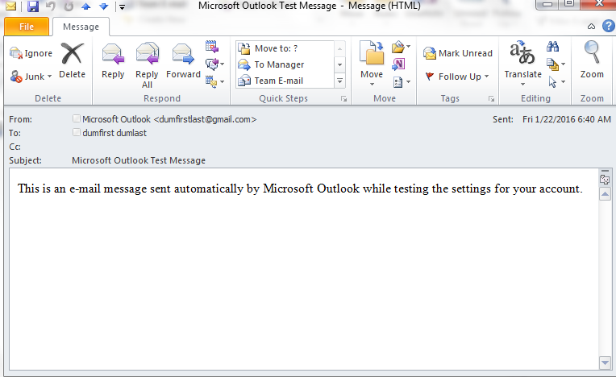

<html><head></head><body>
<h1 class="title topictitle1" id="ariaid-title1">PSTParserAFS</h1>

The PSTParserAFS function parses Personal Storage Table (PST) files
			(which store email in Microsoft software such as Microsoft Outlook and Microsoft
			Exchange Client) directly from Aster File Store (AFS).

You can use the PSTParserAFS function to extract email content for
			customer attrition analysis, customer service analysis, and spam detection. You can also
			input PSTParserAFS output to other <b>ML Engine</b>
			functions, such as Text_Parser, the sentiment extraction functions, and the text
			classification functions.

<h2 class="title topictitle2" id="ariaid-title2">Verifying that AFS is Working</h2>

Because PST Parser works directly on AFS using Aster nCluster Terminal (ACT), AFS must be working before you run the function. To verify that AFS is running, run these commands on the Queen:
<pre class="pre codeblock" xml:space="preserve"><code>\afs -mkdir /test
\afs -ls /</code></pre>

If the second command lists the <code class="ph codeph">/test</code> directory as the output, AFS is working. (For more information about the <code class="ph codeph">\afs</code> command, see <cite class="cite">Teradata Aster® Database User Guide for Aster Appliances</cite> 6.20.

<h2 class="title topictitle2" id="ariaid-title3">PSTParserAFS Syntax</h2>

<h3 class="title sectiontitle">Version 1.2</h3><pre class="pre codeblock" xml:space="preserve"><code>SELECT * FROM PSTParserAFS (
  ON <var class="keyword varname">empty_table</var>
  USING 
  Path ('<var class="keyword varname">input_path</var>' [,...])
  [ Host ('<var class="keyword varname">afs_server_ip_address</var>') ]
  [ Port ('<var class="keyword varname">afs_server_port_number</var>') ]
  [ OutputColumns ({ '<var class="keyword varname">output_column</var>' | '<var class="keyword varname">output_column_range</var>' }[,...] ]
  [ Exclude ('<var class="keyword varname">message_folder</var>' [,...]) ]
) AS <var class="keyword varname">alias</var>;</code></pre>
<b>Note</b>
This function does not need an input table, but <b>SQL</b> functions require at least one input table be provided. You can create an empty table and pass it to the function.

<h2 class="title topictitle2" id="ariaid-title4">PSTParserAFS Arguments</h2>

<dl class="dl parml"><dt class="dt pt dlterm">Path</dt><dd class="dd pd">Specifies the path to the PST files on AFS. The <var class="keyword varname">input_path</var> represents either a directory or a file name, and can use regular expressions. For example:
<ul class="ul" id="tzk1507828743252__ul_o1j_dqp_1cb">
<li class="li"><i>/test</i></li>
<li class="li"><i>/test/testfile.pst</i></li>
<li class="li"><i>/test/*.pst</i></li></ul></dd><dd class="dd pd ddexpand">The PST files must be available on AFS before you call the function.</dd><dd class="dd pd ddexpand">If <var class="keyword varname">input_path</var> represents a directory, the function parses all PST files in the directory.</dd><dd class="dd pd ddexpand">If a file represented by an <var class="keyword varname">input_path</var> is not a PST file, the function does not parse that file and logs an error.</dd><dd class="dd pd ddexpand">A single vworker processes each PST file.</dd><dt class="dt pt dlterm">Host</dt><dd class="dd pd">[Optional] Specifies the IP address of the AFS server.</dd><dd class="dd pd ddexpand">Default: IP address of Queen node</dd><dt class="dt pt dlterm">Port</dt><dd class="dd pd">[Optional] Specifies the port number of the AFS server.</dd><dd class="dd pd ddexpand">Default: 2601</dd><dt class="dt pt dlterm">OutputColumns</dt><dd class="dd pd">[Optional] Specifies the custom columns to output. For the names and descriptions of the default and custom columns, see <a href="ysj1507828671069.md#jlr1507828753907">PSTParserAFS Output</a>. If you specify a column not listed in that output, the function issues an error message.</dd><dd class="dd pd ddexpand">Default behavior: The function outputs only the default columns.</dd><dt class="dt pt dlterm">Exclude</dt><dd class="dd pd">[Optional] Specifies the message folders to exclude while parsing the PST file (for examples, Drafts, Deleted, and Junk). The <var class="keyword varname">message_folder</var> represents either a directory or a file name, and can use regular expressions. If <var class="keyword varname">message_folder</var> represents a directory, the function excludes all PST files in the directory.</dd><dd class="dd pd ddexpand">Default behavior: The function parses all folders in the PST file. However, the function does not parse or output PST files related to Calendar, Contacts, Tasks, or RSS.</dd></dl>

<h2 class="title topictitle2" id="ariaid-title5">PSTParserAFS Input</h2>

The input PST files must be available on AFS before you call the function. To upload a PST file to AFS, use the <code class="ph codeph">\afs -put</code> command in ACT. For example, to copy all PST files in the current directory on your Queen to the <i>/test/</i> directory on AFS, use this command:
<pre class="pre codeblock" xml:space="preserve"><code>\afs -put *.pst /test/</code></pre>

If AFS does not have the specified directory, the command creates the directory before copying the files to it.

Here are more examples for uploading PST files to AFS:
<pre class="pre codeblock" xml:space="preserve"><code>\afs -put /home/beehive/*.pst /test/subdir1/
\afs -put /home/beehive/test1.pst /test/subdir2/
\afs -put /home/beehive/test3.pst /test/subdir3/file1.pst</code></pre>

The third example stores the file test3.pst as file1.pst in AFS.

<h2 class="title topictitle2" id="ariaid-title6">PSTParserAFS Output</h2>

The output table has the default columns and any custom columns specified by the OutputColumns argument. The following table lists and describes the default and custom columns. In the following table, column name aliases are in parentheses (for example, the alias of the message_id column name is id). The function treats aliases as unique column names and processes them independently. Column names are case-insensitive.

The function creates the output table in memory, but you can direct it to a database table on disk or operate on it directly within the <b>SQL</b> framework.

<b>Note</b>
Because "date" and "to" are SQL keywords, you must enclose them with double quotation marks. For example:<pre class="pre codeblock" xml:space="preserve"><code>SELECT sender, id, "to" FROM PSTParserAFS (ON ...)</code></pre>

<table cellpadding="4" cellspacing="0" summary="" id="jlr1507828753907__table_N1000E_N1000C_N10001" class="table" frame="border" border="1" rules="all">
PSTParserAFS Output Table Schema
<colgroup span="1"><col style="width:16.666666666666664%" span="1"></col><col style="width:33.33333333333333%" span="1"></col><col style="width:16.666666666666664%" span="1"></col><col style="width:33.33333333333333%" span="1"></col></colgroup><thead class="thead" style="text-align:left;"><tr class="row"><th class="entry nocellnorowborder" style="vertical-align:top;" id="d247440e261" rowspan="1" colspan="1">Status</th><th class="entry nocellnorowborder" style="vertical-align:top;" id="d247440e263" rowspan="1" colspan="1">Column</th><th class="entry nocellnorowborder" style="vertical-align:top;" id="d247440e265" rowspan="1" colspan="1">Data Type</th><th class="entry cell-norowborder" style="vertical-align:top;" id="d247440e267" rowspan="1" colspan="1">Description</th></tr></thead><tbody class="tbody"><tr class="row"><td class="entry nocellnorowborder" style="vertical-align:top;" headers="d247440e261" rowspan="1" colspan="1">Default</td><td class="entry nocellnorowborder" style="vertical-align:top;" headers="d247440e263" rowspan="1" colspan="1">message_id (<var class="keyword varname">id</var>)</td><td class="entry nocellnorowborder" style="vertical-align:top;" headers="d247440e265" rowspan="1" colspan="1">VARCHAR</td><td class="entry cell-norowborder" style="vertical-align:top;" headers="d247440e267" rowspan="1" colspan="1">Unique identifier (ID) of the message (email), if assigned by the exchange server; blank otherwise. The exchange server does not assign IDs to messages in the Draft, Output, and Sent Items folders. 

To assign a unique global ID to each email message in the output table, concatenate the fields input_path and node_id.
</td></tr><tr class="row"><td class="entry nocellnorowborder" style="vertical-align:top;" headers="d247440e261" rowspan="1" colspan="1">Default</td><td class="entry nocellnorowborder" style="vertical-align:top;" headers="d247440e263" rowspan="1" colspan="1">sender (<var class="keyword varname">sender_name</var>)</td><td class="entry nocellnorowborder" style="vertical-align:top;" headers="d247440e265" rowspan="1" colspan="1">VARCHAR</td><td class="entry cell-norowborder" style="vertical-align:top;" headers="d247440e267" rowspan="1" colspan="1">Display name of the sender.</td></tr><tr class="row"><td class="entry nocellnorowborder" style="vertical-align:top;" headers="d247440e261" rowspan="1" colspan="1">Default</td><td class="entry nocellnorowborder" style="vertical-align:top;" headers="d247440e263" rowspan="1" colspan="1">sender_email_address</td><td class="entry nocellnorowborder" style="vertical-align:top;" headers="d247440e265" rowspan="1" colspan="1">VARCHAR</td><td class="entry cell-norowborder" style="vertical-align:top;" headers="d247440e267" rowspan="1" colspan="1">Email address of the sender.</td></tr><tr class="row"><td class="entry nocellnorowborder" style="vertical-align:top;" headers="d247440e261" rowspan="1" colspan="1">Default</td><td class="entry nocellnorowborder" style="vertical-align:top;" headers="d247440e263" rowspan="1" colspan="1">recipients (<var class="keyword varname">recipient</var>, <var class="keyword varname">recipient_name</var>, <var class="keyword varname">recipients_name</var>, <var class="keyword varname">recipient_names</var>, <var class="keyword varname">recipients_names</var>)</td><td class="entry nocellnorowborder" style="vertical-align:top;" headers="d247440e265" rowspan="1" colspan="1">VARCHAR</td><td class="entry cell-norowborder" style="vertical-align:top;" headers="d247440e267" rowspan="1" colspan="1">Recipient names (from the message fields TO, CC, and BCC).</td></tr><tr class="row"><td class="entry nocellnorowborder" style="vertical-align:top;" headers="d247440e261" rowspan="1" colspan="1">Default</td><td class="entry nocellnorowborder" style="vertical-align:top;" headers="d247440e263" rowspan="1" colspan="1">recipients_email_addresses (<var class="keyword varname">recipient_email_address</var>)</td><td class="entry nocellnorowborder" style="vertical-align:top;" headers="d247440e265" rowspan="1" colspan="1">VARCHAR</td><td class="entry cell-norowborder" style="vertical-align:top;" headers="d247440e267" rowspan="1" colspan="1">Recipient email addresses.</td></tr><tr class="row"><td class="entry nocellnorowborder" style="vertical-align:top;" headers="d247440e261" rowspan="1" colspan="1">Default</td><td class="entry nocellnorowborder" style="vertical-align:top;" headers="d247440e263" rowspan="1" colspan="1">received_date (<var class="keyword varname">receive_date</var>, <var class="keyword varname">date</var>)</td><td class="entry nocellnorowborder" style="vertical-align:top;" headers="d247440e265" rowspan="1" colspan="1">TIMESTAMP</td><td class="entry cell-norowborder" style="vertical-align:top;" headers="d247440e267" rowspan="1" colspan="1">Date and time when the message arrived at the recipient’s mailbox, in this format: <pre class="pre codeblock" xml:space="preserve"><code><var class="keyword varname">yyyy-mm-dd hh</var>:<var class="keyword varname">mm</var>:<var class="keyword varname">ss</var></code></pre>

For example, 2014-02-17 22:34:58.

The date reflects the recipient’s time zone but does not contain time zone information. Time zone information is in the custom column received_date_timezone.
</td></tr><tr class="row"><td class="entry nocellnorowborder" style="vertical-align:top;" headers="d247440e261" rowspan="1" colspan="1">Default</td><td class="entry nocellnorowborder" style="vertical-align:top;" headers="d247440e263" rowspan="1" colspan="1">subject</td><td class="entry nocellnorowborder" style="vertical-align:top;" headers="d247440e265" rowspan="1" colspan="1">VARCHAR</td><td class="entry cell-norowborder" style="vertical-align:top;" headers="d247440e267" rowspan="1" colspan="1">Subject of the message.</td></tr><tr class="row"><td class="entry nocellnorowborder" style="vertical-align:top;" headers="d247440e261" rowspan="1" colspan="1">Default</td><td class="entry nocellnorowborder" style="vertical-align:top;" headers="d247440e263" rowspan="1" colspan="1">contents (<var class="keyword varname">body</var>)</td><td class="entry nocellnorowborder" style="vertical-align:top;" headers="d247440e265" rowspan="1" colspan="1">VARCHAR</td><td class="entry cell-norowborder" style="vertical-align:top;" headers="d247440e267" rowspan="1" colspan="1">Contents of the message (text).</td></tr><tr class="row"><td class="entry nocellnorowborder" style="vertical-align:top;" headers="d247440e261" rowspan="1" colspan="1">Custom</td><td class="entry nocellnorowborder" style="vertical-align:top;" headers="d247440e263" rowspan="1" colspan="1">node_id (<var class="keyword varname">nodeid</var>)</td><td class="entry nocellnorowborder" style="vertical-align:top;" headers="d247440e265" rowspan="1" colspan="1">BIGINT</td><td class="entry cell-norowborder" style="vertical-align:top;" headers="d247440e267" rowspan="1" colspan="1">Node ID of the message, (unique within a PST file). (Within each PST file, each message is represented as a node.)</td></tr><tr class="row"><td class="entry nocellnorowborder" style="vertical-align:top;" headers="d247440e261" rowspan="1" colspan="1">Custom</td><td class="entry nocellnorowborder" style="vertical-align:top;" headers="d247440e263" rowspan="1" colspan="1">input_path</td><td class="entry nocellnorowborder" style="vertical-align:top;" headers="d247440e265" rowspan="1" colspan="1">VARCHAR</td><td class="entry cell-norowborder" style="vertical-align:top;" headers="d247440e267" rowspan="1" colspan="1">Input path location of this PST File on AFS.</td></tr><tr class="row"><td class="entry nocellnorowborder" style="vertical-align:top;" headers="d247440e261" rowspan="1" colspan="1">Custom</td><td class="entry nocellnorowborder" style="vertical-align:top;" headers="d247440e263" rowspan="1" colspan="1">importance</td><td class="entry nocellnorowborder" style="vertical-align:top;" headers="d247440e265" rowspan="1" colspan="1">INTEGER</td><td class="entry cell-norowborder" style="vertical-align:top;" headers="d247440e267" rowspan="1" colspan="1">Level of importance assigned to the Message object by the end user—0 (Low), 1 (Normal), or 2 (High).</td></tr><tr class="row"><td class="entry nocellnorowborder" style="vertical-align:top;" headers="d247440e261" rowspan="1" colspan="1">Custom</td><td class="entry nocellnorowborder" style="vertical-align:top;" headers="d247440e263" rowspan="1" colspan="1">priority</td><td class="entry nocellnorowborder" style="vertical-align:top;" headers="d247440e265" rowspan="1" colspan="1">INTEGER</td><td class="entry cell-norowborder" style="vertical-align:top;" headers="d247440e267" rowspan="1" colspan="1">Priority at which the client requested the message to be sent—0 (Normal) or 1 (Urgent).</td></tr><tr class="row"><td class="entry nocellnorowborder" style="vertical-align:top;" headers="d247440e261" rowspan="1" colspan="1">Custom</td><td class="entry nocellnorowborder" style="vertical-align:top;" headers="d247440e263" rowspan="1" colspan="1">message_size</td><td class="entry nocellnorowborder" style="vertical-align:top;" headers="d247440e265" rowspan="1" colspan="1">BIGINT</td><td class="entry cell-norowborder" style="vertical-align:top;" headers="d247440e267" rowspan="1" colspan="1">Message size on the server, in bytes.</td></tr><tr class="row"><td class="entry nocellnorowborder" style="vertical-align:top;" headers="d247440e261" rowspan="1" colspan="1">Custom</td><td class="entry nocellnorowborder" style="vertical-align:top;" headers="d247440e263" rowspan="1" colspan="1">has_replied</td><td class="entry nocellnorowborder" style="vertical-align:top;" headers="d247440e265" rowspan="1" colspan="1">VARCHAR</td><td class="entry cell-norowborder" style="vertical-align:top;" headers="d247440e267" rowspan="1" colspan="1">Whether the recipient replied to the message—'true' or 'false'.</td></tr><tr class="row"><td class="entry nocellnorowborder" style="vertical-align:top;" headers="d247440e261" rowspan="1" colspan="1">Custom</td><td class="entry nocellnorowborder" style="vertical-align:top;" headers="d247440e263" rowspan="1" colspan="1">has_forwarded</td><td class="entry nocellnorowborder" style="vertical-align:top;" headers="d247440e265" rowspan="1" colspan="1">VARCHAR</td><td class="entry cell-norowborder" style="vertical-align:top;" headers="d247440e267" rowspan="1" colspan="1">Whether the recipient forwarded the message—'true' or 'false'.</td></tr><tr class="row"><td class="entry nocellnorowborder" style="vertical-align:top;" headers="d247440e261" rowspan="1" colspan="1">Custom</td><td class="entry nocellnorowborder" style="vertical-align:top;" headers="d247440e263" rowspan="1" colspan="1">is_flagged</td><td class="entry nocellnorowborder" style="vertical-align:top;" headers="d247440e265" rowspan="1" colspan="1">VARCHAR</td><td class="entry cell-norowborder" style="vertical-align:top;" headers="d247440e267" rowspan="1" colspan="1">Whether the message has a due date—'true' or 'false'.</td></tr><tr class="row"><td class="entry nocellnorowborder" style="vertical-align:top;" headers="d247440e261" rowspan="1" colspan="1">Custom</td><td class="entry nocellnorowborder" style="vertical-align:top;" headers="d247440e263" rowspan="1" colspan="1">received_date_timezone (<var class="keyword varname">timezone</var>, <var class="keyword varname">receive_date_timezone</var>, <var class="keyword varname">date_timezone</var>)</td><td class="entry nocellnorowborder" style="vertical-align:top;" headers="d247440e265" rowspan="1" colspan="1">VARCHAR</td><td class="entry cell-norowborder" style="vertical-align:top;" headers="d247440e267" rowspan="1" colspan="1">Time zone of the received_date value, displayed as an offset from GMT. For example, -0800 is 8 hours behind GMT.</td></tr><tr class="row"><td class="entry nocellnorowborder" style="vertical-align:top;" headers="d247440e261" rowspan="1" colspan="1">Custom</td><td class="entry nocellnorowborder" style="vertical-align:top;" headers="d247440e263" rowspan="1" colspan="1">sent_date (<var class="keyword varname">send_date</var>)</td><td class="entry nocellnorowborder" style="vertical-align:top;" headers="d247440e265" rowspan="1" colspan="1">TIMESTAMP</td><td class="entry cell-norowborder" style="vertical-align:top;" headers="d247440e267" rowspan="1" colspan="1">Date and time when the sender sent the message, in this format:<pre class="pre codeblock" xml:space="preserve"><code><var class="keyword varname">yyyy-mm-dd hh</var>:<var class="keyword varname">mm</var>:<var class="keyword varname">ss</var></code></pre>

For example, 2014-02-17 22:34:58.

The date reflects the sender’s time zone but does not contain time zone information. Time zone information is in the custom column sent_date_timezone.
</td></tr><tr class="row"><td class="entry nocellnorowborder" style="vertical-align:top;" headers="d247440e261" rowspan="1" colspan="1">Custom</td><td class="entry nocellnorowborder" style="vertical-align:top;" headers="d247440e263" rowspan="1" colspan="1">sent_date_timezone (<var class="keyword varname">send_date_timezone</var>)</td><td class="entry nocellnorowborder" style="vertical-align:top;" headers="d247440e265" rowspan="1" colspan="1">VARCHAR</td><td class="entry cell-norowborder" style="vertical-align:top;" headers="d247440e267" rowspan="1" colspan="1">Time zone of the sent_date value, displayed as an offset from GMT. For example, -0800 is 8 hours behind GMT.</td></tr><tr class="row"><td class="entry nocellnorowborder" style="vertical-align:top;" headers="d247440e261" rowspan="1" colspan="1">Custom</td><td class="entry nocellnorowborder" style="vertical-align:top;" headers="d247440e263" rowspan="1" colspan="1">action_date</td><td class="entry nocellnorowborder" style="vertical-align:top;" headers="d247440e265" rowspan="1" colspan="1">TIMESTAMP</td><td class="entry cell-norowborder" style="vertical-align:top;" headers="d247440e267" rowspan="1" colspan="1">Date and time when the recipient acted on the message, in this format:<pre class="pre codeblock" xml:space="preserve"><code><var class="keyword varname">yyyy-mm-dd hh</var>:<var class="keyword varname">mm</var>:<var class="keyword varname">ss</var></code></pre>

For example, 2014-02-17 22:34:58.

The date reflects the recipient’s time zone but does not contain time zone information. Time zone information is in the custom column action_date_timezone.
</td></tr><tr class="row"><td class="entry nocellnorowborder" style="vertical-align:top;" headers="d247440e261" rowspan="1" colspan="1">Custom</td><td class="entry nocellnorowborder" style="vertical-align:top;" headers="d247440e263" rowspan="1" colspan="1">action_date_timezone</td><td class="entry nocellnorowborder" style="vertical-align:top;" headers="d247440e265" rowspan="1" colspan="1">VARCHAR</td><td class="entry cell-norowborder" style="vertical-align:top;" headers="d247440e267" rowspan="1" colspan="1">Time zone of the action_date value, displayed as an offset from GMT. For example, -0800 is 8 hours behind GMT.</td></tr><tr class="row"><td class="entry nocellnorowborder" style="vertical-align:top;" headers="d247440e261" rowspan="1" colspan="1">Custom</td><td class="entry nocellnorowborder" style="vertical-align:top;" headers="d247440e263" rowspan="1" colspan="1">folder (<var class="keyword varname">folder_name</var>)</td><td class="entry nocellnorowborder" style="vertical-align:top;" headers="d247440e265" rowspan="1" colspan="1">VARCHAR</td><td class="entry cell-norowborder" style="vertical-align:top;" headers="d247440e267" rowspan="1" colspan="1">Name of folder that contains the message (for example, 'Inbox' or 'Sent/2014/February').</td></tr><tr class="row"><td class="entry nocellnorowborder" style="vertical-align:top;" headers="d247440e261" rowspan="1" colspan="1">Custom</td><td class="entry nocellnorowborder" style="vertical-align:top;" headers="d247440e263" rowspan="1" colspan="1">sender_ip_address</td><td class="entry nocellnorowborder" style="vertical-align:top;" headers="d247440e265" rowspan="1" colspan="1">VARCHAR</td><td class="entry cell-norowborder" style="vertical-align:top;" headers="d247440e267" rowspan="1" colspan="1">IP address of the sender system (for example, 10.10.143.10).</td></tr><tr class="row"><td class="entry nocellnorowborder" style="vertical-align:top;" headers="d247440e261" rowspan="1" colspan="1">Custom</td><td class="entry nocellnorowborder" style="vertical-align:top;" headers="d247440e263" rowspan="1" colspan="1">to</td><td class="entry nocellnorowborder" style="vertical-align:top;" headers="d247440e265" rowspan="1" colspan="1">VARCHAR</td><td class="entry cell-norowborder" style="vertical-align:top;" headers="d247440e267" rowspan="1" colspan="1">Names of the recipients in the message field TO.</td></tr><tr class="row"><td class="entry nocellnorowborder" style="vertical-align:top;" headers="d247440e261" rowspan="1" colspan="1">Custom</td><td class="entry nocellnorowborder" style="vertical-align:top;" headers="d247440e263" rowspan="1" colspan="1">cc</td><td class="entry nocellnorowborder" style="vertical-align:top;" headers="d247440e265" rowspan="1" colspan="1">VARCHAR</td><td class="entry cell-norowborder" style="vertical-align:top;" headers="d247440e267" rowspan="1" colspan="1">Names of the recipients in the message field CC.</td></tr><tr class="row"><td class="entry nocellnorowborder" style="vertical-align:top;" headers="d247440e261" rowspan="1" colspan="1">Custom</td><td class="entry nocellnorowborder" style="vertical-align:top;" headers="d247440e263" rowspan="1" colspan="1">bcc</td><td class="entry nocellnorowborder" style="vertical-align:top;" headers="d247440e265" rowspan="1" colspan="1">VARCHAR</td><td class="entry cell-norowborder" style="vertical-align:top;" headers="d247440e267" rowspan="1" colspan="1">Names of the recipients in the message field BCC.</td></tr><tr class="row"><td class="entry nocellnorowborder" style="vertical-align:top;" headers="d247440e261" rowspan="1" colspan="1">Custom</td><td class="entry nocellnorowborder" style="vertical-align:top;" headers="d247440e263" rowspan="1" colspan="1">conversation_thread (<var class="keyword varname">thread</var>)</td><td class="entry nocellnorowborder" style="vertical-align:top;" headers="d247440e265" rowspan="1" colspan="1">VARCHAR</td><td class="entry cell-norowborder" style="vertical-align:top;" headers="d247440e267" rowspan="1" colspan="1">Conversation thread of the message—the subject of the first email in the thread, minus the strings 'Re:' and 'Fwd:'.</td></tr><tr class="row"><td class="entry nocellnorowborder" style="vertical-align:top;" headers="d247440e261" rowspan="1" colspan="1">Custom</td><td class="entry nocellnorowborder" style="vertical-align:top;" headers="d247440e263" rowspan="1" colspan="1">number_of_attachments</td><td class="entry nocellnorowborder" style="vertical-align:top;" headers="d247440e265" rowspan="1" colspan="1">INTEGER</td><td class="entry cell-norowborder" style="vertical-align:top;" headers="d247440e267" rowspan="1" colspan="1">Number of files attached to the message.</td></tr><tr class="row"><td class="entry nocellnorowborder" style="vertical-align:top;" headers="d247440e261" rowspan="1" colspan="1">Custom</td><td class="entry nocellnorowborder" style="vertical-align:top;" headers="d247440e263" rowspan="1" colspan="1">attachment_size</td><td class="entry nocellnorowborder" style="vertical-align:top;" headers="d247440e265" rowspan="1" colspan="1">BIGINT</td><td class="entry cell-norowborder" style="vertical-align:top;" headers="d247440e267" rowspan="1" colspan="1">Total size of files attached to the message, in bytes.</td></tr><tr class="row"><td class="entry nocellnorowborder" style="vertical-align:top;" headers="d247440e261" rowspan="1" colspan="1">Custom</td><td class="entry nocellnorowborder" style="vertical-align:top;" headers="d247440e263" rowspan="1" colspan="1">list_of_attachments (<var class="keyword varname">attachments</var>)</td><td class="entry nocellnorowborder" style="vertical-align:top;" headers="d247440e265" rowspan="1" colspan="1">VARCHAR</td><td class="entry cell-norowborder" style="vertical-align:top;" headers="d247440e267" rowspan="1" colspan="1">Names of files attached to the message.</td></tr><tr class="row"><td class="entry row-nocellborder" style="vertical-align:top;" headers="d247440e261" rowspan="1" colspan="1">Custom</td><td class="entry row-nocellborder" style="vertical-align:top;" headers="d247440e263" rowspan="1" colspan="1">message_type</td><td class="entry row-nocellborder" style="vertical-align:top;" headers="d247440e265" rowspan="1" colspan="1">VARCHAR</td><td class="entry cellrowborder" style="vertical-align:top;" headers="d247440e267" rowspan="1" colspan="1">Type of the message (MessageClass). A Normal message has type IPM. Some other qualified types are:
<ul class="ul" id="jlr1507828753907__ul_fh1_fyl_px">
<li class="li">IPM.Contact</li>
<li class="li">IPM.Appointment</li>
<li class="li">IPM.Activity</li>
<li class="li">IPM.Report</li>
<li class="li">IPM.Task</li>
<li class="li">IPM.Recall.Report</li></ul>

For a list of all qualified message classes, and more information, see the Microsoft website.
</td></tr></tbody></table>

<h2 class="title topictitle2" id="ariaid-title7">Alternative Way to Run PSTParserAFS</h2>

Another way to run <code class="ph codeph">PSTParserAFS</code> is to use the <code class="ph codeph">table_from_afs</code> function:
<pre class="pre codeblock" xml:space="preserve"><code>SELECT * FROM table_from_afs (
  ON <var class="keyword varname">empty_table</var>
  USING
  Path ('<var class="keyword varname">input_path</var>' [,...])
  [ Host ('<var class="keyword varname">afs_server_ip_address</var>') ]
  [ Port ('<var class="keyword varname">afs_server_port_number</var>') ]
  Input_Format (
    'com.asterdata.sqlmr.analytics.parser.PSTParserAFS.inputformat.PSTInputFormat',
    'columns <var class="keyword varname">colname</var> [,...] STRINGS' [, 'exclude <var class="keyword varname">MessageFolder1</var> [,...] STRINGS'] )
  SerDe ('com.asterdata.sqlmr.analytics.parser.PSTParserAFS.serde.PSTSerDe',
    'field.delim=1', 'escape.delim=27')
  OutputColumns ('<var class="keyword varname">colname coltype</var>' [, ...]]
) AS <var class="keyword varname">alias</var>;</code></pre>

In the Input_Format argument, you can specify the output column names and folders to exclude.

For more information about the <code class="ph codeph">table_from_afs</code> function, see the <cite class="cite">Teradata Aster® Database User Guide for Aster Appliances</cite> 6.20.

<h2 class="title topictitle2" id="ariaid-title8">PSTParserAFS Examples</h2>

These examples assume that the PST files are stored in AFS in the directory <i>/test/</i>. You can find the <i>dum1.pst</i> input file for these examples in directory <i>pstParserFiles</i> (provided with the function) and download them to the AFS directory<i>/test/</i>. (For instructions for setting up AFS, see <a href="ysj1507828671069.md#nto1507828734675">Verifying that AFS is Working</a>.) Examples 1 and 2 show input and output; the others show only SQL calls.

<h3 class="title topictitle3" id="ariaid-title9">Example 1: Single PST File, Default Output Fields</h3>

<h4 class="title topictitle4" id="ariaid-title10">PSTParserAFS Example 1 Input</h4>

The input file is a PST file that contains information about an email. The following figure shows how the email looks in Outlook. (The sender and recipient are the same.)

<table cellpadding="4" cellspacing="0" summary="" id="aue1507828776620__table_N10014_N1000E_N1000C_N10001" class="table" frame="border" border="1" rules="all">
PSTParserAFS Example 1 Input Table dum1.pst (Columns 1-4)
<colgroup span="1"><col style="width:25%" span="1"></col><col style="width:25%" span="1"></col><col style="width:25%" span="1"></col><col style="width:25%" span="1"></col></colgroup><thead class="thead" style="text-align:left;"><tr class="row"><th class="entry nocellnorowborder" style="vertical-align:top;" id="d247440e785" rowspan="1" colspan="1">message_id</th><th class="entry nocellnorowborder" style="vertical-align:top;" id="d247440e787" rowspan="1" colspan="1">sender</th><th class="entry nocellnorowborder" style="vertical-align:top;" id="d247440e789" rowspan="1" colspan="1">sender_email_address</th><th class="entry cell-norowborder" style="vertical-align:top;" id="d247440e791" rowspan="1" colspan="1">recipients</th></tr></thead><tbody class="tbody"><tr class="row"><td class="entry row-nocellborder" style="vertical-align:top;" headers="d247440e785" rowspan="1" colspan="1"><56a23f55.53adca0a.b5ff9.ffffc1e8@mx.google.com></td><td class="entry row-nocellborder" style="vertical-align:top;" headers="d247440e787" rowspan="1" colspan="1">Microsoft Outlook</td><td class="entry row-nocellborder" style="vertical-align:top;" headers="d247440e789" rowspan="1" colspan="1">dumfirstlast@gmail.com</td><td class="entry cellrowborder" style="vertical-align:top;" headers="d247440e791" rowspan="1" colspan="1">dumfirst dumlast</td></tr></tbody></table>

<table cellpadding="4" cellspacing="0" summary="" id="aue1507828776620__table_N10055_N1000E_N1000C_N10001" class="table" frame="border" border="1" rules="all">
PSTParserAFS Example 1 Input Table dum1.pst (Columns 5-8)
<colgroup span="1"><col style="width:25%" span="1"></col><col style="width:25%" span="1"></col><col style="width:25%" span="1"></col><col style="width:25%" span="1"></col></colgroup><thead class="thead" style="text-align:left;"><tr class="row"><th class="entry nocellnorowborder" style="vertical-align:top;" id="d247440e813" rowspan="1" colspan="1">recipients_email_addresses</th><th class="entry nocellnorowborder" style="vertical-align:top;" id="d247440e815" rowspan="1" colspan="1">received_date</th><th class="entry nocellnorowborder" style="vertical-align:top;" id="d247440e817" rowspan="1" colspan="1">subject</th><th class="entry cell-norowborder" style="vertical-align:top;" id="d247440e819" rowspan="1" colspan="1">contents</th></tr></thead><tbody class="tbody"><tr class="row"><td class="entry row-nocellborder" style="vertical-align:top;" headers="d247440e813" rowspan="1" colspan="1">dumfirstlast@gmail.com</td><td class="entry row-nocellborder" style="vertical-align:top;" headers="d247440e815" rowspan="1" colspan="1">2016-01-22 06:40:21</td><td class="entry row-nocellborder" style="vertical-align:top;" headers="d247440e817" rowspan="1" colspan="1">Microsoft Outlook Test Message</td><td class="entry cellrowborder" style="vertical-align:top;" headers="d247440e819" rowspan="1" colspan="1">This is an e-mail message sent automatically by Microsoft Outlook while testing the settings for your account.</td></tr></tbody></table>

PSTParserAFS Input File Email in Outlook
  </img>  

<h4 class="title topictitle4" id="ariaid-title11">PSTParserAFS Example 1 SQL Call</h4>

<pre class="pre codeblock" xml:space="preserve"><code>SELECT * FROM PSTParserAFS (
  ON empty_table
  USING
  Path ('/test/dum1.pst')
) AS dt;</code></pre>

<h4 class="title topictitle4" id="ariaid-title12">PSTParserAFS Example 1 Output</h4>

<table cellpadding="4" cellspacing="0" summary="" id="pna1507828788433__table_N1000E_N1000C_N10001" class="table" frame="border" border="1" rules="all">
PSTParserAFS Example 1 Output Table dum1.pst (Columns 1-4)
<colgroup span="1"><col style="width:25%" span="1"></col><col style="width:25%" span="1"></col><col style="width:25%" span="1"></col><col style="width:25%" span="1"></col></colgroup><thead class="thead" style="text-align:left;"><tr class="row"><th class="entry nocellnorowborder" style="vertical-align:top;" id="d247440e870" rowspan="1" colspan="1">message_id</th><th class="entry nocellnorowborder" style="vertical-align:top;" id="d247440e872" rowspan="1" colspan="1">sender</th><th class="entry nocellnorowborder" style="vertical-align:top;" id="d247440e874" rowspan="1" colspan="1">sender_email_address</th><th class="entry cell-norowborder" style="vertical-align:top;" id="d247440e876" rowspan="1" colspan="1">recipients</th></tr></thead><tbody class="tbody"><tr class="row"><td class="entry row-nocellborder" style="vertical-align:top;" headers="d247440e870" rowspan="1" colspan="1"><56a23f55.53adca0a.b5ff9.ffffc1e8@mx.google.com></td><td class="entry row-nocellborder" style="vertical-align:top;" headers="d247440e872" rowspan="1" colspan="1">Microsoft Outlook</td><td class="entry row-nocellborder" style="vertical-align:top;" headers="d247440e874" rowspan="1" colspan="1">dumfirstlast@gmail.com</td><td class="entry cellrowborder" style="vertical-align:top;" headers="d247440e876" rowspan="1" colspan="1">dumfirst dumlast</td></tr></tbody></table>

<table cellpadding="4" cellspacing="0" summary="" id="pna1507828788433__table_N1004F_N1000C_N10001" class="table" frame="border" border="1" rules="all">
PSTParserAFS Example 1 Output Table dum1.pst (Columns 5-8)
<colgroup span="1"><col style="width:30.232558139534888%" span="1"></col><col style="width:23.25581395348837%" span="1"></col><col style="width:23.25581395348837%" span="1"></col><col style="width:23.25581395348837%" span="1"></col></colgroup><thead class="thead" style="text-align:left;"><tr class="row"><th class="entry nocellnorowborder" style="vertical-align:top;" id="d247440e898" rowspan="1" colspan="1">recipients_email_addresses</th><th class="entry nocellnorowborder" style="vertical-align:top;" id="d247440e900" rowspan="1" colspan="1">received_date</th><th class="entry nocellnorowborder" style="vertical-align:top;" id="d247440e902" rowspan="1" colspan="1">subject</th><th class="entry cell-norowborder" style="vertical-align:top;" id="d247440e904" rowspan="1" colspan="1">contents</th></tr></thead><tbody class="tbody"><tr class="row"><td class="entry row-nocellborder" style="vertical-align:top;" headers="d247440e898" rowspan="1" colspan="1">dumfirstlast@gmail.com</td><td class="entry row-nocellborder" style="vertical-align:top;" headers="d247440e900" rowspan="1" colspan="1">2016-01-22 06:40:21</td><td class="entry row-nocellborder" style="vertical-align:top;" headers="d247440e902" rowspan="1" colspan="1">Microsoft Outlook Test Message</td><td class="entry cellrowborder" style="vertical-align:top;" headers="d247440e904" rowspan="1" colspan="1">This is an e-mail message sent automatically by Microsoft Outlook while testing the settings for your account.</td></tr></tbody></table>

<h3 class="title topictitle3" id="ariaid-title13">Example 2: Single PST File, Specified Output Fields</h3>

<h4 class="title topictitle4" id="ariaid-title14">PSTParserAFS Example 2 Input</h4>

The input file is dum1.pst.

<h4 class="title topictitle4" id="ariaid-title15">PSTParserAFS Example 2 SQL Call</h4>

<pre class="pre codeblock" xml:space="preserve"><code>SELECT input_path, sender, "to" FROM PSTParserAFS (
  ON empty_table
  USING
  Path ('/test/dum1.pst')
  OutputColumns ('input_path', 'to')
) AS dt;</code></pre>

<h4 class="title topictitle4" id="ariaid-title16">PSTParserAFS Example 2 Output</h4>

<table cellpadding="4" cellspacing="0" summary="" id="azu1507828808472__table_N1000E_N1000C_N10001" class="table" frame="border" border="1" rules="all">
PSTParserAFS Example 2 Output Table
<colgroup span="1"><col style="width:25%" span="1"></col><col style="width:37.5%" span="1"></col><col style="width:37.5%" span="1"></col></colgroup><thead class="thead" style="text-align:left;"><tr class="row"><th class="entry nocellnorowborder" style="vertical-align:top;" id="d247440e968" rowspan="1" colspan="1">input_path</th><th class="entry nocellnorowborder" style="vertical-align:top;" id="d247440e970" rowspan="1" colspan="1">sender</th><th class="entry cell-norowborder" style="vertical-align:top;" id="d247440e972" rowspan="1" colspan="1">to</th></tr></thead><tbody class="tbody"><tr class="row"><td class="entry row-nocellborder" style="vertical-align:top;" headers="d247440e968" rowspan="1" colspan="1">/test/dum1.pst</td><td class="entry row-nocellborder" style="vertical-align:top;" headers="d247440e970" rowspan="1" colspan="1">Microsoft Outlook</td><td class="entry cellrowborder" style="vertical-align:top;" headers="d247440e972" rowspan="1" colspan="1">dumfirst dumlast</td></tr></tbody></table>

<h3 class="title topictitle3" id="ariaid-title17">PSTParserAFS Example 3: Directory of PST Files, Exclude Argument</h3>

This <b>SQL</b> call parses all PST files in the directory <i>/test/</i>, excluding those in subdirectories <i>Drafts</i>, <i>Deleted Items</i>, <i>Notes</i>, and <i>Sent Items</i>:
<pre class="pre codeblock" xml:space="preserve"><code>SELECT * FROM PSTParserAFS (
  ON empty_table
  USING
  Path ('/test/')
  Exclude ('Drafts', 'Deleted Items', 'Notes', 'Sent Items')
) AS dt;</code></pre>

<h3 class="title topictitle3" id="ariaid-title18">PSTParserAFS Example 4: Path and Exclude Arguments with Regular Expressions</h3>

This <b>SQL</b> call parses all PST files in <i>/test/</i> subdirectories <i>test1</i> through <i>test9</i>, excluding those in subdirectory <i>Sent Items/2012/</i>:
<pre class="pre codeblock" xml:space="preserve"><code>SELECT * FROM PSTParserAFS (
  ON empty_table
  USING
  Path ('/test[1-9]/[a-z]*')
  Exclude ('Sent I[a-z]*/2012/[a-z]')
) AS dt;</code></pre>

<h3 class="title topictitle3" id="ariaid-title19">PSTParserAFS Example 5: Multiple PST Files, Specified Host and AFS Server Port Attributes</h3>

<pre class="pre codeblock" xml:space="preserve"><code>SELECT * FROM PSTParserAFS (
  ON empty_table
  USING
  Path ('/test/dum1.pst', '/test/test2.pst', '/test/dir1/')
  Host ('192.0.2.10')
  Port ('2601')
) AS dt;</code></pre>

<h3 class="title topictitle3" id="ariaid-title20">PSTParserAFS Example 6: Using table_from_afs</h3>

This <b>SQL</b> call uses the <a href="ysj1507828671069.md#lch1507828762081">Alternative Way to Run PSTParserAFS</a>:
<pre class="pre codeblock" xml:space="preserve"><code>SELECT * FROM table_from_afs (
  ON empty_table
  USING
  Path ('/test/dum1.pst')
  Input_Format (
    'com.asterdata.sqlmr.analytics.parser.PSTParserAFS.inputformat.PSTInputFormat',
    'columns Sender,folder,Message_ID STRINGS',
    'exclude Sent\\sItems STRINGS')
  SerDe (
    'com.asterdata.sqlmr.analytics.parser.PSTParserAFS.serde.PSTSerDe',     'field.delim=1',
    'escape.delim=27')
  OutputColumns ('Sender varchar', 'folder varchar', 'Message_ID varchar')
) AS dt;</code></pre>

</body></html>
