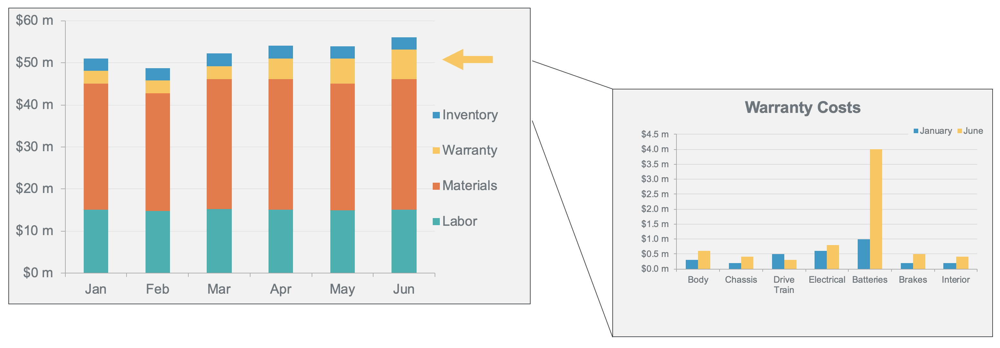
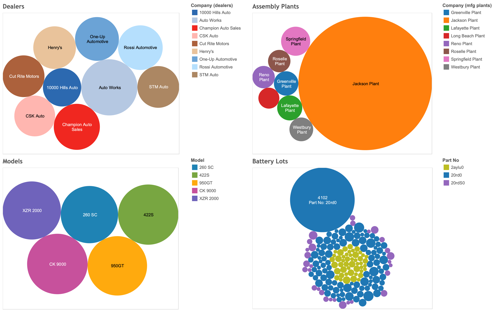

## Manufacturing Defect Analysis


### Introduction

You are an analyst for a major electronic vehicle (EV) manufacturer. While running regular financial reports on Teradata Vantage, you discover a serious business issue with increasing warranty repairs:



The issue is primarily driven by battery-pack replacements, which are one of the most expensive and critical components in the EVs. Using the structured and semi-structured data that Vantage captures during the manufacturing process, you can isolate and address the issue.

### Experience

The Experience section takes about 15 minutes to run.


### Walkthrough
***

#### Step 1: Narrow down the root cause.

Do preliminary analysis and run a report of all vehicle identification numbers (VIN) of cars that needed a battery replacement under warranty:


```sql
SELECT d.company, count(*)
FROM EVCarBattery.dealers d, EVCarBattery.badbatts bb,
EVCarBattery.vehicles v
WHERE bb.vin = v.vin
AND v.dealer_id = d.id
GROUP BY d.company order by 2 desc
```


Next, look at the various car models that have those batteries. The same set of battery parts are used in several different models across the product line:


```sql
SELECT v.model, count(*)
FROM EVCarBattery.vehicles v, EVCarBattery.badbatts bb
WHERE bb.vin = v.vin
GROUP BY v.model order by 2 desc
```

There's nothing significant there, so keep looking.

Find out from which assembly plants the cars are coming:


```sql
SELECT mfg.company, count(*)
FROM EVCarBattery.mfg_plants mfg, EVCarBattery.badbatts bb,
EVCarBattery.vehicles v
WHERE bb.vin = v.vin
AND v.mfg_plant_id = mfg.id
GROUP BY mfg.company order by 2 desc
```

A very high number of faulty cars came from the same assembly plant!

Find out what battery cells are installed in the cars with bad batteries:


```sql
SELECT DISTINCT bom.part_no, p.description, count(*)
FROM EVCarBattery.bom, EVCarBattery.badbatts bb, EVCarBattery.parts p
WHERE bb.vin = bom.vin
AND bom.part_no = p.part_no
AND p.description LIKE 'Battery Cell%'
GROUP BY bom.part_no, p.description
```

It looks like there is an issue with part_no '20rd0'!

Detailed manufacturing data is stored in the integrated data warehouse. See if there is a correlation with lot numbers for those battery cells:


```sql
SELECT bom.part_no, bom.lot_no, p.description, count(*)
FROM EVCarBattery.bom bom, EVCarBattery.badbatts bb, EVCarBattery.parts p
WHERE bb.vin = bom.vin
AND p.part_no = bom.part_no
AND p.description LIKE 'Battery Cell%'
GROUP BY bom.part_no, bom.lot_no, p.description
ORDER BY count(*) DESC
```

The underlying issue with part_no '20rd0' is clear. The majority of the failures are from battery lot '4012', which has been delivered to the Jackson Plant and has a huge number of the faulty batteries that are driving the warranty replacements. These insights show up even better on the dashboard of your favorite BI tool that connects directly to Vantage and allows interactive and iterative analysis:



Modern-connected EV cars provide detailed sensor data as well. You can also look at the temperature sensor data for the battery lot in question:


Compare that to an average battery lot:


The occurrences of higher temperatures and overheating in the battery packs are related to the battery pack model and lot number. You need to identify the underlying cause of the increased warranty costs and prevent it in the future. This requires you to dig deeper and go back to when the cars were assembled and tested.

#### Step 2: Get additional data. Access test results from Data Lake.

You want to understand how to detect bad batteries before they end up in your customers' cars. This will help you avoid expensive warranty repair cycles and poor customer satisfaction in the future. When the cars are manufactured, you store detailed test reports for the various parts and subsystems that make up the vehicle. The reports are voluminous, semi-structured data that is loaded directly into the Data Lake and housed in an object store.

Using Teradata Vantage, you can natively pull in this data for analysis.

Create an authorization object and uncomment the EXTERNAL SECURITY clauses in the statements below:


```sql
CREATE AUTHORIZATION MyAuth
USER 'ACCESS_KEY_ID'
PASSWORD 'SECRET_ACCESS_KEY';
```

Create a foreign table to access the JSON-formatted data in Amazon S3:


```sql
CREATE FOREIGN TABLE test_reports
-- , EXTERNAL SECURITY MyAuth
(
    Location VARCHAR(2048) CHARACTER SET UNICODE CASESPECIFIC,
    payload JSON(16776192) INLINE LENGTH 64000 CHARACTER SET LATIN)
USING (
    Location ('/s3/s3.amazonaws.com/trial-datasets/EVCarBattery')
), NO PRIMARY INDEX
```


```sql
SELECT TOP 10 *
FROM test_reports
```

Put a user-friendly view on top of the foreign table to shred the files and make the test report data easier to access:


```sql
REPLACE VIEW test_reports_v AS
(SELECT vin, part_no, lot_no, CAST(test_report AS JSON) test_report
FROM TD_JSONSHRED(
    ON (
                SELECT payload.vin as vin, payload
                FROM test_reports)
            USING
            ROWEXPR('parts')
            COLEXPR('part_no', 'lot_no', 'test_report') 
            RETURNTYPES('VARCHAR(17)', 'VARCHAR(1000)', 'VARCHAR(10000)')
        ) AS d1 (vin, part_no, lot_no, test_report)
    )
```

```sql
SELECT TOP 10 *
FROM test_reports_v
```

#### Step 3: Access and join the JSON manufacturing test data natively in Vantage.

Take a good look at the test reports. Various parts will have different data that gets reported when testing. The test results for the simplest parts look like this:


```sql
SELECT TOP 1 test_report
FROM test_reports_v
WHERE part_no = '11400zn'
```

In contrast, the test report for a battery has detailed data on the performance of the battery after it is assembled, but before it goes into the vehicle:


```sql
SELECT TOP 1 test_report
FROM test_reports_v
WHERE part_no = '20rdS0'
```


You want to compare the rated and measured capacities along with part and lot numbers for just the batteries. You can easily drill into the JSON data using simple dot notation to access the test resuls you need:


```sql
SELECT TOP 10 tr.part_no, p.description, tr.lot_no, 
tr.test_report."Rated Capacity" AS rated_capacity,
tr.test_report."Static Capacity Test"."Measured Average Capacity" AS measured_capacity
FROM EVCarBattery.parts p, test_reports_v tr
WHERE  p.part_no = tr.part_no
AND p.description LIKE 'Battery Cell%'
```

Visualising this in your BI tool, you can see that these battery packs are actually within the spec, but the range is much lower than the other battery lots. With this insight, you can tighten up your acceptance criteria as well as do proactive analysis to identify possible quality issues before the cars are completed and delivered to your customers. These initiatives will increase product quality and make sure this doesn't happen again!


By using Teradata Vantage to analyze both integrated data and the Data Lake, you get to the bottom of virtually any business problem quickly and easily!

#### Step 4: Cleanup.

Drop the objects you created in your own database schema:


```sql
DROP TABLE test_reports;
```

```sql
DROP VIEW test_reports_v;
```

```sql
DROP AUTHORIZATION MyAuth
```


## Dataset
***

<b>bom</b> - Bill of materials that contains all major parts that make up each vehicle:


- `id`: unique identifier
- `vin`: vehicle identification number
- `part_no`: part number
- `vendor_id`: vendor the part was produced by (unused)
- `lot_no`: lot number from the vendor
- `quantity`: how many of this part are in the vehicle

<b>dealers</b> - Vehicle sales and distributors:


- `id`: unique identifier
- `Company`: company name
- `StreetAddress`: street address
- `City`: city
- `State`: state
- `ZipCode`: postcode
- `Country`: country
- `EmailAddress`: main email address
- `TelephoneNumber`: telephone number
- `DomainName`: URL for company website
- `Latitude`: latitude (location)
- `Longitude`: longitude (location

<b>mfg_plants</b> - Manufacturing facilities:


- `id`: unique identifier
- `Company`: facility name
- `StreetAddress`: street address
- `City`: city
- `State`: state
- `ZipCode`: postcode
- `Country`: country
- `EmailAddress`: main email address
- `TelephoneNumber`: telephone number
- `DomainName`: URL for plant website
- `Latitude`: latitude (location)
- `Longitude`: longitude (location

<b>parts</b> - Master list of parts for all vehicles:


- `part_no`: unique part number
- `description`: part description

<b>vehicles</b> - Vehicles you have built or are building:


- `vin`: unique identifier
- `yr`: model year
- `model`: vehicle model code
- `customer_id`: customer / purchaser
- `dealer_id`: dealer where vehicle was sold/delivered
- `mfg_plant_id`: plant the vehicle was assembled

