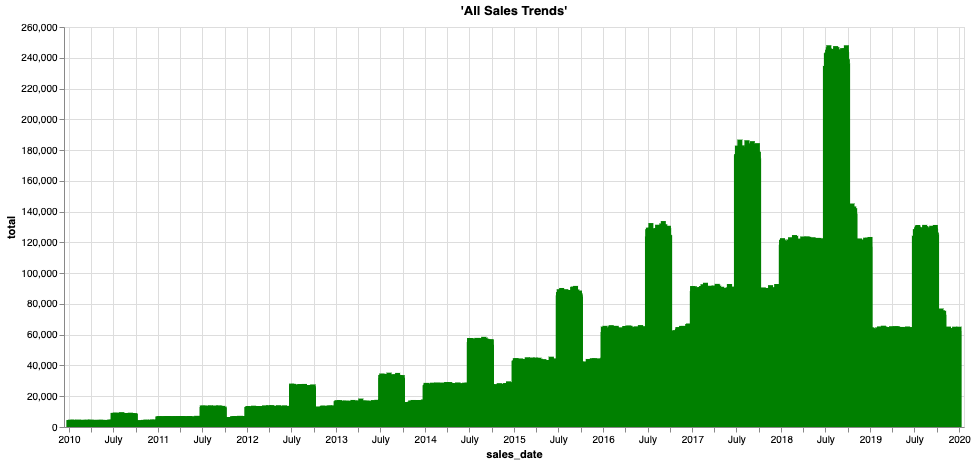

## Deep History - Offloading Cold Historical Data to an Object Store


### Introduction

Increasingly stringent regulations require companies to keep data online and accessible for regulatory compliance for many years. Although the most frequently accessed data is the latest or most current data, that doesn’t mean that older information is not useful or relevant. Historical data that has been compiled over the years gives a rich perspective of the business, such as long-term trends and cyclical patterns.

Teradata Vantage provides unmatched concurrency and performance for the world's largest and most demanding enterprises to analyze their data. Analysis and concurrency needs for older information are generally substantially less as data ages. Over time, there is much more history data that accumulates than current 'hot' data. It makes sense to store that data somewhere that has different performance and price characteristics, like Amazon S3 or Azure Blob storage.

Keeping historical and current data in separate systems can make it a challenge to gain unique insights that are possible only by analyzing the information together. But not any longer. Now, Teradata Vantage can be used to seamlessly join together all the historical and current information across the data warehouse and object storage, without having to change the basic data structures and queries. This makes it possible to cost-effectively answer questions that could not be answered previously and enable decision makers to plan better for the future.

### Experience

The Experience section takes about 10 minutes to run.

First, create an AUTHORIZATION object named MyAuth with your credentials. Alternatively, you can use the AUTHORIZATION simple syntax commented in certain queries:

```sql
CREATE AUTHORIZATION MyAuth
USER 'ACCESS_KEY_ID'
PASSWORD 'SECRET_ACCESS_KEY';
```


### Walkthrough

#### Step 1: Query the data.

Here is your current sales data. Grab some sample rows. This example includes customer, store, basket, and discount information:


```sql
SELECT TOP 10 * 
FROM SalesOffload.sales_fact
```


```sql
SELECT sales_date, sum(sales_quantity) as total 
FROM SalesOffload.sales_fact
GROUP BY sales_date
ORDER BY sales_date ASC
```


```sql
SELECT MIN(sales_date) AS min_date, MAX(sales_date) AS max_date FROM SalesOffload.sales_fact
```

How many records do you have in the data warehouse (2019 data)?


```sql
SELECT COUNT(*)
FROM SalesOffload.sales_fact
```


#### Step 2: Explore offloaded historical data.

You have only one year of sales data in the data warehouse because this is by far the most queried. For compliance, many companies need to keep up to 10 years of historical data. The older data is exported from Vantage on a monthly basis and loaded into Amazon S3 for long-term storage. With Teradata Vantage, you can seamlessly access this offloaded data and join it with the rest of the data to get insights over long-term trends and handle audit requests with ease. This includes using existing queries and reports that would otherwise need to be rewritten!

You know the bucket where the offloaded sales data is located, so look at some of the data there. Use the READ_NOS function to get the list of files and their sizes:


```sql
SELECT location(char(255)), ObjectLength
FROM (
 LOCATION='/s3/s3.amazonaws.com/trial-datasets/SalesOffload'
 RETURNTYPE='NOSREAD_KEYS'
 AUTHORIZATION=MyAuth
 --AUTHORIZATION='{"access_id":"ACCESS_KEY_ID","access_key":"SECRET_ACCESS_KEY"}'
) as d
ORDER BY 1
```


How many files and directories are there total?


```sql
SELECT COUNT(location(char(255))) as NumFiles
FROM (
 LOCATION='/s3/s3.amazonaws.com/trial-datasets/SalesOffload'
 RETURNTYPE='NOSREAD_KEYS'
 AUTHORIZATION=MyAuth
 --AUTHORIZATION='{"access_id":"ACCESS_KEY_ID","access_key":"SECRET_ACCESS_KEY"}'
) as d
ORDER BY 1
```


Let's take a look at one of the files to get a better understanding of the file format:


```sql
SELECT * FROM (
      LOCATION ='/s3/s3.amazonaws.com/trial-datasets/SalesOffload/2010/1/object_33_0_1.parquet'
      RETURNTYPE='NOSREAD_PARQUET_SCHEMA'
      AUTHORIZATION=MyAuth
      --AUTHORIZATION='{"access_id":"ACCESS_KEY_ID","access_key":"SECRET_ACCESS_KEY"}'
      )
AS d
```


#### Step 3: Create a simple abstraction layer for easy access.

Create a foreign table and a view in Vantage to allow business analysts and other users to easily access the offloaded historical data:


```sql
CREATE FOREIGN TABLE sales_fact_offload
, EXTERNAL SECURITY MyAuth
USING
       (
LOCATION  ('/s3/s3.amazonaws.com/trial-datasets/SalesOffload')
STOREDAS  ('PARQUET')
       )
NO PRIMARY INDEX
PARTITION BY COLUMN;
```

Take a look at some of the rows that are in the offloaded files: 


```sql
SELECT TOP 10 *
FROM sales_fact_offload;
```

How much data do you have out there?


```sql
SELECT COUNT(*)
FROM sales_fact_offload;
```


Ok, you are close! Now you want the data to look like a native table. So put a view on top to split it out into columns. With CSV-formatted data, you need to reference the column names with two dots: 


```sql
REPLACE VIEW sales_fact_offload_v as (  
SELECT 
    sales_date,
    customer_id,
    store_id,
    basket_id,
    product_id,
    sales_quantity,
    discount_amount
FROM sales_fact_offload);
```


Now, you can query the data like any other table in Teradata Vantage, but the data is pulled at query runtime directly from the object store! You have a seamless analytic experience by supporting the correlation of object store-based data sets with structured data sets in Teradata relational tables using existing SQL skills and workflows: 


```sql
SELECT TOP 10 *
FROM sales_fact_offload_v;
```

That looks great! Now your users can access all the historical data you have in the object store!

You can do everything in a view over a foreign table that you would do with a standard database view. This includes returning only a subset of the underlying table columns and adding a WHERE clause in the view to limit what rows are made available using the view.

To make it easy to look at just a portion of the vast amount of data at any time, it's stored by year and month. Now, redefine the foreign table so you can prefilter the data when reading it.

#### Step 4: Optimize the foreign table and view for efficient access.

You have a lot of data in S3! Let's optimize the foreign table to minimize the data you have to read when querying the object store. Designing an object store bucket and path structure is an important first step when creating an object store. It requires knowledge of the business needs, the expected patterns in accessing the data, an understanding of the data, and a sensitivity to the tradeoffs. In this case, you will often know the approximate date you are looking at and can use it to your advantage.


```sql
DROP TABLE sales_fact_offload;
```

```sql
CREATE FOREIGN TABLE sales_fact_offload
, EXTERNAL SECURITY MyAuth
USING
       (
LOCATION  ('/s3/s3.amazonaws.com/trial-datasets/SalesOffload')
PATHPATTERN ('$dir1/$year/$month')
STOREDAS  ('PARQUET')
       )
NO PRIMARY INDEX
PARTITION BY COLUMN;
```

You have re-defined your foreign table to include a <b>PATHPATTERN</b> clause. When looking at historical data by date, this allows you to read only the files you need!

Now, recreate your user-friendly view that allows for path filtering:


```sql
REPLACE VIEW sales_fact_offload_v as (  
SELECT 
    CAST($path.$year AS CHAR(4)) sales_year,
    CAST($path.$month AS CHAR(2)) sales_month,
    sales_date,
    customer_id,
    store_id,
    basket_id,
    product_id,
    sales_quantity,
    discount_amount
FROM sales_fact_offload);
```


```sql
SELECT TOP 10 *
FROM sales_fact_offload_v
WHERE sales_year = '2010'
AND sales_month = '9';
```

This is great for use cases where you know the date at least to the month. Suppose you need to see what a customer bought many years ago. Or maybe you want to report on historical store sales. The business analyst can easily query this with no IT intervention and no going to backups or other hard to reach data silos!

Look at what store 6 did for sales back in August 2012:


```sql
SELECT store_id, SUM(sales_quantity)
FROM sales_fact_offload_v
WHERE store_id = 6
AND sales_year = '2012'
AND sales_month = '8'
GROUP BY 1;
```


Join the historical data with the current data so you can see the full picture:


```sql
REPLACE VIEW sales_fact_all as (
SELECT sales_date,
    customer_id,
    store_id,
    basket_id,
    product_id,
    sales_quantity,
    discount_amount
    FROM SalesOffload.sales_fact
    UNION ALL
SELECT 
    sales_date,
    customer_id,
    store_id,
    basket_id,
    product_id,
    sales_quantity,
    discount_amount
FROM sales_fact_offload_v);
```

Lastly, rerun the sales over time report. The code is not different, but now you are able to analyze all sales data and not just the most recent year:


```sql
SELECT sales_date, sum(sales_quantity) as total 
FROM sales_fact_all
GROUP BY sales_date
ORDER BY sales_date ASC;
```





Now you see that in the broader context, 2019 as an off year, and you need to do more digging to see what happened. Thanks to Teradata Vantage, you can cost-effectively analyze all your data by offloading the colder, less-queried data to object storage for safe keeping.

#### Step 5: Cleanup

Drop the objects you created in your own database schema:

```sql
DROP AUTHORIZATION MyAuth;
```

```sql
DROP VIEW sales_fact_all;
```


```sql
DROP VIEW sales_fact_offload_v;
```


```sql
DROP TABLE sales_fact_offload;
```

## Dataset
***

The <b>sales_fact</b> dataset has approximately 43 million rows of sample sales data:

- `sales_date` - Date the order was processed
- `customer_id` - Customer identifier
- `store_id` - Store identifier where the order was taken
- `basket_id` - Grouping or order number
- `product_id` - Identifier of the product
- `sales_quantity` - Quantity of the product sold
- `discount_amount` - How much of a discount was given on this line item
