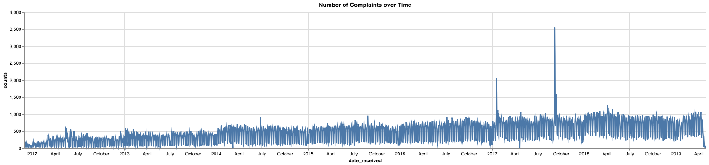
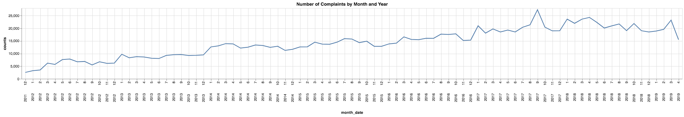
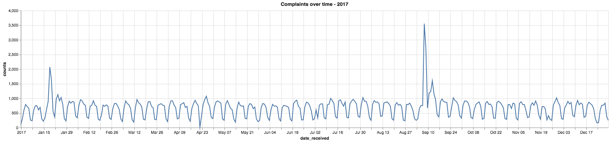

# Time Series Analysis - Consumer Complaints

- [Introduction](#introduction)
- [Experience](#experience)
  - [Running SQL Code on Vantage](#Running-sql-code-on-vantage)
  - [Walkthrough](#walkthrough)
    - [Step 1: Querying the Data](#step-1-querying-the-data)
    - [Step 2: Visualizing the Data](#step-2-visualizing-the-data)
    - [Step 3: Extracting Insights from the Data](#step-3-extracting-insights-from-the-data)
- [Dataset](#dataset)
- [Explore](#explore)

# Introduction

How can we use **Vantage** to extract insights and tell a story behind a dataset? This use case shows how powerful and simple it is to extract answers from a public dataset available through `Data.gov`. We use SQL and a visualization tool to analyze the number of complaints over time to answer the following questions:

_What are the trends of complaints over time?_  
_How can we interpret the outliers in the dataset?_

By answering questions like the ones above, we gain a deeper understanding of the dataset, and we can explain in plain language how the number of complaints evolve over time. In the **Explore** section, we focus on analyzing the number of complaints over time and identifying trends and outliers in the time series to answer the questions above.

# Experience

The **Experience** section takes about 3 minutes to run.

### Running SQL Code on Vantage

1. Click to open the <a href="/editor">Editor</a>.
1. Copy the SQL in each section below into the Editor and click **Run**.
1. View query results in the result panel.

### Walkthrough

#### Step 1: Querying the Data

Start by counting the number of rows in the table.

```sql
select count(*) from [%_PREFIX_%]FinancialProtection.consumer_complaints;
```

<div class = "td-resultset-table-div" style = "max-height: 77px; overflow-y: auto"><table><thead><tr style= "background: #efefef;"><th>Count(*)</th></tr></thead><tr><td>1273782</td></tr></table></div><br><br>

There are just under 1.3 million rows. That is a lot of data, and to show the power of **Vantage**, we will query all the elements in the table at once.

```sql
select TOP 100 * from [%_PREFIX_%]FinancialProtection.consumer_complaints;
```

<div class = "td-resultset-table-div" style = "max-height: 537px; overflow-y: auto"><table><thead><tr style= "background: #efefef;"><th>date_received</th><th>product</th><th>sub_product</th><th>issue</th><th>sub_issue</th><th>consumer_complaint_narrative</th><th>company_public_response</th><th>company</th><th>state</th><th>zip_code</th><th>tags</th><th>consumer_consent_provided</th><th>submitted_via</th><th>date_sent_to_company</th><th>company_response_to_consumer</th><th>timely_response</th><th>consumer_disputed</th><th>complaint_id</th></tr></thead><tr><td>2013-09-19</td><td>Bank account or service</td><td>Checking account</td><td>Making/receiving payments, sending money</td><td></td><td></td><td></td><td>CAPITAL ONE FINANCIAL CORPORATION</td><td>NY</td><td>10312</td><td></td><td></td><td>Phone</td><td>2013-09-20</td><td>Closed with monetary relief</td><td>Yes</td><td>N</td><td>534309</td></tr><tr><td>2013-12-31</td><td>Credit reporting</td><td></td><td>Unable to get credit report/credit score</td><td>Problem getting my free annual report</td><td></td><td></td><td>EQUIFAX, INC.</td><td>NY</td><td>10452</td><td>Older American</td><td></td><td>Web</td><td>2013-12-30</td><td>Closed with non-monetary relief</td><td>Yes</td><td>Y</td><td>650462</td></tr><tr><td>2013-05-17</td><td>Mortgage</td><td>Other mortgage</td><td>Loan modification,collection,foreclosure</td><td></td><td></td><td></td><td>JPMORGAN CHASE & CO.</td><td>AL</td><td>36605</td><td></td><td></td><td>Phone</td><td>2013-05-20</td><td>Closed with explanation</td><td>Yes</td><td>N</td><td>410426</td></tr><tr><td>2012-10-09</td><td>Mortgage</td><td>FHA mortgage</td><td>Loan modification,collection,foreclosure</td><td></td><td></td><td></td><td>BANK OF AMERICA, NATIONAL ASSOCIATION</td><td>MA</td><td>011XX</td><td>Servicemember</td><td></td><td>Phone</td><td>2012-10-10</td><td>Closed with explanation</td><td>Yes</td><td>N</td><td>167855</td></tr><tr><td>2012-11-28</td><td>Bank account or service</td><td>Checking account</td><td>Deposits and withdrawals</td><td></td><td></td><td></td><td>U.S. BANCORP</td><td>PA</td><td>15132</td><td></td><td></td><td>Web</td><td>2012-11-28</td><td>Closed with non-monetary relief</td><td>Yes</td><td>N</td><td>198805</td></tr></table></div><br>

#### Step 2: Visualizing the Data

From the query above, we notice that this dataset has a lot of information. To derive some insights, we need to start grouping the data.

The first column is `date_received`. This is the date the complaints were received, and it means that we can look at a time series plot of the data. Let's start by grouping the counts of `complaint_id` over time, using `date_received` as our time axis.

```sql
select date_received, count(complaint_id) as counts
from [%_PREFIX_%]FinancialProtection.consumer_complaints
group by date_received;
```

<div class = "td-resultset-table-div" style = "max-height: 537px; overflow-y: auto"><table><thead><tr style= "background: #efefef;"><th>date_received</th><th>counts</th></tr></thead><tr><td>2012-11-23</td><td>121</td></tr><tr><td>2018-06-19</td><td>857</td></tr><tr><td>2017-09-04</td><td>298</td></tr><tr><td>2017-04-28</td><td>727</td></tr><tr><td>2019-04-09</td><td>1030</td></tr><tr><td>2017-09-12</td><td>1230</td></tr><tr><td>2016-12-08</td><td>591</td></tr><tr><td>2013-03-14</td><td>382</td></tr><tr><td>2013-08-03</td><td>148</td></tr><tr><td>2011-12-26</td><td>21</td></tr></table></div><br>

This is great; we now have the number of complaints (`counts`) by time (`date_received`), but how do we make sense of this data? Let's plot this time series on a graph.



By visualizing the data above, we see that the number of complaints varies a lot over time. Complaints also increase as time progresses. There are also some unusual spikes in 2017. Let's understand more about our data. We start by looking at the general trend.

Let's group the data by month and replot the graph above.

```sql
select extract(year from date_received) || extract(month from date_received) as month_date, count(complaint_id) as counts
from [%_PREFIX_%]FinancialProtection.consumer_complaints
group by month_date
order by month_date;
```

<div class = "td-resultset-table-div" style = "max-height: 537px; overflow-y: auto"><table><thead><tr style= "background: #efefef;"><th>month_date</th><th>counts</th></tr></thead><tr><td>       2011         12</td><td>2536</td></tr><tr><td>       2012          1</td><td>3230</td></tr><tr><td>       2012          2</td><td>3509</td></tr><tr><td>       2012          3</td><td>6230</td></tr><tr><td>       2012          4</td><td>5703</td></tr><tr><td>       2012          5</td><td>7617</td></tr><tr><td>       2012          6</td><td>7841</td></tr><tr><td>       2012          7</td><td>6755</td></tr><tr><td>       2012          8</td><td>6877</td></tr><tr><td>       2012          9</td><td>5493</td></tr><tr><td>       2012         10</td><td>6741</td></tr></table></div><br>



Looking at complaints over month and year, we see a clear upward trend. One hypothesis is that as time progresses, people get more conscious and spread the word. The media can also advertise the complaint channels over time. Through this chart we can see clearly the spikes that we saw above were in January 2017 and September 2017. Let's dive deeper into these dates and draw some insights on the next step.

#### Step 3: Extracting Insights from the Data

Let's narrow down the two spikes above and see exactly where they are happening. We can do this by ploting another time series plot, this time only in 2017.

```sql
select date_received, count(complaint_id) as counts
from [%_PREFIX_%]FinancialProtection.consumer_complaints
where year(date_received) = 2017
group by date_received
order by date_received;
```

<div class = "td-resultset-table-div" style = "max-height: 537px; overflow-y: auto"><table><thead><tr style= "background: #efefef;"><th>date_received</th><th>counts</th></tr></thead><tr><td>2017-01-01</td><td>105</td></tr><tr><td>2017-01-02</td><td>299</td></tr><tr><td>2017-01-03</td><td>604</td></tr><tr><td>2017-01-04</td><td>789</td></tr><tr><td>2017-01-05</td><td>718</td></tr><tr><td>2017-01-06</td><td>656</td></tr><tr><td>2017-01-07</td><td>257</td></tr><tr><td>2017-01-08</td><td>232</td></tr><tr><td>2017-01-09</td><td>585</td></tr><tr><td>2017-01-10</td><td>744</td></tr></table></div><br>



As we look at the peaks, we find that they occurred from January 15<sup>th</sup> to 21<sup>st</sup> and during the first week of September. To find the actual dates of the peaks, we can limit the query to pick up at least 1,500 complaints a day.

```sql
select date_received,
    month(date_received) as month_date,
    count(complaint_id) as counts
from [%_PREFIX_%]FinancialProtection.consumer_complaints
where year(date_received) = 2017 and month_date in (1, 9)
group by date_received
having counts >= 1500
order by month_date, counts desc;
```

<div class = "td-resultset-table-div" style = "max-height: 157px; overflow-y: auto"><table><thead><tr style= "background: #efefef;"><th>date_received</th><th>month_date</th><th>counts</th></tr></thead><tr><td>2017-01-19</td><td>1</td><td>2070</td></tr><tr><td>2017-01-20</td><td>1</td><td>1633</td></tr><tr><td>2017-09-08</td><td>9</td><td>3553</td></tr><tr><td>2017-09-09</td><td>9</td><td>2709</td></tr><tr><td>2017-09-13</td><td>9</td><td>1600</td></tr></table></div><br>

Let's look at some of the issues that were reported during these dates.

```sql
select date_received, company, count(company) as counts
from [%_PREFIX_%]FinancialProtection.consumer_complaints
where date_received in (
    date '2017-01-19',
    date '2017-01-20',
    date '2017-09-08',
    date '2017-09-09',
    date '2017-09-13'
)
group by date_received, company
having counts > 500
order by date_received, counts desc;
```

<div class = "td-resultset-table-div" style = "max-height: 157px; overflow-y: auto"><table><thead><tr style= "background: #efefef;"><th>date_received</th><th>company</th><th>counts</th></tr></thead><tr><td>2017-01-19</td><td>Navient Solutions, LLC.</td><td>1195</td></tr><tr><td>2017-01-20</td><td>Navient Solutions, LLC.</td><td>895</td></tr><tr><td>2017-09-08</td><td>EQUIFAX, INC.</td><td>2731</td></tr><tr><td>2017-09-09</td><td>EQUIFAX, INC.</td><td>2318</td></tr><tr><td>2017-09-13</td><td>EQUIFAX, INC.</td><td>547</td></tr></table></div><br>
Interestingly, we can see that the great majority of the the complaints were directed at two companies: Navient Solutions and EQUIFAX. These seem to be highly correlated with the Navient Lawsuit and the Equifax breach events that happened around those dates, respectively. Let's recap what happened:

> **Navient Lawsuit**:
> _On January 2017, the U.S. Consumer Financial Protection Bureau (CFPB) and the Illinois and Washington attorneys general sued Navient Solutions. Navient is a major servicer of private and federal student loans. Accoriding to the CFPB at least since January 2010 "Navient has misallocated payments, steered struggling borrowers toward multiple forbearances instead of income-driven repayment plans, and provided unclear information about how to re-enroll in income-driven repayment plans and how to qualify for a co-signer release"_

> **Equifax Breach:** > _On September 7<sup>th</sup> 2017, Equifax announced a cybersecurity breach, one of the largest in history, had happened from mid-May through July 2017.
> Some of the personal information that was accessed included names, social security numbers, birth dates, addresses and driver's license numbers._

Let's now look at the top issues for Navient Solutions and Equifax during those periods to confirm our hypothesis.

```sql
-- analyze top issues reported against Navient Soultions on 2017-01-19 and 2017-01-20
select company, product, issue, count(issue) as counts
from [%_PREFIX_%]FinancialProtection.consumer_complaints
where date_received in (
    date '2017-01-19',
    date '2017-01-20') and
    company like 'Navient Solutions%'
group by company, product, issue
order by counts desc;
```

<div class = "td-resultset-table-div" style = "max-height: 197px; overflow-y: auto"><table><thead><tr style= "background: #efefef;"><th>company</th><th>product</th><th>issue</th><th>counts</th></tr></thead><tr><td>Navient Solutions, LLC.</td><td>Student loan</td><td>Dealing with my lender or servicer</td><td>1107</td></tr><tr><td>Navient Solutions, LLC.</td><td>Student loan</td><td>Can't repay my loan</td><td>968</td></tr><tr><td>Navient Solutions, LLC.</td><td>Student loan</td><td>Getting a loan</td><td>9</td></tr><tr><td>Navient Solutions, LLC.</td><td>Debt collection</td><td>Cont'd attempts collect debt not owed</td><td>2</td></tr><tr><td>Navient Solutions, LLC.</td><td>Debt collection</td><td>False statements or representation</td><td>2</td></tr><tr><td>Navient Solutions, LLC.</td><td>Consumer Loan</td><td>Managing the loan or lease</td><td>1</td></tr><tr><td>Navient Solutions, LLC.</td><td>Debt collection</td><td>Communication tactics</td><td>1</td></tr></table></div><br>

We can see the top two issues represent the majority of complaint counts against Navient Solutions. Furthermore, by looking at the product and issue columns, we can infer that they are indeed related to the lawsuit regarding student loans. Now let's do the same analysis for the Equifax issues.

```sql
-- analyze top issues reported against Navient Soultions on 2017-01-19 and 2017-01-20
select
    company,
    product,
    issue,
    count(issue) as counts
from [%_PREFIX_%]FinancialProtection.consumer_complaints
where date_received in (
    date '2017-09-08',
    date '2017-09-09',
    date '2017-09-13') and
        company like 'EQUIFAX%'
group by company, product, issue
order by counts desc;
```

<div class = "td-resultset-table-div" style = "max-height: 437px; overflow-y: auto"><table><thead><tr style= "background: #efefef;"><th>company</th><th>product</th><th>issue</th><th>counts</th></tr></thead><tr><td>EQUIFAX, INC.</td><td>Credit reporting, credit repair services, or other personal consumer reports</td><td>Improper use of your report</td><td>4500</td></tr><tr><td>EQUIFAX, INC.</td><td>Credit reporting, credit repair services, or other personal consumer reports</td><td>Problem with fraud alerts or security freezes</td><td>322</td></tr><tr><td>EQUIFAX, INC.</td><td>Credit reporting, credit repair services, or other personal consumer reports</td><td>Credit monitoring or identity theft protection services</td><td>264</td></tr><tr><td>EQUIFAX, INC.</td><td>Credit reporting, credit repair services, or other personal consumer reports</td><td>Problem with a credit reporting company's investigation into an existing problem</td><td>234</td></tr><tr><td>EQUIFAX, INC.</td><td>Credit reporting, credit repair services, or other personal consumer reports</td><td>Incorrect information on your report</td><td>177</td></tr><tr><td>EQUIFAX, INC.</td><td>Credit reporting, credit repair services, or other personal consumer reports</td><td>Unable to get your credit report or credit score</td><td>35</td></tr><tr><td>EQUIFAX, INC.</td><td>Credit reporting, credit repair services, or other personal consumer reports</td><td>Identity theft protection or other monitoring services</td><td>22</td></tr><tr><td>EQUIFAX, INC.</td><td>Credit reporting, credit repair services, or other personal consumer reports</td><td>Problem with a company's investigation into an existing issue</td><td>10</td></tr><tr><td>EQUIFAX, INC.</td><td>Debt collection</td><td>Attempts to collect debt not owed</td><td>7</td></tr><tr><td>EQUIFAX, INC.</td><td>Credit reporting, credit repair services, or other personal consumer reports</td><td>Problem with customer service</td><td>6</td></tr><tr><td>EQUIFAX, INC.</td><td>Credit reporting, credit repair services, or other personal consumer reports</td><td>Fraud or scam</td><td>4</td></tr><tr><td>EQUIFAX, INC.</td><td>Credit reporting, credit repair services, or other personal consumer reports</td><td>Confusing or misleading advertising or marketing</td><td>4</td></tr><tr><td>EQUIFAX, INC.</td><td>Credit reporting, credit repair services, or other personal consumer reports</td><td>Unexpected or other fees</td><td>3</td></tr><tr><td>EQUIFAX, INC.</td><td>Debt collection</td><td>False statements or representation</td><td>2</td></tr><tr><td>EQUIFAX, INC.</td><td>Credit card or prepaid card</td><td>Other features, terms, or problems</td><td>2</td></tr><tr><td>EQUIFAX, INC.</td><td>Credit card or prepaid card</td><td>Getting a credit card</td><td>1</td></tr><tr><td>EQUIFAX, INC.</td><td>Debt collection</td><td>Written notification about debt</td><td>1</td></tr><tr><td>EQUIFAX, INC.</td><td>Credit reporting, credit repair services, or other personal consumer reports</td><td>Confusing or missing disclosures</td><td>1</td></tr><tr><td>EQUIFAX, INC.</td><td>Vehicle loan or lease</td><td>Struggling to pay your loan</td><td>1</td></tr></table></div><br>

Here we can also confirm our hypothesis. The top issues talk about improper use of the credit report, fraud alerts, identity theft etc. This really does seem related to the Equifax breach that happened around the same time frame.

# Dataset

The Consumer Complaints Database has complaints data that was received by the Consumer Financial Protection Bureau (CFPB) on financial products and services, which can include bank accounts, credit cards, credit reporting, debt collection, money transfers, mortgages, student loans and other types of consumer credit. The dataset is refreshed daily and contains information on the provider, complaint, date, ZIP code and more. More information about the dataset is in the _Consumer_ section of the `Data.gov` website.

The `[%_PREFIX_%]FinancialProtection.consumer_complaints` dataset has 1,273,782 rows, each representing a unique consumer complaint, and 18 columns, representing the following features:

- `date_received`: date that CFPB received the complaint
- `product`: type of product the consumer identified in the complaint
- `sub_product`: type of sub-product the consumer identified in the complaint
- `issue`: issue the consumer identified in the complaint
- `sub_issue`: sub-issue the consumer identified in the complaint
- `consumer_complaint_narrative`: consumer-submitted description of "what happened" from the complaint
- `company_public_response`: company's optional, public-facing response to a consumer's complaint
- `company`: complaint is about this company
- `state`: state of the mailing address provided by the consumer
- `zip_code`: mailing ZIP code provided by the consumer
- `tags`: data that supports easier searching and sorting of complaints submitted by or on behalf of consumers
- `consumer_consent_provided`: identifies whether the consumer option in to publish their complaint narrative
- `submitted_via`: how the complaint was submitted to the CFPB
- `date_sent_to_company`: date the CFBP sent the complaint to the company
- `company_response_to_consumer`: how the company responded
- `timely_response`: whether the company gave a timely response
- `consumer_disputed`: whether the company disputed the company's response
- `complaint_id`: unique identification number for a complaint

# Explore

Through this notebook, we saw the power and simplicity of running queries in the SQL Editor and how it can be leveraged to extract insights from the data to tell the story behind a dataset. Hopefully you've noticed how easy it is to use **Vantage** to write your own SQL queries.

You can continue to explore Vantage to extract more insights and find answers to other questions by using the preloaded dataset. Here are some suggestions:

- **What are the most common types of complaints?** Group the `product` category to arrive at this answer. How does this change over time?
- **How are customers submitting their complaints?** To answer this, group the `submitted_via` column. 
- **What proportion of the customer complaints are disputed?** By aggregating counts of `customer_disputed` we can answer this question.
- **Is there seasonality in the data? What is the reason for the seasonality?** If we subtract the trend from the series we can analyze the seasonality in the dataset. Are most of the complaints filed during the week or on the weekends?
