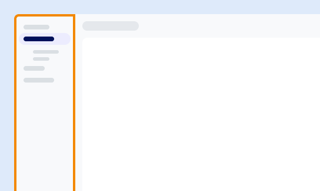

Use the menu to access the primary features, including:

-   Monitor queries, resources, and consumption.

-   Add new users and configure single sign-on (SSO).

-   Load, copy, migrate, and back up your data.

-   Use third-party and user-defined functions.

-   Get started and launch the Resource center.

The available options may vary depending on your role, permissions, and environment.

---

**Next:** [Explore the toolbar](njy1721168384549.md)

