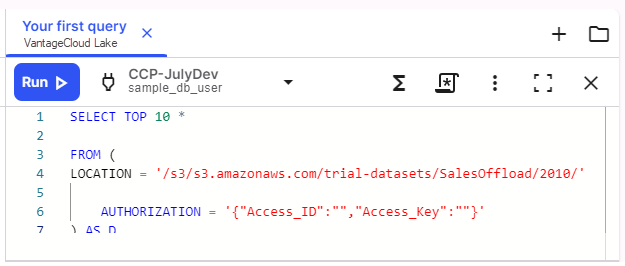

1.  Access the SQL editor by selecting **SQL Editor**  from the toolbar.

    Depending on your access, you may be prompted to make a database connection.


1.  Select **+** to create a new script in Editor and copy this SQL and paste it into Editor.

    ```sql      
    SELECT TOP 10 * 
    FROM ( 
        LOCATION = '/s3/s3.amazonaws.com/trial-datasets/SalesOffload/2010/'
        AUTHORIZATION = '{"Access_ID":"","Access_Key":""}' 
    ) AS D 
    ````
    

      This selects 10 rows of data and displays the results.


1.  Confirm that you've selected the correct environment, then select **Run ** to start the query.

    

    The **Results** area shows the top 10 results.


---

**Next:** [Create a chart to visualize the results](ydj1721092986132.md)

