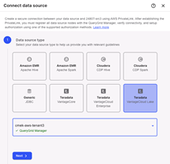
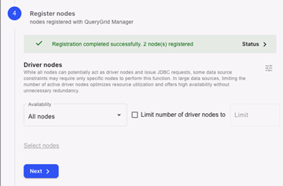
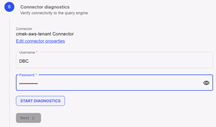
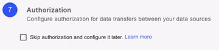

When connecting a VantageCloud Lake environment as a data source, QueryGrid must be deployed on both environments and visible on the same VantageCloud Lake console.

## New data source

1.  Select which VantageCloud Lake environment will be the source environment and which will be the target environment.

    Both VantageCloud Lake data sources must be on the same platform, for instance, VantageCloud Lake on AWS can only connect to VantageCloud Lake on AWS, not another cloud provider.

1.  From the source environment, select **Manage data** > **QueryGrid**.

1.  From the **Data sources** tab, select  to add a data source.

1.  Select VantageCloud Lake as the target data source.

    

1.  Select the target environment from the **Select VantageCloud Lake environment** menu and then select **Next**.

## Private link

1.  Submit a support ticket on [https://support.teradata.com](https://support.teradata.com) using the information from this step and request the DNS address and secondary IP address for the target system.

1.  Once received, enter the DNS addresses provided and select **Next**.

    The secondary IP address will be used in the **Data source details** step.

## Data source details

1.  Enter a name and description for the data source.

    Teradata recommends using the name of the environment being added.

1.  Select the cloud platform and region where the target system is located, for example AWS and US West (Oregon).

1.  Under **Connector properties**, enter the secondary IP of the target system, provided from **PrivateLink** step.

1.  Select **Next**.

## Register nodes

The nodes automatically register themselves when you get to this step. Select **Next** once the registration is completed.

## Network diagnostics

Start the diagnostics and wait for it to complete before selecting **Next**.

## Connector diagnostics

1.  Enter the DBC password for the target environment.

    This is the password that was provided when the environment was first provisioned.

1.  Select **Start diagnostics** to run the test and wait for it to complete before selecting **Next**.

    

## Authorization

Select **Learn** more to see the available authorization options and decide what is best for your environments.

You can optionally select **Skip authorization** and then **Finish** to complete it at a later time.

