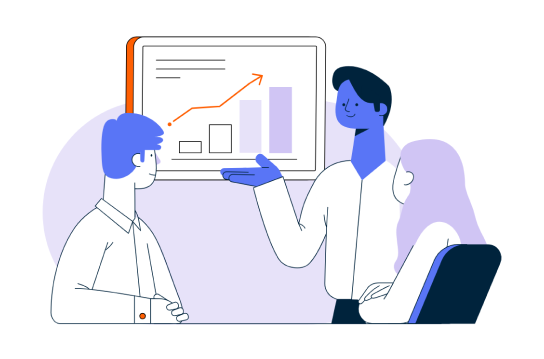

Teradata Vantage ist die verbundene Multi-Cloud-Datenplattform für Analysen, mit der Sie komplexe Datenprobleme lösen können. Hier lernen Sie die VantageCloud Lake-Konsole kennen und sehen, was alles möglich ist.

