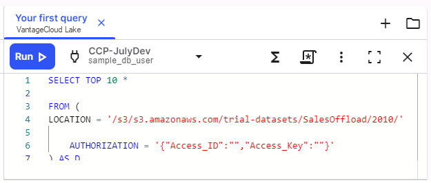

1.  Greifen Sie auf den SQL-Editor zu, indem Sie in der Symbolleiste **SQL-Editor**  auswählen.

    Abhängig von Ihrer Zugriffsberechtigung werden Sie möglicherweise aufgefordert, eine Datenbankverbindung herzustellen.

2.  Wählen Sie **+** aus, um ein neues Skript im Editor zu erstellen, kopieren Sie dieses SQL und fügen Sie es in den Editor ein.

        ```sql SELECT TOP 10 * 

    FROM (

        LOCATION = '/s3/s3.amazonaws.com/trial-datasets/SalesOffload/2010/' AUTHORIZATION = '{"Access_ID":"","Access_Key":""}' 

    ) AS D

    \`\`\`

    Mit dieser Funktion werden 10 Datenzeilen ausgewählt und die Ergebnisse angezeigt.

3.  Vergewissern Sie sich, dass Sie die richtige Umgebung ausgewählt haben, und wählen Sie dann ** ausführen** aus, um die Abfrage zu starten.

    

    Im Bereich **Erbebnisse** werden die 10 wichtigsten Ergebnisse angezeigt.

------------------------------------------------------------------------

**Als Nächstes:** [Diagramm erstellen, um die Ergebnisse zu visualisieren](ydj1721092986132.md)
