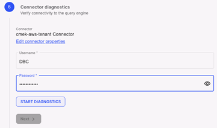

Bei der Verbindung einer VantageCloud Lake-Umgebung als Datenquelle muss QueryGrid auf beiden Umgebungen bereitgestellt werden und auf derselben VantageCloud Lake-Konsole sichtbar sein.

## Neue Datenquelle

1.  Wählen Sie aus, welche VantageCloud Lake-Umgebung die Quellumgebung und welche die Zielumgebung sein soll.

    Beide VantageCloud Lake-Datenquellen müssen sich auf derselben Plattform befinden. Beispielsweise kann VantageCloud Lake on AWS nur eine Verbindung zu VantageCloud Lake on AWS herstellen, nicht zu einem anderen Public Cloud-Anbieter.

1.  Wählen Sie in der Quellumgebung **Daten verwalten** > **QueryGrid**aus.

1.  Wählen Sie auf der Registerkarte **Datenquellen** die Option  aus, um eine Datenquelle hinzuzufügen.

1.  Wählen Sie VantageCloud Lake als Zieldatenquelle aus.

    

1.  Wählen Sie die Zielumgebung aus dem Menü **VantageCloud Lake-Umgebung auswählen** und dann **Weiter**aus.

## Privater Link

1.  Senden Sie [https://support.teradata.com]mit den Informationen aus diesem Schritt ein Support-Ticket an(https://support.teradata.com) und fordern Sie die DNS-Adresse und die sekundäre IP-Adresse für das Zielsystem an.

1.  Geben Sie nach dem Erhalt die bereitgestellten DNS-Adressen ein und wählen Sie **Weiter** aus.

    Die sekundäre IP-Adresse wird im Schritt **Datenquellendetails** verwendet.

## Datenquellendetails

1.  Geben Sie einen Namen und eine Beschreibung für die Datenquelle ein.

    Teradata empfiehlt, den Namen der Umgebung zu verwenden, die hinzugefügt wird.

1.  Wählen Sie die Public Cloud-Plattform und die Region aus, in der sich das Zielsystem befindet, zum Beispiel AWS und US West (Oregon).

1.  Geben Sie unter **Verbindungseigenschaften**die sekundäre IP des Zielsystems ein, die Sie im Schritt **Privater Link** erhalten haben.

1.  Wählen Sie **Weiteraus.**

## Knoten registrieren

Die Knoten werden automatisch registriert, wenn Sie zu diesem Schritt kommen. Wählen Sie **Weiter** aus, sobald die Registrierung abgeschlossen ist.

## Netzwerkdiagnose

Starten Sie die Diagnose und warten Sie, bis sie abgeschlossen ist, bevor Sie **Weiterauswählen.**

## Verbindungsdiagnose

1.  Geben Sie das Root-Passwort für die Zielumgebung ein.

    Dies ist das Passwort, das bei der ersten Bereitstellung der Umgebung angegeben wurde.

1.  Wählen Sie **Diagnose starten** aus, um den Test durchzuführen, und warten Sie, bis er abgeschlossen ist, bevor Sie **Weiter**auswählen.

    

## Autorisierung

Wählen Sie die Option **Lernenaus, um die verfügbaren Autorisierungsoptionen zu sehen und zu entscheiden, was für Ihre Umgebung am besten geeignet ist.**

Sie können optional **Autorisierung überspringen** und dann **Fertig stellen** auswählen, um es zu einem späteren Zeitpunkt abzuschließen.

---

Zurück zu [Datenquelle verbinden](znp1640282079399.md)

