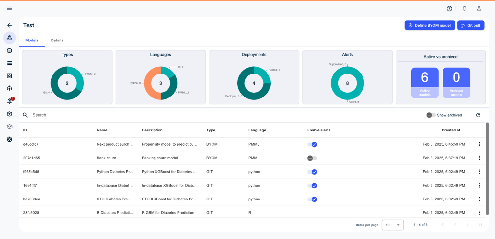

**Hinweis:**Git-Modelle werden zurzeit in VantageCloud Lake nicht unterstützt.

Auf der Registerkarte **Modelle** werden die Modelltypen, die von den Modellen verwendeten Sprachen, die Anzahl der Bereitstellungen, die Anzahl der generierten Warnungen und die Anzahl der aktiven/archivierten Modelle angezeigt.

Sie können ein BYOM-Modell definieren oder einen Echtzeit-Git-Pull durchführen. ModelOps sucht in regelmäßigen Abständen nach Git-Code-Updates und ruft sie ab.

