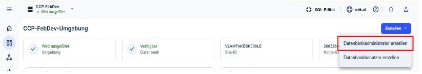

Datenbankadministratoren (DBAs) sorgen dafür, dass die Datenbank immer eine optimale Leistung bietet und dass die Daten sicher und geschützt sind. DBAs sind Datenbankbenutzer, die eine Vielzahl administrativer Aufgaben ausführen.

Als Organisationsadministrator können Sie über das Dashboard von Umgebungen den ersten (primären) DBA für eine Umgebung erstellen. Der primäre DBA-Benutzer kann dann weitere DBAs und Benutzer für die Umgebung erstellen.

**Hinweis:** Einige Optionen können in einer VantageCloud Lake-Testumgebung vorab ausgewählt werden oder nicht verfügbar sein.

1.  Wählen Sie im Menü eine Umgebung auf der Seite **Startseite** aus.

2.  Wählen Sie **Erstellen** \> **Datenbankadministrator erstellen** aus.

    

3.  Geben Sie das Root-Passwort ein.

    Das Root-Passwort gehört zu dem Benutzernamen DBC und wurde bei der Erstellung der Umgebung erstellt. Wenn Sie Ihr Passwort vergessen haben, wenden Sie sich an den Teradata-Support.

4.  Erstellen Sie die Anmeldedaten des Datenbankadministrators anhand der Anleitungen für die Erstellung eines Passworts.

5.  \[Optional\] Verwenden Sie den Abschnitt **Erweiterte Optionen**, um die Menge an [Dauerhafter Speicher](yvc1731523611301.md) und [Zeichensatz](hnk1731523638342.md) für den DBA anzugeben.

6.  \[Optional\] Wählen Sie **SQL einblenden** aus, um die zugewiesenen Berechtigungen anzuzeigen, bevor der Datenbank-Administratorbenutzer erstellt wird.

    Dieser Bildschirm ist nur zur Ansicht verfügbar. Versuchen Sie es erneut oder wenden Sie sich an Ihren Supportadministrator, wenn ein Fehler auftritt.

7.  Wählen Sie **Erstellen** aus.

8.  Falls relevant, melden Sie sich als Organisationsadministrator ab und als der neu erstellte DBA wieder an, um weitere Konfigurationen auszuführen.

Wie geht es weiter?
-------------------

1.  [Computing-Ressourcen verwalten](nmr1658424425362.md)

2.  [Datenbankbenutzer hinzufügen](wxe1659392685092.md)

3.  [Datenbankadministratoren hinzufügen](chs1723830476456.md)

4.  [Daten laden und verwalten](jwm1694121113608.md)

5.  [Abfrageleistung überwachen](ajr1640280560519.md)
