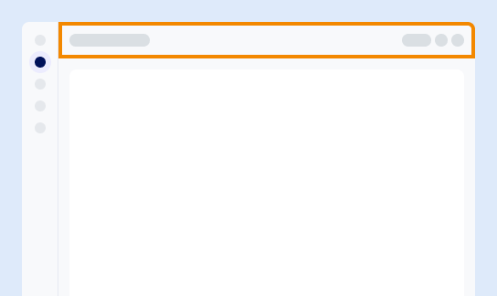

Hier können Sie auf allgemeine Funktionen zugreifen, darunter:

-   SQL-Editor

-   ask.ai, unser KI-gestützter Chatbot

-   Kontextspezifische Hilfe

-   Benutzereinstellungen

-   Andere allgemeine Aufgaben

Die verfügbaren Optionen hängen von Ihrer Rolle, Ihren Berechtigungen und Ihrer Umgebung ab.

Wenn Sie sich in einer Umgebungsansicht befinden, wird der Umgebungswechsler angezeigt. Um auf eine andere Umgebung als die aktuelle zuzugreifen, wählen Sie mit dem Wechsler eine andere Umgebung aus. Wenn Sie die Umgebung wechseln, bleibt die Konsole auf derselben Seite, enthält jedoch die Informationen für die neu ausgewählte Umgebung.

------------------------------------------------------------------------

**Als Nächstes:** [Ressourcen zum Lernen entdecken](xex1721168413281.md)
