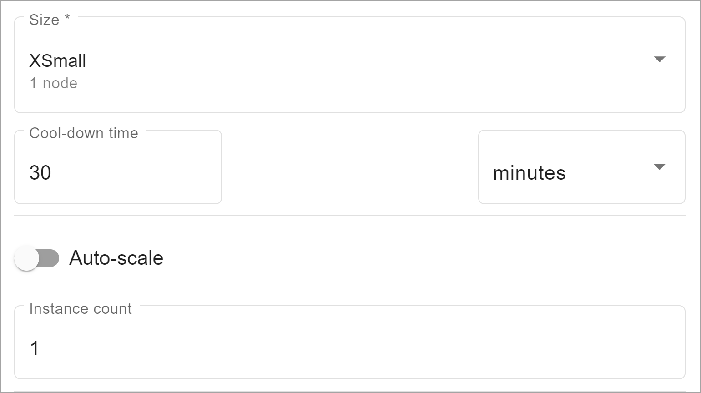

Sie können den Computing-Verbrauch auf zwei Arten verwalten.

Primärer Cluster
----------------

Wenn Sie als Organisationsadministrator [eine Umgebung erstellen](qiv1640281527006.md), wählen Sie **Instanzgröße** aus, also die Größe jedes Knotens im primären Cluster. Sie wählen auch **Anzahl der Instanzen** aus, die Anzahl der Knoten.

Die vom **Instanzgröße** verbrauchten Einheiten multipliziert mit dem **Anzahl der Instanzen** sind die Einheiten, die der primäre Cluster pro Stunde verbraucht.

Verbrauchte Einheiten von **Instanzgröße**:

| Instanzgröße     | Lake-Einheiten | Lake+-Einheiten |
|------------------|----------------|-----------------|
| XS               | 2              | 2.4             |
| Klein            | 4              | 4.8             |
| Mittel           | 7              | 8.4             |
| Groß             | 10             | 12              |
| XL               | 13             | 15.6            |
| XXL              | 20             | 24              |
| XXXL (auf Azure) | 27.0           | 32.4            |

Computing-Gruppen
-----------------

Wenn eine Computing-Gruppe mehr Kapazität hat, können mehr Abfragen gleichzeitig ausgeführt werden. Die Gleichzeitigkeit der Abfragen und die Größe der Abfragen wirken sich auf die Zeit aus, die für den Abschluss der Arbeit benötigt wird.

Wenn Sie als Administrator einer Organisation oder einer Computing-Gruppe [Computing-Profile verwalten](dvl1640281718303.md), wählen Sie **Größe** aus, d. h. die Anzahl der Knoten in jedem Computing-Cluster. Sie wählen auch **Anzahl der Instanzen** aus, die Anzahl der Computing-Cluster.

Die von diesem **Größe** verbrauchten Einheiten multipliziert mit dem **Anzahl der Instanzen** sind die Einheiten, die die Computing-Gruppe pro Stunde verbraucht, während das Profil aktiv ist.

Sie können Computing-Cluster so einstellen, dass sie automatisch skalieren, von einer minimalen bis zu einer maximalen Anzahl von Instanzen, um sich an wechselnde Arbeitslasten anzupassen. Wenn Sie das tun, variiert der Verbrauch pro Stunde.

Verbrauchte Einheiten von **Größe**:

| Knotengröße       | Lake-Einheiten | Lake+-Einheiten |
|-------------------|----------------|-----------------|
| XS (1 Knoten)     | 10             | 12              |
| S (2 Knoten)      | 20             | 24              |
| Medium (4 Knoten) | 40             | 48              |
| L (8 Knoten)      | 80             | 96              |
| XL (16 Knoten)    | 160            | 192             |
| XXL (32 Knoten)   | 320            | 384             |
