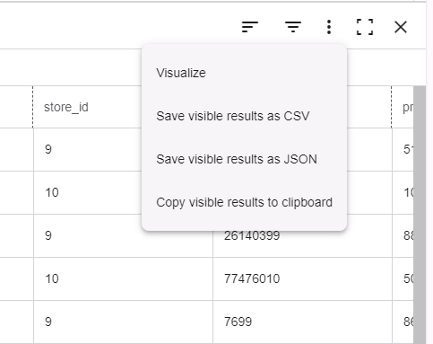

Erstellen wir ein Diagramm, um auf einen Blick zu sehen, an welchen Tagen die meisten Verkäufe getätigt werden.

1.  Wählen Sie  und dann **Visualisieren** aus dem Ergebnismenü aus.

    

    Die Registerkarte **Erbebnisse** zeigt grundlegende Informationen zum Datensatz an und hilft Ihnen, fehlende Werte zu identifizieren.

2.  Wählen Sie auf der Seite **Visualisierung** die Registerkarte **Diagramme** aus.

3.  Wählen Sie unter **Eigenschaften** Folgendes aus:

    1.  Wählen Sie **sales\_date** für die X-Achse aus.

    2.  Wählen Sie **sales\_quantit**y für die Serie aus.

    3.  Wählen Sie **Anzahl** für die Funktion aus.

4.  Sie können alle anderen Einstellungen als Standardeinstellungen beibehalten und dann **Ausführen** auswählen.

Herzlichen Glückwunsch! Sie haben Ihre erste Abfrage ausgeführt und die Ergebnisse visualisiert.

Weitere Informationen zum SQL-Editor, zu Visualisierungen und Analysefunktionen finden Sie unter [Verwenden des Editors](xbg1640280430669.md).
