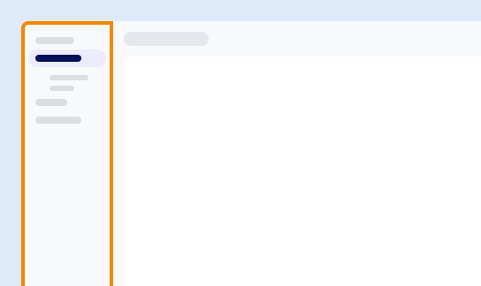

Utilice este menú para acceder a las funciones principales, como por ejemplo:

-   Supervisar consultas, recursos y consumo.

-   Agregar nuevos usuarios y configurar el inicio de sesión único (SSO).

-   Cargar, copiar, migrar y realizar copias de seguridad de sus datos.

-   Usar funciones de terceros y definidas por el usuario.

-   Empezar a usar el producto e iniciar el Centro de recursos.

Las opciones disponibles pueden variar según su rol, sus permisos y su entorno.

------------------------------------------------------------------------

**Siguiente:** [Acceder a las tareas](njy1721168384549.md)
