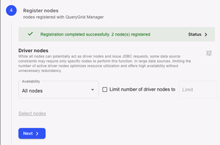
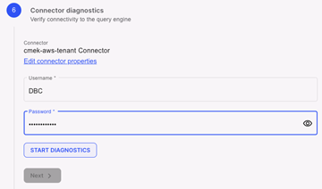
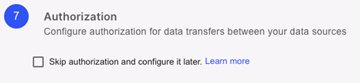

Al conectar un entorno de VantageCloud Lake como fuente de datos, QueryGrid debe implementarse en ambos entornos y estar visible en la misma instancia de VantageCloud Lake Console.

Nueva fuente de datos
---------------------

1.  Seleccione qué entorno de VantageCloud Lake será el entorno de origen y cuál será el entorno de destino.

    Las dos fuentes de datos de VantageCloud Lake deben estar en la misma plataforma; por ejemplo, VantageCloud Lake on AWS solo puede conectarse a VantageCloud Lake on AWS, no a otro proveedor de nube.

2.  En el entorno de origen, seleccione **Gestionar datos** \> **QueryGrid**.

3.  En la pestaña **Fuentes de datos**, seleccione  para agregar una fuente de datos.

4.  Seleccione VantageCloud Lake como fuente de datos de destino.

    

5.  Seleccione el entorno de destino en el menú **Seleccione el entorno de VantageCloud Lake** y, posteriormente, seleccione **Siguiente**.

Enlace privado
--------------

1.  Envíe un ticket de soporte a <https://support.teradata.com> utilizando la información de este paso y solicite la dirección DNS y la dirección IP secundaria para el sistema de destino.

2.  Una vez recibida, introduzca la dirección DNS proporcionada y seleccione **Siguiente**.

    La dirección IP secundaria se utilizará en el paso **Detalles de la fuente de datos**.

Detalles de la fuente de datos
------------------------------

1.  Introduzca un nombre y una descripción para la fuente de datos.

    Teradata recomienda usar el nombre del entorno que se va a agregar.

2.  Seleccione la plataforma de nube y la región donde se encuentra el sistema de destino, por ejemplo, AWS y Oeste de EE. UU. (Oregón).

3.  En **Propiedades del conector**, introduzca la IP secundaria del sistema de destino, proporcionada en el paso **PrivateLink**.

4.  Seleccione **Siguiente**.

Registrar nodos
---------------

Los nodos se registran automáticamente cuando se llega a este paso. Seleccione **Siguiente** una vez completado el registro.

Diagnósticos de red
-------------------

Inicie el diagnóstico y espere a que se complete antes de seleccionar **Siguiente**.

Diagnósticos del conector
-------------------------

1.  Introduzca la contraseña DBC para el entorno de destino.

    Esta es la contraseña que se proporcionó cuando se aprovisionó el entorno por primera vez.

2.  Seleccione **Iniciar diagnósticos** para ejecutar la prueba y espere a que se complete antes de seleccionar **Siguiente**.

    

Autorización
------------

Seleccione **Aprender** más para ver las opciones de autorización disponibles y decidir cuál es la mejor para sus entornos.

Opcionalmente, puede seleccionar **Omitir autorización** y posteriormente **Finalizar** para completarlo más tarde.

