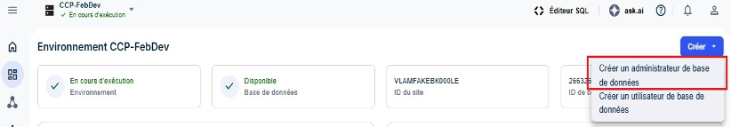

Los administradores de base de datos (DBA) mantienen la base de datos al máximo rendimiento y garantizan que los datos estén seguros y protegidos. Los DBA son usuarios de base de datos que realizan toda una serie de tareas administrativas.

Como administrador de una organización, puede crear el primer DBA (principal) para entornos desde el cuadro de mando de un entorno. El usuario DBA principal puede posteriormente crear cualquier DBA y usuario subsiguiente para el entorno.

**Nota:** Algunas opciones pueden estar preseleccionadas o no estar disponibles en un entorno de prueba de VantageCloud Lake.

1.  En el menú, seleccione un entorno de la página **Inicio**.

1.  Seleccione **Crear** > **Crear administrador de base de datos**.

    

1.  Introduzca la contraseña raíz.

    La contraseña raíz pertenece al nombre de usuario DBC y se estableció al crear el entorno. Si ha olvidado su contraseña, llame al soporte técnico de Teradata.

1.  Cree las credenciales de administrador de la base de datos utilizando la guía para crear una contraseña.

1.  [Optional]Use la sección **Opciones avanzadas** para especificar la cantidad de [Espacio permanente](yvc1731523611301.md) y [Juego de caracteres](hnk1731523638342.md) para el DBA.

1.   **SeleccioneMostrar SQL[Optional]para ver los privilegios asignados antes de crear el usuario administrador de base de datos.**

    Esta es una pantalla solo de visualización. Si se produce un error, inténtelo de nuevo o llame al administrador de soporte técnico.

1.   **SeleccioneCrear.**

1.  Si es relevante, cierre la sesión como administrador de la organización y vuelva a iniciarla como el DBA recién creado para continuar con cualquier otra configuración.

## Qué viene a continuación

1.  [Gestionar recursos computacionales](nmr1658424425362.md)

1.  [Agregar usuarios de base de datos](wxe1659392685092.md)

1.  [Agregar administradores de base de datos](chs1723830476456.md)

1.  [Cargar y gestionar datos](jwm1694121113608.md)

1.  [Supervisar el rendimiento de las consultas](ajr1640280560519.md)

