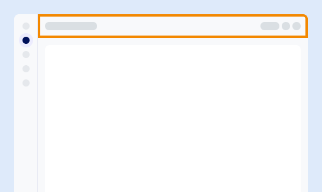
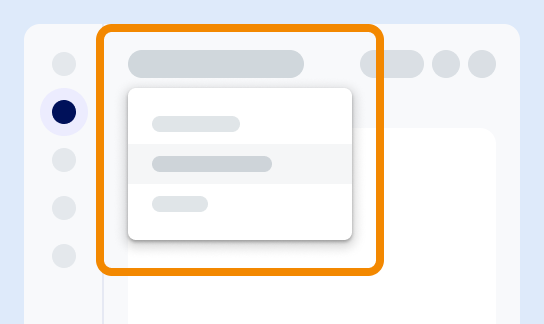

Puede acceder a características comunes desde la barra de herramientas, incluidas las siguientes:

-   Editor de SQL

-   ask.ai, nuestro chatbot basado en IA

-   Ayuda específica según el contexto

-   Configuración del usuario

-   Otras tareas comunes

Las opciones disponibles pueden variar según su rol, sus permisos y su entorno.

Al visualizar un entorno, el conmutador de entorno está visible. Para acceder a un entorno distinto del que se encuentra, utilice el conmutador para seleccionar un entorno diferente. Al cambiar el entorno, la consola permanece en la misma página pero contiene la información del entorno recién seleccionado.

---

**Siguiente:** [Descubrir recursos](xex1721168413281.md)

