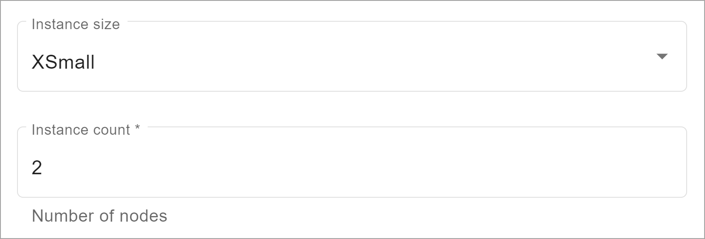

El consumo de cálculo se gestiona de dos maneras.

Clúster principal
-----------------

Como administrador de organización, al [crear un entorno](qiv1640281527006.md), debe seleccionar **Tamaño de instancia**, que es el tamaño de cada nodo en el clúster principal. También debe seleccionar **Recuento de instancias**, el número de nodos.

Las unidades consumidas por **Tamaño de instancia** multiplicadas por **Recuento de instancias** son las unidades que consume el clúster principal por hora.

Unidades consumidas por **Tamaño de instancia**:

| Tamaño de instancia  | Unidades de Lake | Unidades de Lake+ |
|----------------------|------------------|-------------------|
| XPequeño             | 2                | 2,4               |
| Pequeño              | 4                | 4,8               |
| Media                | 7                | 8,4               |
| Grande               | 10               | 12                |
| XGrande              | 13               | 15,6              |
| XXGrande             | 20               | 24                |
| XXXGrande (en Azure) | 27,0             | 32,4              |

Grupos de cálculo
-----------------

Si un grupo de cálculo tiene más capacidad, se pueden ejecutar más consultas simultáneamente. La simultaneidad de consultas y el tamaño de las consultas tienen un efecto en el tiempo necesario para completar el trabajo.

Como administrador de organización o administrador de grupo de cálculo, al [gestionar perfiles de cálculo](dvl1640281718303.md), debe seleccionar **Tamaño**, que es el número de nodos en cada clúster de cálculo. También debe seleccionar **Recuento de instancias**, el número de clústeres de cálculo.

Las unidades consumidas por **Tamaño** multiplicadas por **Recuento de instancias** son las unidades que el grupo de cálculo consume por hora mientras el perfil está activo.

Puede configurar los clústeres de cálculo para el escalado automático, de un número mínimo de instancias a un máximo, para adaptarse a las cargas de trabajo cambiantes. Si lo hace, las unidades consumidas por hora varían.

Unidades consumidas por **Tamaño**:

| Tamaño de nodo      | Unidades de Lake | Unidades de Lake+ |
|---------------------|------------------|-------------------|
| XPequeño (1 nodo)   | 10               | 12                |
| Pequeño (2 nodos)   | 20               | 24                |
| Medio (4 nodos)     | 40               | 48                |
| Grande (8 nodos)    | 80               | 96                |
| XGrande (16 nodos)  | 160              | 192               |
| XXGrande (32 nodos) | 320              | 384               |
