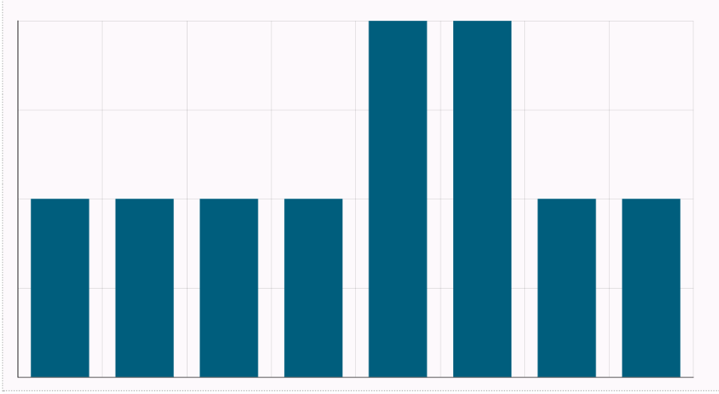

Vamos a crear un gráfico para ver fácilmente qué días tienen más ventas.

1.  Seleccione  y posteriormente **Visualizar** en el menú de resultados.

    

    La pestaña **Resultados** muestra información básica sobre el conjunto de datos y le ayuda a identificar los valores que faltan.

1.  En la página **Visualización**, seleccione la pestaña **Gráficos**.

1.  En **Propiedades**, seleccione:

    1.  Seleccione **sales_date** para el eje X.

    1.  Seleccione **sales_quantit**y para la serie.

    1.  Seleccione **Recuento** para la función.

1.  Puede dejar los valores predeterminados para el resto y, posteriormente, seleccionar **Ejecutar**.

¡Enhorabuena! Ha ejecutado su primera consulta y ha visualizado los resultados.

Consulte [Uso del editor](xbg1640280430669.md) para obtener más información sobre el Editor de SQL, las visualizaciones y las funciones analíticas.

