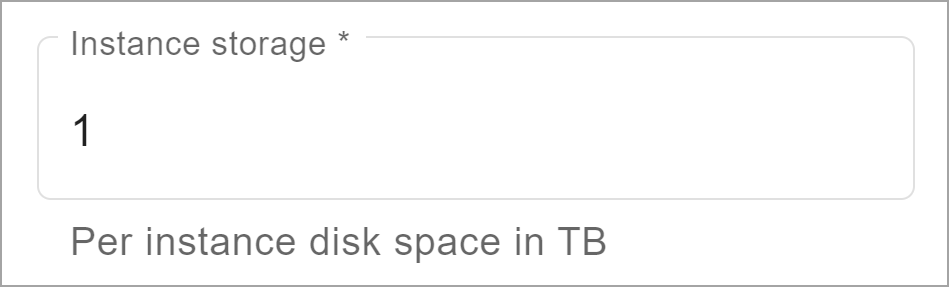

**Block storage** is accessible to an environment’s primary cluster. You consume it by provisioning it to an environment. As an organization admin, when you create an environment, in the **Instance storage** field, you indicate the number of terabytes for each node in the primary cluster.

THIS DID NOT FIX ANYTHING: I put the passthru block element around the graphic's 'p' below and the "url/to/image =250x250" within the alt text:

Now trying the 'p' with passthru block and image with url/to/image =250x250 in the format attribute

**Object storage** is accessible to an environment’s compute clusters. Your environments consume it simply by using it.

When the contract term ends, unused terabytes of block and object storage do not roll over to the next term. If you consume all available terabytes of object storage before the term ends, you pay for additional consumed terabytes on a month-to-month basis.

