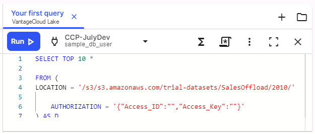

1.  Pour accéder à l'éditeur SQL, sélectionnez **Éditeur SQL**  dans la barre d'outils.

    En fonction de votre accès, vous pouvez être invité à établir une connexion à la base de données.

2.  Sélectionnez **+** pour créer un script dans l'Éditeur, puis copiez ce SQL et collez-le dans l'Éditeur.

        ```sql SELECT TOP 10 * 

    FROM (

        LOCATION = '/s3/s3.amazonaws.com/trial-datasets/SalesOffload/2010/' AUTHORIZATION = '{"Access_ID":"","Access_Key":""}' 

    ) AS D

    \`\`\`

    Cette opération sélectionne 10 lignes de données et affiche les résultats.

3.  Confirmez que vous avez sélectionné l'environnement approprié, puis sélectionnez **Exécuter ** pour lancer la requête.

    

    La zone **Résultats** affiche les 10 premiers résultats.

------------------------------------------------------------------------

**Suivant :** [Créer un graphique pour visualiser les résultats](ydj1721092986132.md)
