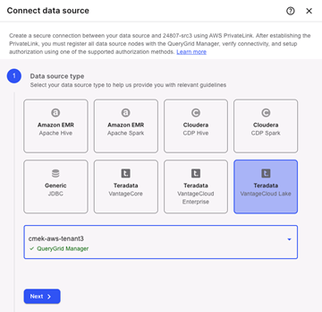

Lors de la connexion d'un environnement VantageCloud Lake comme source de données, QueryGrid doit être déployé sur les deux environnements et visible sur la même instance de VantageCloud Lake Console.

Nouvelle source de données
--------------------------

1.  Sélectionnez l'environnement VantageCloud Lake qui sera l'environnement source et celui qui sera l'environnement cible.

    Les deux sources de données de VantageCloud Lake doivent se trouver sur la même plateforme. Par exemple, VantageCloud Lake on AWS ne peut se connecter qu'à VantageCloud Lake on AWS, et non à un autre fournisseur de cloud.

2.  Dans l'environnement source, sélectionnez **Gérer les données** \> **QueryGrid**.

3.  Dans l'onglet **Sources de données**, sélectionnez  pour ajouter une source de données.

4.  Sélectionnez VantageCloud Lake comme source de données cible.

    

5.  Dans le menu **Sélectionner l'environnement VantageCloud Lake**, sélectionnez l'environnement cible, puis **Suivant**.

Liaison privée
--------------

1.  Soumettez un ticket d'assistance sur <https://support.teradata.com> en utilisant les informations de cette étape et demandez l'adresse DNS et l'adresse IP secondaire pour le système cible.

2.  Une fois reçue, saisissez l'adresse DNS fournie et sélectionnez **Suivant**.

    L'adresse IP secondaire sera utilisée à l'étape **Détails de la source de données**.

Détails de la source de données
-------------------------------

1.  Saisissez un nom et une description pour la source de données.

    Teradata recommande d'utiliser le nom de l'environnement en cours d'ajout.

2.  Sélectionnez la plateforme cloud et la région dans lesquelles se trouve le système cible, par exemple AWS et Ouest des États-Unis (Oregon).

3.  Sous **Propriétés du connecteur**, saisissez l'adresse IP secondaire du système cible, fournie à l'étape **PrivateLink**.

4.  Sélectionnez **Suivant**.

Enregistrer les nœuds
---------------------

Les nœuds s'enregistrent automatiquement lorsque vous accédez à cette étape. Une fois l'enregistrement terminé, sélectionnez **Suivant**.

Diagnostics du réseau
---------------------

Démarrez les diagnostics et attendez qu'ils soient terminés avant de sélectionner **Suivant**.

Diagnostics du connecteur
-------------------------

1.  Saisissez le mot de passe DBC pour l'environnement cible.

    Il s'agit du mot de passe fourni lors du premier provisionnement de l'environnement.

2.  Sélectionnez **Démarrer les diagnostics** pour exécuter le test et attendez qu'il soit terminé avant de sélectionner **Suivant**.

    

Autorisation
------------

Pour consulter les options d'autorisation disponibles et décider ce qui convient le mieux à vos environnements, sélectionnez-en **Formation** de plus.

Vous pouvez éventuellement sélectionner **Ignorer l'autorisation**, puis **Terminer** pour le terminer ultérieurement.

