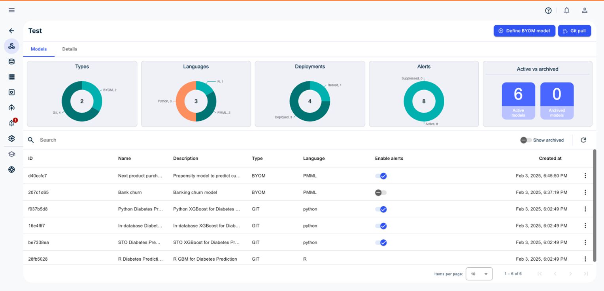

L'onglet **Modèles** indique les types de modèles, les langues utilisées par les modèles, le nombre de déploiements, le nombre d'alertes générées et le nombre de modèles actifs/archivés.

Vous pouvez définir un modèle BYOM ou effectuer un Git pull en temps réel. ModelOps vérifie la présence de mises à jour du code Git et les récupère à intervalles réguliers.

