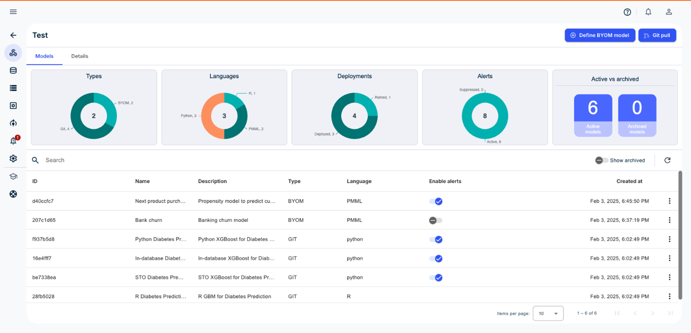

**Remarque :** Les modèles Git ne sont pas pris en charge actuellement dans VantageCloud Lake.

L'onglet **Modèles** indique les types de modèles, les langues utilisées par les modèles, le nombre de déploiements, le nombre d'alertes générées et le nombre de modèles actifs/archivés.

Vous pouvez définir un modèle BYOM ou effectuer une commande Git pull en temps réel. ModelOps recherche et récupère régulièrement les mises à jour du code Git.

