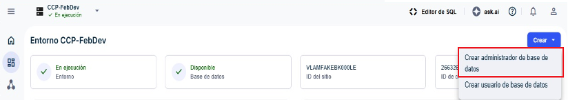

Les administrateurs de base de données (DBA) maintiennent la base de données à un niveau de performances optimal et veillent à ce que les données soient sécurisées et protégées. Les DBA sont des utilisateurs de base de données qui effectuent de nombreuses tâches administratives.

En tant qu'administrateur d'organisation, vous pouvez créer le premier DBA (principal) pour les environnements à partir du tableau de bord d'un environnement. L'utilisateur DBA principal peut ensuite créer ultérieurement des DBA et des utilisateurs pour l'environnement.

**Remarque :** Certaines options peuvent être présélectionnées ou indisponibles dans un environnement d'essai de VantageCloud Lake.

1.  Dans le menu, sélectionnez un environnement sur la page **Accueil**.

2.  Sélectionnez **Créer** \> **Créer un administrateur de base de données**.

    

3.  Saisissez le mot de passe racine.

    Celui-ci fait partie du nom d'utilisateur DBC et a été défini lors de la création de l'environnement. Si vous avez perdu votre mot de passe, appelez l'assistance Teradata.

4.  Créez les identifiants de l'administrateur de base de données à l'aide du guide de création d'un mot de passe.

5.  \[Facultatif\] Utilisez la section **Options avancées** pour spécifier la quantité de [Espace permanent](yvc1731523611301.md) et [Jeu de caractères](hnk1731523638342.md) pour le DBA.

6.  \[Facultatif\] Sélectionnez **Afficher SQL** pour afficher les privilèges attribués avant de créer l'utilisateur administrateur de base de données.

    Il s'agit d'un écran en affichage seul. En cas d'erreur, réessayez ou contactez votre administrateur pour bénéficier d'une assistance.

7.  Sélectionnez **Créer**.

8.  Le cas échéant, déconnectez-vous en tant qu'administrateur d'organisation et reconnectez-vous en tant que DBA récemment créé pour poursuivre les autres configurations.

Étape suivante
--------------

1.  [Gérer les ressources de calcul](nmr1658424425362.md)

2.  [Ajouter des utilisateurs de base de données](wxe1659392685092.md)

3.  [Ajouter des administrateurs de base de données](chs1723830476456.md)

4.  [Charger et gérer des données](jwm1694121113608.md)

5.  [Surveiller les performances des requêtes](ajr1640280560519.md)
