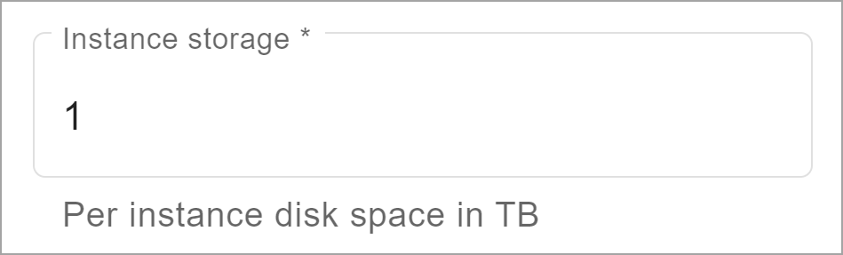

Le cluster principal d'un environnement peut accéder à **Stockage par blocs**. Vous le consommez en le provisionnant dans un environnement. En tant qu'administrateur d'organisation, lorsque vous créez un environnement, vous indiquez dans le champ **Stockage d'instance** le nombre de téraoctets pour chaque nœud du cluster principal.

Les clusters de calcul d'un environnement peuvent accéder à **Stockage d'objets**. Vos environnements le consomment simplement en l'utilisant.

Lorsque le contrat prend fin, les téraoctets inutilisés du stockage par blocs et du stockage d'objets ne sont pas reportés sur la période suivante. Si vous consommez tous les téraoctets disponibles du stockage d'objets avant la fin du contrat, vous payez les téraoctets supplémentaires que vous consommez sur une base mensuelle.
