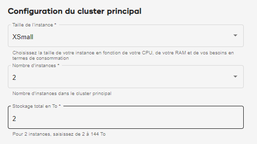

La consommation du calcul peut être gérée de deux façons.

Cluster principal
-----------------

En tant qu'administrateur d'organisation, lorsque vous [créez un environnement](qiv1640281527006.md), vous sélectionnez le **Taille de l’instance**, qui correspond à la taille de chaque nœud dans le cluster principal. Vous sélectionnez également un **Nombre d'instances**, le nombre de nœuds sur le cluster principal.

Les unités consommées par le **Taille de l’instance** multipliées par le **Nombre d'instances** sont les unités que le cluster principal consomme par heure.

Groupes de calcul
-----------------

Plus la capacité du groupe de calcul est grande, plus vous pouvez exécuter de requêtes simultanées. La taille et la simultanéité des requêtes ont une incidence sur le délai nécessaire à l'exécution des tâches.

En tant qu'administrateur d'organisation ou de groupe de calcul, lorsque vous [gérez les profils de calcul](dvl1640281718303.md), vous sélectionnez un **Taille de l’instance**, qui correspond au nombre de nœuds dans chaque cluster de calcul. Vous sélectionnez également un **Nombre d'instances**, le nombre de clusters de calcul.

Les unités consommées par le **Taille de l’instance** multipliées par le **Nombre d'instances** sont les unités que le groupe de calcul consomme par heure lorsque le profil est actif.

Vous pouvez définir les clusters de calcul de manière à ce qu'ils s'adaptent automatiquement, d'un nombre minimal à maximal d'instances, pour absorber les variations de charges de travail. Dans une telle configuration, les unités consommées par heure fluctuent.
