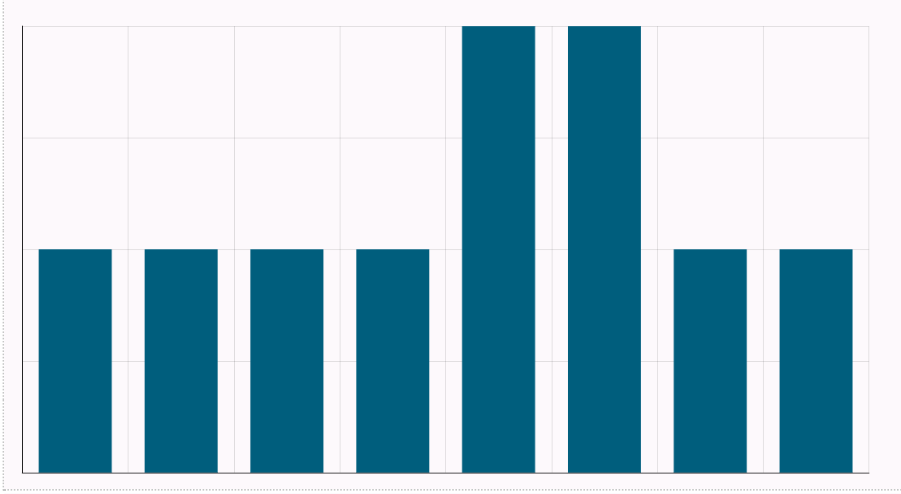

Générons un graphique pour voir facilement quels sont les jours où les ventes sont les plus importantes.

1.  Sélectionnez , puis **Visualiser** dans le menu Résultats.

    

    L'onglet **Résultats** affiche des informations de base sur l'ensemble de données et vous aide à identifier toutes les valeurs manquantes.

1.  Sur la page **Visualisation**, sélectionnez l'onglet **Graphiques**.

1.  Sous **Propriétés**, sélectionnez :

    1.  Sélectionnez **sales_date** pour l'axe des X.

    1.  Sélectionnez **sales_quantit**y pour la série.

    1.  Sélectionnez **Nombre** pour la fonction.

1.  Vous pouvez laisser tous les autres paramètres par défaut, puis sélectionner **Exécuter**.

Félicitations ! Vous avez exécuté votre première requête et visualisé les résultats.

Pour en savoir plus sur l'éditeur SQL, les visualisations et les fonctions d'analyse, reportez-vous à [Utilisation de l'éditeur](xbg1640280430669.md).

