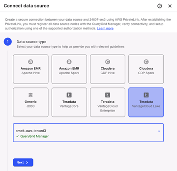
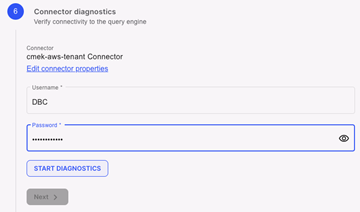

データ ソースとしてVantageCloud Lake環境を接続する場合、QueryGridを両方の環境にデプロイして同じVantageCloud Lakeコンソールで表示できるようにする必要があります。

## 新規データ ソース

1.  どちらのVantageCloud Lake環境をソース環境とし、どちらの環境をターゲット環境とするかを選択します。

    VantageCloud Lakeデータ ソースは両方とも同じプラットフォーム上にある必要があります。たとえば、VantageCloud Lake on AWSはVantageCloud Lake on AWSにのみ接続でき、他のパブリック クラウド プロバイダには接続できません。

1.  ソース環境から **データを管理する** > **QueryGrid** を選択します。

1.  **データ ソース** タブから  を選択してデータ ソースを追加します。

1.  ターゲット データ ソースとしてVantageCloud Lakeを選択します。

    

1.  **VantageCloud Lake環境を選択する** メニューからターゲット環境を選択し、**次へ** を選択します。

## プライベート リンク

1.  このステップの情報を[https://support.teradata.com]使用して (https://support.teradata.com) でサポート チケットを送信し、ターゲット システムのDNSアドレスとセカンダリIPアドレスをリクエストします。

1.  アドレスを受け取ったら、提供されたDNSアドレスを入力し、**次へ** を選択します。

    セカンダリIPアドレスは **データ ソースの詳細** ステップで使用されます。

## データ ソースの詳細

1.  データ ソースの名前と説明を入力します。

    追加する環境の名前を使用することをお勧めします。

1.  ターゲット システムがあるパブリック クラウド プラットフォームとリージョンを選択します (たとえば「AWS」と「米国西部 (オレゴン)」など)。

1.  **コネクタ プロパティ** で、**PrivateLink** ステップにおいて提供されたターゲット システムのセカンダリIPを入力します。

1.  **次へ** を選択します。

## ノードの登録

このステップに進むと、ノードは自動的に自己登録を行います。登録が完了したら **次へ** を選択します。

## ネットワーク診断

診断を開始し、完了するのを待ってから **次へ** を選択します。

## コネクタ診断

1.  ターゲット環境のルート パスワードを入力します。

    これは、環境が最初にプロビジョニングされたときに提供されたパスワードのことです。

1.  **診断を開始する** を選択してテストを実行し、完了するまで待ってから **次へ** を選択します。

    

## 認証

さらに **学習** を選択して、使用可能な認証オプションを確認し、環境に最適なものがどれであるかを決定します。

オプションで **認証をスキップする** > **完了** の順に選択して後で完了することもできます。

