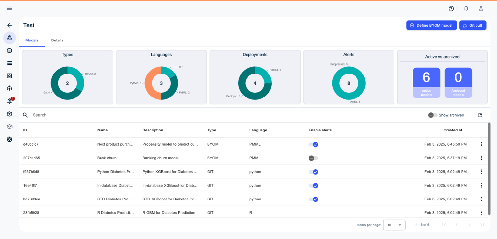

**注:**現在、GitモデルはVantageCloud Lakeでのみサポートされていません。

**モデル** タブにはモデル タイプ、モデルで使用された言語、デプロイメント数、生成されたアラート数、アクティブ モデル数/アーカイブ済みモデル数が表示されます

BYOMモデルの定義やGitプルのリアルタイムの実行ができます。ModelOpsが定期的にGitコードの更新をチェック、取得します。

