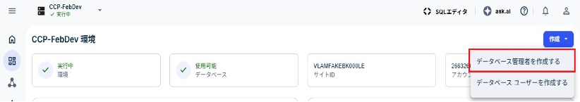

データベース管理者 (DBA) は、データベースを最良のパフォーマンスに保ち、データの安全性と保護を確保します。DBAは、さまざまな管理タスクを実行するデータベース ユーザーです。

組織管理者として、環境のダッシュボードから環境の最初の (プライマリ) DBAを作成できます。その後、プライマリDBAユーザーは、その環境用に後続のDBAとユーザーを作成できます。

**注:** VantageCloud Lakeのトライアル環境では、一部のオプションが事前に選択されている、または利用できない場合があります。

1.  メニューの **ホーム** ページから環境を選択します。

1.  **作成** > **データベース管理者を作成する** の順に選択します。

    

1.  ルート パスワードを入力します。

    ルート パスワードは、ユーザー名DBCに属し、環境作成時に設定されたものです。パスワードを忘れた場合は、Teradataサポートに連絡してください。

1.  パスワード作成ガイドを使用して、データベース管理者の認証情報を作成します。

1.  [Optional] **詳細オプション**セクションを使用して、DBAの [永久領域](yvc1731523611301.md) と [文字セット](hnk1731523638342.md) の値を指定します。

1.  ** SQLを表示する を選択して、データベース管理者ユーザーを作成する前[Optional]に割り当てられた権限を表示します。**

    これは表示専用画面です。エラーが発生した場合は、再試行するか、サポート管理者に連絡してください。

1.  **作成** を選択します。

1.  必要に応じて、組織管理者としてサインアウトし、新しく作成したDBAとしてサインインし直して、その他の構成を続行します。

## 次の手順

1.  [コンピュート リソースを管理する](nmr1658424425362.md)

1.  [データベース ユーザーを追加する](wxe1659392685092.md)

1.  [データベース管理者を追加する](chs1723830476456.md)

1.  [データをロードおよび管理する](jwm1694121113608.md)

1.  [クエリー パフォーマンスを監視する](ajr1640280560519.md)

