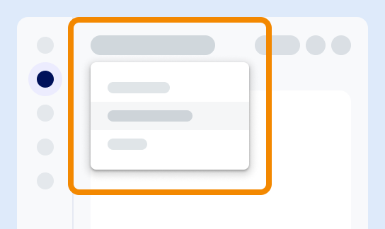

ツールバーから、次を含む一般的な機能にアクセスできます。

-   SQLエディタ

-   ask.ai (AI搭載のチャットボット)

-   コンテキスト別ヘルプ

-   ユーザー設定

-   その他の一般的なタスク

使用可能なオプションは、ロール、権限、環境によって異なる場合があります。

環境を表示すると、環境スイッチャーが表示されます。今いる環境とは別の環境にアクセスするには、スイッチャーを使って別の環境を選択します。環境を切り替えても、コンソールは同じページのままですが、新しく選択した環境の情報が表示されます。

---

**次へ:** [リソースについて知る](xex1721168413281.md)

