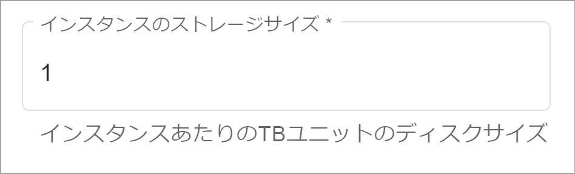

**ストレージをブロック** は、環境のプライマリ クラスタにアクセスできます。それを環境にプロビジョニングすることによって消費します。組織管理者として、環境を作成する際にプライマリ クラスタの各ノードのテラバイト数を **インスタンス ストレージ** フィールドで指定します。

**オブジェクト ストレージ** は、環境のコンピューティング クラスタにアクセスできます。環境は、単にそれを使用することによって消費します。

契約期間終了の際、ブロックおよびオブジェクト ストレージの未使用分テラバイトは、次の期間に繰り越されません。契約期間終了前にオブジェクト ストレージの利用可能テラバイトをすべて消費した場合、追加で消費したテラバイトの料金を月単位で支払う必要があります。
