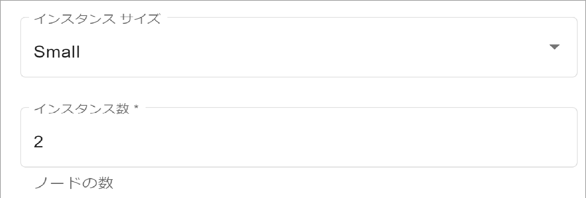
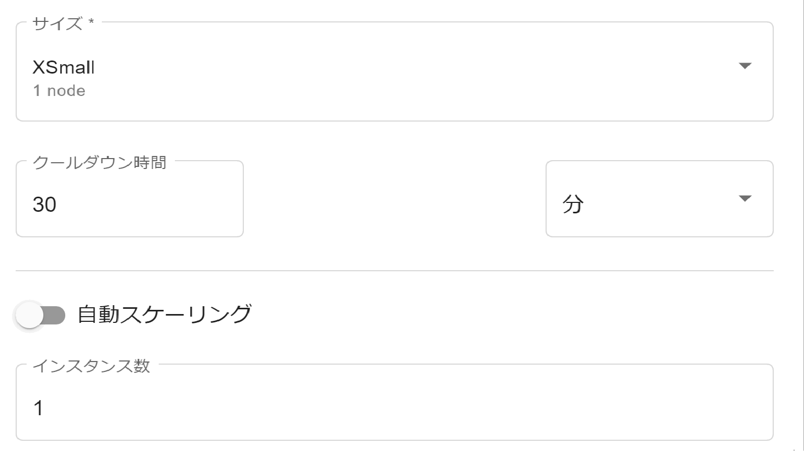

コンピューティング消費量は、2通りの方法で管理します。

プライマリ クラスタ
-------------------

組織管理者として [環境の作成](qiv1640281527006.md) を行う際に **インスタンス サイズ** を選択します。これは、プライマリ クラスタの各ノードのサイズです。また、ノードの数である **インスタンス数** も選択します。

**インスタンス サイズ** によるユニット消費量に **インスタンス数** を掛けたものが、プライマリ クラスタによる1時間あたりのユニット消費量です。

**インスタンス サイズ** によるユニット消費量:

-   **Lake**

    XSmall = 5 ユニット

    Small = 10 ユニット

    Medium = 20 ユニット

    Large = 30 ユニット

    XLarge = 40 ユニット

    XXLarge = 60 ユニット

-   **Lake+**

    XSmall = 6 ユニット

    Small = 12 ユニット

    Medium = 24 ユニット

    Large = 36 ユニット

    XLarge = 48 ユニット

    XXLarge = 72 ユニット

コンピューティング グループ
---------------------------

コンピューティング グループの容量が大きいと、より多くのクエリーを同時に実行できます。作業が完了するまでにかかる時間は、クエリーの同時実行数とクエリーのサイズに影響されます。

組織管理者またはコンピューティング グループ管理者として、[コンピューティング グループ プロファイルの管理](dvl1640281718303.md) を行う際に **サイズ** を選択します。これは、各コンピューティング クラスタのノード数です。また、コンピューティング クラスタの数である **インスタンス数** も選択します。

**サイズ** によるユニット消費量に **インスタンス数** を掛けたものが、プロファイルがアクティブなときのコンピューティング グループによる1時間あたりのユニット消費量となります。

ワークロードの変化に対応するために、コンピューティング クラスタをインスタンス数の最小値と最大値の間で自動スケーリングするように設定することができます。その場合、1時間あたりのユニット消費量は変動します。

**サイズ** によるユニット消費量:

-   **Lake**

    XSmall (1 ノード) = 10 ユニット

    Small (2 ノード) = 20 ユニット

    Medium (4 ノード) = 40 ユニット

    Large (8 ノード) = 80 ユニット

    XLarge (16 ノード) = 160 ユニット

    XXLarge (32 ノード) = 320 ユニット

-   **Lake+**

    XSmall (1 ノード) = 12 ユニット

    Small (2 ノード) = 24 ユニット

    Medium (4 ノード) = 48 ユニット

    Large (8 ノード) = 96 ユニット

    XLarge (16 ノード) = 192 ユニット

    XXLarge (32 ノード) = 384 ユニット
