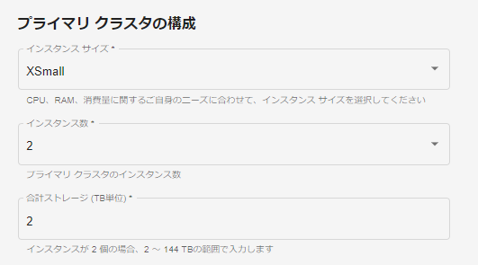

コンピューティング消費量は、2通りの方法で管理します。

プライマリ クラスタ
-------------------

組織管理者として [環境の作成](qiv1640281527006.md) を行う際に **インスタンス サイズ** を選択します。これは、プライマリ クラスタの各ノードのサイズです。また、プライマリ クラスタのノード数である **インスタンス数** も選択します。

**インスタンス サイズ** によるユニット消費量に **インスタンス数** を掛けたものが、プライマリ クラスタによる1時間あたりのユニット消費量です。

コンピューティング グループ
---------------------------

コンピューティング グループの容量が大きいと、より多くのクエリーを同時に実行できます。作業が完了するまでにかかる時間は、クエリーの同時実行数とクエリーのサイズに影響されます。

組織管理者またはコンピューティング グループ管理者として、[コンピューティング プロファイルの管理](dvl1640281718303.md) を行う際に **インスタンス サイズ** を選択します。これは、各コンピューティング クラスタのノード数です。また、コンピューティング クラスタの数である **インスタンス数** も選択します。

**インスタンス サイズ** によるユニット消費量に **インスタンス数** を掛けたものが、プロファイルがアクティブなときのコンピューティング グループによる1時間あたりのユニット消費量となります。

ワークロードの変化に対応するために、コンピューティング クラスタをインスタンス数の最小値と最大値の間で自動スケーリングするように設定することができます。その場合、1時間あたりのユニット消費量は変動します。
