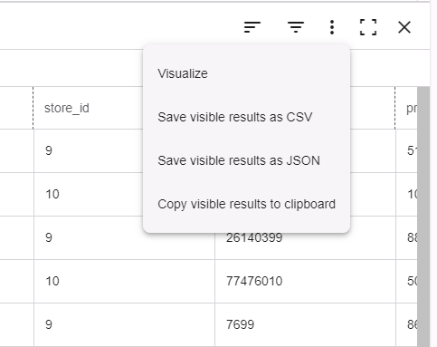

どの日が最も売上が多いかを見やすくするために、チャートを作成してみましょう。

1.  結果メニューから 、**ビジュアライズ** の順に選択します。

    

    **結果** タブにはデータセットに関する基本情報が表示され、欠損値を特定するのに役立ちます。

1.  **ビジュアライゼーション** ページで、**グラフ** タブを選択します。

1.  **プロパティ** で、次の選択を行います。

    1.  X軸に **sales_date** を選択します。

    1.  シリーズに **sales_quantit** を選択します。

    1.  関数に **カウント** を選択します。

1.  その他はデフォルトのままにしておき、**実行** を選択します。

おめでとうございます!最初のクエリーを実行し、結果をビジュアライズしました。

SQLエディタ、ビジュアライゼーション、分析関数の詳細については、[エディタを使用](xbg1640280430669.md) を参照してください。

